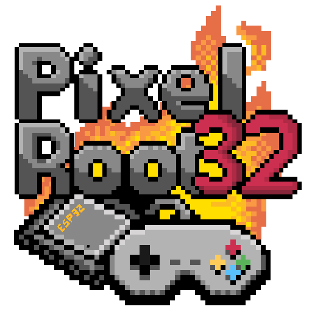

<p align="center">
  
</p>

<h1 align="center">PixelRoot32 Game Engine</h1>

<p align="center">
  <strong>A lightweight, modular 2D game engine for ESP32 and PC</strong>
</p>

<p align="center">
  <a href="https://github.com/PixelRoot32-Game-Engine/PixelRoot32-Game-Engine/blob/main/LICENSE"></a>
  <a href="https://registry.platformio.org/libraries/gperez88/PixelRoot32-Game-Engine"></a>
  <a href="https://github.com/PixelRoot32-Game-Engine/PixelRoot32-Game-Engine"></a>
  <a href="https://github.com/PixelRoot32-Game-Engine/PixelRoot32-Game-Engine/issues"></a>
  <a href="https://github.com/PixelRoot32-Game-Engine/PixelRoot32-Game-Engine/pulls"></a>
</p>

<p align="center">
  <a href="https://ko-fi.com/gperez88"></a>
  <a href="https://www.paypal.com/ncp/payment/THC3PDSRQKZW6"></a>
</p>

<p align="center">
  <a href="#-overview">Overview</a> •
  <a href="#-key-features">Features</a> •
  <a href="#-tool-suite">Tool Suite</a> •
  <a href="#-quick-start">Quick Start</a> •
  <a href="#-best-practices">Best Practices</a> •
  <a href="#-documentation">Documentation</a> •
  <a href="#-roadmap">Roadmap</a> •
  <a href="#-changelog">Changelog</a> •
  <a href="#-contributing">Contributing</a> •
  <a href="#-license">License</a> •
  <a href="#-credits">Credits</a>
</p>

---

## 📖 Overview

**PixelRoot32** is a lightweight, modular 2D game engine written in **C++17**, designed primarily for **ESP32 microcontrollers**, with a native simulation layer for **PC (SDL2)** to enable rapid development without hardware.

The engine follows a scene-based architecture inspired by **Godot Engine**, featuring kinematic controllers, scene transitions, camera effects, and deterministic gameplay systems tailored for embedded hardware.

## 🧠 Engine Philosophy

PixelRoot32 is not the product of a traditional electronics expert or a large engineering team.

It was born from curiosity, experimentation, and a deep love for retro games from the 90s.

Coming from a mobile development background with limited experience in C++, this project represents a leap into embedded systems. This was made possible by how accessible knowledge has become today—especially with AI-assisted tools lowering the barrier to building complex systems.

PixelRoot32 is a reflection of that shift: exploring new domains driven by curiosity rather than specialization.

At its core, the engine is built around a few simple ideas:

- Determinism over convenience  
- No hidden costs (no runtime allocations, no magic)  
- Simplicity and explicit control  
- Performance as a core constraint  
- Retro-inspired design with modern practices  

👉 Learn more: [Engine Philosophy](docs/philosophy/engine-philosophy.md)

---

## Demo in Action

Watch PixelRoot32 running on ESP32 with example games:

[](https://www.youtube.com/shorts/55_Jwkx-gPs)

> Click the image to watch the full demo on YouTube.  

## ✨ Key Features

- **Cross-Platform**: Develop on PC (Windows/Linux/macOS) and deploy on ESP32.
- **Scene-Entity System**: Intuitive management of Scenes, Entities, and Actors.
- **High Performance**: Optimized for ESP32 with DMA transfers, IRAM-cached rendering, and a Dirty Regions pipeline.
- **Sprite System**: Support for 1bpp/2bpp/4bpp sprites with multi-palette selection, flipping, rotation, and animation.
- **Tilemap Support**: Optimized rendering with viewport culling, static layer caching, multi-palette, and tile animations.
- **Tile Animation System**: Frame-based animations (water, lava) with O(1) frame resolution and zero-allocation policy.
- **Scene Transitions**: Built-in Fade, Iris, and Diagonal Wipe transitions with configurable effects and ESP32-optimized rendering.
- **Camera Effects**: Deterministic camera shake, punch, and offset effects designed for low-resource embedded hardware.
- **Independent Resolution Scaling**: Render at low logical resolutions (e.g., 128x128) and scale to physical displays (e.g., 240x240).
- **NES-Style Audio**: Dynamic 8-voice subsystem with a fixed **4+4 partition** (melodic tracks vs percussion/SFX), advanced SFX synthesis (loops, sweeps, breakpoint envelopes, `playSfxBank`), and fixed-point No-FPU optimizations (Pulse, Triangle, Noise, Sine, Saw).
- **Lightweight UI**: Label, Button, and Checkbox with automatic layouts.
- **AABB Physics**: Godot-style physics with Kinematic/Rigid actors, one-way platforms, moving platform support, floor velocity inheritance, and custom hitboxes.
- **Indexed Color Palettes**: Optimized palettes (PR32, NES, GameBoy, PICO-8) with multi-palette support.
- **Modular Architecture**: Compile only needed subsystems via `PIXELROOT32_ENABLE_*` flags to reduce firmware size.

> 💡 **Detailed info:** Check out the [Full Feature List](https://docs.pixelroot32.org/#getting-started).

---

## 🧰 Tool Suite

The **PixelRoot32 Tool Suite** is now available — a native desktop app (C++17 / SDL2 / ImGui) that accelerates asset creation for the engine.

| Module | Status |
|--------|--------|
| **Sprite Compiler** | ✅ Available — PNG to C headers (1bpp/2bpp/4bpp, grid selection) |
| **Tilemap Editor** | ✅ Available — visual multi-layer tilemaps with C++ export |
| **Music Editor** | 🔜 Coming soon — pattern-based tracker for the PR32 APU |
| **SFX Editor** | 🔜 Coming soon — sound effect synthesis |

👉 [Get the Tool Suite](https://pixelroot32.com) · [Detailed docs](docs/tools/index.md)

---

## Quick Start

### ⚠️ Configuration Requirement

To compile PixelRoot32, you **must** configure your `platformio.ini` to use C++17 and disable exceptions:

```ini
build_unflags = -std=gnu++11
build_flags =
    -std=gnu++17
    -fno-exceptions
```

### Prerequisites

- **VS Code + PlatformIO**
- **ESP32 DevKit** or **SDL2** (for PC simulation)

### 📦 Installation (via PlatformIO)

To use PixelRoot32 in your own project, add the following to the `lib_deps` option of your `platformio.ini`:

```ini
lib_deps =
    gperez88/PixelRoot32-Game-Engine@^1.8.0
```

PlatformIO will automatically download and install the library and its dependencies during the next build — including the shared [PixelRoot32-APU](https://registry.platformio.org/libraries/gperez88/PixelRoot32-APU) synthesis core (also used by the PixelRoot32 Tool Suite).

### Fast Setup

1. **Clone this repository** and open an example under [`examples/`](examples/):

   ```bash
   git clone https://github.com/PixelRoot32-Game-Engine/PixelRoot32-Game-Engine.git
   cd PixelRoot32-Game-Engine/examples/hello_world
   ```

   Each folder (`hello_world`, `sprites`, `dual_palette`, `animated_tilemap`, `camera`, `physics`, `metroidvania`, `snake`, `2048`, `brick_breaker`, `music-demo`, `flappy_bird`, `bomberbot`, `room_screen`, `midway_clone`, `legend_of_clone`) is a **standalone PlatformIO project** with its own `platformio.ini`. See the [examples catalogue](examples/README.md) for what each one demonstrates and which opt-in capability it turns on.

2. **Open that example folder in VS Code** (File → Open Folder) and select your environment (`env:esp32dev`, `env:esp32cyd`, `env:esp32c3`, or `env:native`).
3. **Build and Upload** using PlatformIO.

> 📚 **More information:** See the [Getting Started Guide](https://docs.pixelroot32.org/).

---

## 🛠️ Best Practices

To ensure high performance on ESP32, PixelRoot32 enforces strict development patterns:

1. **Fixed-Point Math**: Always use `Scalar` instead of `float`. Use `math::toScalar()` for literals.
2. **Zero Allocation**: Avoid `new`/`malloc` during the game loop. Use **Object Pooling** and `std::unique_ptr`.
3. **Render Layers**: Organize entities by `renderLayer` (0=Bg, 1=Game, 2=UI) to optimize drawing order.
4. **Platform Memory**: Use `PIXELROOT32_FLASH_ATTR` and `PIXELROOT32_READ_*_P` macros for cross-platform Flash/RAM access.
5. **Centralized Logging**: Use `log()` from `core/Log.h` instead of `Serial.print` or `printf`.

> 📘 **Essential Reading**: Check the **[Style & Best Practices Guide](docs/guide/index.md#-standards-&-compatibility)** for detailed rules on memory management, performance optimization, and coding style.

---

## 📚 Documentation

### Online Resources

- **[📖 Full Documentation](https://docs.pixelroot32.org)**: Guides, API reference, and tutorials.
- **[🛠️ Asset Tools](https://github.com/PixelRoot32-Game-Engine/PixelRoot32-Sprite-Sheet-Compiler)**: Sprite compiler and development tools.

### Local Reference

- **[Examples](examples/)**: Local path to the same demos (open a subfolder in PlatformIO).
- **Camera Example**: Demonstrates camera effects, scene transitions, moving platforms, and scene management workflows.
- **[API Reference](docs/api/index.md)**: Class reference and usage.
- **[Architecture](docs/architecture/overview.md)**: System design and layer hierarchy.
- **[Physics System](docs/architecture/physics-subsystem.md)**: Flat Solver documentation.
- **[Audio Subsystem](docs/architecture/audio-subsystem.md)**: Sound engine details.
- **[Contributing](CONTRIBUTING.md)** | **[Style Guide](docs/guide/style-guide.md)**

---

## 🗺️ Roadmap

- 💾 **Persistence (Save/Load)**: Abstract key-value storage (NVS on ESP32).
- 📡 **ESP-NOW Networking Module**: Optional peer-to-peer communication layer for local multiplayer and device synchronization. Provides packet abstraction, Scene event integration, optional reliability (ACK/retry), and deterministic state sync. Designed for router-free ESP32 communication.
- 🔊 **Audio Coprocessor Module**: Optional dual-ESP32 architecture that offloads audio synthesis to a dedicated ESP32-C3 via SPI, improving game performance while remaining fully backward compatible.
- ⚙️ **Gameplay Framework**: Generic gameplay systems for interactions, triggers, events, state machines, and reusable gameplay components.

### Completed Features ✅

- ✅ **Spatial Partitioning (Uniform Grid)**: Optional collision optimization system that divides the world into fixed-size grid cells to reduce collision checks.
- ✅ **Advanced Physics System (Flat Solver)**: Godot-like Kinematic/Rigid actors, stable stacking, and iterative collision resolution.
- ✅ **Moving Platform Support**: Kinematic floor velocity inheritance and platform-aware character movement.
- ✅ **Custom Hitboxes**: Independent hitbox sizing and offsets for gameplay collision tuning.
- ✅ **Scene Transition System**: Fade, Iris, and Diagonal Wipe transitions with configurable animation behavior.
- ✅ **Camera Effects System**: Deterministic shake, punch, and offset effects optimized for ESP32.
- ✅ **Dual Numeric Backend (Float / Fixed-Point)**: Support for ESP32 variants without FPU (C3, C2, C6).
- ✅ **u8g2 Support**: Support for monochrome OLEDs (SSD1306, SH1106).
- ✅ **Native Bitmap Font System**: Font system based on 1bpp sprites.
- ✅ **UI Layout System**: Automatic layouts (Vertical, Horizontal, Grid, Panel, Anchor, Padding).
- ✅ **Tile Animation System**: O(1) frame resolution for tile-based animations with zero-allocation policy.
- ✅ **Multi-Palette Graphics**: Per-cell palette indexing for tilemaps and sprites.
- ✅ **One-Way Platform Collision**: Jump-through platforms with spatial crossing detection.
- ✅ **Modular Compilation**: `PIXELROOT32_ENABLE_*` flags for conditional subsystem inclusion.
- ✅ **Unified Logging System**: Cross-platform `log()` abstraction with `PIXELROOT32_DEBUG_MODE`.
- ✅ **Touch Screen Support**: `UITouchButton`, `UITouchCheckbox`, and `UITouchSlider`.
- ✅ **4+4 Audio Voice Partition**: Melodic sequencer tracks (slots 0–3) isolated from percussion/SFX (slots 4–7) with subpool-limited voice stealing.
- ✅ **Advanced SFX Synthesis**: Looping SFX, noise period sweep, Linear/Exponential curves, duty/pitch breakpoint envelopes, and header-only `playSfxBank` (additive `AudioEvent` ABI).
- ✅ **Shared APU Library**: The synthesis core lives in [PixelRoot32-APU](https://github.com/PixelRoot32-Game-Engine/PixelRoot32-APU), shared with the PixelRoot32 Tool Suite — one ABI source, byte-identical preview/export audio.
- ✅ **TileMap Editor**: Specialized tool to design environments with C++ export. [PixelRoot32 Tool Suite](https://pixelroot32.com).

---

## 🕒 Changelog

## Unreleased

Introduces the **Gameplay Framework**. Every capability is opt-in behind its own build flag, all default to `0`, and a build that enables none of them is identical to 1.8.0 — no breaking changes.

### 🕹️ Gameplay Framework

- **Grid Space**: Cell ↔ world conversion with correct floor semantics at negative coordinates and no division on the hot path, plus `GridMotion` for sub-cell interpolated movement between cells. A `constexpr GridSpec` costs zero SRAM.
- **State Machine**: Actor states driven from a flash-resident `const` table with `onEnter`/`onUpdate`/`onExit` callbacks and immediate, fully drained transitions.
- **Object Pool**: `ObjectPool<T, N>` — fixed-capacity, zero-heap acquire/release for bullets, enemies and explosions.
- **Events & Interaction Triggers**: Engine-owned fixed-capacity event bus, plus `InteractionTracker` turning the per-frame contact set into `onEnter`/`onExit` edges for trigger volumes and pickups.
- **Room Graphs**: `RoomGraph<N>` models a screen-by-screen world with per-room camera bounds, consumes Tilemap Editor room exports through `buildRoomGraph()` with no parsing or allocation, and notifies scenes via `Scene::onRoomEnter()`.

### 🎨 Graphics & UI

- **Camera Tweens**: `CameraTween<N>` moves the camera along waypoints with Linear and quadratic easing, fixed-point throughout (no FPU cost on ESP32-C3).
- **Depth Sorting**: Optional secondary comparator *within* a render layer — what top-down games need to order actors against scenery by Y.
- **UI Sprites**: `UISprite` makes an icon a first-class UI element (visibility, layout placement, `setFixedPosition()`); `UISpriteRow` draws a whole value-driven row — hearts, lives, ammo — from one entity, with half and quarter steps.
- **Transition Color Fix**: Fades and wipes scaled the packed colour byte as a single value, rotating hue instead of dimming on hardware. Now scaled per channel.

### 🏀 Physics

- **Spatial Queries**: `queryRadius()` / `queryBox()` with a collision-layer mask for blasts, aggro ranges and area effects — no manual scan over every actor.
- **Multi-Hit Tiles**: `requiredHits` + `applyHit()` on `TileConsumptionHelper` for breakable and armoured blocks.

### ⚡ Performance

- **Deferred DMA Wait**: The frame's last SPI block stays in flight and flushes at the top of the next call, so frame cost becomes `max(CPU, transfer)` instead of `CPU + transfer`. Always on.
- **1bpp Direct Framebuffer Path**: Text, `MultiSprite` layers and 1bpp tilemaps write the 8bpp framebuffer directly instead of a virtual `drawPixel()` per pixel (~40–100 cycles → ~4–8).
- **12-bit RGB444 (opt-in, experimental)**: `PIXELROOT32_TFT_12BIT_COLOR` cuts 25% of SPI bus time and DMA buffer size with no colour loss. **Not yet verified on hardware** — ships off.

### 🎮 Examples

- **bomberbot** (grid movement, chain-reaction explosions, PRNG enemy AI), **midway_clone** (pooled vertical shooter with a camera driven every frame, profiled), **legend_of_clone** (screen-by-screen overworld and dungeon), **room_screen** (minimal `RoomGraph` demo).
- `snake` and `2048` now derive board geometry from Grid Space; `flappy_bird` and `metroidvania` run their states through State Machine; `physics` shows radius queries, `metroidvania` the triggers and event bus, `bomberbot` depth sorting, and `camera` the effects and tweens.
- The catalogue is now 16 projects, each covering something no other example covers, with a flag-to-example table in [`examples/README.md`](examples/README.md). `space_invaders` and `tic_tac_toe` were removed as duplicates, and `camera-effect-demo` was folded into `camera`.

Full changelog: [CHANGELOG.md](CHANGELOG.md)

---

## 🤝 Contribute

Contributions are welcome! Read our [Contributing Guide](CONTRIBUTING.md) to get started.

---

## 📄 License

PixelRoot32 is an **open-source** project licensed under the **MIT License**.
Based on [ESP32-Game-Engine](https://github.com/nbourre/ESP32-Game-Engine) by nbourre.

See the [LICENSE](LICENSE) file for the full text.

> ⚠️ The PixelRoot32 Game Engine name and logo are subject to the trademark policy. See [TRADEMARK.md](./TRADEMARK.md).
---

## 👏 Credits

Developed by **Gabriel Perez** as a modular game engine for embedded systems.

Special thanks to **nbourre** for the original ESP32-Game-Engine.

---

<p align="center">
  <em>Built with ❤️ for the retro-dev community.</em>
</p>
