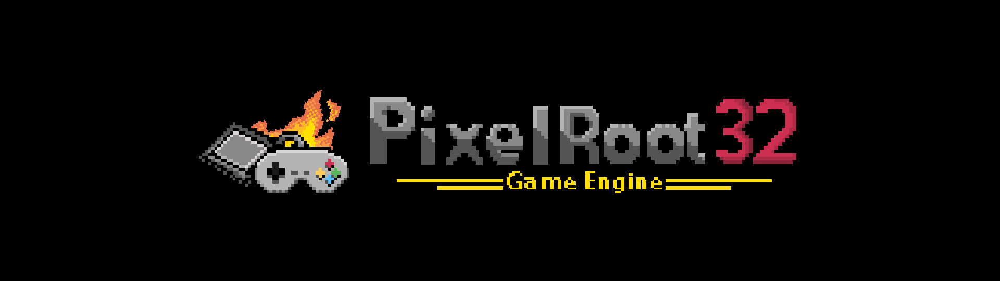
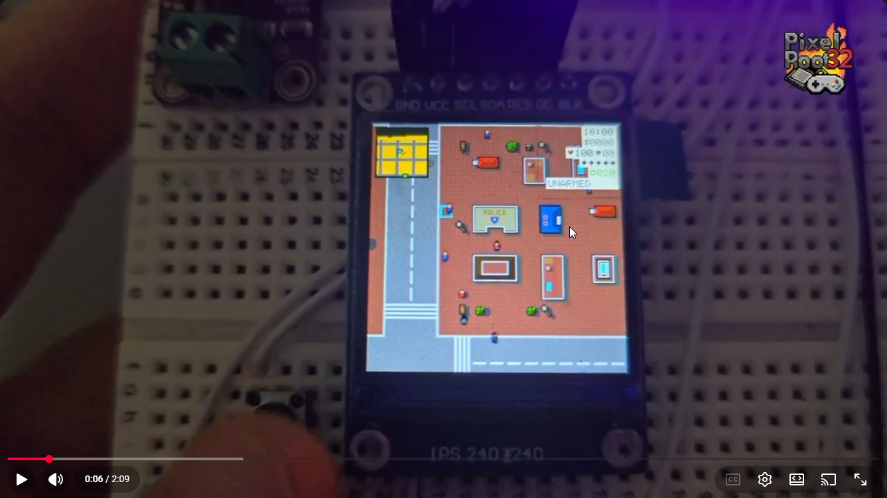

<h1 align="center">PixelRoot32 Game Engine</h1>

<p align="center">
  <strong>A lightweight, modular 2D game engine for ESP32 and PC</strong>
</p>

<p align="center">
  <a href="https://github.com/PixelRoot32-Game-Engine/PixelRoot32-Game-Engine/blob/main/LICENSE"></a>
  <a href="https://registry.platformio.org/libraries/gperez88/PixelRoot32-Game-Engine"></a>
  <a href="https://github.com/PixelRoot32-Game-Engine/PixelRoot32-Game-Engine"></a>
  <a href="https://github.com/PixelRoot32-Game-Engine/PixelRoot32-Game-Engine/issues"></a>
  <a href="https://github.com/PixelRoot32-Game-Engine/PixelRoot32-Game-Engine/pulls"></a>
</p>

<p align="center">
  <a href="#-overview">Overview</a> •
  <a href="#-key-features">Features</a> •
  <a href="#-demo-projects">Demo Projects</a> •
  <a href="#-tool-suite">Tool Suite</a> •
  <a href="#-quick-start">Quick Start</a> •
  <a href="#-best-practices">Best Practices</a> •
  <a href="#-documentation">Documentation</a> •
  <a href="#-roadmap">Roadmap</a> •
  <a href="#-changelog">Changelog</a> •
  <a href="#-contributing">Contributing</a> •
  <a href="#-license">License</a> •
  <a href="#-credits">Credits</a>
</p>

---

## 📖 Overview

**PixelRoot32** is a lightweight, modular 2D game engine written in **C++17**, designed primarily for **ESP32 microcontrollers**, with a native simulation layer for **PC (SDL2)** to enable rapid development without hardware.

The engine follows a scene-based architecture inspired by **Godot Engine**, featuring kinematic controllers, scene transitions, camera effects, and deterministic gameplay systems tailored for embedded hardware.

## 🧠 Engine Philosophy

PixelRoot32 is not the product of a traditional electronics expert or a large engineering team.

It was born from curiosity, experimentation, and a deep love for retro games from the 90s.

Coming from a mobile development background with limited experience in C++, this project represents a leap into embedded systems. This was made possible by how accessible knowledge has become today—especially with AI-assisted tools lowering the barrier to building complex systems.

PixelRoot32 is a reflection of that shift: exploring new domains driven by curiosity rather than specialization.

At its core, the engine is built around a few simple ideas:

- Determinism over convenience  
- No hidden costs (no runtime allocations, no magic)  
- Simplicity and explicit control  
- Performance as a core constraint  
- Retro-inspired design with modern practices  

👉 Learn more: [Engine Philosophy](docs/philosophy/engine-philosophy.md)

---

## Demo in Action

Watch PixelRoot32 running on ESP32 with example games:

[](https://youtu.be/WErteZxaBZw)

> Click the image to watch the full demo on YouTube.  

## ✨ Key Features

- **Cross-Platform**: Develop on PC (Windows/Linux/macOS) and deploy on ESP32.
- **Scene-Entity System**: Intuitive management of Scenes, Entities, and Actors.
- **High Performance**: Optimized for ESP32 with DMA transfers, IRAM-cached rendering, and a Dirty Regions pipeline.
- **Sprite System**: Support for 1bpp/2bpp/4bpp sprites with multi-palette selection, flipping, rotation, and animation.
- **Tilemap Support**: Optimized rendering with viewport culling, static layer caching, multi-palette, and tile animations.
- **Tile Animation System**: Frame-based animations (water, lava) with O(1) frame resolution and zero-allocation policy.
- **Scene Transitions**: Built-in Fade, Iris, and Diagonal Wipe transitions with configurable effects and ESP32-optimized rendering.
- **Camera Effects**: Deterministic camera shake, punch, and offset effects designed for low-resource embedded hardware.
- **Independent Resolution Scaling**: Render at low logical resolutions (e.g., 128x128) and scale to physical displays (e.g., 240x240).
- **NES-Style Audio**: Dynamic 8-voice subsystem with a fixed **4+4 partition** (melodic tracks vs percussion/SFX), advanced SFX synthesis (loops, sweeps, breakpoint envelopes, `playSfxBank`), and fixed-point No-FPU optimizations (Pulse, Triangle, Noise, Sine, Saw).
- **Lightweight UI**: Label, Button, and Checkbox with automatic layouts.
- **AABB Physics**: Godot-style physics with Kinematic/Rigid actors, one-way platforms, moving platform support, floor velocity inheritance, and custom hitboxes.
- **Gameplay Framework**: Opt-in building blocks — grid space, state machines, object pools, an event bus, interaction triggers, room graphs, camera tweens, depth sorting and spatial queries — each behind its own `PIXELROOT32_ENABLE_*` flag, all default `0`.
- **Indexed Color Palettes**: Optimized palettes (PR32, NES, GameBoy, PICO-8) with multi-palette support.
- **Modular Architecture**: Compile only needed subsystems via `PIXELROOT32_ENABLE_*` flags to reduce firmware size.

> 💡 **Detailed info:** Check out the [Full Feature List](https://docs.pixelroot32.org/#getting-started).

---

## 🎮 Demo Projects

**[PixelRoot32-Demo-Projects](https://github.com/PixelRoot32-Game-Engine/PixelRoot32-Demo-Projects)** is the companion repository: **31 complete,
self-contained projects** you can copy, build and play.

| Category | Count | A sample of what is there |
|----------|:-----:|---------------------------|
| Getting started | 2 | [`hello_world`](https://github.com/PixelRoot32-Game-Engine/PixelRoot32-Demo-Projects/tree/main/getting_started/hello_world) — the smallest complete project |
| Games | 12 | [`bomberbot`](https://github.com/PixelRoot32-Game-Engine/PixelRoot32-Demo-Projects/tree/main/games/bomberbot), [`chess`](https://github.com/PixelRoot32-Game-Engine/PixelRoot32-Demo-Projects/tree/main/games/chess), [`2048`](https://github.com/PixelRoot32-Game-Engine/PixelRoot32-Demo-Projects/tree/main/games/2048), [`snake`](https://github.com/PixelRoot32-Game-Engine/PixelRoot32-Demo-Projects/tree/main/games/snake) |
| Gameplay | 4 | [`state_machine`](https://github.com/PixelRoot32-Game-Engine/PixelRoot32-Demo-Projects/tree/main/gameplay/state_machine), [`metroidvania`](https://github.com/PixelRoot32-Game-Engine/PixelRoot32-Demo-Projects/tree/main/gameplay/metroidvania) |
| Graphics | 5 | [`iso_dungeon`](https://github.com/PixelRoot32-Game-Engine/PixelRoot32-Demo-Projects/tree/main/graphics/iso_dungeon), [`depth_sort`](https://github.com/PixelRoot32-Game-Engine/PixelRoot32-Demo-Projects/tree/main/graphics/depth_sort) |
| Audio | 2 | [`music_sequencer`](https://github.com/PixelRoot32-Game-Engine/PixelRoot32-Demo-Projects/tree/main/audio/music_sequencer), [`sfx_bank`](https://github.com/PixelRoot32-Game-Engine/PixelRoot32-Demo-Projects/tree/main/audio/sfx_bank) |
| UI · Input · Performance | 6 | menus, digital and touch controls, and profiling vehicles |

Every demo is a standalone PlatformIO project that builds against the
**published release** from the registry — copy the folder anywhere, run
`pio run -e native`, and you have a working starting point.

**How it differs from [`examples/`](examples/) in this repository:** the
examples here are five minimal projects, each isolating a single engine
capability, and none of them is a game. Read an example to learn one API; read a
demo to see several of them working together in something finished.

👉 [Browse the demo catalogue](https://github.com/PixelRoot32-Game-Engine/PixelRoot32-Demo-Projects)

---

## 🧰 Tool Suite

The **PixelRoot32 Tool Suite** is a native desktop app (C++17 / SDL2 / ImGui) that accelerates asset creation for the engine.

The **engine itself remains 100% free and open source**. These tools are optional power-ups designed to streamline your workflow and support the project: each grants a **lifetime license** (one-time purchase, yours forever, free lifetime updates).

| Module | Status |
|--------|--------|
| **Sprite Compiler** | ✅ Available — PNG to C headers (1bpp/2bpp/4bpp, grid selection) |
| **Tilemap Editor** | ✅ Available — visual multi-layer tilemaps with C++ export |
| **Music Editor** | 🔜 Coming soon — pattern-based tracker for the PR32 APU |
| **SFX Editor** | 🔜 Coming soon — sound effect synthesis |

👉 [Get the Tool Suite](https://pixelroot32.com) · [Detailed docs](docs/tools/index.md)

---

## 💛 Support this project

The best way to support PixelRoot32 is getting the **Tool Suite** above — a lifetime license that funds the project.

If that's not for you, a tip is always welcome:

<p align="left">
  <a href="https://ko-fi.com/gperez88"></a>
  <a href="https://www.paypal.com/ncp/payment/THC3PDSRQKZW6"></a>
</p>

---

## Quick Start

### ⚠️ Configuration Requirement

To compile PixelRoot32, you **must** configure your `platformio.ini` to use C++17 and disable exceptions:

```ini
build_unflags = -std=gnu++11
build_flags =
    -std=gnu++17
    -fno-exceptions
```

### Prerequisites

- **VS Code + PlatformIO**
- **ESP32 DevKit** or **SDL2** (for PC simulation)

### 📦 Installation (via PlatformIO)

To use PixelRoot32 in your own project, add the following to the `lib_deps` option of your `platformio.ini`:

```ini
lib_deps =
    gperez88/PixelRoot32-Game-Engine@^1.11.0
```

PlatformIO will automatically download and install the library and its dependencies during the next build — including the shared [PixelRoot32-APU](https://registry.platformio.org/libraries/gperez88/PixelRoot32-APU) synthesis core (also used by the PixelRoot32 Tool Suite).

### Fast Setup

1. **Clone this repository** and open an example under [`examples/`](examples/):

   ```bash
   git clone https://github.com/PixelRoot32-Game-Engine/PixelRoot32-Game-Engine.git
   cd PixelRoot32-Game-Engine/examples/sprites
   ```

   Each folder (`sprites`, `camera`, `animated_tilemap`, `physics`, `mono_oled`) is a **standalone PlatformIO project** with its own `platformio.ini`. See the [examples catalogue](examples/README.md) for what each one demonstrates and which opt-in capability it turns on. Complete games and larger use cases live in [**PixelRoot32-Demo-Projects**](https://github.com/PixelRoot32-Game-Engine/PixelRoot32-Demo-Projects).

2. **Open that example folder in VS Code** (File → Open Folder) and select your environment (`env:esp32dev`, `env:esp32cyd`, `env:esp32c3`, or `env:native`).
3. **Build and Upload** using PlatformIO.

> 📚 **More information:** See the [Getting Started Guide](https://docs.pixelroot32.org/).

---

## 🛠️ Best Practices

To ensure high performance on ESP32, PixelRoot32 enforces strict development patterns:

1. **Fixed-Point Math**: Always use `Scalar` instead of `float`. Use `math::toScalar()` for literals.
2. **Zero Allocation**: Avoid `new`/`malloc` during the game loop. Use **Object Pooling** and `std::unique_ptr`.
3. **Render Layers**: Organize entities by `renderLayer` (0=Bg, 1=Game, 2=UI) to optimize drawing order.
4. **Platform Memory**: Use `PIXELROOT32_FLASH_ATTR` and `PIXELROOT32_READ_*_P` macros for cross-platform Flash/RAM access.
5. **Centralized Logging**: Use `log()` from `core/Log.h` instead of `Serial.print` or `printf`.

> 📘 **Essential Reading**: Check the **[Style & Best Practices Guide](docs/guide/index.md#-standards-&-compatibility)** for detailed rules on memory management, performance optimization, and coding style.

---

## 📚 Documentation

### Online Resources

- **[📖 Full Documentation](https://docs.pixelroot32.org)**: Guides, API reference, and tutorials.
- **[🛠️ Asset Tools](https://github.com/PixelRoot32-Game-Engine/PixelRoot32-Sprite-Sheet-Compiler)**: Sprite compiler and development tools.

### Local Reference

- **[Examples](examples/)**: Five minimal, single-idea capability examples (open a subfolder in PlatformIO).
- **[PixelRoot32-Demo-Projects](https://github.com/PixelRoot32-Game-Engine/PixelRoot32-Demo-Projects)**: Complete games and per-topic demos. Anything larger than a single feature lives there, not in `examples/`.
- **[Camera Example](examples/camera/)**: `Camera2D` following with smoothing and bounds, parallax layers, camera effects and a scripted `CameraTween` pan.
- **[API Reference](docs/api/index.md)**: Class reference and usage.
- **[Architecture](docs/architecture/overview.md)**: System design and layer hierarchy.
- **[Physics System](docs/architecture/physics-subsystem.md)**: Flat Solver documentation.
- **[Audio Subsystem](docs/architecture/audio-subsystem.md)**: Sound engine details.
- **[Contributing](CONTRIBUTING.md)** | **[Style Guide](docs/guide/style-guide.md)**

---

## 🗺️ Roadmap

- 💾 **Persistence (Save/Load)**: One storage interface with NVS on ESP32, external EEPROM, and file-on-native backends.
- 📡 **ESP-NOW Networking Module**: Optional peer-to-peer communication layer for local multiplayer and device synchronization. Provides packet abstraction, Scene event integration, optional reliability (ACK/retry), and deterministic state sync. Designed for router-free ESP32 communication.
- 🔊 **Audio Coprocessor Module**: Optional dual-ESP32 architecture that offloads audio synthesis to a dedicated ESP32-C3 via SPI, improving game performance while remaining fully backward compatible.
- 💬 **Dialog System, post-MVP**: Additions to the 1.11.0 dialog system that land when a game needs them: multi-column option rows, conditional choices, speaker portraits, per-character reveal and localization.

👉 **Full Roadmap**: [docs/roadmap.md](docs/roadmap.md) — including completed features.

---

## 🕒 Changelog

## 1.11.0

Introduces a **dialog system** and **accented Latin text**. Both are opt-in behind build flags that default to `0`. ASCII text measures and renders exactly as in 1.10.0; the one API change is that `FontManager::getGlyphIndex` now returns `uint16_t` (see Changed).

### 💬 Dialog

- **`DialogRunner` (`PIXELROOT32_ENABLE_DIALOG`)**: a headless dialog state machine for text lines, auto-advancing lines, paged text and choices. It is driven only by semantic `feed(DialogAction)` and `update(deltaTimeMs)` calls, has no `Renderer`, `InputManager` or `Font` dependency, and reports lines and confirmed choices through one event callback. The script is a caller-owned `const` table in flash. A session allocates nothing on the heap, and the runner is 28 B on ESP32.
- **`DialogBox`**: an optional default panel for a runner. It draws the border, speaker label, the current page of wrapped text and a single-column option list with the selection highlighted. One layout function feeds both drawing and `choiceRect()` touch hit-testing, so the two cannot drift apart, and `measureHeightPx()` sizes a panel for a whole script. It is not a `UIElement`, so it works with the UI system off.
- **`DialogTypes`**: `DialogLine`, `DialogChoice` and `DialogScript`, the data model a game authors its script in.

### 🔤 Text & Fonts

- **Accented Latin characters (`PIXELROOT32_ENABLE_FONT_LATIN1`)**: renders `á é í ó ú ü ñ Á É Í Ó Ú Ü Ñ ¿ ¡ « » º` from ordinary UTF-8 string literals, with no compiler charset flag. Accented capitals keep the same baseline as unaccented ones.
- **`TextLayout`**: glyph-accurate word wrap and measurement (`wrap()`, `measureWidthPx()`, `countWrappedLines()`), allocation-free, with page skipping so a presenter never wraps the same text twice. It is always available, with no flag.
- **`Font` supplement block**: optional extra glyphs appended to the struct, so every existing font initializer keeps compiling.

### 🔧 Changed

- `FontManager::getGlyphIndex` returns `uint16_t` and reports "not found" as `FontManager::kNoGlyph` (`0xFFFF`) instead of `255`, which was itself a legal glyph index. **Migration:** replace comparisons against `255` and stop storing the result in a `uint8_t`. Neither mistake fails to compile, so check call sites by hand.
- `textWidth` and `drawTextCentered` measure per glyph instead of per byte, so they agree with `drawText` for multi-byte text. ASCII strings are unaffected.

Reference consumer: [`examples/dialog`](examples/dialog), which shows an auto-advancing line, a speaker chain and a branching three-option choice.

Full changelog: [CHANGELOG.md](CHANGELOG.md)

---

## 🤝 Contribute

Contributions are welcome! Read our [Contributing Guide](CONTRIBUTING.md) to get started.

---

## 📄 License

PixelRoot32 is an **open-source** project licensed under the **MIT License**.
Based on [ESP32-Game-Engine](https://github.com/nbourre/ESP32-Game-Engine) by nbourre.

See the [LICENSE](LICENSE) file for the full text.

> ⚠️ The PixelRoot32 Game Engine name and logo are subject to the trademark policy. See [TRADEMARK.md](./TRADEMARK.md).
---

## 👏 Credits

Developed by **Gabriel Perez** as a modular game engine for embedded systems.

Special thanks to **nbourre** for the original ESP32-Game-Engine.

---

<p align="center">
  <em>Built with ❤️ for the retro-dev community.</em>
</p>
