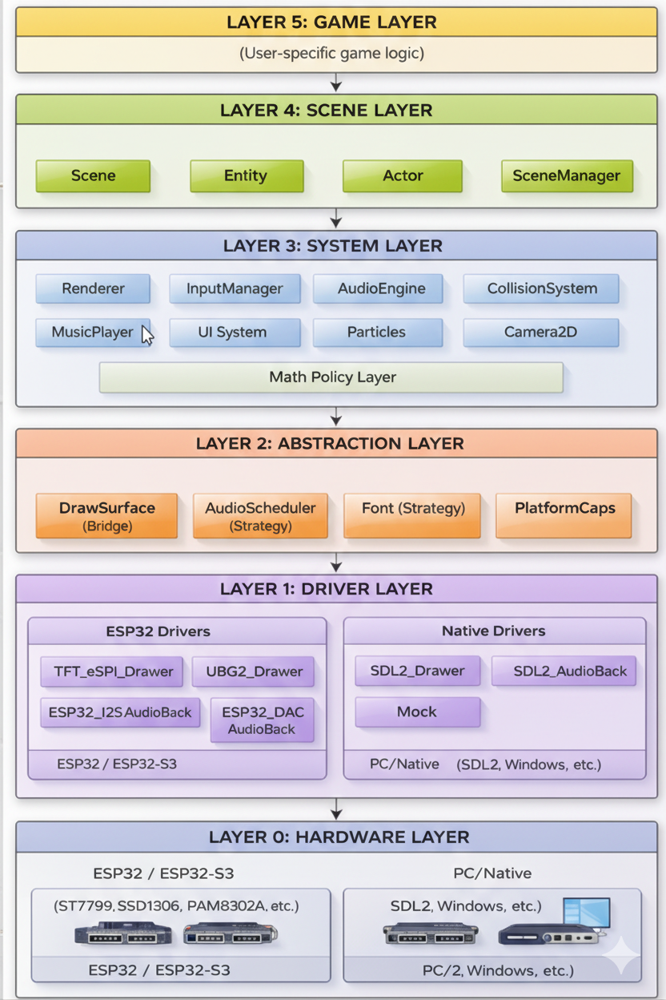

# Architecture Document - PixelRoot32 Game Engine

## Executive Summary

PixelRoot32 is a lightweight, modular 2D game engine written in C++17, designed primarily for ESP32 microcontrollers, with a native simulation layer for PC (SDL2) that enables rapid development without hardware.

The engine follows a scene-based architecture inspired by Godot Engine, making it intuitive for developers familiar with modern game development workflows.

---

## 1. Architecture Overview

### 1.1 Design Philosophy

- **Modularity**: Each subsystem can be used independently
- **Portability**: Same code for ESP32 and PC (SDL2)
- **Performance**: Optimized for resource-constrained hardware
- **Extensibility**: Plugin architecture for drivers and backends
- **Modern C++**: Leverages C++17 features (smart pointers, string_view) for safety and efficiency

#### What Does "Modularity" Mean in PixelRoot32?

**Modularity** means that each main subsystem has **low coupling** and can be instantiated, tested, and used in isolation, without depending on other subsystems. This allows:

- **Independent testing**: Each module can be unit tested
- **Selective usage**: Use only the modules you need
- **Easy replacement**: Change implementations without affecting the rest of the code

**Concrete examples of independence:**

```cpp
// 1. AudioEngine works without Renderer or SceneManager
AudioConfig audioConfig;
AudioEngine audio(audioConfig);
audio.init();
audio.playEvent({WaveType::PULSE, 440.0f, 0.5f, 0.8f});

// 2. Renderer can be used without Audio or Input
DisplayConfig displayConfig;
Renderer renderer(displayConfig);
renderer.init();
renderer.beginFrame();
renderer.drawSprite(sprite, 10, 10, Color::White);
renderer.endFrame();

// 3. InputManager is autonomous
InputConfig inputConfig;
InputManager input(inputConfig);
input.init();
input.update(deltaTime);
if (input.isButtonPressed(0)) { /* ... */ }

// 4. CollisionSystem is optional per scene
Scene scene;
// You can update physics only if you need it
scene.collisionSystem.update();

// 5. Interchangeable drivers without changing game code
// Same code works with TFT_eSPI_Drawer, U8G2_Drawer, or SDL2_Drawer
```

**Note**: `Engine` is the only component with tight coupling (orchestrates everything), but each subsystem can exist and function independently.

### 1.2 Main Architectural Features

- Stack-based Scene-Entity system
- Rendering with logical resolution independent of physical resolution
- NES-style 4-channel audio subsystem
- UI system with automatic layouts
- AABB (Axis-Aligned Bounding Box) physics
- Multi-platform support through driver abstraction

---

## 2. Layer Hierarchy Diagram



---

## 3. Detailed Layer Description

### 3.1 LAYER 0: Hardware Layer

**Responsibility**: Underlying physical hardware.

**Components**:

- **ESP32/ESP32-S3**: Main microcontrollers
- **Displays**: ST7789, ST7735, SSD1306 (OLED), SH1106
- **Audio**: Internal DAC, I2S with PAM8302A amplifiers
- **Input**: Physical buttons connected to GPIOs
- **PC/Native**: Simulation via SDL2 on Windows/Linux/macOS

---

### 3.2 LAYER 1: Driver Layer

**Responsibility**: Platform-specific hardware abstraction.

**Design Patterns**: Concrete implementation of abstractions

**ESP32 Drivers**:

| Driver | File | Description |
|--------|------|-------------|
| `TFT_eSPI_Drawer` | `drivers/esp32/TFT_eSPI_Drawer.cpp` | TFT display driver (ST7789, ST7735) |
| `U8G2_Drawer` | `drivers/esp32/U8G2_Drawer.cpp` | Monochrome OLED driver (SSD1306, SH1106) |
| `ESP32_I2S_AudioBackend` | `drivers/esp32/ESP32_I2S_AudioBackend.cpp` | I2S audio backend |
| `ESP32_DAC_AudioBackend` | `drivers/esp32/ESP32_DAC_AudioBackend.cpp` | Internal DAC audio backend |
| `ESP32AudioScheduler` | `audio/ESP32AudioScheduler.cpp` | Multi-core audio scheduler |

**Native (PC) Drivers**:

| Driver | File | Description |
|--------|------|-------------|
| `SDL2_Drawer` | `drivers/native/SDL2_Drawer.cpp` | SDL2 graphics simulation |
| `SDL2_AudioBackend` | `drivers/native/SDL2_AudioBackend.cpp` | SDL2 audio backend |
| `NativeAudioScheduler` | `audio/NativeAudioScheduler.cpp` | Native scheduler |
| `MockArduino` | `platforms/mock/MockArduino.cpp` | Arduino API emulation |

---

### 3.3 LAYER 2: Abstraction Layer

**Responsibility**: Abstract interfaces that decouple subsystems from concrete implementations.

**Design Patterns**:

- **Bridge Pattern**: `DrawSurface` decouples Renderer from specific drivers
- **Strategy Pattern**: `AudioScheduler` allows different scheduling implementations

**Main Components**:

#### DrawSurface (Bridge Pattern)

```cpp
class DrawSurface {
    virtual void init() = 0;
    virtual void drawPixel(int x, int y, uint16_t color) = 0;
    virtual void drawLine(int x1, int y1, int x2, int y2, uint16_t color) = 0;
    virtual void sendBuffer() = 0;
    // ... more drawing methods
};
```

#### AudioScheduler (Strategy Pattern)

```cpp
class AudioScheduler {
    virtual void init() = 0;
    virtual void submitCommand(const AudioCommand& cmd) = 0;
    virtual void generateSamples(int16_t* stream, int length) = 0;
};
```

#### PlatformCapabilities

Structure that detects and exposes hardware capabilities:

- `hasDualCore`: Multi-core support
- `audioCoreId`: Recommended core for audio
- `mainCoreId`: Recommended core for game loop

---

### 3.4 LAYER 3: System Layer

**Responsibility**: Game engine subsystems that implement high-level functionality.

#### 3.4.1 Renderer

**Files**: `include/graphics/Renderer.h`, `src/graphics/Renderer.cpp`

**Responsibility**: High-level rendering system that abstracts graphics operations.

**Features**:

- Logical resolution independent of physical resolution
- Support for 1bpp, 2bpp, 4bpp sprites
- Sprite animation system
- Tilemaps with viewport culling
- Native bitmap font system
- Render contexts for dual palettes

**Main API**:

```cpp
class Renderer {
    void beginFrame();
    void endFrame();
    void drawSprite(const Sprite& sprite, int x, int y, Color color);
    void drawText(std::string_view text, int x, int y, Color color, uint8_t size);
    void drawTileMap(const TileMap& map, int originX, int originY);
    void setDisplaySize(int w, int h);
    void setDisplayOffset(int x, int y);
};
```

#### 3.4.2 InputManager

**Files**: `include/input/InputManager.h`, `src/input/InputManager.cpp`

**Responsibility**: Input management from physical buttons or keyboard (PC).

**Features**:

- Debouncing support
- States: Pressed, Released, Down, Clicked
- Configurable via `InputConfig`
- Hardware abstraction through polling

**Button States**:

- `isButtonPressed()`: UP → DOWN transition
- `isButtonReleased()`: DOWN → UP transition
- `isButtonDown()`: Current DOWN state
- `isButtonClicked()`: Complete click

#### 3.4.3 AudioEngine

**Files**: `include/audio/AudioEngine.h`, `src/audio/AudioEngine.cpp`

**Responsibility**: NES-style 4-channel audio system.

**Audio Architecture**:

```
AudioEngine (Facade)
    └── AudioScheduler (Strategy)
            ├── AudioCommandQueue
            ├── Channel Generators (Pulse, Triangle, Noise)
            └── Mixer with LUT
```

**Wave Types**:

- `PULSE`: Square wave with variable duty cycle
- `TRIANGLE`: Triangle wave
- `NOISE`: Pseudo-random noise

**Components**:

- `AudioCommandQueue`: Thread-safe command queue
- `MusicPlayer`: Music sequencing system
- `AudioMixerLUT`: Optimized mixer with lookup tables

#### 3.4.4 CollisionSystem

**Files**: `include/physics/CollisionSystem.h`, `src/physics/CollisionSystem.cpp`

**Responsibility**: AABB collision detection between Actors.

**Features**:

- Collision layer and mask system
- `onCollision()` callbacks in Actors
- Based on `std::vector` for entity registration

**Collision Layers**:

```cpp
enum DefaultLayers {
    kNone = 0,
    kPlayer = 1 << 0,
    kEnemy = 1 << 1,
    kProjectile = 1 << 2,
    kWall = 1 << 3,
    // ... up to 16 layers
};
```

#### 3.4.5 UI System

**Files**: `include/graphics/ui/*.h`, `src/graphics/ui/*.cpp`

**Responsibility**: User interface system with automatic layouts.

**Class Hierarchy**:

```
Entity
└── UIElement
    ├── UILabel
    ├── UIButton
    ├── UICheckbox
    └── UIPanel
        └── UILayout
            ├── UIHorizontalLayout
            ├── UIVerticalLayout
            ├── UIGridLayout
            ├── UIAnchorLayout
            └── UIPaddingContainer
```

**Available Layouts**:

- `UIHorizontalLayout`: Horizontal arrangement
- `UIVerticalLayout`: Vertical arrangement
- `UIGridLayout`: Grid arrangement
- `UIAnchorLayout`: Edge anchoring
- `UIPaddingContainer`: Internal margins

#### 3.4.6 Particle System

**Files**: `include/graphics/particles/*.h`, `src/graphics/particles/*.cpp`

**Components**:

- `Particle`: Individual particle with position, velocity, life
- `ParticleEmitter`: Configurable emitter with presets
- `ParticleConfig`: Emission configuration

#### 3.4.7 Camera2D

**Files**: `include/graphics/Camera2D.h`, `src/graphics/Camera2D.cpp`

**Responsibility**: 2D camera with viewport transformations.

**Features**:

- Position and zoom
- Automatic offset for Renderer
- Support for fixed-position UI elements

#### 3.4.8 Math Policy Layer

**Files**: `include/math/Scalar.h`, `include/math/Fixed16.h`, `include/math/MathUtil.h`

**Responsibility**: Platform-agnostic numerical abstraction layer.

**Features**:

- **Automatic Type Selection**: Selects `float` for FPU-capable platforms (ESP32, S3) and `Fixed16` for integer-only platforms (ESP32-C3, S2).
- **Unified API**: Provides a consistent `Scalar` type and `MathUtil` functions regardless of the underlying representation.
- **Performance Optimization**: Ensures optimal performance on all supported hardware without code changes.

**Components**:

- `Scalar`: Type alias (`float` or `Fixed16`).
- `Fixed16`: 16.16 fixed-point implementation.
- `MathUtil`: Mathematical helper functions (abs, min, max, sqrt, etc.) compatible with `Scalar`.

---

### 3.5 LAYER 4: Scene Layer

**Responsibility**: Game scene and entity management.

#### 3.5.1 Engine

**Files**: `include/core/Engine.h`, `src/core/Engine.cpp`

**Responsibility**: Central class that orchestrates all subsystems.

**Game Loop**:

```cpp
void Engine::run() {
    while (true) {
        // 1. Calculate delta time
        deltaTime = currentMillis - previousMillis;
        
        // 2. Update
        update();
        
        // 3. Draw
        draw();
    }
}

void Engine::update() {
    inputManager.update(deltaTime);
    sceneManager.update(deltaTime);
}

void Engine::draw() {
    renderer.beginFrame();
    sceneManager.draw(renderer);
    renderer.endFrame();
}
```

**Managed Subsystems**:

- `SceneManager`: Scene stack
- `Renderer`: Graphics system
- `InputManager`: User input
- `AudioEngine`: Audio system
- `MusicPlayer`: Music player
- `PlatformCapabilities`: Hardware capabilities (`pixelroot32::platforms`)

#### 3.5.2 SceneManager

**Files**: `include/core/SceneManager.h`, `src/core/SceneManager.cpp`

**Responsibility**: Scene stack management (push/pop).

**Operations**:

- `setCurrentScene()`: Replace current scene
- `pushScene()`: Push new scene (pauses previous)
- `popScene()`: Pop scene (resumes previous)

**Scene Stack**:

```cpp
Scene* sceneStack[MAX_SCENES];  // Maximum 5 scenes by default
int sceneCount;
```

#### 3.5.3 Scene

**Files**: `include/core/Scene.h`, `src/core/Scene.cpp`

**Responsibility**: Entity container representing a level or screen.

**Memory Management**:
The Scene follows a **non-owning** model for entities. When you call `addEntity(Entity*)`, the scene stores a reference to the entity but **does not take ownership**.
- You are responsible for the entity's lifetime (typically using `std::unique_ptr` in your Scene subclass).
- The Scene will NOT delete entities when it is destroyed or when `clearEntities()` is called.

**Features**:

- Entity array (`MAX_ENTITIES = 32`)
- Render layer system (`MAX_LAYERS = 3`)
- Integrated `CollisionSystem`
- Viewport culling
- Optional: `SceneArena` for custom allocators

**Lifecycle**:

```cpp
virtual void init();                    // When entering scene
virtual void update(unsigned long dt);  // Every frame
virtual void draw(Renderer& r);         // Every frame
```

#### 3.5.4 Entity

**Files**: `include/core/Entity.h`

**Responsibility**: Abstract base class for all game objects.

**Properties**:

- Position (`x`, `y`)
- Dimensions (`width`, `height`)
- `EntityType`: GENERIC, ACTOR, UI_ELEMENT
- `renderLayer`: Render layer (0-255)
- `isVisible`: Visibility control
- `isEnabled`: Update control

**Virtual Methods**:

```cpp
virtual void update(unsigned long deltaTime) = 0;
virtual void draw(Renderer& renderer) = 0;
```

#### 3.5.5 Actor

**Files**: `include/core/Actor.h`

**Responsibility**: Entity with physical collision capabilities.

**Features**:

- Inherits from `Entity`
- `CollisionLayer layer`: Own collision layer
- `CollisionLayer mask`: Layers it collides with
- `getHitBox()`: Gets bounding box for collision
- `onCollision(Actor* other)`: Collision callback

---

### 3.6 LAYER 5: Game Layer

**Responsibility**: Game-specific code implemented by the user.

**Implementation Example**:

```cpp
class Player : public Actor {
public:
    void update(unsigned long deltaTime) override {
        // Movement logic
        if (engine.getInputManager().isButtonPressed(BTN_A)) {
            jump();
        }
    }
    
    void draw(Renderer& r) override {
        r.drawSprite(playerSprite, x, y, Color::White);
    }
    
    void onCollision(Actor* other) override {
        if (other->isInLayer(Layers::kEnemy)) {
            takeDamage();
        }
    }
};

class GameScene : public Scene {
    std::unique_ptr<Player> player;

public:
    void init() override {
        player = std::make_unique<Player>(100, 100, 16, 16);
        addEntity(player.get());
    }
};
```

---

## 4. Data Flow and Dependencies

### 4.1 Game Loop Flow

```
┌──────────┐     ┌──────────────┐     ┌──────────────┐     ┌──────────┐
│   Init   │────▶│  Game Loop   │────▶│    Exit      │────▶│ Cleanup  │
└──────────┘     └──────────────┘     └──────────────┘     └──────────┘
                        │
         ┌──────────────┼──────────────┐
         ▼              ▼              ▼
   ┌──────────┐   ┌──────────┐   ┌──────────┐
   │  Input   │   │  Update  │   │   Draw   │
   │  Poll    │   │  Logic   │   │  Render  │
   └──────────┘   └──────────┘   └──────────┘
                        │
         ┌──────────────┼──────────────┐
         ▼              ▼              ▼
   ┌──────────┐   ┌──────────┐   ┌──────────┐
   │  Audio   │   │ Physics  │   │   UI     │
   │ Generate │   │  Update  │   │  Draw    │
   └──────────┘   └──────────┘   └──────────┘
```

### 4.2 Module Dependencies

```
Engine
├── SceneManager
│   └── Scene
│       ├── Entity
│       │   ├── Actor
│       │   └── UIElement
│       └── CollisionSystem
├── Renderer
│   ├── DrawSurface (abstract)
│   │   ├── TFT_eSPI_Drawer
│   │   ├── U8G2_Drawer
│   │   └── SDL2_Drawer
│   ├── Font (abstract)
│   │   └── Font5x7
│   └── Camera2D
├── InputManager
│   └── InputConfig
├── AudioEngine
│   ├── AudioScheduler (abstract)
│   │   ├── ESP32AudioScheduler
│   │   └── NativeAudioScheduler
│   └── MusicPlayer
└── PlatformCapabilities
```

### 4.3 Audio Flow

```
Game Code
    │
    ▼ (submitCommand)
AudioCommandQueue (Thread-Safe)
    │
    ▼ (processCommands)
AudioScheduler
    │
    ├──▶ Pulse Channel
    ├──▶ Triangle Channel
    ├──▶ Noise Channel
    └──▶ Music Sequencer
    │
    ▼ (generateSamples)
Mixer (with LUT)
    │
    ▼
AudioBackend
    ├──▶ ESP32_I2S_AudioBackend
    ├──▶ ESP32_DAC_AudioBackend
    └──▶ SDL2_AudioBackend
```

---

## 5. Configuration and Compilation

### 5.1 Configuration Files

| File | Description |
|------|-------------|
| `platforms/EngineConfig.h` | Global engine configuration |
| `platforms/PlatformDefaults.h` | Platform-specific defaults |
| `platforms/PlatformCapabilities.h` | Hardware detection (`pixelroot32::platforms`) |
| `graphics/DisplayConfig.h` | Display configuration |
| `input/InputConfig.h` | Input configuration |
| `audio/AudioConfig.h` | Audio configuration |

### 5.2 Compilation Flags

| Flag | Description |
|------|-------------|
| `PLATFORM_ESP32` | Compilation for ESP32 |
| `PLATFORM_NATIVE` | Compilation for PC |
| `PIXELROOT32_ENABLE_DEBUG_OVERLAY` | Enable debug overlay |
| `PIXELROOT32_ENABLE_2BPP_SPRITES` | 2bpp sprite support |
| `PIXELROOT32_ENABLE_4BPP_SPRITES` | 4bpp sprite support |
| `PIXELROOT32_ENABLE_SCENE_ARENA` | Scene allocator |
| `PIXELROOT32_USE_U8G2_DRIVER` | U8G2 driver for OLEDs |
| `PIXELROOT32_NO_TFT_ESPI` | Disable TFT_eSPI |

---

## 6. Performance Optimizations

### 6.1 Implemented Strategies

1. **Logical vs Physical Resolution**: Rendering at low resolution (e.g., 128x128) with scaling to physical display (e.g., 240x240)

2. **Multi-Core Audio (ESP32)**:
   - Core 0: Audio scheduling and generation
   - Core 1: Main game loop

3. **Mixer LUT**: Lookup tables for mixing without FPU

4. **DMA Transfers**: DMA transfers for displays

5. **IRAM-Cached Rendering**: Critical functions in internal RAM

6. **Viewport Culling**: Only render visible entities

7. **Cached Debug Strings**: Text formatting every N frames

### 6.2 Performance Metrics

- **FPS Target**: 30-60 FPS on ESP32
- **Audio Latency**: < 50ms
- **Memory Footprint**: < 100KB RAM for complete engine
- **Sprite Capacity**: 100+ sprites @ 60fps (logical resolution 128x128)

---

## 7. Extensibility

### 7.1 Adding a New Display Driver

1. Inherit from `DrawSurface`
2. Implement all virtual methods
3. Register in Renderer factory

```cpp
class MyCustomDrawer : public DrawSurface {
    void init() override;
    void drawPixel(int x, int y, uint16_t color) override;
    // ... other methods
};
```

### 7.2 Adding a New UI Type

1. Inherit from `UIElement`
2. Implement `update()` and `draw()`
3. Add to layouts if it's a container

```cpp
class MyCustomWidget : public UIElement {
    void update(unsigned long dt) override;
    void draw(Renderer& r) override;
};
```

### 7.3 Adding a New Audio Type

1. Create wave generator
2. Integrate into `AudioScheduler`
3. Update mixer

---

## 8. Simplified Class Diagram

```text
┌────────────────────────────────────────────────────────────────────────┐
│                               Engine                                   │
├────────────────────────────────────────────────────────────────────────┤
│ - sceneManager: SceneManager                                           │
│ - renderer: Renderer                                                   │
│ - inputManager: InputManager                                           │
│ - audioEngine: AudioEngine                                             │
│ - musicPlayer: MusicPlayer                                             │
├────────────────────────────────────────────────────────────────────────┤
│ + init()                                                               │
│ + run()                                                                │
│ + setScene(Scene*)                                                     │
│ + getRenderer(): Renderer&                                             │
│ + getInputManager(): InputManager&                                     │
│ + getAudioEngine(): AudioEngine&                                       │
└────────────────────────────────────────────────────────────────────────┘
                                    │
                                    │ uses
                                    ▼
┌────────────────────────────────────────────────────────────────────────┐
│                            SceneManager                                │
├────────────────────────────────────────────────────────────────────────┤
│ - sceneStack[5]: Scene*                                                │
│ - sceneCount: int                                                      │
├────────────────────────────────────────────────────────────────────────┤
│ + setCurrentScene(Scene*)                                              │
│ + pushScene(Scene*)                                                    │
│ + popScene()                                                           │
│ + update(dt)                                                           │
│ + draw(Renderer&)                                                      │
└────────────────────────────────────────────────────────────────────────┘
                                    │
                                    │ manages
                                    ▼
┌────────────────────────────────────────────────────────────────────────┐
│                              Scene                                     │
├────────────────────────────────────────────────────────────────────────┤
│ - entities[32]: Entity*                                                │
│ - collisionSystem: CollisionSystem                                     │
├────────────────────────────────────────────────────────────────────────┤
│ + init()                                                               │
│ + update(dt)                                                           │
│ + draw(Renderer&)                                                      │
│ + addEntity(Entity*)                                                   │
└────────────────────────────────────────────────────────────────────────┘
                                    │
                                    │ contains
                                    ▼
┌────────────────────────────────────────────────────────────────────────┐
│                              Entity                                    │
├────────────────────────────────────────────────────────────────────────┤
│ # x, y: float                                                          │
│ # width, height: int                                                   │
│ # type: EntityType                                                     │
│ # renderLayer: unsigned char                                           │
│ # isVisible: bool                                                      │
│ # isEnabled: bool                                                      │
├────────────────────────────────────────────────────────────────────────┤
│ + update(dt) = 0                                                       │
│ + draw(Renderer&) = 0                                                  │
└────────────────────────────────────────────────────────────────────────┘
                                    △
                    ┌───────────────┼───────────────┐
                    │               │               │
                    ▼               ▼               ▼
            ┌──────────┐     ┌──────────┐    ┌──────────┐
            │  Actor   │     │UIElement │    │ Generic  │
            └──────────┘     └──────────┘    └──────────┘
```

---

## 9. Conclusion

PixelRoot32 implements a well-defined layered architecture that enables:

1. **Portability**: 100% portable game code between ESP32 and PC
2. **Modularity**: Independent and replaceable subsystems
3. **Performance**: Specific optimizations for embedded hardware
4. **Extensibility**: Easy addition of new drivers and features
5. **Simplicity**: Intuitive API inspired by Godot Engine

The Scene-Entity architecture provides a familiar programming model for game developers, while the driver abstraction layer enables multi-platform support without sacrificing performance.

---

## References

- [API Reference](API_REFERENCE.md)
- [Audio Subsystem Reference](AUDIO_NES_SUBSYSTEM_REFERENCE.md)
- [Extending PixelRoot32](EXTENDING_PIXELROOT32.md)
- [Style Guide](STYLE_GUIDE.md)
- [Resolution Scaling](RESOLUTION_SCALING.md)

---

**Document Generated**: February 2026  
**Engine Version**: v0.7.0-dev  
**Author**: PixelRoot32 Architecture Analysis
