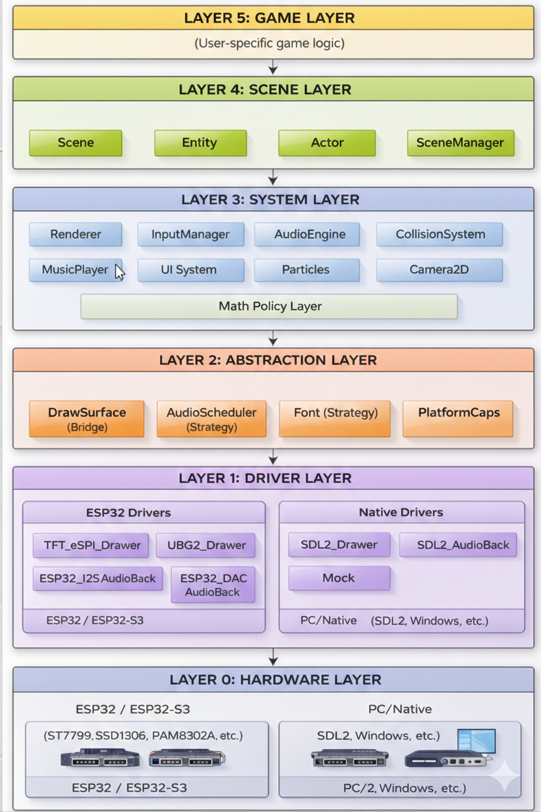

# Architecture Document - PixelRoot32 Game Engine

## Executive Summary

PixelRoot32 is a lightweight, modular 2D game engine written in C++17, designed primarily for ESP32 microcontrollers, with a native simulation layer for PC (SDL2) that enables rapid development without hardware.

The engine follows a scene-based architecture inspired by Godot Engine, making it intuitive for developers familiar with modern game development workflows.

> **Note:** For detailed architecture documentation with diagrams and examples, visit the [official documentation](https://docs.pixelroot32.org/manual/engine_architecture/).

---

## 1. Architecture Overview

### 1.1 Design Philosophy

- **Modularity**: Each subsystem can be used independently and compiled conditionally
- **Selective Compilation**: Subsystems can be excluded at compile time to reduce firmware size and RAM usage
- **Portability**: Same code for ESP32 and PC (SDL2)
- **Performance**: Optimized for resource-constrained hardware with aggressive dead code elimination
- **Extensibility**: Plugin architecture for drivers and backends
- **Modern C++**: Leverages C++17 features (smart pointers, string_view) for safety and efficiency

#### What Does "Modularity" Mean in PixelRoot32?

**Modularity** means that each main subsystem has **low coupling** and can be instantiated, tested, and used in isolation, without depending on other subsystems. This allows:

- **Independent testing**: Each module can be unit tested
- **Selective usage**: Use only the modules you need
- **Easy replacement**: Change implementations without affecting the rest of the code
- **Conditional compilation**: Exclude entire subsystems at compile time to save firmware size and RAM

**Concrete examples of independence:**

```cpp
// 1. AudioEngine works without Renderer or SceneManager (if enabled)
#if PIXELROOT32_ENABLE_AUDIO
AudioConfig audioConfig;
AudioEngine audio(audioConfig);
audio.init();
audio.playEvent({WaveType::PULSE, 440.0f, 0.5f, 0.8f});
#endif

// 2. Renderer can be used without Audio or Input
DisplayConfig displayConfig;
Renderer renderer(displayConfig);
renderer.init();
renderer.beginFrame();
renderer.drawSprite(sprite, 10, 10, Color::White);
renderer.endFrame();

// 3. InputManager is autonomous
InputConfig inputConfig;
InputManager input(inputConfig);
input.init();
input.update(deltaTime);
if (input.isButtonPressed(0)) { /* ... */ }

// 4. CollisionSystem is optional per scene (if enabled)
#if PIXELROOT32_ENABLE_PHYSICS
Scene scene;
// You can update physics only if you need it
scene.collisionSystem.update();
#endif

// 5. Interchangeable drivers without changing game code
// Same code works with TFT_eSPI_Drawer, U8G2_Drawer, or SDL2_Drawer
```

**Note**: `Engine` is the only component with tight coupling (orchestrates everything), but each subsystem can exist and function independently. The modular compilation system uses `PIXELROOT32_ENABLE_*` flags to conditionally compile subsystems, dramatically reducing firmware size and RAM usage on embedded targets.

### 1.2 Main Architectural Features

- Stack-based Scene-Entity system
- Rendering with logical resolution independent of physical resolution
- NES-style 4-channel audio subsystem (conditionally compiled)
- UI system with automatic layouts (conditionally compiled)
- "Flat Solver" physics with specialized Actor types (conditionally compiled)
- Circular and AABB collision support
- Multi-platform support through driver abstraction
- **Modular compilation** for selective subsystem inclusion

---

## 2. Layer Hierarchy Diagram



---

## 3. Detailed Layer Description

### 3.1 LAYER 0: Hardware Layer

**Responsibility**: Underlying physical hardware.

**Components**:

- **ESP32/ESP32-S3**: Main microcontrollers
- **Displays**: ST7789, ST7735, SSD1306 (OLED), SH1106
- **Audio**: Internal DAC, I2S with PAM8302A amplifiers
- **Input**: Physical buttons connected to GPIOs
- **PC/Native**: Simulation via SDL2 on Windows/Linux/macOS

---

### 3.2 LAYER 1: Driver Layer

**Responsibility**: Platform-specific hardware abstraction.

**Design Patterns**: Concrete implementation of abstractions

**ESP32 Drivers**:

| Driver | File | Description |
|--------|------|-------------|
| `TFT_eSPI_Drawer` | `drivers/esp32/TFT_eSPI_Drawer.cpp` | TFT display driver (ST7789, ST7735) |
| `U8G2_Drawer` | `drivers/esp32/U8G2_Drawer.cpp` | Monochrome OLED driver (SSD1306, SH1106) |
| `ESP32_I2S_AudioBackend` | `drivers/esp32/ESP32_I2S_AudioBackend.cpp` | I2S audio backend |
| `ESP32_DAC_AudioBackend` | `drivers/esp32/ESP32_DAC_AudioBackend.cpp` | Internal DAC audio backend |
| `ESP32AudioScheduler` | `audio/ESP32AudioScheduler.cpp` | Multi-core audio scheduler |

**Native (PC) Drivers**:

| Driver | File | Description |
|--------|------|-------------|
| `SDL2_Drawer` | `drivers/native/SDL2_Drawer.cpp` | SDL2 graphics simulation |
| `SDL2_AudioBackend` | `drivers/native/SDL2_AudioBackend.cpp` | SDL2 audio backend |
| `NativeAudioScheduler` | `audio/NativeAudioScheduler.cpp` | Native scheduler |
| `MockArduino` | `platforms/mock/MockArduino.cpp` | Arduino API emulation |

---

### 3.3 LAYER 2: Abstraction Layer

**Responsibility**: Abstract interfaces that decouple subsystems from concrete implementations.

**Design Patterns**:

- **Bridge Pattern**: `DrawSurface` decouples Renderer from specific drivers
- **Strategy Pattern**: `AudioScheduler` allows different scheduling implementations

**Main Components**:

#### PlatformMemory.h (Macro Abstraction)

Provides a unified API for memory operations that differ between ESP32 (Flash/PROGMEM) and Native (RAM) platforms.

- `PIXELROOT32_FLASH_ATTR`: Attribute for Flash storage.
- `PIXELROOT32_STRCMP_P`: Cross-platform flash string comparison.
- `PIXELROOT32_MEMCPY_P`: Cross-platform flash memory copy.
- `PIXELROOT32_READ_*_P`: Cross-platform flash data reading (byte, word, etc.).

#### DrawSurface (Bridge Pattern)

```cpp
class DrawSurface {
    virtual void init() = 0;
    virtual void drawPixel(int x, int y, uint16_t color) = 0;
    virtual void drawLine(int x1, int y1, int x2, int y2, uint16_t color) = 0;
    virtual void sendBuffer() = 0;
    // ... more drawing methods
};
```

#### AudioScheduler (Strategy Pattern)

```cpp
class AudioScheduler {
    virtual void init() = 0;
    virtual void submitCommand(const AudioCommand& cmd) = 0;
    virtual void generateSamples(int16_t* stream, int length) = 0;
};
```

#### PlatformCapabilities

Structure that detects and exposes hardware capabilities:

- `hasDualCore`: Multi-core support
- `audioCoreId`: Recommended core for audio
- `mainCoreId`: Recommended core for game loop

#### Math System (Scalar Abstraction)

**Files**: `include/math/Scalar.h`, `include/math/Fixed16.h`, `include/math/MathUtil.h`

**Responsibility**: Provide deterministic, platform-optimized numerical operations.

**Features**:

- **Hardware Adaptation**: Automatically switches between `float` and `Fixed16` based on FPU presence (ESP32-S3 vs ESP32-C3).
- **16.16 Fixed Point**: Optimized `Fixed16` implementation for RISC-V targets (C3/C6) providing enough range for physics and sub-pixel precision.
- **Generic Math API**: Single API for `sin`, `cos`, `sqrt`, `atan2` that resolves to the most efficient implementation per platform.
- **Stable Rounding**: Explicit `roundToInt`, `floorToInt`, and `ceilToInt` functions to avoid floating-point truncation artifacts in rendering (e.g., camera jitter).

#### Unified Logging System

**Files**: `include/core/Log.h`, `src/platforms/PlatformLog.cpp`

**Responsibility**: Cross-platform logging abstraction that eliminates `#ifdef` blocks in user code.

**Features**:

- Unified API for ESP32 (Serial) and Native (stdout)
- Log levels: Info, Profiling, Warning, Error
- printf-style formatting
- Automatic platform routing
- **Zero overhead when disabled**: Double-layer conditional compilation

**Architecture - Double-Layer Conditional Compilation**:

The logging system uses two layers of conditional compilation to ensure zero runtime cost in production:

1. **`#ifdef PIXELROOT32_DEBUG_MODE`** (header level): Makes `log()` calls emit formatting code when defined; otherwise replaces with no-op inline functions
2. **`if constexpr (pixelroot32::platforms::config::EnableLogging)`** (implementation level): Compile-time check that skips runtime formatting even when the header is active

```
PIXELROOT32_DEBUG_MODE defined:
    log() → format with va_list → platformPrint() → Serial/stdout

PIXELROOT32_DEBUG_MODE not defined:
    log() → (void)level; (void)fmt; → no-op
```

**Main API**:

```cpp
namespace pixelroot32::core::logging {
    enum class LogLevel { Info, Profiling, Warning, Error };
    void log(LogLevel level, const char* format, ...);
    void log(const char* format, ...); // Info level shorthand
}

// Enable in platformio.ini:
// build_flags = -DPIXELROOT32_DEBUG_MODE
```

**Platform Output**:

- ESP32: Routes to `Serial.print()`
- Native: Routes to `printf()` with `fflush(stdout)`

**Integration**: Used internally by `SDL2_Drawer`, `SDL2_AudioBackend`, and `TileCollisionBuilder` for debug diagnostics.

---

### 3.4 LAYER 3: System Layer

**Responsibility**: Game engine subsystems that implement high-level functionality.

#### 3.4.1 Renderer

**Files**: `include/graphics/Renderer.h`, `src/graphics/Renderer.cpp`

**Responsibility**: High-level rendering system that abstracts graphics operations.

**Features**:

- Logical resolution independent of physical resolution
- Support for 1bpp, 2bpp, 4bpp sprites
- Sprite animation system
- Tilemaps with viewport culling
- Multi-palette tilemaps (2bpp/4bpp): optional per-cell background palette via `paletteIndices` and a background palette slot bank (see Color module)
- Multi-palette sprites (2bpp/4bpp): optional sprite palette slot selection via `paletteSlot` parameter and sprite palette slot context
- Native bitmap font system
- Render contexts for dual palettes

#### Multi-Palette Sprites Architecture

The engine supports multiple palettes for 2bpp/4bpp sprites through a sprite palette slot bank, similar to the existing background palette system for tilemaps.

**Data Flow:**

```
sprite.paletteSlot parameter (0-7) → getSpritePaletteSlot(slot) → resolveColorWithPalette(color, palette) → LUT → drawSpriteInternal
```

**Components:**

- **`spritePaletteSlots[8]`**: Array of palette pointers (slot 0-7) in Color module
- **`currentSpritePaletteSlot`**: Renderer context slot (0xFF = inactive)
- **`getSpritePaletteSlot(uint8_t slot)`**: Returns palette pointer with fallback to slot 0
- **`resolveColorWithPalette(Color, const uint16_t*)`**: Converts Color enum to RGB565 using explicit palette
- **`setSpritePaletteSlotContext(uint8_t slot)`**: Sets global context that overrides `paletteSlot` parameter
- **`getSpritePaletteSlotContext()`**: Returns current context slot

**Usage Patterns:**

1. **Per-sprite palette selection**: `drawSprite(sprite, x, y, paletteSlot, flipX)`
2. **Batch rendering with context**: `setSpritePaletteSlotContext(2)` then `drawSprite(sprite, x, y, 0, flipX)` for multiple sprites
3. **Backward compatibility**: Legacy `drawSprite(sprite, x, y, flipX)` uses slot 0

**Integration with legacy system:**

- Slot 0 stays synchronized with `setSpritePalette()` / `setSpriteCustomPalette()`
- Existing `sprite.palette` fields in Sprite2bpp/Sprite4bpp remain optional
- `resolveColor(Color, PaletteContext::Sprite)` continues to work for single palette mode

**Main API**:

```cpp
class Renderer {
    void beginFrame();
    void endFrame();
    void drawSprite(const Sprite& sprite, int x, int y, Color color);
    void drawText(std::string_view text, int x, int y, Color color, uint8_t size);
    void drawTileMap(const TileMap& map, int originX, int originY);
    void setDisplaySize(int w, int h);
    void setDisplayOffset(int x, int y);
};
```

#### 3.4.2 InputManager

**Files**: `include/input/InputManager.h`, `src/input/InputManager.cpp`

**Responsibility**: Input management from physical buttons or keyboard (PC), plus optional touch event routing.

**Features**:

- Debouncing support
- States: Pressed, Released, Down, Clicked
- Configurable via `InputConfig`
- Hardware abstraction through polling
- **Touch event dispatcher** (when `PIXELROOT32_ENABLE_TOUCH=1`): Routes SDL mouse events to touch pipeline on Native, accepts injected touch points on ESP32

**Button States**:

- `isButtonPressed()`: UP → DOWN transition
- `isButtonReleased()`: DOWN → UP transition
- `isButtonDown()`: Current DOWN state
- `isButtonClicked()`: Complete click

**Touch input (parallel to buttons)**

When `PIXELROOT32_ENABLE_TOUCH=1`, `InputManager` includes a `TouchEventDispatcher` that:

- On **Native**: Receives SDL mouse events via `processSDLEvent()`, converts them to touch events with coordinate mapping
- On **ESP32**: Accepts injected touch points via `injectTouchPoint()` from external touch drivers

The touch path flows through `Engine` automatically — see [Touch Input Architecture](TOUCH_INPUT.md) for the full pipeline.

#### 3.4.3 AudioEngine

**Files**: `include/audio/AudioEngine.h`, `src/audio/AudioEngine.cpp`

**Responsibility**: NES-style 4-channel audio system.

**Audio Architecture**:

```
AudioEngine (Facade)
    └── AudioScheduler (Strategy)
            ├── AudioCommandQueue
            ├── Channel Generators (Pulse, Triangle, Noise)
            └── Mixer with LUT
```

**Wave Types**:

- `PULSE`: Square wave with variable duty cycle
- `TRIANGLE`: Triangle wave
- `NOISE`: Pseudo-random noise

**Components**:

- `AudioCommandQueue`: Thread-safe command queue
- `MusicPlayer`: Music sequencing system
- `AudioMixerLUT`: Optimized mixer with lookup tables

#### 3.4.4 CollisionSystem (Flat Solver)

**Files**: `include/physics/CollisionSystem.h`, `src/physics/CollisionSystem.cpp`

**Responsibility**: High-performance physics solver optimized for ESP32 microcontrollers.

**Companion Builder**: For tilemap-based levels, use **`TileCollisionBuilder`** (`include/physics/TileCollisionBuilder.h`) to generate physics bodies from a `TileBehaviorLayer` with a single call. See [Physics System Reference](PHYSICS_SYSTEM_REFERENCE.md) for details.

**System Architecture**:
The **Flat Solver** uses a fixed-timestep pipeline with proper separation of velocity and position phases:

```
1. Detect Collisions       → Rebuild static grid if dirty; clear dynamic; insert RIGID/KINEMATIC
                             → Broadphase (dual-layer grid) + Narrowphase → fixed contact pool
2. Solve Velocity          → Impulse-based response (2 iterations); sensor contacts skipped
3. Integrate Positions      → p = p + v * dt (RIGID only)
4. Solve Penetration        → Baumgarte stabilization + Slop; sensor contacts skipped
5. Trigger Callbacks        → onCollision notifications
```

**Key Features**:

- **Fixed Timestep**: Deterministic 1/60s simulation
- **Dual-Layer Spatial Grid**: Static layer (rebuilt only when entities change) + dynamic layer (cleared and refilled every frame); reduces per-frame cost with many static tiles
- **Fixed Contact Pool**: `Contact contacts[kMaxContacts]` (default 128); no heap allocations in the hot path; overflow drops extra contacts
- **Narrowphase**: AABB vs AABB, Circle vs Circle, Circle vs AABB; internal `ScalarRect` for consistent Scalar math
- **Sensors**: `PhysicsActor::setSensor(true)`; contact flag `isSensorContact` skips impulse and penetration; use for triggers, collectibles
- **One-Way Platforms**: `PhysicsActor::setOneWay(true)`; contact accepted only when landing from above (normal and velocity filter)
- **Entity Id Deduplication**: `Actor::entityId` assigned by `addEntity`; pair processing uses `entityId` for stable deduplication
- **CCD**: Selective continuous collision detection for fast-moving circles vs static AABB
- **Profiling Hooks**: `PIXELROOT32_PROFILE_BEGIN` / `PIXELROOT32_PROFILE_END` around each pipeline stage when `PIXELROOT32_ENABLE_PROFILING` is defined

**Collision Layers**:

```cpp
enum DefaultLayers {
    kNone = 0,
    kPlayer = 1 << 0,
    kEnemy = 1 << 1,
    kProjectile = 1 << 2,
    kWall = 1 << 3,
    // ... up to 16 layers
};
```

**Physics Constants**:

```cpp
FIXED_DT = 1/60s           // Timestep
SLOP = 0.02f               // Ignore penetration < 2cm
BIAS = 0.2f                // 20% position correction
VELOCITY_THRESHOLD = 0.5f  // Zero restitution below this
VELOCITY_ITERATIONS = 2    // Impulse solver passes
CCD_THRESHOLD = 3.0f       // CCD activation threshold
```

#### 3.4.5 UI System

**Files**: `include/graphics/ui/*.h`, `src/graphics/ui/*.cpp`

**Responsibility**: User interface system with automatic layouts.

**Class Hierarchy**:

```
Entity
├── UIElement
│   ├── UILabel
│   ├── UIButton
│   ├── UICheckbox
│   └── UIPanel
│       └── UILayout
│           ├── UIHorizontalLayout
│           ├── UIVerticalLayout
│           ├── UIGridLayout
│           ├── UIAnchorLayout
│           └── UIPaddingContainer
└── UITouchElement        (Touch-optimized widgets with Entity interface)
    ├── UITouchButton    (Touch button with draw() rendering)
    └── UITouchSlider    (Touch slider with drag interaction)
```

**Available Layouts**:

- `UIHorizontalLayout`: Horizontal arrangement
- `UIVerticalLayout`: Vertical arrangement
- `UIGridLayout`: Grid arrangement
- `UIAnchorLayout`: Edge anchoring
- `UIPaddingContainer`: Internal margins

**Touch Widget Architecture**:

- **UITouchWidget (struct)**: Lightweight widget data embedded within UITouchElement. Contains position, size, state, flags, and type. Accessed via `UITouchElement::getWidgetData()`.

- **UITouchElement (class)**: Abstract `UIElement` base with embedded `widgetData_`. Subclasses implement `draw()` and the pure virtual `processEvent(const TouchEvent&)` so `UIManager` can dispatch touches without type switches.

- **UITouchButton / UITouchSlider / UITouchCheckbox**: Concrete widgets constructed by the scene (e.g. `std::make_unique<UITouchButton>("Label", x, y, w, h)` or arena allocation in `init()`).

- **UIManager**: Non-owning registry (max 16 `UITouchElement*`). The scene calls `addElement(ptr)` after construction; `clear` / `removeElement` only unregister pointers and never destroy objects. `processEvents` hit-tests and calls `processEvent` on the hit (or captured) element. `update` / `draw` on `UIManager` are no-ops; widgets update and render as entities when added via `addEntity` (typically inside a `UILayout`).

```cpp
// Scene-owned widgets + registration for touch routing (illustrative)
auto button = std::make_unique<UITouchButton>("OK", 10, 20, 100, 40);
auto layout = std::make_unique<UIVerticalLayout>(/* x, y, w, h */);
getUIManager().addElement(button.get());
layout->addElement(button.get());
addEntity(layout.get());

uint8_t consumed = getUIManager().processEvents(events, count);
```

This keeps ownership and allocation policy in the scene (aligned with `STYLE_GUIDE` / arena or smart pointers) while `UIManager` remains a small, fixed-capacity event router.

#### 3.4.6 Particle System

**Files**: `include/graphics/particles/*.h`, `src/graphics/particles/*.cpp`

**Components**:

- `Particle`: Individual particle with position, velocity, life
- `ParticleEmitter`: Configurable emitter with presets
- `ParticleConfig`: Emission configuration

#### 3.4.7 Camera2D

**Files**: `include/graphics/Camera2D.h`, `src/graphics/Camera2D.cpp`

**Responsibility**: 2D camera with viewport transformations.

**Features**:

- Position and zoom
- Automatic offset for Renderer
- Support for fixed-position UI elements

#### 3.4.8 Tile Animation System

**Files**: `include/graphics/TileAnimation.h`, `src/graphics/TileAnimation.cpp`

**Responsibility**: Frame-based tile animations (water, lava, conveyor belts) with static tilemap data and ESP32-optimized performance.

**Design Goals**:

- **Static tilemap data**: Tilemap indices never change; animation is a view-time transformation
- **Zero dynamic allocations**: All data in fixed-size arrays or PROGMEM
- **O(1) frame resolution**: Hash table lookup via `lookupTable[MAX_TILESET_SIZE]`
- **Minimal CPU overhead**: <1% of frame budget on ESP32

**Components**:

```
TileAnimation[ ] (PROGMEM)  →  TileAnimationManager  →  lookupTable[256] (RAM)
     4 bytes × N                  step()                    resolveFrame(tileIndex)
```

**TileAnimation struct** (4 bytes per animation, PROGMEM):

- `baseTileIndex`: First tile in sequence
- `frameCount`: Number of frames
- `frameDuration`: Ticks per frame

**TileAnimationManager**:

- `lookupTable[MAX_TILESET_SIZE]`: Maps tile index → current animated frame (O(1))
- `step()`: Advances global timer, updates lookup table (O(animations × frameCount))
- `resolveFrame(tileIndex)`: O(1) array lookup, marked `IRAM_ATTR`

**Memory Cost**:

| Component | Size | Location |
|-----------|------|----------|
| Lookup table | MAX_TILESET_SIZE bytes | RAM |
| Animation definitions | 4 bytes × N | PROGMEM |
| **Total (256 tiles)** | **265 bytes RAM** | ~0.08% ESP32 DRAM |

**Integration**: Link `TileAnimationManager*` to `TileMapGeneric::animManager`. Renderer calls `resolveFrame()` for each visible tile; nullptr disables animations with zero overhead.

See [API Reference – Tile Animation System](API_REFERENCE.md) for usage examples.

#### 3.4.9 Tile Attribute System

**Files**: `include/graphics/Renderer.h` (structures), `include/physics/TileAttributes.h`, `include/physics/TileConsumptionHelper.h`, Scene headers (generated data)

**Responsibility**: Runtime tile metadata and collision behavior: (1) **key-value attributes** (PROGMEM, O(n) query) for non–hot-path metadata; (2) **flags-based behavior layer** (dense array, O(1)) for physics and gameplay.

**Architecture**:

The tile attribute system provides two paths:

1. **Key-value (LayerAttributes)**  
   Lightweight metadata attached to tiles, defined in the PixelRoot32 Tilemap Editor and exported as PROGMEM. Query with `get_tile_attribute(layer, x, y, key)`. Use for non–collision metadata (e.g. room names, signs). Sparse representation; O(n) search. Data flow: Editor → Scene header (TileAttribute, TileAttributeEntry, LayerAttributes) → `get_tile_attribute()`. Use cases: collision hints, interaction types, game logic values, animation flags.

2. **Flags-based (TileFlags + TileBehaviorLayer)**  
   Dense 1-byte-per-tile layer exported as `uint8_t[]`. O(1) lookup via **`getTileFlags(layer, x, y)`**. Used for collision and real-time gameplay: solid, sensor, damage, collectible, one-way, trigger. **`TileCollisionBuilder`** creates **StaticActor** or **SensorActor** per tile, sets **`setUserData(packTileData(x, y, flags))`**. In **`onCollision`**, **`unpackTileData`** and test flags (e.g. `TILE_COLLECTIBLE` → collect; `TILE_DAMAGE` → damage player).

**Consumible tiles**: When a tile is consumed (e.g. coin), call **`scene.removeEntity(tileActor)`** and **`tilemap->setTileActive(tileX, tileY, false)`**. **`physics::TileConsumptionHelper`** (or **`consumeTileFromCollision()`**) encapsulates this and reuses **TileMapGeneric::runtimeMask** (no separate consumed mask). See [Physics System Reference](PHYSICS_SYSTEM_REFERENCE.md) and [API Reference – TileConsumptionHelper](API_REFERENCE.md).

**Design philosophy** (key-value path):

- **Centralized query logic** in the engine
- **Sparse representation**: only tiles with attributes in export
- **Flash storage** (PROGMEM) to minimize RAM
- **Simple query API** by position

**Design philosophy** (flags path):

- **No strings at runtime**; bit operations only
- **O(1) lookups**; 1 byte per tile
- **Same pipeline**: Entity, CollisionSystem, **userData**, **onCollision**

#### 3.4.10 Math Policy Layer

**Files**: `include/math/Scalar.h`, `include/math/Fixed16.h`, `include/math/MathUtil.h`

**Responsibility**: Platform-agnostic numerical abstraction layer.

**Features**:

- **Automatic Type Selection**: Selects `float` for FPU-capable platforms (ESP32, S3) and `Fixed16` for integer-only platforms (ESP32-C3, S2).
- **Unified API**: Provides a consistent `Scalar` type and `MathUtil` functions regardless of the underlying representation.
- **Performance Optimization**: Ensures optimal performance on all supported hardware without code changes.

**Components**:

- `Scalar`: Type alias (`float` or `Fixed16`).
- `Fixed16`: 16.16 fixed-point implementation.
- `MathUtil`: Mathematical helper functions (abs, min, max, sqrt, etc.) compatible with `Scalar`.

#### 3.4.11 Tilemap Optimization System

**Files**:

- `include/graphics/TileCache.h`
- `include/graphics/ChunkManager.h`
- `include/graphics/TileAnimation.h` (DirtyTileTracker)
- `include/graphics/DrawSurface.h` (drawTileDirect)
- `include/drivers/esp32/TFT_eSPI_Drawer.h`

**Responsibility**: Optimized tilemap rendering for ESP32 with multiple strategies.

**Architecture**:

```
Tilemap Rendering Pipeline:
┌─────────────────────────────────────────────────────────────┐
│                    drawTileMap()                            │
│  1. Viewport Culling (skip off-screen tiles)                │
│  2. DirtyTileTracker (skip unchanged animated tiles)        │
│  3. ChunkManager (batch visible chunks)                     │
│  4. TileCache (LRU cache for pre-rendered tiles)            │
│  5. drawSpriteInternal() with IRAM_ATTR                     │
└─────────────────────────────────────────────────────────────┘
        │
        ▼ (optional fast path for ESP32)
┌─────────────────────────────────────────────────────────────┐
│              drawTileDirect() - Direct Buffer               │
│  Writes tiles directly to sprite buffer (8bpp)              │
│  Much faster than pixel-by-pixel drawPixel()                │
│  Note: Requires compatible palette with TFT_eSPI            │
└─────────────────────────────────────────────────────────────┘
```

**Components**:

1. **TileCache** - LRU cache for pre-rendered tiles
   - Default: 16 tiles (128 bytes per tile at 8x8 16bpp)
   - Reduces repeated rendering of same tiles
   - Memory: `PIXELROOT32_TILE_CACHE_SIZE * 128` bytes

2. **ChunkManager** - Viewport culling by chunks
   - Divides tilemap into 8x8 tile chunks
   - Only renders visible chunks
   - Default chunk size: 8 tiles

3. **DirtyTileTracker** - Animation change tracking
   - Bitmap-based (1 bit per tile)
   - Skips tiles that haven't changed animation frame
   - Default: 256 tiles = 32 bytes

4. **drawTileDirect()** - Direct buffer write (ESP32)
   - Writes 8bpp tile data directly to sprite buffer
   - Uses `memcpy` instead of pixel-by-pixel drawPixel()
   - Currently limited by TFT_eSPI palette compatibility

**Compile-Time Flags** (defined in `EngineConfig.h`):

```cpp
// Tilemap Optimization Flags
PIXELROOT32_ENABLE_TILEMAP_OPTIMIZATION  // 1 = enabled, 0 = disabled
PIXELROOT32_TILE_CACHE_SIZE             // Default: 16
PIXELROOT32_DIRTY_TRACKER_SIZE          // Default: 256
PIXELROOT32_CHUNK_SIZE                  // Default: 8
```

**Performance Notes**:

- Viewport culling provides ~2-3x speedup for partial tilemaps
- Direct buffer write (`drawTileDirect`) can achieve ~27 FPS but has palette compatibility issues with custom palettes
- IRAM_ATTR on `drawSpriteInternal` ensures hot path stays in internal RAM
- Pixel batching was tested but provided no improvement and was removed

**Current FPS Performance** (ESP32 @ 240x240):

- Baseline: ~16 FPS
- With tilemap optimizations: ~16 FPS (limited by DMA transfer bottleneck)
- Direct buffer (experimental): ~27 FPS (colors require fix)

---

### 3.5 LAYER 4: Scene Layer

**Responsibility**: Game scene and entity management.

#### 3.5.1 Engine

**Files**: `include/core/Engine.h`, `src/core/Engine.cpp`

**Responsibility**: Central class that orchestrates all subsystems, including automatic touch processing on ESP32.

**Touch Integration** (`PIXELROOT32_ENABLE_TOUCH=1`):

When the touch flag is enabled, Engine provides:

- `getTouchDispatcher()`: Returns a reference to the internal `TouchEventDispatcher` for injecting touch points (ESP32) or receiving SDL mouse events (Native)
- `hasTouchEvents()`: Returns true if touch events are pending in the queue
- `setTouchManager(TouchManager* tm)`: Registers an external TouchManager for automatic processing

**Automatic Touch Processing (ESP32)**:

When `setTouchManager()` is called, Engine internally:

1. Polls `touchManager->getTouchPoints()` each frame
2. Detects touch releases (when count goes from >0 to 0)
3. Processes touch points through the internal `TouchEventDispatcher` to generate gesture events (TouchDown, TouchUp, Drag, etc.)
4. Sends events to the current scene via `Scene::processTouchEvents()`

This eliminates the need for manual touch injection code in the game loop:

**Game Loop**:

```cpp
void Engine::run() {
    while (true) {
        // 1. Calculate delta time
        deltaTime = currentMillis - previousMillis;
        
        // 2. Update
        update();
        
        // 3. Draw
        draw();
    }
}

void Engine::update() {
    inputManager.update(deltaTime);
    sceneManager.update(deltaTime);
}

void Engine::draw() {
    renderer.beginFrame();
    sceneManager.draw(renderer);
    renderer.endFrame();
}
```

**Managed Subsystems**:

- `SceneManager`: Scene stack
- `Renderer`: Graphics system
- `InputManager`: User input
- `AudioEngine`: Audio system
- `MusicPlayer`: Music player
- `PlatformCapabilities`: Hardware capabilities (`pixelroot32::platforms`)

#### 3.5.2 SceneManager

**Files**: `include/core/SceneManager.h`, `src/core/SceneManager.cpp`

**Responsibility**: Scene stack management (push/pop).

**Operations**:

- `setCurrentScene()`: Replace current scene
- `pushScene()`: Push new scene (pauses previous)
- `popScene()`: Pop scene (resumes previous)

**Scene Stack**:

```cpp
Scene* sceneStack[pixelroot32::platforms::config::MaxScenes];  // Maximum 8 scenes by default
int sceneCount;
```

#### 3.5.3 Scene

**Files**: `include/core/Scene.h`, `src/core/Scene.cpp`

**Responsibility**: Entity container representing a level or screen.

**Memory Management**:
The Scene follows a **non-owning** model for entities. When you call `addEntity(Entity*)`, the scene stores a reference to the entity but **does not take ownership**.

- You are responsible for the entity's lifetime (typically using `std::unique_ptr` in your Scene subclass).
- The Scene will NOT delete entities when it is destroyed or when `clearEntities()` is called.

**Features**:

- Entity array (`MAX_ENTITIES = 32`)
- Render layer system (`MAX_LAYERS = 3`)
- Integrated `CollisionSystem`
- Viewport culling
- Optional: `SceneArena` for custom allocators

**Lifecycle**:

```cpp
virtual void init();                    // When entering scene
virtual void update(unsigned long dt);  // Every frame
virtual void draw(Renderer& r);         // Every frame
```

#### 3.5.4 Entity

**Files**: `include/core/Entity.h`

**Responsibility**: Abstract base class for all game objects.

**Properties**:

- Position (`x`, `y`)
- Dimensions (`width`, `height`)
- `EntityType`: GENERIC, ACTOR, UI_ELEMENT
- `renderLayer`: Render layer (0-255)
- `isVisible`: Visibility control
- `isEnabled`: Update control

**Virtual Methods**:

```cpp
virtual void update(unsigned long deltaTime) = 0;
virtual void draw(Renderer& renderer) = 0;
```

#### 3.5.5 Actor / PhysicsActor Hierarchy

Following the Godot Engine philosophy, physical actors are specialized into distinct types based on their movement requirements.

**Hierarchy**:

```
Entity
└── Actor
    └── PhysicsActor (Base)
        ├── StaticActor    (Immovable walls/floors; static grid layer)
        │   └── SensorActor (Trigger: setSensor(true), e.g. collectibles)
        ├── KinematicActor (Character movement, move_and_slide)
        └── RigidActor     (Props, physical objects with gravity)
```

**Actor Roles**:

- **StaticActor**: Immovable scenery. Placed in the **static layer** of the spatial grid (rebuilt only when entities are added/removed). Other bodies collide with them normally.
- **SensorActor**: Subclass of StaticActor that calls `setSensor(true)`. Generates `onCollision` but no impulse or penetration correction.
- **KinematicActor**: Logic-driven movement. Use `moveAndCollide()` or `moveAndSlide()`. Inserted into the **dynamic layer** each frame.
- **RigidActor**: Fully simulated (gravity, forces, collisions). Inserted into the dynamic layer.
- **One-Way / Sensor Flags**: Any `PhysicsActor` can use `setOneWay(true)` (one-way platforms) or `setSensor(true)` (triggers). Tile metadata can be stored via `setUserData()` and decoded with `physics::packTileData` / `unpackTileData` from `TileAttributes.h`.
- **Shape Support**: All physics actors can be configured as `AABB` (Rectangle) or `CIRCLE`.

**Features**:

- `CollisionLayer layer`: Own collision layer
- `CollisionLayer mask`: Layers it collides with
- `bool bounce`: Optional bouncing behavior
- `onCollision(Actor* other)`: Notification-only callback (non-interruptive)

---

### 3.6 LAYER 5: Game Layer

**Responsibility**: Game-specific code implemented by the user.

**Implementation Example**:

```cpp
class Player : public Actor {
public:
    void update(unsigned long deltaTime) override {
        // Movement logic
        if (engine.getInputManager().isButtonPressed(BTN_A)) {
            jump();
        }
    }
    
    void draw(Renderer& r) override {
        r.drawSprite(playerSprite, x, y, Color::White);
    }
    
    void onCollision(Actor* other) override {
        if (other->isInLayer(Layers::kEnemy)) {
            takeDamage();
        }
    }
};

class GameScene : public Scene {
    std::unique_ptr<Player> player;

public:
    void init() override {
        player = std::make_unique<Player>(100, 100, 16, 16);
        addEntity(player.get());
    }
};
```

---

## 4. Data Flow and Dependencies

### 4.1 Game Loop Flow

```
┌──────────┐     ┌──────────────┐     ┌──────────────┐     ┌──────────┐
│   Init   │────▶│  Game Loop   │────▶│    Exit      │────▶│ Cleanup  │
└──────────┘     └──────────────┘     └──────────────┘     └──────────┘
                        │
         ┌──────────────┼──────────────┐
         ▼              ▼              ▼
   ┌──────────┐   ┌──────────┐   ┌──────────┐
   │  Input   │   │  Update  │   │   Draw   │
   │  Poll    │   │  Logic   │   │  Render  │
   └──────────┘   └──────────┘   └──────────┘
                        │
         ┌──────────────┼──────────────┐
         ▼              ▼              ▼
   ┌──────────┐   ┌──────────┐   ┌──────────┐
   │  Audio   │   │ Physics  │   │   UI     │
   │ Generate │   │  Update  │   │  Draw    │
   └──────────┘   └──────────┘   └──────────┘
```

### 4.2 Module Dependencies

```
Engine
├── SceneManager
│   └── Scene
│       ├── Entity
│       │   ├── Actor
│       │   └── UIElement
│       └── CollisionSystem
├── Renderer
│   ├── DrawSurface (abstract)
│   │   ├── TFT_eSPI_Drawer
│   │   ├── U8G2_Drawer
│   │   └── SDL2_Drawer
│   ├── Font (abstract)
│   │   └── Font5x7
│   └── Camera2D
├── InputManager
│   └── InputConfig
├── AudioEngine
│   ├── AudioScheduler (abstract)
│   │   ├── ESP32AudioScheduler
│   │   └── NativeAudioScheduler
│   └── MusicPlayer
└── PlatformCapabilities
```

### 4.3 Audio Flow

```
Game Code
    │
    ▼ (submitCommand)
AudioCommandQueue (Thread-Safe)
    │
    ▼ (processCommands)
AudioScheduler
    │
    ├──▶ Pulse Channel
    ├──▶ Triangle Channel
    ├──▶ Noise Channel
    └──▶ Music Sequencer
    │
    ▼ (generateSamples)
Mixer (with LUT)
    │
    ▼
AudioBackend
    ├──▶ ESP32_I2S_AudioBackend
    ├──▶ ESP32_DAC_AudioBackend
    └──▶ SDL2_AudioBackend
```

---

## 5. Configuration and Compilation

### 5.1 Configuration Files

| File | Description |
|------|-------------|
| `platforms/EngineConfig.h` | Global engine configuration |
| `platforms/PlatformDefaults.h` | Platform-specific defaults |
| `platforms/PlatformCapabilities.h` | Hardware detection (`pixelroot32::platforms`) |
| `graphics/DisplayConfig.h` | Display configuration |
| `input/InputConfig.h` | Input configuration |
| `docs/TOUCH_INPUT.md` | Touch pipeline, calibration, scene integration |
| `audio/AudioConfig.h` | Audio configuration |

### 5.2 Compilation Flags

| Flag | Description |
|------|-------------|
| `PLATFORM_ESP32` | Compilation for ESP32 |
| `PLATFORM_NATIVE` | Compilation for PC |
| `PIXELROOT32_ENABLE_DEBUG_OVERLAY` | Enable debug overlay |
| `PIXELROOT32_ENABLE_2BPP_SPRITES` | 2bpp sprite support |
| `PIXELROOT32_ENABLE_4BPP_SPRITES` | 4bpp sprite support |
| `PIXELROOT32_ENABLE_SCENE_ARENA` | Scene allocator |
| `PIXELROOT32_ENABLE_TILEMAP_OPTIMIZATION` | Tilemap optimizations (default: 1) |
| `PIXELROOT32_TILE_CACHE_SIZE` | Tile cache size (default: 16) |
| `PIXELROOT32_DIRTY_TRACKER_SIZE` | Dirty tile tracker size (default: 256) |
| `PIXELROOT32_CHUNK_SIZE` | Chunk size for viewport culling (default: 8) |
| `PIXELROOT32_USE_U8G2_DRIVER` | U8G2 driver for OLEDs |
| `PIXELROOT32_NO_TFT_ESPI` | Disable TFT_eSPI |

---

## 6. Performance Optimizations

### 6.1 Implemented Strategies

1. **Logical vs Physical Resolution**: Rendering at low resolution (e.g., 128x128) with high-performance scaling to physical display (e.g., 240x240).

2. **Scaling Pipeline (v1.0.0)**:
   - **Fast-Path Switching**: Specialized routines for 1:1 and 2x integer scaling that avoid expensive bit/byte calculations.
   - **Bit-Expansion LUTs**: OLED horizontal expansion via 16-entry lookup tables.
   - **32-bit Register Writes**: TFT vertical duplication via optimized 32-bit `memcpy` and register access.

3. **Multi-Core Audio (ESP32)**:
   - Core 0: Audio scheduling and generation.
   - Core 1: Main game loop.

4. **Mixer LUT**: Lookup tables for mixing without FPU.

5. **DMA Pipelining (TFT)**:
   - **Double Buffering**: CPU calculates next block while DMA sends the previous one.
   - **Large Block Sizes**: Using 60-line blocks to minimize interrupt frequency.

6. **I2C 1MHz (OLED)**: Sustained 60 FPS on monochrome screens via bus overclocking.

7. **IRAM-Cached Rendering**: Critical functions in internal RAM.

8. **Viewport Culling**: Only render visible entities

9. **Cached Debug Strings**: Text formatting every N frames

### 6.2 Performance Metrics

- **FPS Target**: 30-60 FPS on ESP32
- **Audio Latency**: < 50ms
- **Memory Footprint**: < 100KB RAM for complete engine
- **Sprite Capacity**: 100+ sprites @ 60fps (logical resolution 128x128)
- **Tilemap Rendering**: ~16 FPS @ 240x240 (ESP32) - limited by DMA transfer bottleneck

---

## 7. Extensibility

### 7.1 Adding a New Display Driver

1. Inherit from `DrawSurface`
2. Implement all virtual methods
3. Register in Renderer factory

```cpp
class MyCustomDrawer : public DrawSurface {
    void init() override;
    void drawPixel(int x, int y, uint16_t color) override;
    // ... other methods
};
```

### 7.2 Adding a New UI Type

1. Inherit from `UIElement`
2. Implement `update()` and `draw()`
3. Add to layouts if it's a container

```cpp
class MyCustomWidget : public UIElement {
    void update(unsigned long dt) override;
    void draw(Renderer& r) override;
};
```

### 7.3 Adding a New Audio Type

1. Create wave generator
2. Integrate into `AudioScheduler`
3. Update mixer

---

## 8. Simplified Class Diagram

```text
┌────────────────────────────────────────────────────────────────────────┐
│                               Engine                                   │
├────────────────────────────────────────────────────────────────────────┤
│ - sceneManager: SceneManager                                           │
│ - renderer: Renderer                                                   │
│ - inputManager: InputManager                                           │
│ - audioEngine: AudioEngine                                             │
│ - musicPlayer: MusicPlayer                                             │
├────────────────────────────────────────────────────────────────────────┤
│ + init()                                                               │
│ + run()                                                                │
│ + setScene(Scene*)                                                     │
│ + getRenderer(): Renderer&                                             │
│ + getInputManager(): InputManager&                                     │
│ + getAudioEngine(): AudioEngine&                                       │
└────────────────────────────────────────────────────────────────────────┘
                                    │
                                    │ uses
                                    ▼
┌────────────────────────────────────────────────────────────────────────┐
│                            SceneManager                                │
├────────────────────────────────────────────────────────────────────────┤
│ - sceneStack[5]: Scene*                                                │
│ - sceneCount: int                                                      │
├────────────────────────────────────────────────────────────────────────┤
│ + setCurrentScene(Scene*)                                              │
│ + pushScene(Scene*)                                                    │
│ + popScene()                                                           │
│ + update(dt)                                                           │
│ + draw(Renderer&)                                                      │
└────────────────────────────────────────────────────────────────────────┘
                                    │
                                    │ manages
                                    ▼
┌────────────────────────────────────────────────────────────────────────┐
│                              Scene                                     │
├────────────────────────────────────────────────────────────────────────┤
│ - entities[32]: Entity*                                                │
│ - collisionSystem: CollisionSystem                                     │
├────────────────────────────────────────────────────────────────────────┤
│ + init()                                                               │
│ + update(dt)                                                           │
│ + draw(Renderer&)                                                      │
│ + addEntity(Entity*)                                                   │
└────────────────────────────────────────────────────────────────────────┘
                                    │
                                    │ contains
                                    ▼
┌────────────────────────────────────────────────────────────────────────┐
│                              Entity                                    │
├────────────────────────────────────────────────────────────────────────┤
│ # x, y: float                                                          │
│ # width, height: int                                                   │
│ # type: EntityType                                                     │
│ # renderLayer: unsigned char                                           │
│ # isVisible: bool                                                      │
│ # isEnabled: bool                                                      │
├────────────────────────────────────────────────────────────────────────┤
│ + update(dt) = 0                                                       │
│ + draw(Renderer&) = 0                                                  │
└────────────────────────────────────────────────────────────────────────┘
                                    △
                    ┌───────────────┼───────────────┐
                    │               │               │
                    ▼               ▼               ▼
            ┌──────────┐     ┌──────────┐    ┌──────────┐
            │  Actor   │     │UIElement │    │ Generic  │
            └────┬─────┘     └──────────┘    └──────────┘
                 │
                 ▼
        ┌──────────────┐
        │ PhysicsActor │
        └───────┬──────┘
                │
   ┌────────────┼────────────────┐
   │            │                │
   ▼            ▼                ▼
┌───────────┐ ┌──────────────┐ ┌──────────┐
│StaticActor│ │KinematicActor│ │RigidActor│
└───────────┘ └──────────────┘ └──────────┘

```

---

## 9. Conclusion

PixelRoot32 implements a well-defined layered architecture that enables:

1. **Portability**: 100% portable game code between ESP32 and PC
2. **Modularity**: Independent and replaceable subsystems
3. **Performance**: Specific optimizations for embedded hardware
4. **Extensibility**: Easy addition of new drivers and features
5. **Simplicity**: Intuitive API inspired by Godot Engine

The Scene-Entity architecture provides a familiar programming model for game developers, while the driver abstraction layer enables multi-platform support without sacrificing performance.

---

## References

- [API Reference](API_REFERENCE.md)
- [Audio Subsystem Reference](AUDIO_NES_SUBSYSTEM_REFERENCE.md)
- [Extending PixelRoot32](EXTENDING_PIXELROOT32.md)
- [Style Guide](STYLE_GUIDE.md)
- [Resolution Scaling](RESOLUTION_SCALING.md)

---

**Document Generated**: March 2026  
**Engine Version**: v1.1.0  
**Author**: PixelRoot32 Architecture Analysis
