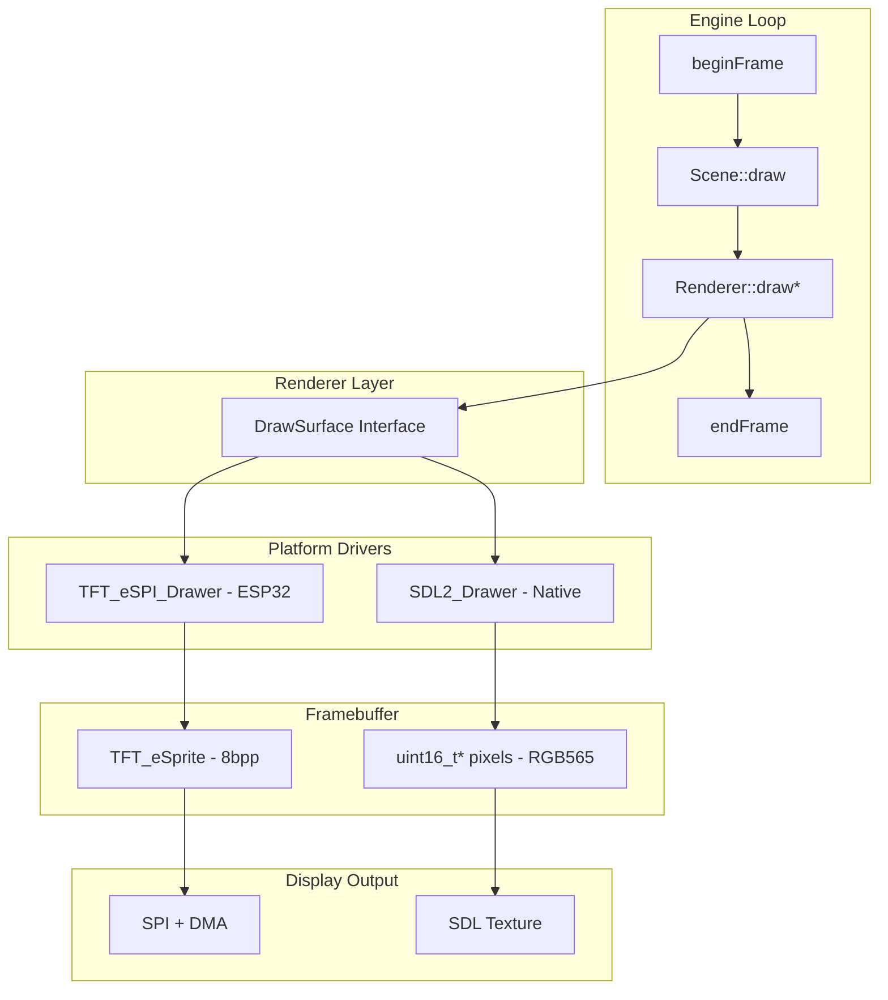
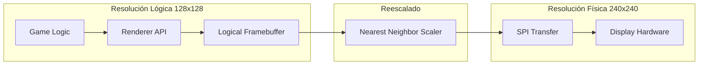
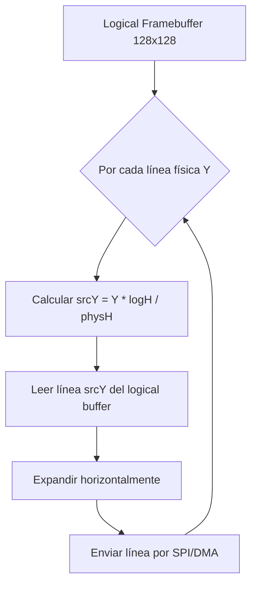

# Plan Técnico: Sistema de Resolución Lógica Independiente para PixelRoot32

## Resumen Ejecutivo

Este documento presenta un plan técnico detallado para implementar un sistema de renderizado con **resolución lógica independiente** de la resolución física de la pantalla en el engine PixelRoot32. El objetivo es permitir renderizar internamente a resoluciones bajas (ej: 128x128) y reescalar la imagen para mostrarla en pantallas de mayor resolución (ej: 240x240), optimizando significativamente el rendimiento en ESP32.

---

## Análisis del Estado Actual

### Arquitectura de Renderizado Actual



### Puntos de Dependencia de Resolución Identificados

| Archivo | Línea | Dependencia | Impacto |
|---------|-------|-------------|---------|
| [Config.h](file:///c:/Users/gperez88/Documents/Proyects/Games/pixelroot32%20workspace/PixelRoot32%20Game%20Samples/lib/PixelRoot32-Game-Engine/include/Config.h) | 7-8 | `DISPLAY_WIDTH/HEIGHT = 240` | Constantes globales |
| [Renderer.h](file:///c:/Users/gperez88/Documents/Proyects/Games/pixelroot32%20workspace/PixelRoot32%20Game%20Samples/lib/PixelRoot32-Game-Engine/include/graphics/Renderer.h#L494-495) | 494-495 | `width = 240; height = 240` | Clipping de primitivas |
| [DisplayConfig.h](file:///c:/Users/gperez88/Documents/Proyects/Games/pixelroot32%20workspace/PixelRoot32%20Game%20Samples/lib/PixelRoot32-Game-Engine/include/graphics/DisplayConfig.h#L48-49) | 48-49 | `w = 240, h = 240` | Valores por defecto |
| [UIAnchorLayout.h](file:///c:/Users/gperez88/Documents/Proyects/Games/pixelroot32%20workspace/PixelRoot32%20Game%20Samples/lib/PixelRoot32-Game-Engine/include/graphics/ui/UIAnchorLayout.h#L113) | 113 | `screenHeight = 240.0f` | Cálculo de anclas UI |
| [TFT_eSPI_Drawer.cpp](file:///c:/Users/gperez88/Documents/Proyects/Games/pixelroot32%20workspace/PixelRoot32%20Game%20Samples/lib/PixelRoot32-Game-Engine/src/drivers/esp32/TFT_eSPI_Drawer.cpp#L42) | 42 | `createSprite(displayWidth, displayHeight)` | Framebuffer allocation |
| [SDL2_Drawer.cpp](file:///c:/Users/gperez88/Documents/Proyects/Games/pixelroot32%20workspace/PixelRoot32%20Game%20Samples/lib/PixelRoot32-Game-Engine/src/drivers/native/SDL2_Drawer.cpp#L57) | 57 | `new uint16_t[displayWidth * displayHeight]` | Framebuffer allocation |

### Consumo de Memoria Actual (240x240)

| Componente | Cálculo | Memoria |
|------------|---------|---------|
| TFT_eSprite (8bpp) | 240 × 240 × 1 byte | **57,600 bytes** |
| SDL2 framebuffer (RGB565) | 240 × 240 × 2 bytes | 115,200 bytes |

> [!WARNING]
> En ESP32 con ~320KB de RAM disponible, un framebuffer de 57KB consume aproximadamente el **18%** de la memoria total.

---

## Propuesta de Arquitectura

### Concepto: Resolución Lógica vs Física



### Nueva Estructura de Datos

```cpp
// En DisplayConfig.h o nuevo archivo ResolutionConfig.h

struct ResolutionConfig {
    // Resolución lógica (donde dibuja el juego)
    uint16_t logicalWidth;
    uint16_t logicalHeight;
    
    // Resolución física (hardware)
    uint16_t physicalWidth;
    uint16_t physicalHeight;
    
    // Helpers
    float getScaleX() const { return (float)physicalWidth / logicalWidth; }
    float getScaleY() const { return (float)physicalHeight / logicalHeight; }
    bool needsScaling() const { return logicalWidth != physicalWidth || logicalHeight != physicalHeight; }
};
```

---

## Fase 1 – Análisis y Refactor Base ✅ COMPLETADA

### 1.1 Abstracción de Resolución Lógica

#### [MODIFY] [Config.h](file:///c:/Users/gperez88/Documents/Proyects/Games/pixelroot32%20workspace/PixelRoot32%20Game%20Samples/lib/PixelRoot32-Game-Engine/include/Config.h)

Reemplazar constantes hardcoded por valores configurables:

```cpp
// Antes
#define DISPLAY_HEIGHT 240
#define DISPLAY_WIDTH  240

// Después - Valores por defecto, configurables vía DisplayConfig
#ifndef PHYSICAL_DISPLAY_WIDTH
#define PHYSICAL_DISPLAY_WIDTH  240
#endif
#ifndef PHYSICAL_DISPLAY_HEIGHT
#define PHYSICAL_DISPLAY_HEIGHT 240
#endif

// Resolución lógica por defecto (puede ser 128, 160, o igual a física)
#ifndef LOGICAL_WIDTH
#define LOGICAL_WIDTH  PHYSICAL_DISPLAY_WIDTH
#endif
#ifndef LOGICAL_HEIGHT
#define LOGICAL_HEIGHT PHYSICAL_DISPLAY_HEIGHT
#endif
```

---

#### [MODIFY] [DisplayConfig.h](file:///c:/Users/gperez88/Documents/Proyects/Games/pixelroot32%20workspace/PixelRoot32%20Game%20Samples/lib/PixelRoot32-Game-Engine/include/graphics/DisplayConfig.h)

Extender `DisplayConfig` para soportar resolución lógica:

```cpp
struct DisplayConfig {
public:
    DisplayType type;
    int rotation = 0;
    
    // Resolución física (hardware)
    uint16_t physicalWidth;
    uint16_t physicalHeight;
    
    // Resolución lógica (rendering)
    uint16_t logicalWidth;
    uint16_t logicalHeight;
    
    int xOffset = 0;
    int yOffset = 0;

    DisplayConfig(
        DisplayType type,
        const int rot = 0,
        uint16_t physW = 240,
        uint16_t physH = 240,
        uint16_t logW = 0,   // 0 = igual a física
        uint16_t logH = 0,   // 0 = igual a física
        const int xOff = 0,
        const int yOff = 0
    )
        : type(type), rotation(rot), 
          physicalWidth(physW), physicalHeight(physH),
          logicalWidth(logW == 0 ? physW : logW),
          logicalHeight(logH == 0 ? physH : logH),
          xOffset(xOff), yOffset(yOff), drawSurface(nullptr)
    {
        // ... resto del constructor
    }
    
    // Helpers
    bool needsScaling() const { 
        return logicalWidth != physicalWidth || logicalHeight != physicalHeight; 
    }
    
    float getScaleX() const { return (float)physicalWidth / logicalWidth; }
    float getScaleY() const { return (float)physicalHeight / logicalHeight; }

    // Alias para compatibilidad (deprecated)
    uint16_t width() const { return logicalWidth; }
    uint16_t height() const { return logicalHeight; }
    
    DrawSurface& getDrawSurface() const { return *drawSurface; }

private:
    DrawSurface* drawSurface = nullptr;
};
```

---

#### [MODIFY] [Renderer.h](file:///c:/Users/gperez88/Documents/Proyects/Games/pixelroot32%20workspace/PixelRoot32%20Game%20Samples/lib/PixelRoot32-Game-Engine/include/graphics/Renderer.h)

Actualizar miembros internos para usar resolución lógica:

```diff
 private:
     DrawSurface* drawer;
     DisplayConfig config;

-    int width = 240;
-    int height = 240;
+    int logicalWidth;   // Resolución lógica para clipping
+    int logicalHeight;

     int xOffset = 0;
     int yOffset = 0;
```

---

#### [MODIFY] [Renderer.cpp](file:///c:/Users/gperez88/Documents/Proyects/Games/pixelroot32%20workspace/PixelRoot32%20Game%20Samples/lib/PixelRoot32-Game-Engine/src/graphics/Renderer.cpp)

Actualizar constructor e `init()`:

```cpp
Renderer::Renderer(const DisplayConfig& config) 
    : config(config),
      logicalWidth(config.logicalWidth),
      logicalHeight(config.logicalHeight) 
{        
    drawer = &config.getDrawSurface();
    xOffset = config.xOffset;
    yOffset = config.yOffset;
}

void Renderer::init() {
    // DrawSurface recibe resolución LÓGICA (donde dibujamos)
    getDrawSurface().setDisplaySize(config.logicalWidth, config.logicalHeight);
    
    // Configurar resolución física para el driver
    getDrawSurface().setPhysicalSize(config.physicalWidth, config.physicalHeight);
    
    getDrawSurface().init();
}
```

---

### 1.2 Archivos/Clases Afectadas en Fase 1

| Archivo | Cambio |
|---------|--------|
| `Config.h` | Añadir LOGICAL_WIDTH/HEIGHT, PHYSICAL_WIDTH/HEIGHT |
| `DisplayConfig.h` | Añadir logicalWidth/Height, helpers de escalado |
| `Renderer.h` | Renombrar width/height a logicalWidth/logicalHeight |
| `Renderer.cpp` | Usar logicalWidth/logicalHeight para clipping |
| `DrawSurface.h` | Añadir `setPhysicalSize()` virtual |
| `UIAnchorLayout.h` | Usar resolución lógica dinámica |

---

## Fase 2 – Sistema de Reescalado ✅ COMPLETADA

### 2.1 Diseño del Algoritmo de Reescalado

El reescalado se realiza mediante **Nearest Neighbor** por las siguientes razones:
- Preserva el estilo pixel-art
- Cero costo computacional adicional significativo
- No requiere buffers intermedios (puede hacerse on-the-fly)

#### Estrategia: Reescalado On-the-Fly durante SPI Transfer

En lugar de mantener un framebuffer físico completo (240x240 = 115KB en RGB565), el reescalado se hace **línea por línea** durante la transferencia SPI.



### 2.2 Implementación Propuesta para ESP32

#### [MODIFY] [TFT_eSPI_Drawer.h](file:///c:/Users/gperez88/Documents/Proyects/Games/pixelroot32%20workspace/PixelRoot32%20Game%20Samples/lib/PixelRoot32-Game-Engine/include/drivers/esp32/TFT_eSPI_Drawer.h)

```cpp
class TFT_eSPI_Drawer : public pixelroot32::graphics::DrawSurface {
public:
    // ... existentes ...
    
    void setPhysicalSize(int w, int h) override;
    
private:
    TFT_eSPI tft;
    TFT_eSprite spr;  // Framebuffer LÓGICO
    
    int logicalWidth;
    int logicalHeight;
    int physicalWidth;
    int physicalHeight;
    
    // Buffer de línea para reescalado (solo 1 línea física)
    uint16_t* lineBuffer = nullptr;  // physicalWidth pixels
    
    void sendBufferScaled();
    void scaleLine(int srcY, uint16_t* dst);
};
```

#### [MODIFY] [TFT_eSPI_Drawer.cpp](file:///c:/Users/gperez88/Documents/Proyects/Games/pixelroot32%20workspace/PixelRoot32%20Game%20Samples/lib/PixelRoot32-Game-Engine/src/drivers/esp32/TFT_eSPI_Drawer.cpp)

```cpp
void TFT_eSPI_Drawer::init() {
    tft.init();
    tft.setRotation(0);
    tft.fillScreen(TFT_BLACK);

    // Crear sprite con resolución LÓGICA (menor memoria)
    spr.setColorDepth(8);
    spr.createSprite(logicalWidth, logicalHeight);
    
    // Buffer para una línea física (para reescalado)
    if (logicalWidth != physicalWidth || logicalHeight != physicalHeight) {
        lineBuffer = new uint16_t[physicalWidth];
    }
    
    spr.initDMA();
}

void TFT_eSPI_Drawer::setDisplaySize(int w, int h) {
    logicalWidth = w;
    logicalHeight = h;
}

void TFT_eSPI_Drawer::setPhysicalSize(int w, int h) {
    physicalWidth = w;
    physicalHeight = h;
}

void TFT_eSPI_Drawer::sendBuffer() {
    if (logicalWidth == physicalWidth && logicalHeight == physicalHeight) {
        // Sin escalado - transferencia directa
        spr.pushSprite(0, 0);
    } else {
        // Con escalado
        sendBufferScaled();
    }
}

void TFT_eSPI_Drawer::sendBufferScaled() {
    tft.startWrite();
    tft.setAddrWindow(0, 0, physicalWidth, physicalHeight);
    
    // Pre-calcular factores (usar enteros para evitar divisiones)
    const int scaleXNum = logicalWidth;
    const int scaleXDen = physicalWidth;
    const int scaleYNum = logicalHeight;
    const int scaleYDen = physicalHeight;
    
    uint8_t* srcBuffer = (uint8_t*)spr.getPointer();
    
    for (int physY = 0; physY < physicalHeight; ++physY) {
        // Nearest neighbor: calcular línea fuente
        int srcY = (physY * scaleYNum) / scaleYDen;
        
        scaleLine(srcY, lineBuffer);
        
        // Enviar línea por DMA
        tft.pushPixelsDMA(lineBuffer, physicalWidth);
    }
    
    tft.dmaWait();
    tft.endWrite();
}

void IRAM_ATTR TFT_eSPI_Drawer::scaleLine(int srcY, uint16_t* dst) {
    const int scaleXNum = logicalWidth;
    const int scaleXDen = physicalWidth;
    
    uint8_t* srcRow = (uint8_t*)spr.getPointer() + srcY * logicalWidth;
    
    for (int physX = 0; physX < physicalWidth; ++physX) {
        int srcX = (physX * scaleXNum) / scaleXDen;
        
        // Convertir color 8-bit indexed a RGB565
        // TFT_eSprite usa paleta de 332 colores en modo 8bpp
        uint8_t pixel8 = srcRow[srcX];
        dst[physX] = spr.color8to16(pixel8);
    }
}
```

### 2.3 Optimización Crítica: Tablas de Lookup

Para evitar divisiones en el inner loop (costosas en ESP32), usar tablas precalculadas:

```cpp
// En init(), después de conocer las resoluciones
class TFT_eSPI_Drawer {
private:
    uint16_t* xLUT = nullptr;  // [physicalWidth] -> srcX
    uint16_t* yLUT = nullptr;  // [physicalHeight] -> srcY
    
    void buildScaleLUTs() {
        if (lineBuffer) {
            xLUT = new uint16_t[physicalWidth];
            yLUT = new uint16_t[physicalHeight];
            
            for (int i = 0; i < physicalWidth; ++i) {
                xLUT[i] = (i * logicalWidth) / physicalWidth;
            }
            for (int i = 0; i < physicalHeight; ++i) {
                yLUT[i] = (i * logicalHeight) / physicalHeight;
            }
        }
    }
};

// Versión optimizada de scaleLine
void IRAM_ATTR TFT_eSPI_Drawer::scaleLine(int srcY, uint16_t* dst) {
    uint8_t* srcRow = (uint8_t*)spr.getPointer() + srcY * logicalWidth;
    
    for (int physX = 0; physX < physicalWidth; ++physX) {
        uint8_t pixel8 = srcRow[xLUT[physX]];  // Sin división!
        dst[physX] = spr.color8to16(pixel8);
    }
}
```

### 2.4 Cálculo de Memoria con Reescalado

| Resolución Lógica | Framebuffer (8bpp) | LUT X | LUT Y | Line Buffer | **Total** |
|-------------------|-------------------|-------|-------|-------------|-----------|
| 240x240 (actual) | 57,600 bytes | 0 | 0 | 0 | **57,600 bytes** |
| 160x160 | 25,600 bytes | 480 | 480 | 480 | **27,040 bytes** |
| 128x128 | 16,384 bytes | 480 | 480 | 480 | **17,824 bytes** |
| 96x96 | 9,216 bytes | 480 | 480 | 480 | **10,656 bytes** |

> [!IMPORTANT]
> **Ahorro de memoria con 128x128: ~40KB (~70% de reducción)**

---

## Fase 3 – Integración con Subsistemas ✅ COMPLETADA

### 3.1 Cámara

#### [MODIFY] [Camera2D.h](file:///c:/Users/gperez88/Documents/Proyects/Games/pixelroot32%20workspace/PixelRoot32%20Game%20Samples/lib/PixelRoot32-Game-Engine/include/graphics/Camera2D.h)

La cámara ya usa `viewportWidth`/`viewportHeight` inyectados en constructor. Solo necesita recibir resolución lógica:

```cpp
// En el código de juego, crear cámara con resolución lógica:
Camera2D camera(LOGICAL_WIDTH, LOGICAL_HEIGHT);
// o
Camera2D camera(engine.getRenderer().getLogicalWidth(), 
                engine.getRenderer().getLogicalHeight());
```

### 3.2 UI System

#### [MODIFY] [UIAnchorLayout.h](file:///c:/Users/gperez88/Documents/Proyects/Games/pixelroot32%20workspace/PixelRoot32%20Game%20Samples/lib/PixelRoot32-Game-Engine/include/graphics/ui/UIAnchorLayout.h)

```diff
  class UIAnchorLayout : public UILayout {
  public:
+     void setScreenSize(float w, float h) {
+         screenWidth = w;
+         screenHeight = h;
+     }
+     
  private:
-     float screenHeight = 240.0f;
+     float screenWidth = 240.0f;   // Actualizar desde Renderer
+     float screenHeight = 240.0f;  // Actualizar desde Renderer
  };
```

### 3.3 Physics (PhysicsActor)

#### [MODIFY] [PhysicsActor.h](file:///c:/Users/gperez88/Documents/Proyects/Games/pixelroot32%20workspace/PixelRoot32%20Game%20Samples/lib/PixelRoot32-Game-Engine/include/core/PhysicsActor.h)

No requiere cambios si el código de juego ya usa `setWorldSize()` con resolución lógica:

```cpp
// Código de juego - usar resolución lógica para física
actor->setWorldSize(LOGICAL_WIDTH, LOGICAL_HEIGHT);
```

### 3.4 Input Mapping (Pantalla → Coordenadas Lógicas)

Si el engine soporta entrada táctil en el futuro, será necesario un mapeo inverso:

```cpp
// Pseudocódigo para mapeo inverso
struct InputTransformer {
    static Point physicalToLogical(int physX, int physY, const DisplayConfig& cfg) {
        return {
            (physX * cfg.logicalWidth) / cfg.physicalWidth,
            (physY * cfg.logicalHeight) / cfg.physicalHeight
        };
    }
};
```

> [!NOTE]
> Actualmente el engine usa botones físicos, no pantalla táctil. El mapeo inverso se puede añadir cuando sea necesario.

---

## Fase 4 – Optimización y Validación

### 4.1 Impacto Estimado en Rendimiento

| Métrica | 240x240 | 128x128 + Scaling | Cambio |
|---------|---------|-------------------|--------|
| Framebuffer size | 57.6 KB | 16.4 KB | **-71%** |
| Pixels to render | 57,600 | 16,384 | **-72%** |
| SPI transfers | 57,600 push | 57,600 push + scale | +scale overhead |
| Estimated FPS | ~30 fps | ~45-60 fps | **+50-100%** |

> [!TIP]
> El overhead del reescalado es mínimo comparado con el ahorro en operaciones de dibujo.

### 4.2 Puntos de Profiling Recomendados

```cpp
// Añadir en TFT_eSPI_Drawer.cpp para medición
#ifdef PIXELROOT32_ENABLE_PROFILING
    unsigned long scaleStart = micros();
    sendBufferScaled();
    unsigned long scaleTime = micros() - scaleStart;
    Serial.printf("[PROFILE] Scale+Transfer: %lu us\n", scaleTime);
#endif
```

### 4.3 Configuración de Resoluciones Predefinidas

```cpp
// En nuevo archivo ResolutionPresets.h

namespace pixelroot32::graphics {

enum ResolutionPreset {
    RES_240x240,  // Full resolution (no scaling)
    RES_160x160,  // 44% memory savings
    RES_128x128,  // 72% memory savings (recommended)
    RES_96x96,    // 82% memory savings (very pixelated)
    RES_CUSTOM    // User-defined
};

inline DisplayConfig createPreset(ResolutionPreset preset, DisplayType type = ST7789) {
    switch (preset) {
        case RES_240x240:
            return DisplayConfig(type, 0, 240, 240, 240, 240);
        case RES_160x160:
            return DisplayConfig(type, 0, 240, 240, 160, 160);
        case RES_128x128:
            return DisplayConfig(type, 0, 240, 240, 128, 128);
        case RES_96x96:
            return DisplayConfig(type, 0, 240, 240, 96, 96);
        default:
            return DisplayConfig(type);
    }
}

} // namespace
```

---

## Riesgos Técnicos y Mitigaciones

| Riesgo | Probabilidad | Impacto | Mitigación |
|--------|--------------|---------|------------|
| Artefactos de escalado en sprites pequeños | Media | Bajo | Usar resolución lógica múltiplo de física (120, 160) |
| Incompatibilidad con proyectos existentes | Baja | Alto | Mantener defaults 240x240, cambios opt-in |
| Overhead de conversión 8bit→RGB565 | Media | Medio | Usar LUT de paleta precalculado |
| Aumento de latencia por doble buffer | Baja | Bajo | El escalado reemplaza, no añade, buffering |
| Stack overflow por buffers temporales | Baja | Alto | Usar heap allocation, no stack |

---

## Recomendaciones Específicas para ESP32

1. **Usar IRAM_ATTR** en funciones críticas de escalado
2. **Alinear buffers a 4 bytes** para acceso eficiente
3. **Considerar PSRAM** si disponible para framebuffers mayores
4. **Evitar operaciones flotantes** en inner loops (usar fixed-point)
5. **DMA chunked transfer**: enviar múltiples líneas por transacción DMA

---

## Plan de Verificación

### Pruebas Automatizadas

No se identificaron tests automatizados existentes en el proyecto. Se recomienda:

1. **Test de memoria**: Verificar que el framebuffer se crea con el tamaño lógico correcto
2. **Test de escalado**: Comparar output de `scaleLine()` contra valores esperados

### Verificación Manual

1. **Compilar para ESP32** con resolución 128x128:
   ```cpp
   DisplayConfig config(DisplayType::ST7789, 0, 240, 240, 128, 128);
   ```

2. **Verificar visual**: Los sprites y tilemaps deben verse correctamente escalados

3. **Medir FPS**: Usar `PIXELROOT32_ENABLE_FPS_DISPLAY` para verificar mejora

4. **Probar ejemplos existentes**: Pong, BrickBreaker, etc. deben funcionar sin modificaciones

### Compatibilidad hacia Atrás

Verificar que proyectos existentes compilan sin cambios cuando:
- No se especifica resolución lógica (defaults a 240x240)
- Se usa el constructor original de `DisplayConfig`

---

## Archivos a Modificar (Resumen)

| Archivo | Tipo | Descripción |
|---------|------|-------------|
| `Config.h` | MODIFY | Añadir LOGICAL_WIDTH/HEIGHT macros |
| `DisplayConfig.h` | MODIFY | Añadir logicalWidth/Height, helpers |
| `DrawSurface.h` | MODIFY | Añadir `setPhysicalSize()` virtual |
| `Renderer.h` | MODIFY | Usar logicalWidth/Height internos |
| `Renderer.cpp` | MODIFY | Actualizar init() y draw methods |
| `TFT_eSPI_Drawer.h` | MODIFY | Añadir scaling members |
| `TFT_eSPI_Drawer.cpp` | MODIFY | Implementar `sendBufferScaled()` |
| `SDL2_Drawer.h` | MODIFY | Añadir physical size support |
| `SDL2_Drawer.cpp` | MODIFY | Reescalado via SDL logical size |
| `UIAnchorLayout.h` | MODIFY | Hacer screenWidth/Height dinámicos |
| `Camera2D.cpp` | NO | Ya soporta viewport inyectado |
| `PhysicsActor.cpp` | NO | Ya soporta worldSize inyectado |
| `ResolutionPresets.h` | NEW | Presets de resolución |

---

## Conclusión

Este plan permite implementar resolución lógica independiente en PixelRoot32 con:
- **Mínimo impacto en código existente** (cambios opt-in)
- **Ahorro significativo de memoria** (~70% con 128x128)
- **Mejora potencial de FPS** (+50-100%)
- **Compatibilidad total** hacia atrás

El reescalado on-the-fly evita buffers intermedios y mantiene la eficiencia del pipeline actual basado en DMA.
