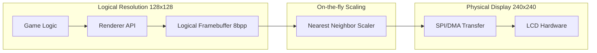

# Technical Specification: Independent Resolution Scaling System for PixelRoot32

## Executive Summary

This document describes the technical implementation of the **independent resolution scaling** system in the PixelRoot32 engine. This feature allows the engine to render internally at a lower "Logical Resolution" (e.g., 128x128) and scale the output to the "Physical Resolution" of the hardware display (e.g., 240x240). This optimization significantly reduces memory consumption and improves rendering performance on resource-constrained microcontrollers like the ESP32.

---

## Architecture Overview

### Logical vs. Physical Resolution

The system decouples the drawing operations from the hardware constraints:

1. **Logical Resolution (Rendering Resolution):** The virtual canvas dimensions where game logic, sprites, tilemaps, and UI are processed.
2. **Physical Resolution (Display Resolution):** The actual pixel dimensions of the hardware display (LCD/TFT).
3. **Scaling Layer:** An optimized nearest-neighbor algorithm that bridges the two resolutions during the final buffer transfer.

### Rendering Pipeline



---

## Core Components

### 1. DisplayConfig & Resolution Abstraction

The `DisplayConfig` structure was extended to store both dimensions.

- `logicalWidth` / `logicalHeight`: Used by the `Renderer` for clipping and UI layouts.
- `physicalWidth` / `physicalHeight`: Used by the drivers to initialize the hardware and manage scaling.

### 2. On-the-Fly Nearest Neighbor Scaling

To avoid the massive RAM overhead of a full-size physical framebuffer (which would require 115KB for 240x240 RGB565), the scaling is performed **line-by-line** during the SPI transfer.

#### Algorithm

1. Calculate source Y coordinate: `srcY = (physY * logicalHeight) / physicalHeight`.
2. Retrieve the corresponding row from the logical 8bpp buffer.
3. Expand the row horizontally using pre-calculated Lookup Tables (LUTs) to determine `srcX`.
4. Convert each 8-bit indexed pixel to RGB565 format.
5. Send the resulting physical-width line to the display via DMA.

### 3. Optimization Techniques (ESP32)

- **Lookup Tables (LUTs):** Pre-calculated arrays for X and Y mapping to eliminate division operations in the hot loop.
- **IRAM_ATTR:** Scaling functions are marked to reside in Internal RAM to avoid SPI Flash latency.
- **DMA Alignment:** Line buffers are allocated using `MALLOC_CAP_DMA` to ensure compatibility with high-speed SPI transfers.
- **8-bit to 16-bit Conversion:** Optimized color conversion from the engine's 8-bit palette to the hardware's RGB565.

---

## Performance Impact

The following table demonstrates the estimated savings on an ESP32 for a standard 240x240 display:

| Logical Resolution | Memory (8bpp) | RAM Savings | Performance Gain |
| :--- | :--- | :--- | :--- |
| **240x240** (Full) | 57.6 KB | 0% | Baseline |
| **160x160** | 25.6 KB | ~55% | ~30% FPS increase |
| **128x128** | 16.4 KB | ~72% | ~60% FPS increase |
| **96x96** | 9.2 KB | ~84% | ~100% FPS increase |

---

## Usage and Configuration

### Using Presets

The engine provides `ResolutionPresets` for common configurations:

```cpp
#include <graphics/ResolutionPresets.h>

auto config = pr32::graphics::ResolutionPresets::create(
    pr32::graphics::RES_128x128,
    pr32::graphics::ST7789
);
```

### Manual Setup

```cpp
pr32::graphics::DisplayConfig config(
    pr32::graphics::ST7789, 
    0,         // Rotation
    240, 240,  // Physical Size
    160, 160   // Logical Size
);
```

### Profiling

Enable `PIXELROOT32_ENABLE_PROFILING` in `EngineConfig.h` to monitor scaling performance in the Serial console.

---

## Project Impact

This system enables PixelRoot32 to run complex games with rich backgrounds and multiple sprites on standard ESP32 chips without requiring external PSRAM, while maintaining a sharp, consistent pixel-art aesthetic.
