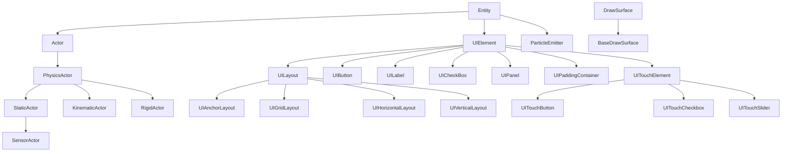

# Architecture Index - PixelRoot32 Game Engine

> **NOTE:** This is the main entry point for architecture documentation. For detailed narratives and design philosophy, see the files in this folder. For ESP32 rendering pipeline details, see the ESP32 section below.

---

## Quick Navigation

### Layer Architecture

| Layer | Document | Description |
|-------|----------|-------------|
| **Layer 0** | [Hardware Layer](./layer-hardware.md) | ESP32, displays, audio hardware, PC simulation |
| **Layer 1** | [Driver Layer](./layer-drivers.md) | TFT_eSPI, U8G2, SDL2, AudioBackends |
| **Layer 2** | [Abstraction Layer](./layer-abstraction.md) | DrawSurface, PlatformMemory, Logging, Math |
| **Layer 3** | [System Layer](./layer-systems.md) | Renderer, Audio, Physics, UI subsystems |
| **Layer 4** | [Scene Layer](./layer-scene.md) | Engine, SceneManager, Entity, Actor hierarchy |

### Subsystem Deep Dives

| Subsystem | Document | Description |
|-----------|----------|-------------|
| **Audio NES** | [Audio Subsystem](./audio-subsystem.md) | 4-channel NES-style: shared `ApuCore`, `AudioScheduler`, backends |
| **Physics** | [Physics Subsystem](./physics-subsystem.md) | Flat Solver, collisions, CCD |
| **Memory** | [Memory System](./memory-system.md) | Smart pointers, RAII, ESP32 DRAM |
| **Resolution Scaling** | [Resolution Scaling](./resolution-scaling.md) | Logical vs physical resolution |
| **Tile Animation** | [Tile Animation](./tile-animation.md) | Lookup tables, O(1) resolve |
| **Touch Input** | [Touch Input](./touch-input.md) | Pipeline, XPT2046, calibration |
| **Extensibility** | [Extending PixelRoot32](../guide/extending-pixelroot32.md) | Custom drivers, configuration |

### API Reference

| Module | Document |
|--------|----------|
| Configuration | [config.md](../api/config.md) |
| Math | [math.md](../api/math.md) |
| Core | [core.md](../api/core.md) |
| Physics | [physics.md](../api/physics.md) |
| Graphics | [graphics.md](../api/graphics.md) |
| UI | [ui.md](../api/ui.md) |
| Audio | [audio.md](../api/audio.md) |
| Input | [input.md](../api/input.md) |
| Platform | [platform.md](../api/platform.md) |

---

## Core Class Hierarchy

---

## Subsystem Modular Compilation

| Subsystem | Enable Flag | Default |
|-----------|-------------|---------|
| Audio | `PIXELROOT32_ENABLE_AUDIO` | Enabled |
| Physics | `PIXELROOT32_ENABLE_PHYSICS` | Enabled |
| UI System | `PIXELROOT32_ENABLE_UI_SYSTEM` | Enabled |
| Particles | `PIXELROOT32_ENABLE_PARTICLES` | Enabled |
| Touch Input | `PIXELROOT32_ENABLE_TOUCH` | Disabled |
| Tile Animations | `PIXELROOT32_ENABLE_TILE_ANIMATIONS` | Enabled |
| Static tilemap FB snapshot (4bpp) | `PIXELROOT32_ENABLE_STATIC_TILEMAP_FB_CACHE` | Enabled (`PlatformDefaults.h`) |
| Debug Overlay | `PIXELROOT32_ENABLE_DEBUG_OVERLAY` | Disabled |

---

## ESP32 Rendering Pipeline and Tilemap Caching

On ESP32 with **TFT_eSPI** (`TFT_eSPI_Drawer`), the logical framebuffer is typically an **8-bit color-depth sprite** (`TFT_eSprite`). Each frame:

1. **`Renderer::beginFrame()`** obtains a pointer to that buffer via **`DrawSurface::getSpriteBuffer()`** (when the driver supports it), clears the buffer, then draws the scene.
2. **2bpp / 4bpp tilemaps and sprites** can write **directly into that buffer** (matching TFT_eSPI's 8bpp packing for RGB565), avoiding a virtual `drawPixel` per pixel where possible.
3. **`present()` / `sendBuffer()`** converts logical 8bpp rows to **RGB565** using a LUT and pushes pixels to the panel via **DMA**.

### Static Tilemap Layer Cache

The engine provides **`pixelroot32::graphics::StaticTilemapLayerCache`** (`include/graphics/StaticTilemapLayerCache.h`): a **4bpp tilemap** helper that can snapshot the logical framebuffer after drawing a **static** group of `TileMap4bppDrawSpec` entries, then on subsequent frames **`memcpy`** that snapshot back and redraw only the **dynamic** group.

- **Allocation:** `allocateForLogicalSize` / `allocateForRenderer` in `Scene::init()`
- **Opt-out:** build flag `PIXELROOT32_ENABLE_STATIC_TILEMAP_FB_CACHE=0`, or `setFramebufferCacheEnabled(false)`
- **Example:** `examples/animated_tilemap` — `AnimatedTilemapScene`

**Game / scene developer contract:**

- Call **`invalidate()`** when something inside the **static** group changes visually
- **Dynamic** layers are drawn every frame on the fast path—no invalidation needed
- **Scroll:** cache rebuilds when the camera sample changes; no extra invalidation solely for scroll

---

## Related Documentation

| Document | Description |
|----------|-------------|
| [API Reference](../api/index.md) | Complete API documentation index |
| [Getting Started](../guide/getting-started.md) | First steps with the engine |
| [Style Guide](../guide/coding-style.md) | Coding conventions |
| [Platform Compatibility](../guide/platform-compatibility.md) | Supported hardware matrix |
| [Testing](../guide/testing.md) | Unit and integration testing |
| [MusicPlayer Guide](../guide/music-player-guide.md) | Background music, multi-track, tempo/BPM |

---

## Detailed Architecture

For comprehensive narrative documentation including:

- Executive summary and design philosophy
- Design philosophy and modularity explanation
- Layer hierarchy in depth
- Module dependencies diagram
- Performance optimizations detail
- Configuration and compilation flags

**See:** [Layer Abstraction](./layer-abstraction.md) - Design philosophy and layer details