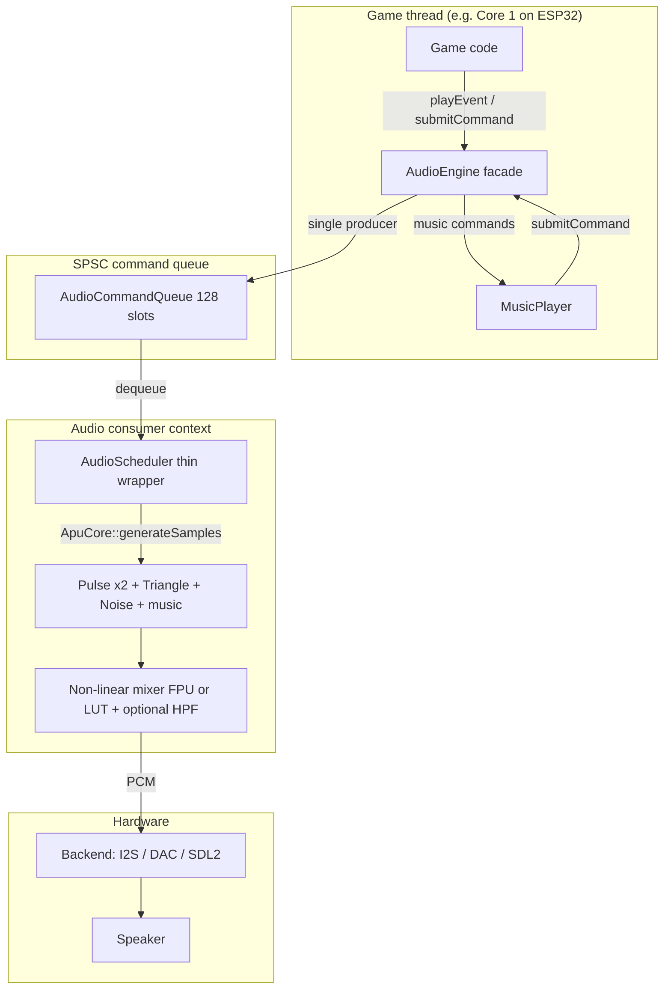

# PixelRoot32 / PR32: NES-inspired Audio System – Implementation and Usage

> **Note:** For the complete audio system documentation with interactive examples and API reference, visit the [official documentation](https://docs.pixelroot32.org/manual/game_development/audio/).

This document describes how the NES-style audio subsystem is implemented in the
PixelRoot32 (PR32) engine and how to use it from your games. It covers both the
high-level architecture and the concrete implementation details.

- The system focuses on:
  - Being **deterministic** and low-cost in terms of CPU and RAM.
  - Respecting the existing engine architecture (`core`, `drivers`, `examples`) and the style guide.
  - Providing a **platform-agnostic** audio API:
    - Consistent with `Engine`, `Renderer`, and `InputManager`.
    - With implementations for ESP32 (I2S and DAC) and SDL2 (desktop).
  - Avoiding unnecessary complexity:
    - No exact emulation of the NES APU.
    - No heavy external audio libraries.
    - No breaking changes for existing games in `examples`.

---

## 1. Overview

- **Dynamic voice pool** inside **`ApuCore`** (default **`MAX_VOICES = 8`**). Each voice holds the same oscillator/envelope state as before (`AudioChannel`, exposed as alias **`Voice`** in [`AudioTypes.h`](include/audio/AudioTypes.h)).
- **Public API unchanged**: games and music still describe sounds with **`WaveType`** on **`AudioEvent`** / **`MusicTrack::channelType`**. Internally, `ApuCore` maps `WaveType` ↔ **`VoiceType`** (`PULSE`, `TRIANGLE`, `NOISE`, `SINE`, `SAW`) for allocation policy; the active waveform on a voice is still a `WaveType` on that voice’s state.
- **Voice allocation**: on `PLAY_EVENT`, `ApuCore` prefers an **inactive** voice whose stored type matches the requested `WaveType`; if none, it may **steal** the active voice with the **smallest `remainingSamples`**. When all eight voices are busy, the newest event replaces the “shortest remaining” note (same steal metric as under the old 2-voice melodic pool, but generalized across the whole pool).
- Software mixing into a **mono** 16-bit (`int16_t`) stream.
- **Event-driven** model: games fire short-lived `AudioEvent` instances (SFX, notes).
- **Conditionally compiled**: Entire subsystem can be excluded with `PIXELROOT32_ENABLE_AUDIO=0` to save firmware size and RAM.
- **Platform-agnostic API** with concrete work split as follows:
  - [`AudioEngine`](include/audio/AudioEngine.h) is a thin facade: it forwards `playEvent` / `setMasterVolume` as commands and delegates `generateSamples` to an `AudioScheduler`.
  - **Mixing, voice pool state, music sequencing, and the SPSC command queue** live in **[`ApuCore`](include/audio/ApuCore.h)** (`src/audio/ApuCore.cpp`). The three schedulers only decide **execution context** (same-thread vs FreeRTOS task vs `std::thread` + ring buffer).
  - Backends (SDL2, ESP32 I2S/DAC) pull PCM by calling `AudioEngine::generateSamples`, which reaches `ApuCore::generateSamples`.

### Command path (high level)



- **`AudioEngine`** forwards commands and **`generateSamples`** to the active **`AudioScheduler`**, which delegates to **`ApuCore`**: SPSC queue, four channels, music sequencer, mixing, and (on the FPU path) a one-pole output HPF.
- On **ESP32**, core affinity and task priority are applied when the **backend** creates its FreeRTOS task (`PlatformCapabilities`), not inside `ESP32AudioScheduler` construction arguments (those parameters are reserved for API stability).

Main files:

- Facade: [`audio/AudioEngine.h`](include/audio/AudioEngine.h)
- Shared core: [`audio/ApuCore.h`](include/audio/ApuCore.h), [`src/audio/ApuCore.cpp`](src/audio/ApuCore.cpp)
- Schedulers: [`audio/DefaultAudioScheduler.h`](include/audio/DefaultAudioScheduler.h), [`drivers/esp32/ESP32AudioScheduler.h`](include/drivers/esp32/ESP32AudioScheduler.h), [`drivers/native/NativeAudioScheduler.h`](include/drivers/native/NativeAudioScheduler.h)
- Audio types & commands: [`audio/AudioTypes.h`](include/audio/AudioTypes.h), [`audio/AudioCommandQueue.h`](include/audio/AudioCommandQueue.h)
- Mixer LUT: [`audio/AudioMixerLUT.h`](include/audio/AudioMixerLUT.h) (`inline constexpr` table, single rodata copy per link)
- SDL2 backend: [`SDL2_AudioBackend`](include/drivers/native/SDL2_AudioBackend.h)
- ESP32 I2S backend: [`ESP32_I2S_AudioBackend`](include/drivers/esp32/ESP32_I2S_AudioBackend.h)
- ESP32 DAC backend: [`ESP32_DAC_AudioBackend`](include/drivers/esp32/ESP32_DAC_AudioBackend.h) (I2S **DAC-built-in** + DMA)

---

## 2. Internal data model

### 2.1 Basic types

Defined in [`AudioTypes.h`](include/audio/AudioTypes.h):

```cpp
enum class WaveType : uint8_t {
    PULSE,
    TRIANGLE,
    NOISE,
    SINE,
    SAW
};
```

`WaveType` is the **authoring / API** waveform tag on `AudioEvent` and on `MusicTrack::channelType`.

For internal bookkeeping (optional reading for engine contributors), [`AudioTypes.h`](include/audio/AudioTypes.h) also defines **`VoiceType`** (same set of synthesis kinds) and **`constexpr`** helpers **`toVoiceType(WaveType)`** / **`toWaveType(VoiceType)`** so `ApuCore` can treat allocation consistently while keeping the public surface on `WaveType`.

### 2.2 AudioChannel (voice state)

Each **voice** is an `AudioChannel` instance owned by **`ApuCore`** (fixed array **`voices[MAX_VOICES]`**, default size **8**). The type alias **`using Voice = AudioChannel`** documents the intent: one entry in the pool is one polyphonic voice.

Highlights (see [`AudioTypes.h`](include/audio/AudioTypes.h) for the full struct):

- **Float path** (FPU ESP32, native): `phase` in `[0,1)`, `phaseIncrement = frequency / sampleRate`, linear volume ramp (`volume`, `targetVolume`, `volumeDelta`).
- **Integer mirror** (ESP32-C3, no FPU): `phaseQ32`, `phaseIncQ32`, `dutyCycleQ32` — updated on each `PLAY_EVENT` so the hot inner loop in `ApuCore::generateSamples` avoids per-sample soft-float.
- **Noise**: `lfsrState` (15-bit LFSR), `noisePeriodSamples`, `noiseCountdown` — same deterministic polynomial on **all** platforms.
- **Lifetime**: `remainingSamples` counts down each rendered sample until the voice is disabled (then it can be reused or stolen per §3.5).

On **note on**, `ApuCore` initializes an ADSR envelope from the `InstrumentPreset` (or legacy defaults: 2ms attack, no decay, full sustain, 5ms release) to shape the note amplitude over time, reducing clicks and enabling expressive articulation.

### 2.3 AudioEvent

Also defined in `AudioTypes.h`:

```cpp
struct AudioEvent {
    WaveType type;
    float frequency;
    float duration; // seconds
    float volume;   // 0.0 - 1.0
    float duty;     // only for PULSE
    uint8_t noisePeriod = 0;  // for NOISE: 0=calc from frequency, >0=direct LFSR period
    const InstrumentPreset* preset = nullptr;
    float sweepEndHz = 0.0f;       // linear sweep target (PULSE/TRIANGLE); 0 = off
    float sweepDurationSec = 0.0f; // sweep length; 0 = off
};
```

- **Linear sweep** (optional): when `sweepDurationSec > 0` and `sweepEndHz > 0`, and `type` is `PULSE` or `TRIANGLE`, frequency moves linearly from `frequency` toward `sweepEndHz` over `min(ceil(sweepDurationSec * sampleRate), note samples)`; `NOISE` ignores these fields.
- It is the basic unit used to trigger a sound.
- It is passed as a parameter to `AudioEngine::playEvent`.
- **Note**: Only available when `PIXELROOT32_ENABLE_AUDIO=1`

---

## 3. AudioEngine and ApuCore: mixing core

[`AudioEngine`](include/audio/AudioEngine.h) forwards `generateSamples` to the active [`AudioScheduler`](include/audio/AudioScheduler.h), which in all stock implementations delegates to **[`ApuCore::generateSamples`](include/audio/ApuCore.h)**.

### 3.1 Voice pool initialization

`ApuCore` constructs **`MAX_VOICES`** entries (default **8**). After `reset()`, each slot’s waveform tag defaults to `WaveType::PULSE` until the next `PLAY_EVENT` retriggers it; **`executePlayEvent`** sets `type` from the incoming event (via the `VoiceType` mapping for clarity in code paths).

**`STOP_CHANNEL`**: `AudioCommand` still carries a **`channelIndex`** byte; valid indices are **`0` … `MAX_VOICES - 1`** (today **0–7**). Older docs referred to “channels 0–3”; callers that assumed exactly four hardware slots should treat the index as a **voice slot** in the pool.

**Note**: This entire subsystem is only compiled when `PIXELROOT32_ENABLE_AUDIO=1`.

### 3.2 Lifetime and time model (Sample-Based)

The audio system no longer uses `deltaTime` or frame-based updates. Instead, it uses **sample-accurate timing** managed by an `AudioScheduler`:

- **Audio Time**: Internal unit is samples (e.g., 1 second = 44100 samples at 44.1kHz).
- **Decoupled Logic**: The `AudioScheduler` runs in a separate thread (SDL2) or core (ESP32).
- **Lifetime**: For each active **voice** (`AudioChannel` / `Voice`), `ApuCore` subtracts 1 from `remainingSamples` for every sample generated.
- When `remainingSamples` reaches 0, the voice is automatically disabled (unless extended by the ADSR **RELEASE** phase per existing rules).

Important:

- **Game logic** runs at its own frame rate (e.g., 60 FPS).
- **Audio generation** runs at the hardware sample rate (e.g., 22050 Hz).
- Render stalls or frame drops **do not affect** audio pitch or tempo.

### 3.3 Per-voice sample generation

Oscillator work is implemented in **`ApuCore::generateSampleForVoice`** (float path) and in the **integer inner loop** of `ApuCore::generateSamples` on no-FPU ESP32 builds. If the voice is disabled, the contribution is `0`.

1. **`PULSE`**: square with configurable duty (`dutyCycle` / `dutyCycleQ32`).
2. **`TRIANGLE`**: symmetric triangle in `[-1, 1]` (float) or quantized from `phaseQ32` high bits (integer path).
3. **`NOISE`**: **NES-style 15-bit LFSR** on **all** targets — same bit taps, advanced when `noiseCountdown` reaches 0, then reloaded from `noisePeriodSamples`. `AudioEvent::frequency` for noise sets the default clock when `noisePeriod == 0`; otherwise a fixed period can be supplied for percussion.

After the per-voice sample (float path):

- Phase advances for non-noise waves; noise uses only the countdown/LFSR.
- **ADSR envelope** is applied via per-sample state machine (ATTACK→DECAY→SUSTAIN→RELEASE→OFF) replacing the simple volume ramp.
- **LFO modulation** is applied when enabled: pitch modulation alters `phaseIncrement` (frequency), volume modulation alters envelope output amplitude.
- **Per-channel `MIXER_SCALE` (0.4)**, **master volume**, and the **non-linear compressor** are applied in `ApuCore::generateSamples` (see §3.4). On FPU/native builds a **single-pole HPF** runs on the mixed float signal before scaling to `int16_t` to tame DC and retrigger clicks. On no-FPU platforms (ESP32-C3), a **fixed-point HPF** runs on the integer mix output before scaling to `int16_t`.

### 3.4 Mixing all voices (Non-Linear Mixer)

`AudioEngine::generateSamples` → scheduler → **`ApuCore::generateSamples`**.

The system uses a **non-linear mixing strategy** aligned across FPU and LUT paths:

- Per voice: `s = wave(v) * volume(v) * MIXER_SCALE` (`MIXER_SCALE = 0.4`).
- Sum `S = Σ s`, then **`mixed = S / (1 + |S| * MIXER_K)`** with `MIXER_K = 0.5`.
- Scale to PCM and apply **master volume**.

#### Strategy A: Floating-Point (FPU ESP32, ESP32-S3, native)

- Compressor as above, then **HPF** on the mixed float, then clamp to `int16_t`.
- `std::fabs` / float path.

#### Strategy B: Integer + LUT (ESP32-C3, no FPU)

- Inner loop uses **fixed-point phase** and **Q15 volume** so the oscillator does not touch soft-float every sample.
- **ADSR Envelope** is also implemented completely in integer Q15 fixed-point math (`tickEnvelopeQ15`) to eliminate heavy soft-float emulation during the fast 22kHz inner loop.
- **LFO modulation**: Both pitch and volume LFO are supported on no-FPU builds via integer-only Q16/Q15 phase accumulation (`tickLfoPhase`, `tickLfoDepthQ15`) — same modulation logic as the FPU path, implemented in fixed-point to avoid soft-float.
- Per-voice samples are scaled with the same **0.4** intent (`≈ 13107/32768` in Q15) before summation.
- **`audio_mixer_lut`**: `index = (sum + 131072) >> 8` into 1025 entries; table documented in `AudioMixerLUT.h` to match the FPU curve.
- **Master volume** via precomputed **Q16** `masterVolumeScale` when ≠ 1.0.

#### Clipping prevention

The compressor / LUT asymptote keeps peaks bounded; final clamp remains as a safety net on the FPU path.

#### Profiling peaks

When **`PIXELROOT32_ENABLE_PROFILING`** is defined (`platforms/EngineConfig.h` → `pixelroot32::platforms::config::EnableProfiling`), `ApuCore` may log peak statistics roughly once per second of audio. Peak tracking uses **per-instance** members (no `static` locals inside `generateSamples`).

### 3.5 Event playback: playEvent

`void AudioEngine::playEvent(const AudioEvent& event)`:

- Acts as a **Command Producer**.
- It enqueues an `AudioCommand` into a lock-free **Single Producer / Single Consumer (SPSC)** ring buffer ([`AudioCommandQueue`](include/audio/AudioCommandQueue.h), capacity **128** entries).
- The **audio consumer** (scheduler thread / ESP32 audio task / SDL callback path) dequeues and applies commands.

**Queue contract and overflow**

- The implementation is only safe with **one producer** and **one consumer**. Do not call `playEvent` / `submitCommand` from multiple threads unless you replace the queue with an MPMC-safe structure.
- If the queue is **full**, `enqueue` **drops the newest command** and returns `false`. **`ApuCore::submitCommand`** increments an atomic **`droppedCommands`** counter and may emit a **throttled** warning when `PIXELROOT32_DEBUG_MODE` is defined. Avoid flooding more than ~127 outstanding commands between consumer passes.

`ApuCore` then:

- Selects a **voice slot** via **`findVoiceForEvent(WaveType)`**: prefers an **inactive** voice whose `type` already matches the requested `WaveType`; otherwise picks any inactive slot; if **all** voices are active, **steals** the voice with the **minimum `remainingSamples`** (breaking ties by scan order).
- Converts the event's duration (seconds) into `remainingSamples` based on the current sample rate.
- Initializes the voice state (`enabled`, `frequency`, `phase`, fixed-point mirrors, ADSR envelope, LFSR for noise, etc.) and sets `type` from the event.

---

## 4. Audio Schedulers and Backends

The system uses a decoupled architecture: **`ApuCore`** owns the **voice pool** (synthesis state), the command queue, music sequencing, and mixing. An **`AudioScheduler`** selects **when** `ApuCore::generateSamples` runs; an **`AudioBackend`** pushes PCM to hardware.

### 4.1 AudioScheduler

The `AudioScheduler` interface provides `init`, `submitCommand` (forwards to `ApuCore`), `start` / `stop`, `isIndependent`, `generateSamples`, and optional **`isMusicPlaying` / `isMusicPaused`** (all stock implementations delegate to the same `ApuCore` atomics).

| Scheduler | Typical use | Where `ApuCore::generateSamples` runs |
|-----------|-------------|----------------------------------------|
| **`NativeAudioScheduler`** | `PLATFORM_NATIVE` && !unit tests | Dedicated **`std::thread`**; PCM pushed to a lock-free ring; SDL callback drains via `AudioEngine::generateSamples`. |
| **`ESP32AudioScheduler`** | ESP32 firmware | Same **CPU context** as the backend audio task (I2S/DAC backend creates the FreeRTOS task and calls `engine->generateSamples`). |
| **`DefaultAudioScheduler`** | Unit tests, minimal hosts | Whatever thread invokes `generateSamples` (no extra audio thread). |

**Task creation** for ESP32 still lives in the **backends** ([`ESP32_I2S_AudioBackend`](src/drivers/esp32/ESP32_I2S_AudioBackend.cpp), [`ESP32_DAC_AudioBackend`](src/drivers/esp32/ESP32_DAC_AudioBackend.cpp)), not inside `ESP32AudioScheduler::start()`.

#### 4.1.1 Platform-Agnostic Core Management

The system no longer uses hardcoded core IDs for ESP32. Instead, it uses a `PlatformCapabilities` (`pixelroot32::platforms`) structure to detect hardware features at startup:

- **Dual-Core ESP32**: Audio task is pinned to **Core 0** (leaving Core 1 for the game loop). Task priority defaults to `5` and internal DMA buffer block size is `512` samples.
- **Single-Core ESP32**: Audio task runs on **Core 0**, sharing it with the game loop and display drivers. To prevent audio starvation against heavy display transfers (e.g. U8G2), priority is dynamically elevated to `18`. To prevent this high-priority task from aggressively fragmenting display transfers via priority inversion, the internal buffer block size is reduced to `128` samples, and `taskYIELD()` is used cooperatively.
- **Native (SDL2)**: Uses a standard system thread.

### 4.2 Platform Configuration and Build Flags

The audio system behavior can be customized via `platforms/PlatformDefaults.h` or compile-time flags.

#### 4.2.1 Core Affinity

- `PR32_DEFAULT_AUDIO_CORE`: Defines the default core for audio processing (Default: `0` on ESP32).
- `PR32_DEFAULT_MAIN_CORE`: Defines the default core for the main engine loop (Default: `1` on ESP32).

#### 4.2.2 Build Flags

| Flag | Description |
|------|-------------|
| `PIXELROOT32_NO_DAC_AUDIO` | Disables the Internal DAC backend on classic ESP32. |
| `PIXELROOT32_NO_I2S_AUDIO` | Disables the I2S audio backend. |
| `PIXELROOT32_USE_U8G2` | Enables support for the U8G2 display driver (future support). |
| `PIXELROOT32_NO_TFT_ESPI` | Disables the default TFT_eSPI display driver. |

### 4.3 Audio Backends (interface)

Backends implement the abstract `AudioBackend` interface:

```cpp
class AudioBackend {
public:
    virtual ~AudioBackend() = default;
    virtual void init(AudioEngine* engine, const pixelroot32::platforms::PlatformCapabilities& caps) = 0;
    virtual int getSampleRate() const = 0;
};
```

**Note**: Audio backends are only compiled and available when `PIXELROOT32_ENABLE_AUDIO=1`.

### 4.4 SDL2 backend (Windows / Linux / Mac)

Implemented in:

- Header: [`include/drivers/native/SDL2_AudioBackend.h`](include/drivers/native/SDL2_AudioBackend.h)
- Source: [`src/drivers/native/SDL2_AudioBackend.cpp`](src/drivers/native/SDL2_AudioBackend.cpp)

Key points:

- Uses `SDL_OpenAudioDevice` to open a mono device (`AUDIO_S16SYS`, 1 channel).
- Sets up a C callback (`SDLAudioCallbackWrapper`) that calls the member function
  `SDL2_AudioBackend::audioCallback`.
- In `audioCallback`:
  - Computes how many 16-bit samples are required from `len` (bytes).
  - Calls `engineInstance->generateSamples(...)` to fill the buffer directly.

This completely decouples **audio timing** from the SDL2 game loop.

### 4.5 ESP32 Backends

The engine provides two distinct backends for ESP32, allowing developers to choose between high-quality I2S (external DAC) or retro-style internal DAC.

#### A) ESP32 I2S Backend (External DAC)

- **Class**: `ESP32_I2S_AudioBackend`
- **Header**: [`include/drivers/esp32/ESP32_I2S_AudioBackend.h`](include/drivers/esp32/ESP32_I2S_AudioBackend.h)
- **Use case**: High-quality audio using external DACs like **MAX98357A** or **PCM5102**.
- **Key points**:
  - Uses ESP32 **I2S** peripheral with DMA (`I2S_NUM_0`).
  - Output is digital I2S (BCLK, LRCK, DOUT).
  - Runs in a dedicated FreeRTOS task to ensure smooth playback.
  - Supports standard sample rates (e.g., 22050Hz, 44100Hz).

#### B) ESP32 DAC Backend (Internal DAC)

- **Class**: `ESP32_DAC_AudioBackend`
- **Header**: [`include/drivers/esp32/ESP32_DAC_AudioBackend.h`](include/drivers/esp32/ESP32_DAC_AudioBackend.h)
- **Use case**: Retro audio using the ESP32 **internal 8-bit DAC** (GPIO **25** = DAC1 or **26** = DAC2), e.g. with **PAM8302A**.
- **Key points**:
  - Uses the legacy **I2S driver** in **`I2S_MODE_DAC_BUILT_IN`**: samples are written with **`i2s_write`** in blocks (DMA), **not** per-sample `dacWrite()`.
  - A FreeRTOS task fills a buffer from `AudioEngine::generateSamples`, converts signed `int16` to **offset-binary** for the DAC path, and applies **~0.7×** headroom before `i2s_write` (same intent as the old PAM8302A scaling).
  - **Hardware note**: internal DAC exists on **classic ESP32** / **ESP32-S2** class chips, not on **S3** / **C3**.
- **Limitations**: 8-bit effective resolution, mono, more noise than external I2S DAC.
- **Recommendation**: For higher fidelity, prefer **`ESP32_I2S_AudioBackend`** + external codec.

#### C) Reference Pinout (ESP32)

| Backend | Peripheral | ESP32 Pin | Module Connection |
|---------|------------|-----------|-----------------|
| **DAC** | DAC1 | GPIO 25 | **PAM8302A**: A+ (IN+) |
| **DAC** | GND | GND | **PAM8302A**: A- (IN-) |
| **I2S** | BCLK | GPIO 26 | **MAX98357A**: BCLK |
| **I2S** | LRCK | GPIO 25 | **MAX98357A**: LRC (WS) |
| **I2S** | DOUT | GPIO 22 | **MAX98357A**: DIN |

### 4.6 Backend Configuration (in `main.cpp`)

To select a backend, simply instantiate the desired class and pass it to the `AudioConfig` struct.

**Example for Internal DAC (PAM8302A):**

```cpp
// 1. Instantiate the backend (GPIO 25, 11025Hz for retro feel)
pr32::drivers::esp32::ESP32_DAC_AudioBackend audioBackend(25, 11025);

// 2. Configure the engine
pr32::audio::AudioConfig audioConfig;
audioConfig.backend = &audioBackend;

// 3. Initialize engine
pr32::core::Engine engine(displayConfig, inputConfig, audioConfig);
```

**Example for I2S (MAX98357A):**

```cpp
// 1. Instantiate the backend (BCLK=26, LRCK=25, DOUT=22)
pr32::drivers::esp32::ESP32_I2S_AudioBackend audioBackend(26, 25, 22, 22050);

// 2. Configure the engine
pr32::audio::AudioConfig audioConfig;
audioConfig.backend = &audioBackend;

// 3. Initialize engine
pr32::core::Engine engine(displayConfig, inputConfig, audioConfig);
```

Advantages:

- Audio is generated in a dedicated task, independent from the game frame rate.
- The game loop can run at 60 FPS even while audio is streamed at 22050 Hz.

---

## 5. Integration with Engine and the game loop

The central `Engine` is responsible for:

- Creating the `AudioEngine` instance.
- Providing an `AudioConfig` with the appropriate backend and scheduler.
- Managing the lifecycle of the audio subsystem.

See [`core/Engine.h`](include/core/Engine.h) and
[`core/Engine.cpp`](src/core/Engine.cpp).

**Decoupled flow:**

1. The game creates `DisplayConfig`, `InputConfig`, and `AudioConfig`.
2. It constructs `Engine(displayConfig, inputConfig, audioConfig)`.
3. It calls `engine.init()`:
   - Initializes renderer, input, and audio.
   - The audio scheduler starts its dedicated thread/task.
4. On each frame:
   - `Engine::update`:
     - Computes `deltaTime`.
     - Updates input.
     - Calls `sceneManager.update(deltaTime)`.
     - **Note**: `AudioEngine` and `MusicPlayer` no longer need frame updates.
   - `Engine::draw`:
     - Renders the scene.

Meanwhile, the **Audio Scheduler** (Core 0 / Thread) runs independently at the target sample rate.

---

## 6. Using audio from a game

### 6.1 Accessing the AudioEngine

From any scene or actor that has access to `Engine`:

```cpp
auto& audio = engine.getAudioEngine();
```

### 6.2 Triggering a simple sound

Example of a “coin” sound when the player passes an obstacle in GeometryJump
([`GeometryJumpScene.cpp`](examples/GeometryJump/GeometryJumpScene.cpp)):

```cpp
pr32::audio::AudioEvent coinEvent{};
coinEvent.type = pr32::audio::WaveType::PULSE;
coinEvent.frequency = 1500.0f;
coinEvent.duration = 0.12f;
coinEvent.volume = 0.8f;
coinEvent.duty = 0.5f;
engine.getAudioEngine().playEvent(coinEvent);
```

Recommended patterns:

- Use `PULSE` for “blip”, “coin”, jumps, and UI sounds.
- Use `TRIANGLE` for bass lines or softer tones.
- Use `NOISE` for hits, explosions, and collisions.

### 6.2.1 Global master volume

Games can control a global volume multiplier without changing individual events:

```cpp
auto& audio = engine.getAudioEngine();

audio.setMasterVolume(0.5f); // 50% of full volume
// ...
float current = audio.getMasterVolume(); // Query current setting
```

- `setMasterVolume` clamps the value to `[0.0f, 1.0f]`.
- It scales the mixed bus uniformly on top of each event’s own `volume`.

### 6.2.2 Optional master bitcrush

After the non-linear mixer (and HPF on FPU paths), the bus may be re-quantized for a lo-fi effect:

```cpp
audio.setMasterBitcrush(6);   // 1–15 effective bits; 0 = off
uint8_t bits = audio.getMasterBitcrush();
```

Internally this uses `AudioCommandType::SET_MASTER_BITCRUSH` on the same SPSC queue as other audio commands.

### 6.3 Designing NES-like effects

Effects are built by combining basic parameters and optional ADSR envelopes:

**Basic Parameters**
- `frequency`: lower or higher pitch (sweep start when using `sweepEndHz` / `sweepDurationSec`).
- `duration`: effect length (seconds).
- `volume`: 0.0–1.0.
- `duty` (pulse only):
  - 0.125: thinner, sharper timbre.
  - 0.25: classic "NES lead".
  - 0.5: symmetric square, "fatter" sound.

**ADSR Envelope (via `InstrumentPreset`)**
- `attackTime`: how quickly the sound reaches peak volume (0.0 = instant).
- `decayTime`: how quickly it drops to sustain level after attack.
- `sustainLevel`: volume maintained during the sustain phase (0.0-1.0).
- `releaseTime`: how quickly the sound fades after duration ends.

Use an `InstrumentPreset` with an `AudioEvent` to apply envelopes:
```cpp
AudioEvent evt{};
evt.type = WaveType::PULSE;
evt.frequency = 1500.0f;
evt.duration = 0.12f;
evt.preset = &INSTR_PULSE_LEAD;  // Uses built-in ADSR envelope
audio.playEvent(evt);
```

---

## 7. Melody subsystem (tracks and songs)

The audio system also includes a lightweight melody/music layer built on top of
`AudioEngine`. It is designed to stay simple and deterministic, while being easy
to use from games.

### 7.1 Data model (`AudioMusicTypes.h`)

Defined in [`AudioMusicTypes.h`](include/audio/AudioMusicTypes.h):

```cpp
enum class Note : uint8_t {
    C = 0, Cs, D, Ds, E, F, Fs, G, Gs, A, As, B,
    Rest,
    COUNT
};
```

- `Note::Rest` represents a silence.
- Frequencies are derived from an internal table for octave 4 combined with
  power-of-two shifts:

```cpp
inline float noteToFrequency(Note note, int octave);
```

Melodies are sequences of `MusicNote` elements:

```cpp
struct MusicNote {
    Note note;
    uint8_t octave;
    float duration; // seconds
    float volume;   // 0.0 - 1.0
};
```

A `MusicTrack` groups notes and defines how they are played:

```cpp
struct MusicTrack {
    const MusicNote* notes;
    size_t count;
    bool loop;
    WaveType channelType;
    float duty;
    
    // Multi-track support (optional - nullptr = disabled)
    const MusicTrack* secondVoice = nullptr;  // Second melody voice
    const MusicTrack* thirdVoice = nullptr;   // Third melody voice
    const MusicTrack* percussion = nullptr;  // Drum/percussion track
};

// Maximum simultaneous tracks: main + 3 sub-tracks
constexpr size_t MAX_MUSIC_TRACKS = 4;
```

For convenience there are simple “instrument” presets and helpers:

```cpp
struct InstrumentPreset {
    // Basic parameters
    float baseVolume;
    float duty;           // 0.0 = NOISE (percussion), >0 = PULSE/TRIANGLE
    uint8_t defaultOctave;
    float defaultDuration = 0.0f;  // 0.0 = use note.duration, >0 = fixed (percussion)
    uint8_t noisePeriod = 0;        // 0 = calc from freq, >0 = direct LFSR period
    
    // ADSR Envelope
    float attackTime = 0.002f;      // Attack time in seconds
    float decayTime = 0.0f;         // Decay time in seconds
    float sustainLevel = 1.0f;      // Sustain level (0.0-1.0)
    float releaseTime = 0.005f;     // Release time in seconds
    
    // LFO Modulation
    LfoTarget lfoTarget = LfoTarget::NONE;  // NONE, PITCH, or VOLUME
    float lfoFrequency = 0.0f;      // LFO frequency in Hz
    float lfoDepth = 0.0f;          // Modulation depth
    float lfoDelay = 0.0f;          // Delay before LFO starts
    
    // Waveform refinements
    bool noiseShortMode = false;    // Metallic 93-step LFSR for NOISE
    float dutySweep = 0.0f;         // Duty cycle change per second (PWM)
};

// Melodic instruments
inline constexpr InstrumentPreset INSTR_PULSE_LEAD{0.35f, 0.5f, 4};
inline constexpr InstrumentPreset INSTR_PULSE_HARMONY{0.22f, 0.125f, 5};
inline constexpr InstrumentPreset INSTR_TRIANGLE_BASS{0.30f, 0.5f, 3};

// Percussion instruments (duty=0, use with WaveType::NOISE)
inline constexpr InstrumentPreset INSTR_KICK{0.40f, 0.0f, 1, 0.12f, 25};     // Kick: octave=1, dur=0.12s, period=25
inline constexpr InstrumentPreset INSTR_SNARE{0.30f, 0.0f, 2, 0.15f, 50};   // Snare: octave=2, dur=0.15s, period=50
inline constexpr InstrumentPreset INSTR_HIHAT{0.20f, 0.0f, 3, 0.05f, 12};    // Hi-HAT: octave=3, dur=0.05s, period=12

inline MusicNote makeNote(const InstrumentPreset& preset, Note note, float duration);
inline MusicNote makeNote(const InstrumentPreset& preset, Note note, uint8_t octave, float duration);
inline MusicNote makeRest(float duration);
inline float instrumentToFrequency(const InstrumentPreset& preset, Note note, uint8_t octave);
```

> **Note:** For percussion, use `duty == 0.0f` to signal NOISE channel. The `defaultOctave` field determines drum type: 1=Kick, 2=Snare, 3+=Hi-HAT. The `instrumentToFrequency()` helper returns **fixed LFSR clock rates** for the NOISE channel (Kick=80Hz, Snare=150Hz, Hi-HAT=3000Hz). Unlike `noteToFrequency()` which produces musical pitch, these values control noise density/brightness (higher = more chaotic/bright, lower = slower/deeper).

These helpers reduce boilerplate when defining tracks and keep note volumes and
octaves consistent per instrument.

### 7.2 MusicPlayer (`MusicPlayer.h`)

**📖 Detailed guide:** [Music player guide](../guide/music-player-guide.md)

Defined in [`MusicPlayer.h`](include/audio/MusicPlayer.h) and
[`MusicPlayer.cpp`](src/audio/MusicPlayer.cpp).

**Responsibilities (thin client):**

- **`play` / `stop` / `pause` / `resume` / `setTempoFactor` / `setBPM` / `setMasterVolume`**: build `AudioCommand`s or delegate to `AudioEngine::setMasterVolume`.
- **`isPlaying()`**: combines **`AudioEngine::isMusicPlaying()`** and **`isMusicPaused()`** (fed by `ApuCore` atomics) with a short grace window after `play()` so the game thread does not observe a false “stopped” before `MUSIC_PLAY` is consumed.
- **`getActiveTrackCount()`**: derives from the last `play()` request and local flags (1 + non-null sub-tracks).

**Sequencing (audio consumer):**

- Tick-based sequencer lives in **`ApuCore::updateMusicSequencer`**: `globalTickCounter` is derived from **`audioTimeSamples / tickDurationSamples`** each block; when a tick elapses, pending `MusicNote`s emit internal **`executePlayEvent`** calls (same path as SFX).
- **All platforms share identical sequencing math** because there is a single implementation in `ApuCore`.

### 7.3 Integration with Engine

`MusicPlayer` is owned by `Engine` alongside `AudioEngine`:

- The `Engine` constructor creates `audioEngine` and `musicPlayer`.
- Games use:

```cpp
auto& music = engine.getMusicPlayer();
music.play(myTrack);
```

This keeps music sequencing **sample-accurate** and completely independent of the game frame rate. Render stalls or logic spikes will not cause music to jitter or slow down.

### 7.4 Example: GeometryJump background music

GeometryJump defines a simple looping melody using the helpers in
`AudioMusicTypes.h`
(see [`GeometryJumpScene.cpp`](examples/GeometryJump/GeometryJumpScene.cpp)):

```cpp
using namespace pixelroot32::audio;

static const MusicNote MELODY_NOTES[] = {
    makeNote(INSTR_PULSE_LEAD, Note::C, 0.20f),
    makeNote(INSTR_PULSE_LEAD, Note::E, 0.20f),
    makeNote(INSTR_PULSE_LEAD, Note::G, 0.25f),
    makeRest(0.10f),
    // ...
};

static const MusicTrack GAME_MUSIC = {
    MELODY_NOTES,
    sizeof(MELODY_NOTES) / sizeof(MusicNote),
    true,            // loop
    WaveType::PULSE, // use one PULSE channel
    0.5f             // duty cycle
};

void GeometryJumpScene::init() {
    // ...
    engine.getMusicPlayer().play(GAME_MUSIC);
}
```

- Music uses the same **`executePlayEvent`** path as SFX, so melody notes **consume slots in the voice pool** alongside sound effects. With **8** voices, simple lead lines still leave headroom for SFX; dense multi-track + rapid SFX can trigger **voice stealing** (§3.5).
- Timing is **sample-accurate** in `ApuCore`, so melody playback does not depend on render FPS; game logic should still avoid assuming instant delivery of enqueued commands if the audio queue overflows (§3.5).

### 7.5 Multi-track music playback

The MusicPlayer supports up to **4** simultaneous tracks (main + 3 sub-tracks):

```cpp
// Define separate tracks for different layers
static const MusicNote MELODY_NOTES[] = { /* ... */ };
static const MusicNote BASS_NOTES[] = { /* ... */ };
static const MusicNote DRUM_NOTES[] = { /* ... */ };

static const MusicTrack MELODY_TRACK = { MELODY_NOTES, 3, true, WaveType::PULSE, 0.5f };
static const MusicTrack BASS_TRACK = { BASS_NOTES, 2, true, WaveType::PULSE, 0.25f };
static const MusicTrack DRUM_TRACK = { DRUM_NOTES, 4, true, WaveType::NOISE, 0.0f };

// Combine into main track
static const MusicTrack FULL_MUSIC = {
    MELODY_NOTES, 3, true, WaveType::PULSE, 0.5f,
    &BASS_TRACK,      // secondVoice - bass line
    nullptr,          // thirdVoice
    &DRUM_TRACK       // percussion - drums
};

// Play all 3 tracks simultaneously
musicPlayer.play(FULL_MUSIC);

// Query active track count
size_t count = musicPlayer.getActiveTrackCount(); // Returns 3
```

Key behaviors:

- Sub-track pointers default to `nullptr` for single-layer music.
- `stop()`, `pause()`, `resume()` affect the whole arrangement enqueued by the last `MUSIC_PLAY`.
- Tempo factor / BPM commands apply to the shared sequencer in `ApuCore`.

`AudioCommand` carries **`subTracks[MAX_SUB_TRACKS]`** and **`subTrackCount`** for `MUSIC_PLAY`; `ApuCore::processCommands` copies them into its internal `tracks[]` array.

---

## 8. Current limitations and future extensions

With the **Multi-Core Architecture (v0.7.0-dev)**, many previous limitations were addressed, particularly regarding timing and stability.

### 8.1 Resolved / Improved

- **Sample-Accurate Timing**: The system now uses samples instead of `deltaTime` for all internal logic, eliminating jitter and drift.
- **Decoupled Execution**: Audio logic is completely isolated from the game's frame rate, preventing audio stuttering during heavy CPU load.
- **Music Tempo Control**: Added support for real-time tempo changes via `MUSIC_SET_TEMPO`.
- **ADSR Envelopes**: Full Attack-Decay-Sustain-Release envelopes implemented via `InstrumentPreset` for expressive note articulation and click-free playback.
- **LFO Modulation**: Low-frequency oscillators for vibrato (pitch) and tremolo (volume) effects.
- **Multi-track Music**: Support for up to 4 simultaneous tracks (main + 3 sub-tracks) with independent voices and percussion.
- **Linear frequency sweep**: optional portamento on `PULSE` / `TRIANGLE` via `AudioEvent::sweepEndHz` and `sweepDurationSec` (sample-accurate linear interpolation; applied before LFO pitch modulation each sample).
- **Master bitcrush**: optional `AudioEngine::setMasterBitcrush` (0–15) on the final `int16_t` bus.
- **extra waveforms**: `WaveType::SINE` (256-point LUT in [`AudioOscLUT.h`](include/audio/AudioOscLUT.h)) and `WaveType::SAW` (linear ramp); both are first-class `WaveType` values allocated from the **same `MAX_VOICES` pool** as pulse/triangle/noise. `executePlayEvent` sets each voice’s `type` per note; linear sweep applies to SINE/SAW as well.
- **— post-mix hook**: optional `AudioConfig::postMixMono` / `postMixUser`, applied in `ApuCore::generateSamples` after bitcrush on the full buffer. **RT-safe contract:** no heap allocation, no mutexes, bounded work. `AudioEngine::init` forwards the pointer to `ApuCore::setPostMixMono`.

### 8.2 Remaining Limitations

- No exact cycle-accurate emulation of the NES APU.
- **NES hardware-style sweep registers** (automatic decreasing pitch per APU frame, etc.) are not emulated; only **linear** frequency sweeps on `PLAY_EVENT` are supported.
- **Complex envelopes**: ADSR is implemented; however, advanced features like delayed attack, logarithmic curves, or multiple envelope stages are not available.
- **Music catch-up / backlog**: if `generateSamples` is not called for a long wall-clock gap (host suspended, debugger break), `updateMusicSequencer` may need to process many ticks in one call. **`ApuCore`** bounds how many note starts are handled per `generateSamples` invocation via **`setSequencerNoteLimit` / `getSequencerNoteLimit`** (default from `MAX_NOTES_PER_FRAME`, overridable 1–1000; compile-time cap **`AUDIO_SEQUENCER_MAX_NOTES`** in [`ApuCore.h`](include/audio/ApuCore.h)). Excess notes are deferred to the next audio block; **`getDeferredNotes`** reflects how many were deferred last pass (diagnostic). If the host is suspended for a very long time, work still grows with backlog, but each block does not fire an unbounded burst of `executePlayEvent` calls in a single inner loop iteration.
- **`MUSIC_PLAY` start anchor** (distinct from host-suspend catch-up): On `MUSIC_PLAY`, `ApuCore` aligns `globalTickCounter` and each track’s `nextNoteTicks` to **`audioTimeSamples / tickDurationSamples`** at command processing time so elapsed time since engine init is **not** mistaken for a tick backlog. Without this, the first `updateMusicSequencer` after play could fire up to **`MAX_NOTES_PER_FRAME`** note starts in one block (voice stealing → dissonant cluster) and skip the start of the phrase. A one-shot **`firstSequencerCallAfterPlay_`** allows the first scheduled note to run in the same audio block when **`currentTick == startTick`** (the usual guard would otherwise wait one tick).
- **Code references (maintainers)** — approximate line numbers; re-check after refactors:
  - [`ApuCore.h`](include/audio/ApuCore.h): sequencer limits `MAX_NOTES_PER_FRAME` / `AUDIO_SEQUENCER_MAX_NOTES` (~L44–L52); API `setSequencerNoteLimit`, `getSequencerNoteLimit`, `getDeferredNotes` (~L74–L82).
  - [`ApuCore.cpp`](src/audio/ApuCore.cpp): `executePlayEvent` — linear sweep clamped to note duration (`sweepLen > noteLen` → truncate, ~L433–L451); `apply_linear_frequency_sweep_float` (~L32–L45); no-FPU path, lerp of `phaseIncQ32` during sweep (~L795–L810).
- **Command queue**: fixed depth **128**; overflow **drops** the newest command and increments **`ApuCore::droppedCommands`**. Contract: **single producer, single consumer** — do not call `playEvent` / `submitCommand` from multiple threads without external serialization.
- **`MusicPlayer` vs. drops**: local `playing` / `paused` flags can briefly disagree with `ApuCore` if a command is dropped. For diagnostics, **`ApuCore::getDroppedCommands()`** is public (e.g. tests or a custom scheduler wrapper); stock `AudioEngine` does not expose it—avoid saturating the queue instead.

### 8.3 Future Extensions

- **NES-style hardware sweep units** (per-frame decrement registers) and exponential / logarithmic glide curves.
- **High-Level SFX Helpers**: Add methods like `playJumpSfx()`, `playExplosionSfx()` to `AudioEngine` for easier use.
- **Advanced Music Tooling**: Better support for patterns and multi-track sequencing in the `MusicPlayer`.
- **SIMD Optimizations**: Investigate SSE/AVX for native platforms and DSP instructions for ESP32-S3 (see research document).

---

## 9. Summary

- The NES-inspired audio system in PixelRoot32:
  - Uses a **dynamic voice pool** inside **`ApuCore`** (default **8** voices) with **voice stealing** under load, while keeping **`WaveType`** on the public `AudioEvent` / track metadata.
  - Produces mono 16-bit audio via software mixing.
  - Is platform-agnostic thanks to `AudioBackend`, `AudioScheduler`, and the shared **`ApuCore`** implementation.
  - Is **decoupled** from the game loop, running on Core 0 (ESP32) or a separate thread (native/SDL2).
  - Uses **sample-accurate timing** for both SFX and music inside **`ApuCore`**.
  - Is controlled from games through `AudioEngine` (SFX) and `MusicPlayer` (Music) via a **lock-free SPSC command queue** (bounded capacity; **overflow drops** the latest command; see §3.5).
