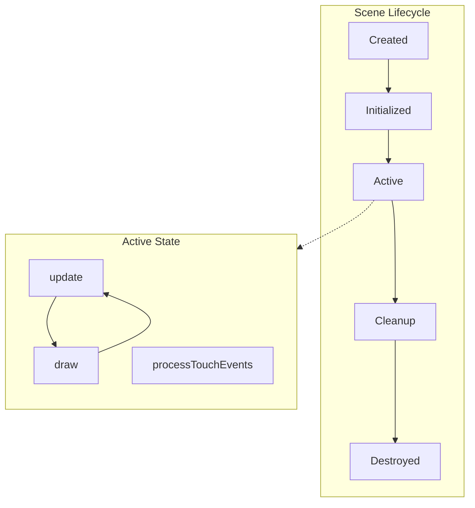
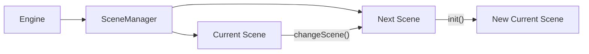
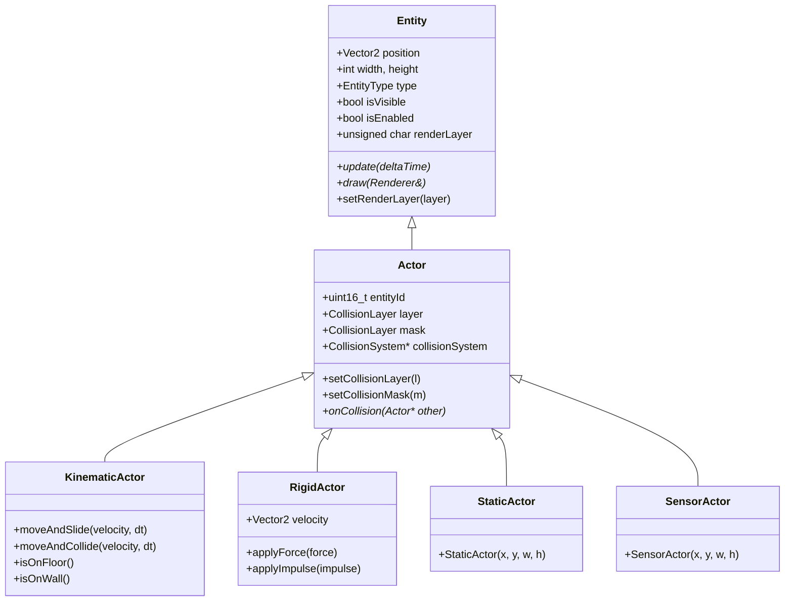
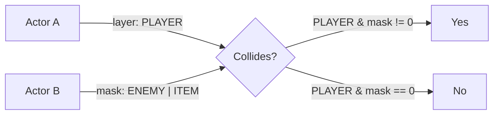
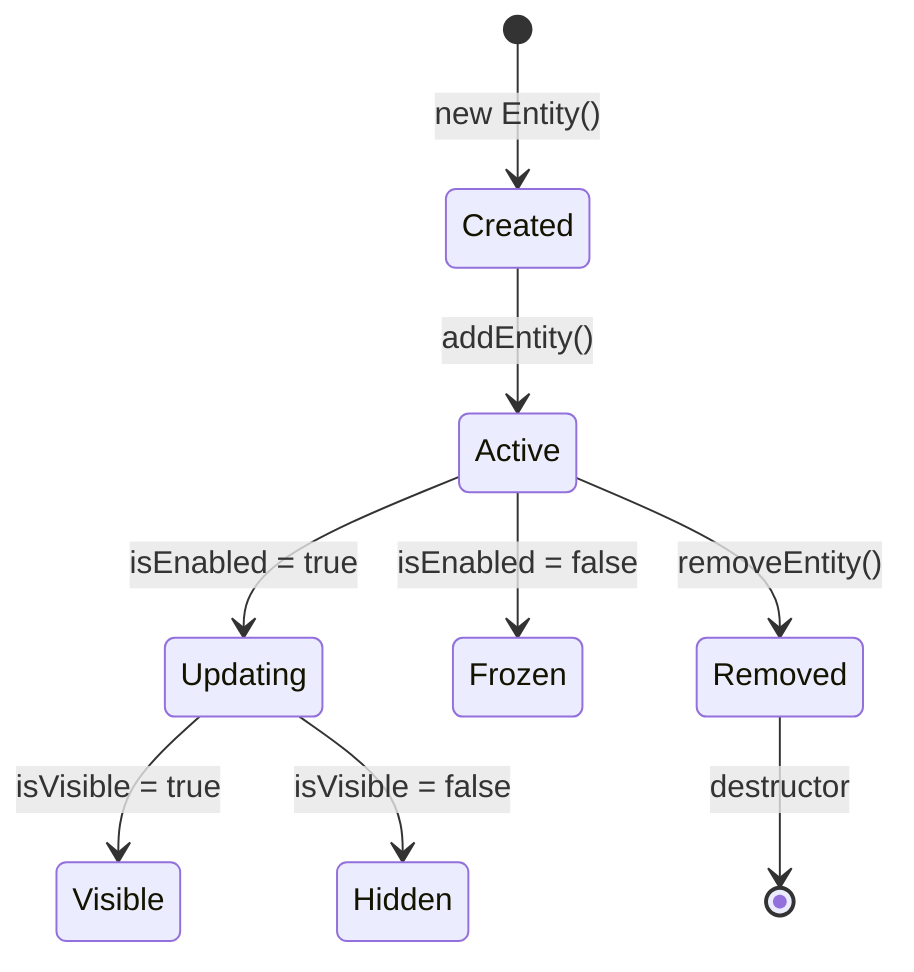
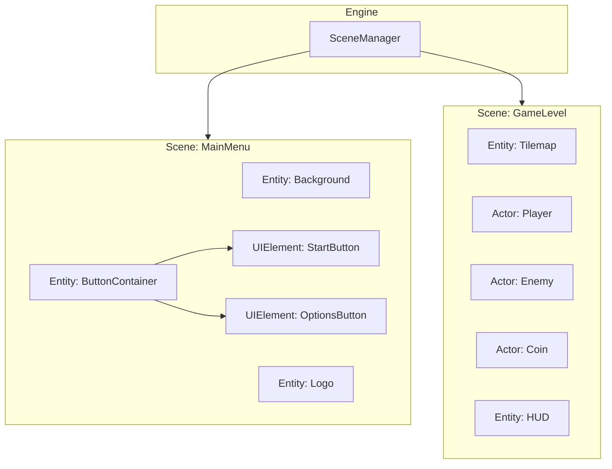

# Layer 4: Scene Layer

## Responsibility

Game scene and entity management. This layer provides the organizational structure for game objects and their lifecycle.

---

## Components

### Engine

**Files**: `include/core/Engine.h`, `src/core/Engine.cpp`

Central class that orchestrates all subsystems.

**Responsibilities**:

- Manages Renderer, SceneManager, InputManager, AudioEngine, MusicPlayer
- Runs the main game loop
- Provides automatic touch processing (when enabled)

**Game Loop**:

```cpp
void Engine::run() {
    while (true) {
        // 1. Calculate delta time
        deltaTime = currentMillis - previousMillis;
        
        // 2. Update
        update();
        
        // 3. Draw
        draw();
    }
}

void Engine::update() {
    inputManager.update(deltaTime);
    sceneManager.update(deltaTime);
    // Note: AudioEngine runs on separate thread/core
}

void Engine::draw() {
    renderer.beginFrame();
    sceneManager.draw(renderer);
    renderer.endFrame();
}
```

**Touch Integration** (`PIXELROOT32_ENABLE_TOUCH=1`):

- `getTouchDispatcher()`: Access touch event dispatcher
- `hasTouchEvents()`: Check for pending events
- `setTouchManager()`: Register external TouchManager for auto-processing

When `setTouchManager()` is called, Engine automatically:

1. Polls `touchManager->getTouchPoints()` each frame
2. Detects touch releases (count >0 → 0)
3. Processes through `TouchEventDispatcher`
4. Dispatches to `Scene::processTouchEvents()`

See [Touch Input Architecture](touch-input.md) for details.

---

### SceneManager

**Files**: `include/core/SceneManager.h`, `src/core/SceneManager.cpp`

Scene stack management (push/pop operations).

**Operations**:

| Method | Description |
|--------|-------------|
| `setCurrentScene()` | Replace current scene |
| `pushScene()` | Push new scene (pauses previous) |
| `popScene()` | Pop scene (resumes previous) |

**Scene Stack**:

```cpp
Scene* sceneStack[MaxScenes];  // Default: 8 scenes
int sceneCount;
```

Useful for:

- Pause menus (push pause scene over game scene)
- Settings screens
- Dialog overlays

---

### Scene

**Files**: `include/core/Scene.h`, `src/core/Scene.cpp`

Entity container representing a level or screen.

**Memory Model**: Non-owning

The Scene follows a **non-owning** model for entities. When you call `addEntity(Entity*)`, the scene stores a reference but **does not take ownership**.

```cpp
// Scene does NOT delete entities
// You are responsible for lifetime (typically std::unique_ptr)

class GameScene : public Scene {
    std::unique_ptr<Player> player;  // You own it
    
public:
    void init() override {
        player = std::make_unique<Player>(100, 100, 16, 16);
        addEntity(player.get());  // Scene gets non-owning pointer
    }
};
```

**Features**:

- Entity array (`MAX_ENTITIES = 32` default)
- Render layer system (`MAX_LAYERS = 3` default)
- Integrated `CollisionSystem`
- Viewport culling
- Optional `SceneArena` for custom allocators

**Lifecycle**:

```cpp
virtual void init();                    // Called when entering scene
virtual void update(unsigned long dt);  // Every frame
virtual void draw(Renderer& r);         // Every frame
virtual void processTouchEvents(const TouchEvent* events, uint8_t count);
virtual void onUnconsumedTouchEvent(const TouchEvent& event);
```

---

### Entity

**Files**: `include/core/Entity.h`

Abstract base class for all game objects.

**Properties**:

| Property | Type | Description |
|----------|------|-------------|
| `x`, `y` | `float` | Position |
| `width`, `height` | `int` | Dimensions |
| `type` | `EntityType` | GENERIC, ACTOR, UI_ELEMENT |
| `renderLayer` | `uint8_t` | Render layer (0-255) |
| `isVisible` | `bool` | Visibility control |
| `isEnabled` | `bool` | Update control |

**Virtual Methods**:

```cpp
virtual void update(unsigned long deltaTime) = 0;
virtual void draw(Renderer& renderer) = 0;
```

---

## Actor / PhysicsActor Hierarchy

Following the Godot Engine philosophy, physical actors are specialized into distinct types based on their movement requirements.

### Hierarchy Diagram

```
Entity
└── Actor
    └── PhysicsActor (Base)
        ├── StaticActor    (Immovable walls/floors)
        │   └── SensorActor (Trigger zones)
        ├── KinematicActor (Player-controlled)
        └── RigidActor     (Physics-simulated props)
```

### Actor Types

| Type | Movement | Collision Layer | Use Case |
|------|----------|-----------------|----------|
| **StaticActor** | None | Static grid | Walls, floors, platforms |
| **SensorActor** | None | Static grid | Collectibles, triggers |
| **KinematicActor** | Code-driven | Dynamic grid | Player, enemies, moving platforms |
| **RigidActor** | Physics-simulated | Dynamic grid | Props, debris, projectiles |

### Common Features

All PhysicsActor types support:

- `setShape(CollisionShape::AABB/CIRCLE)` - Hitbox shape
- `setCollisionLayer(mask)` - Layer membership
- `setCollisionMask(mask)` - Layers to collide with
- `setSensor(true/false)` - Trigger mode (no collision response)
- `setOneWay(true/false)` - One-way platform mode
- `onCollision(Actor* other)` - Notification callback

### Actor Example

```cpp
class Player : public KinematicActor {
public:
    void update(unsigned long dt) override {
        // Movement logic
        if (engine.getInputManager().isButtonPressed(BTN_A)) {
            velocity.y = -jumpForce;
        }
        
        // Move with collision
        moveAndSlide();
    }
    
    void draw(Renderer& r) override {
        r.drawSprite(playerSprite, x, y, Color::White);
    }
    
    void onCollision(Actor* other) override {
        if (other->isInLayer(Layers::kEnemy)) {
            takeDamage();
        }
    }
};
```

---

## Game Layer

**Responsibility**: Game-specific code implemented by the user.

This is where you implement your game logic using the engine's architecture.

### Typical Implementation

```cpp
class GameScene : public Scene {
    std::unique_ptr<Player> player;
    std::vector<std::unique_ptr<Enemy>> enemies;
    std::unique_ptr<TileMap> background;

public:
    void init() override {
        // Create player
        player = std::make_unique<Player>(100, 100, 16, 16);
        addEntity(player.get());
        
        // Create enemies
        for (int i = 0; i < 5; i++) {
            auto enemy = std::make_unique<Enemy>(...);
            enemies.push_back(std::move(enemy));
            addEntity(enemies.back().get());
        }
        
        // Start music
        engine.getMusicPlayer().play(backgroundMusic);
    }
    
    void update(unsigned long dt) override {
        // Scene-level update logic
        Scene::update(dt);  // Updates all entities
    }
    
    void draw(Renderer& r) override {
        // Draw background
        r.drawTileMap(*background, 0, 0);
        
        // Draw entities
        Scene::draw(r);
    }
};
```

---

## Diagrams (scene graph and entities)

### Scene lifecycle



### SceneManager transitions



### Entity / Actor relationships



### Collision layer vs mask



### Entity lifecycle (ownership)



### Scene-based game structure

High-level view of how `SceneManager` binds multiple scenes (from core concepts):



---

## Memory Considerations

| Component | Default Size | Configurable |
|-----------|--------------|--------------|
| Max Entities per Scene | 32 | `MAX_ENTITIES` |
| Max Render Layers | 3 | `MAX_LAYERS` |
| Max Scene Stack | 8 | `MaxScenes` |
| Physics Contacts | 128 | `PHYSICS_MAX_CONTACTS` |

See [Memory System](memory-system.md) for optimization strategies.

---

## Related Documentation

- [Physics Subsystem](physics-subsystem.md) - Actor physics details
- [Touch Input](touch-input.md) - Scene touch handling
- [Memory System](memory-system.md) - Entity memory management
- [API Reference - Core](../api/core.md) - Class-level API
