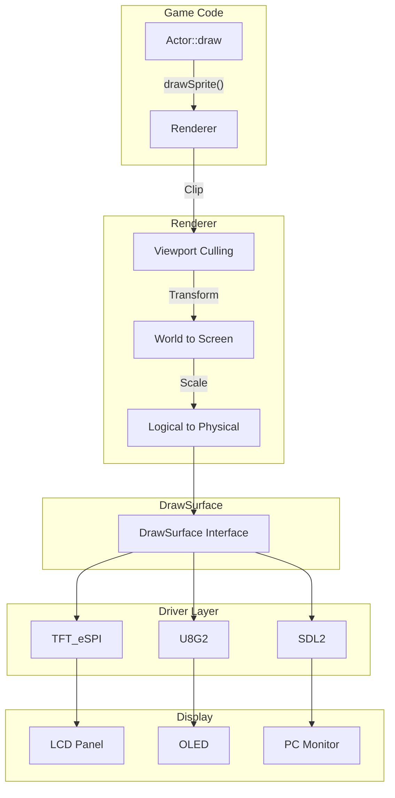
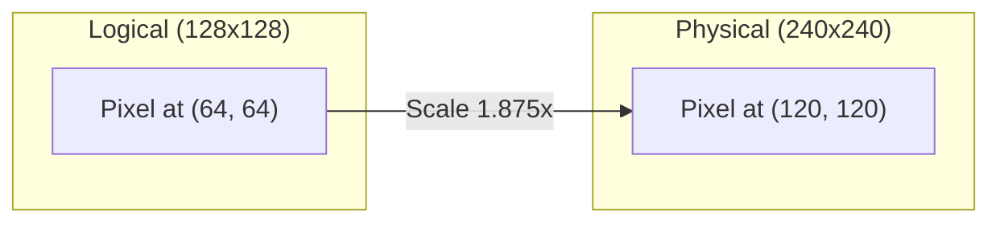
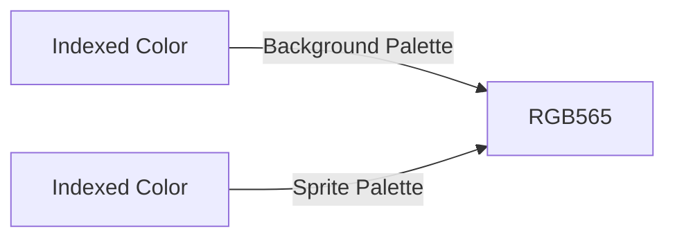
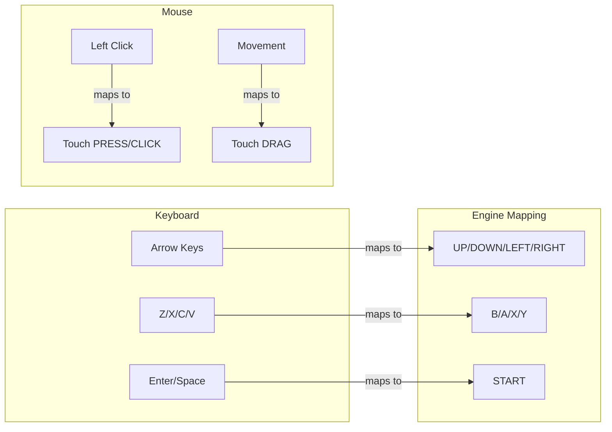
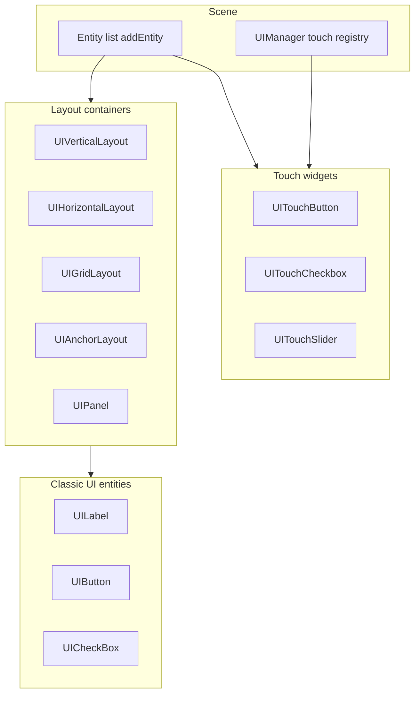
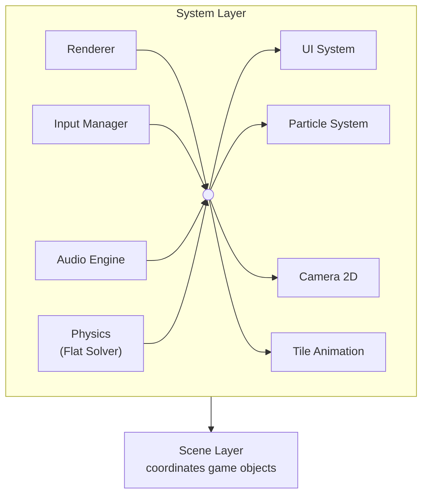
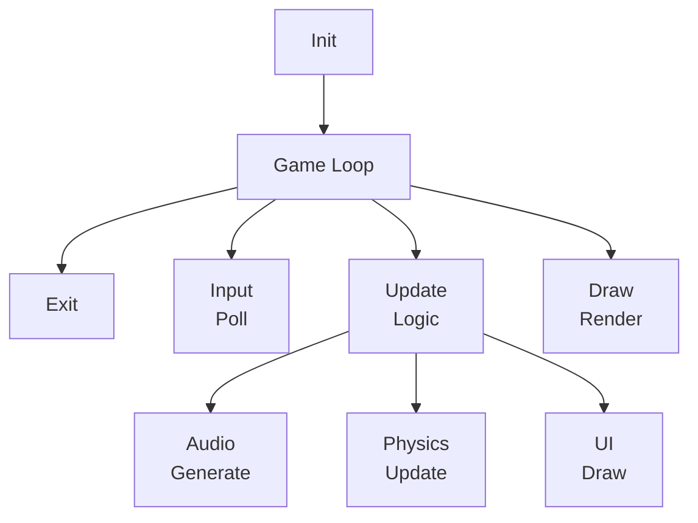

# Layer 3: System Layer

## Responsibility

Game engine subsystems that implement high-level functionality. These systems provide the core capabilities that game code builds upon.

---

## Subsystem Overview

| Subsystem | Document |
|-----------|----------|
| **Audio** | [Audio Subsystem](./audio-subsystem.md) |
| **Physics** | [Physics Subsystem](./physics-subsystem.md) |
| **Touch Input** | [Touch Input](./touch-input.md) |
| **Tile Animation** | [Tile Animation](./tile-animation.md) |
| **Resolution Scaling** | [Resolution Scaling](./resolution-scaling.md) |

---

## Architecture Diagrams

### Rendering Pipeline (Game Code → Display)



### Logical vs Physical Resolution



### Indexed Color → RGB565



### PC Keyboard/Mouse Mapping



### UI Composition



### System Architecture



---

## Data Flow

### Game Loop Flow



### Audio Pipeline

```
Game Code
    │
    ▼ (submitCommand)
AudioCommandQueue (Thread-Safe)
    │
    ▼ (processCommands)
AudioScheduler
    │
    ├──▶ Pulse Channel
    ├──▶ Triangle Channel
    ├──▶ Noise Channel
    └──▶ Music Sequencer
    │
    ▼ (generateSamples)
Mixer (with LUT)
    │
    ▼
AudioBackend
    ├──▶ ESP32_I2S_AudioBackend
    ├──▶ ESP32_DAC_AudioBackend
    └──▶ SDL2_AudioBackend
```

---

## Modular Compilation Flags

| Subsystem | Flag | Default |
|-----------|------|---------|
| Audio | `PIXELROOT32_ENABLE_AUDIO` | Enabled |
| Physics | `PIXELROOT32_ENABLE_PHYSICS` | Enabled |
| UI System | `PIXELROOT32_ENABLE_UI_SYSTEM` | Enabled |
| Particles | `PIXELROOT32_ENABLE_PARTICLES` | Enabled |
| Touch Input | `PIXELROOT32_ENABLE_TOUCH` | Disabled |
| Tile Animations | `PIXELROOT32_ENABLE_TILE_ANIMATIONS` | Enabled |
| Static tilemap framebuffer cache (4bpp) | `PIXELROOT32_ENABLE_STATIC_TILEMAP_FB_CACHE` | Enabled |

---

## Related Documentation

| Subsystem | Document |
|-----------|----------|
| Audio | [Audio Subsystem](./audio-subsystem.md) |
| Physics | [Physics Subsystem](./physics-subsystem.md) |
| Touch Input | [Touch Input](./touch-input.md) |
| Tile Animation | [Tile Animation](./tile-animation.md) |
| Resolution Scaling | [Resolution Scaling](./resolution-scaling.md) |
| Memory | [Memory System](./memory-system.md) |
| API Reference | [API Index](../api/index.md) |