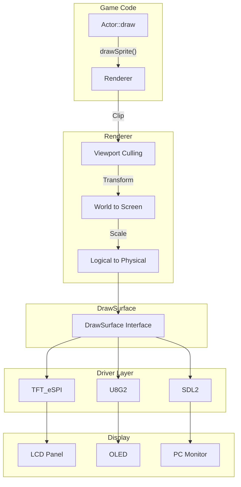
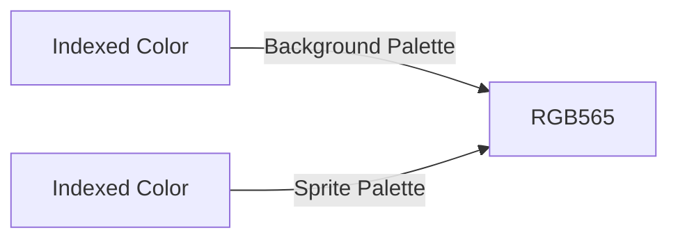
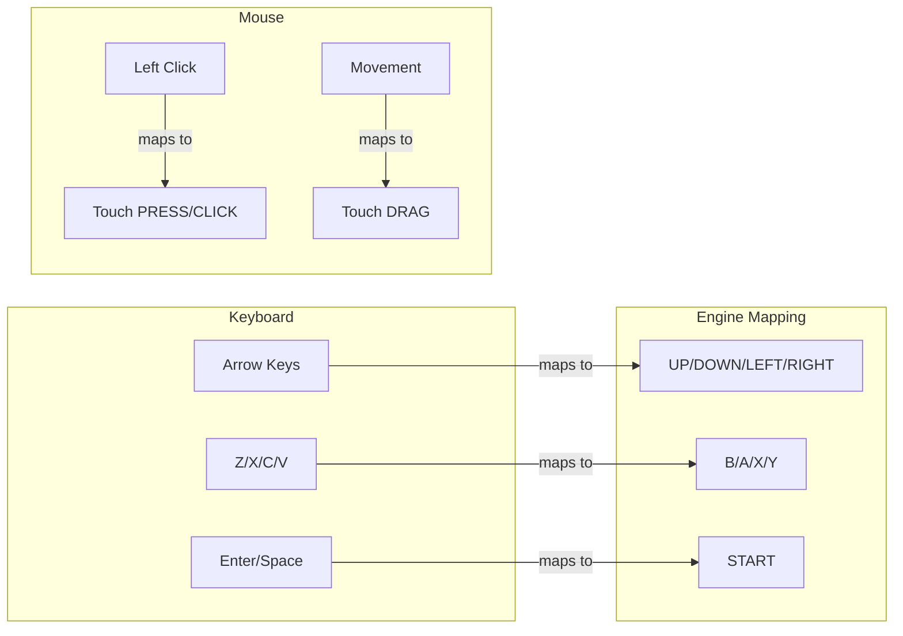
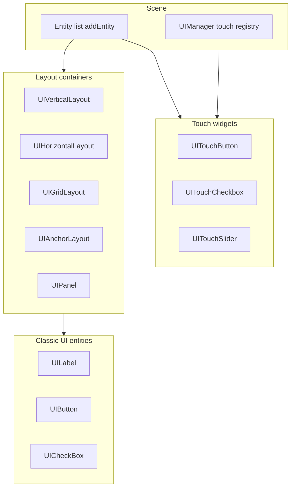
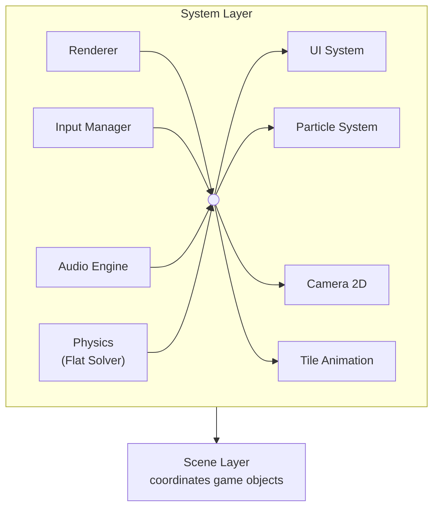
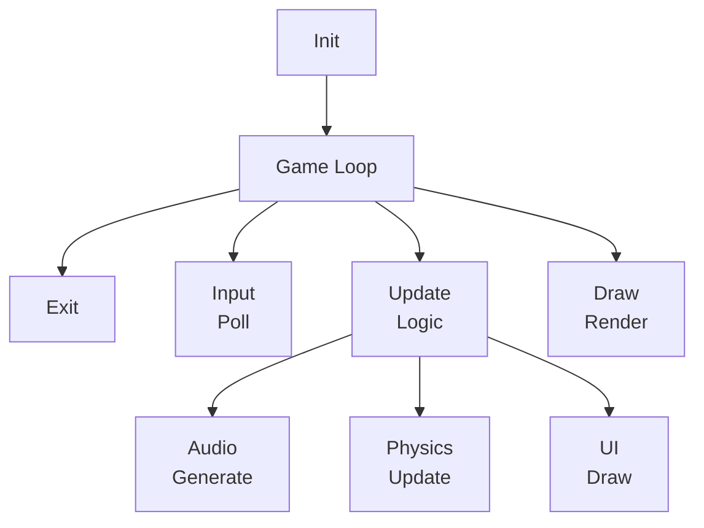

# Layer 3: System Layer

## Responsibility

Game engine subsystems that implement high-level functionality. These systems provide the core capabilities that game code builds upon.

---

## Subsystem Overview

The System Layer contains the following major subsystems:

| Subsystem | Responsibility | Detailed Document |
|-----------|--------------|-------------------|
| **Renderer** | Graphics rendering, sprites, tilemaps | See API Reference |
| **InputManager** | Button and touch input handling | [Touch Input](touch-input.md) |
| **AudioEngine** | NES-style 4-channel audio | [Audio Subsystem](audio-subsystem.md) |
| **CollisionSystem** | Physics simulation, collisions | [Physics Subsystem](physics-subsystem.md) |
| **UI System** | User interface and layouts | See API Reference |
| **Particle System** | Visual effects and particles | See API Reference |
| **Camera2D** | Viewport transformations | See API Reference |
| **Tile Animation** | Animated tilemaps | [Tile Animation](tile-animation.md) |
| **Resolution Scaling** | Logical vs physical resolution | [Resolution Scaling](resolution-scaling.md) |

---

## Diagrams (rendering pipeline, palettes, PC input, UI)

### Renderer path (game code → display)



### Logical vs physical pixel (scaling)

```mermaid
flowchart LR
    subgraph Logical["Logical (128x128)"]
        L1[Pixel at (64, 64)]
    end

    subgraph Physical["Physical (240x240)"]
        P1[Pixel at (120, 120)]
    end

    L1 -->|"Scale 1.875x"| P1
```

### Indexed color → RGB565



### PC keyboard / mouse mapping (illustrative)



### UI composition (scene, layouts, touch)



---

## System Architecture Diagram



---

## Renderer

**Files**: `include/graphics/Renderer.h`, `src/graphics/Renderer.cpp`

High-level rendering system that abstracts graphics operations.

### Features

- Logical resolution independent of physical resolution
- Support for 1bpp, 2bpp, 4bpp sprites
- Sprite animation system
- Tilemaps with viewport culling
- Multi-palette tilemaps (2bpp/4bpp)
- Multi-palette sprites (2bpp/4bpp)
- Native bitmap font system
- Render contexts for dual palettes

### Multi-Palette Sprites Architecture

The engine supports multiple palettes for 2bpp/4bpp sprites through a sprite palette slot bank.

**Data Flow**:
```
sprite.paletteSlot → getSpritePaletteSlot() → resolveColorWithPalette() → drawSpriteInternal
```

**API Example**:
```cpp
class Renderer {
    void beginFrame();
    void endFrame();
    void drawSprite(const Sprite& sprite, int x, int y, Color color);
    void drawText(std::string_view text, int x, int y, Color color, uint8_t size);
    void drawTileMap(const TileMap& map, int originX, int originY);
};
```

---

## InputManager

**Files**: `include/input/InputManager.h`, `src/input/InputManager.cpp`

Input management from physical buttons or keyboard (PC), plus optional touch event routing.

### Features

- Debouncing support
- States: Pressed, Released, Down, Clicked
- Configurable via `InputConfig`
- Hardware abstraction through polling
- **Touch event dispatcher** (when `PIXELROOT32_ENABLE_TOUCH=1`)

### Button States

| Method | Description |
|--------|-------------|
| `isButtonPressed()` | UP → DOWN transition |
| `isButtonReleased()` | DOWN → UP transition |
| `isButtonDown()` | Current DOWN state |
| `isButtonClicked()` | Complete click detected |

**Touch input** is covered in detail in [Touch Input Architecture](touch-input.md).

---

## AudioEngine

**Files**: `include/audio/AudioEngine.h`, `src/audio/AudioEngine.cpp`

NES-style 4-channel audio system. See [Audio Subsystem Reference](audio-subsystem.md) for complete details.

**Quick Overview**:
- 2 PULSE channels (square wave)
- 1 TRIANGLE channel
- 1 NOISE channel
- Sample-accurate timing via AudioScheduler
- Modular compilation: `PIXELROOT32_ENABLE_AUDIO`

---

## CollisionSystem (Flat Solver)

**Files**: `include/physics/CollisionSystem.h`, `src/physics/CollisionSystem.cpp`

High-performance physics solver optimized for ESP32 microcontrollers.

**Simulation Pipeline**:
```
1. Detect Collisions    → Dual-layer spatial grid
2. Solve Velocity       → Impulse-based response
3. Integrate Positions  → p = p + v * dt
4. Solve Penetration  → Baumgarte stabilization
5. Trigger Callbacks    → onCollision notifications
```

See [Physics System Reference](physics-subsystem.md) for complete details.

---

## UI System

**Files**: `include/graphics/ui/*.h`, `src/graphics/ui/*.cpp`

User interface system with automatic layouts.

### Class Hierarchy

```
Entity
├── UIElement
│   ├── UILabel
│   ├── UIButton
│   ├── UICheckbox
│   └── UIPanel
│       └── UILayout
│           ├── UIHorizontalLayout
│           ├── UIVerticalLayout
│           ├── UIGridLayout
│           ├── UIAnchorLayout
│           └── UIPaddingContainer
└── UITouchElement
    ├── UITouchButton
    ├── UITouchSlider
    └── UITouchCheckbox
```

### Touch Widget Architecture

- **UITouchWidget**: Lightweight widget data struct
- **UITouchElement**: Abstract base with widget data
- **UIManager**: Non-owning registry (max 16 elements)

Scene owns widgets; UIManager only routes events.

---

## Particle System

**Files**: `include/graphics/particles/*.h`, `src/graphics/particles/*.cpp`

Visual effects system with configurable emitters.

**Components**:
- `Particle`: Individual particle with position, velocity, life
- `ParticleEmitter`: Configurable emitter with presets
- `ParticleConfig`: Emission configuration

Modular compilation: `PIXELROOT32_ENABLE_PARTICLES`

---

## Camera2D

**Files**: `include/graphics/Camera2D.h`, `src/graphics/Camera2D.cpp`

2D camera with viewport transformations.

**Features**:
- Position and zoom control
- Automatic offset for Renderer
- Support for fixed-position UI elements
- Stable rounding to prevent jitter

---

## Tilemap rendering

**Files**: `include/graphics/Renderer.h`, `src/graphics/Renderer.cpp`, `include/graphics/TileAnimation.h`

`Renderer::drawTileMap` performs **viewport culling** (only tiles that can intersect the logical framebuffer), optional **`TileAnimationManager::resolveFrame`**, optional **runtime tile masks** and **per-cell background palettes** on 2bpp/4bpp maps, then rasterizes each visible tile (ESP32: hot paths use `IRAM_ATTR` where applicable).

For largely static **4bpp** layers when **`DrawSurface::getSpriteBuffer()`** is available, use **`StaticTilemapLayerCache`** and the compile flag **`PIXELROOT32_ENABLE_STATIC_TILEMAP_FB_CACHE`** (see Graphics API and [Architecture](ARCHITECTURE.md#esp32-rendering-pipeline-and-tilemap-caching)).

See [Tile Animation](tile-animation.md) for the animation system.

---

## Subsystem Modular Compilation

| Subsystem | Flag | Default |
|-----------|------|---------|
| Audio | `PIXELROOT32_ENABLE_AUDIO` | Enabled |
| Physics | `PIXELROOT32_ENABLE_PHYSICS` | Enabled |
| UI System | `PIXELROOT32_ENABLE_UI_SYSTEM` | Enabled |
| Particles | `PIXELROOT32_ENABLE_PARTICLES` | Enabled |
| Touch Input | `PIXELROOT32_ENABLE_TOUCH` | Disabled |
| Tile Animations | `PIXELROOT32_ENABLE_TILE_ANIMATIONS` | Enabled |
| Static tilemap framebuffer cache (4bpp) | `PIXELROOT32_ENABLE_STATIC_TILEMAP_FB_CACHE` | Enabled (`PlatformDefaults.h`) |

---

## Data Flow

### Game Loop Flow



### Audio Flow

```
Game Code
    │
    ▼ (submitCommand)
AudioCommandQueue (Thread-Safe)
    │
    ▼ (processCommands)
AudioScheduler
    │
    ├──▶ Pulse Channel
    ├──▶ Triangle Channel
    ├──▶ Noise Channel
    └──▶ Music Sequencer
    │
    ▼ (generateSamples)
Mixer (with LUT)
    │
    ▼
AudioBackend
    ├──▶ ESP32_I2S_AudioBackend
    ├──▶ ESP32_DAC_AudioBackend
    └──▶ SDL2_AudioBackend
```

---

## Related Documentation

| Subsystem | Document |
|-----------|----------|
| Audio | [Audio Subsystem](audio-subsystem.md) |
| Physics | [Physics Subsystem](physics-subsystem.md) |
| Touch Input | [Touch Input](touch-input.md) |
| Tile Animation | [Tile Animation](tile-animation.md) |
| Resolution Scaling | [Resolution Scaling](resolution-scaling.md) |
| Memory | [Memory System](memory-system.md) |

**API Reference**: See `docs/api/API_*.md` for class-level documentation.
