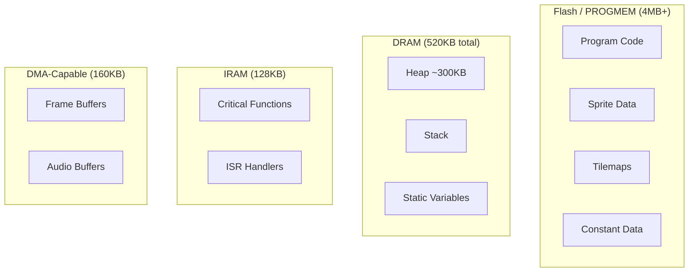

# Memory Management Guide - PixelRoot32 C++17

## Overview

This guide covers modern memory management practices in PixelRoot32 using C++17 features. The engine has transitioned from manual memory management to smart pointers and RAII (Resource Acquisition Is Initialization) patterns for improved safety and maintainability.

### Memory regions (ESP32-oriented overview)



---

## Engine Memory Limits

Understanding the engine's memory limits is crucial for developing stable games on resource-constrained platforms.

### Hard Limits (Compile-Time Constants)

| Limit | Default Value | Configurable | Description |
|-------|--------------|--------------|-------------|
| **Max Entities** | 32 | ✅ via `MAX_ENTITIES` | Maximum entities per scene |
| **Max Layers** | 3 | ✅ via `MAX_LAYERS` | Maximum render layers (0=Bg, 1=Game, 2=UI) |
| **Max Physics Pairs** | 128 | ✅ via `PHYSICS_MAX_PAIRS` | Maximum collision pairs considered in broadphase |
| **Max Physics Contacts** | 128 | ✅ via `PHYSICS_MAX_CONTACTS` | Fixed contact pool size; no heap per frame. Excess contacts are dropped. |
| **Spatial Grid Cell Size** | 32px | ✅ via `SPATIAL_GRID_CELL_SIZE` | Size of uniform grid cells |
| **Max Entities Per Grid Cell** | 24 | ✅ via `SPATIAL_GRID_MAX_ENTITIES_PER_CELL` | Legacy single-grid capacity |
| **Max Static Per Cell** | 12 | ✅ via `SPATIAL_GRID_MAX_STATIC_PER_CELL` | Static layer capacity per cell |
| **Max Dynamic Per Cell** | 12 | ✅ via `SPATIAL_GRID_MAX_DYNAMIC_PER_CELL` | Dynamic layer capacity per cell |
| **Velocity Iterations** | 2 | ✅ via `PIXELROOT32_VELOCITY_ITERATIONS` | Physics solver iterations |
| **Gameplay Event Queue Capacity** | 32 | ✅ via `GAMEPLAY_EVENT_QUEUE_CAPACITY` | Ring buffer slots for `gameplay::GameplayEventBus` (Gameplay Framework Phase 1) |
| **Max Interactive Actors** | 16 | ✅ via `GAMEPLAY_MAX_INTERACTIVE_ACTORS` | Registry size for `gameplay::InteractionTracker` (Gameplay Framework Phase 1) |
| **Spatial Query Max Radius** | 128 | ✅ via `SPATIAL_QUERY_MAX_RADIUS` | Clamp for `queryRadius()` to avoid Q16.16 squared-distance overflow (Gameplay Framework Phase 1) |

**Modular Compilation Impact:**

When subsystems are disabled via `PIXELROOT32_ENABLE_*` flags, their memory allocations are eliminated entirely from the binary:

| Flag | RAM Savings | Flash Savings | Subsystems Removed |
|------|-------------|--------------|-------------------|
| `PIXELROOT32_ENABLE_AUDIO=0` | ~8 KB | ~15 KB | AudioEngine, MusicPlayer, audio buffers |
| `PIXELROOT32_ENABLE_PHYSICS=0` | ~12 KB | ~25 KB | CollisionSystem, spatial grid, physics actors |
| `PIXELROOT32_ENABLE_UI_SYSTEM=0` | ~4 KB | ~20 KB | UIElement, all layouts, UI containers |
| `PIXELROOT32_ENABLE_PARTICLES=0` | ~6 KB | ~10 KB | ParticleEmitter, particle pools |
| **All disabled** | **~30 KB** | **~70 KB** | Maximum savings |

**Gameplay Framework Phase 1 flags (opt-in, default `0`):** unlike the flags above — which default to `1` because audio/physics/UI/particles are load-bearing for existing examples — these four capabilities are purely additive and default **off**, so none of the 15 existing examples pays their cost unless explicitly enabled:

| Flag | Default | RAM Cost When Enabled | Subsystem Added |
|------|---------|------------------------|------------------|
| `PIXELROOT32_ENABLE_GAMEPLAY_EVENTS=1` | `0` | ~512 B (ESP32-C3) / ~768 B (native) | `gameplay::GameplayEventBus` — single-threaded, `Engine`-owned event ring buffer |
| `PIXELROOT32_ENABLE_INTERACTION_TRIGGERS=1` | `0` | ~704 B (ESP32, `PHYSICS_MAX_CONTACTS=64`) / ~1.2 KB (native default 128) | `gameplay::InteractionTracker` — enter/exit edge detection over `CollisionSystem` contacts. Requires `PIXELROOT32_ENABLE_PHYSICS=1` |
| `PIXELROOT32_ENABLE_SPATIAL_QUERY=1` | `0` | 0 B extra static storage (adds methods only) | `SpatialGrid::queryRadius/queryBox` + `CollisionSystem::queryRadius/queryBox`. Requires `PIXELROOT32_ENABLE_PHYSICS=1` |
| `PIXELROOT32_ENABLE_DEPTH_SORT=1` | `0` | ~8 B per `Scene` (comparator pointer + bool) | `Scene::depthComparator` / `depthSortEnabled` secondary sort key, used by `Scene::sortEntities()` |

`PIXELROOT32_ENABLE_INTERACTION_TRIGGERS=1` or `PIXELROOT32_ENABLE_SPATIAL_QUERY=1` combined with `PIXELROOT32_ENABLE_PHYSICS=0` fails the build at compile time via an `#error` in `PlatformDefaults.h` (`CollisionSystem` and `SpatialGrid` only exist when physics is enabled), rather than silently disabling the feature.

**Gameplay Framework Phase 2 flags (opt-in, default `0`):** two more capabilities in `pixelroot32::gameplay`, each pure composition with zero engine-side wiring — no new member, virtual, or hook on `Scene`, `Actor`, or `Entity`. Unlike Phase 1's `INTERACTION_TRIGGERS`/`SPATIAL_QUERY`, **neither depends on `PIXELROOT32_ENABLE_PHYSICS` or any other flag** — neither header includes `core/`, `physics/`, `math/`, or any other capability's header, so no `#error` guard exists or is needed:

| Flag | Default | RAM Cost When Enabled | Subsystem Added |
|------|---------|------------------------|------------------|
| `PIXELROOT32_ENABLE_GAMEPLAY_STATE_MACHINE=1` | `0` | 20 B/instance (ESP32-C3) / 32 B/instance (native), plus one shared table in flash per class | `gameplay::StateMachine` — non-template FSM over a caller-owned `const` state table |
| `PIXELROOT32_ENABLE_GAMEPLAY_OBJECT_POOL=1` | `0` | `N * sizeof(T)` + 8-12 B bookkeeping per pool instantiation (see table below) | `gameplay::ObjectPool<T, N>` — fixed-capacity, zero-heap slot pool with placement-new storage |

**`StateMachine::State` byte budget (one table row — flash/`.rodata`, shared per class, not per instance):**

| Target | 3 function pointers | `id` (`StateId`/`uint8_t`) | padding | `sizeof(State)` |
|--------|----------------------|----------------------------|---------|-------------------|
| ESP32-C3 (32-bit) | 3 × 4 = 12 B | 1 B | 3 B | **16 B** |
| native/PC (64-bit) | 3 × 8 = 24 B | 1 B | 7 B | **32 B** |

**`StateMachine` instance byte budget (SRAM, one per stateful actor):**

| Target | `owner_` + `states_` (2 pointers) | `timeInStateMs_` | 6 × 1 B fields (`current_`, `previous_`, `pending_`, `stateCount_`, `inTransition_`, `transitionOverflows_`) | padding | `sizeof(StateMachine)` |
|--------|-----------------------------------|-------------------|----------------------------------------------------------------------------------------------------------|---------|--------------------------|
| ESP32-C3 (32-bit) | 8 B | 4 B | 6 B | 2 B | **20 B** |
| native/PC (64-bit) | 16 B | 4 B | 6 B | 6 B | **32 B** |

Confirmed against the shipped `include/gameplay/StateMachine.h` layout — field order is `owner_`, `states_`, `timeInStateMs_`, then the six 1-byte fields, exactly as budgeted; no drift from the design.

**Gameplay Framework Phase 3 flag (opt-in, default `0`):** one capability in `pixelroot32::gameplay`, header-only with no `.cpp` file, so there is no additional code cost when the flag is off. It depends on `math/` (`Vector2`, `MathUtil`) but carries **no `#error` guard**, on the same terms as `DepthCompare.h` and `GameplayEvent.h`, which already depend on `math/Scalar.h`: `math/` is always available regardless of `PIXELROOT32_ENABLE_PHYSICS` or any other flag:

| Flag | Default | RAM Cost When Enabled | Subsystem Added |
|------|---------|------------------------|------------------|
| `PIXELROOT32_ENABLE_GAMEPLAY_GRID_SPACE=1` | `0` | 0 B SRAM | `gameplay::GridSpace.h` — grid-to-world/world-to-grid coordinate conversion (`GridSpec`, `cellToWorldX/Y`, `cellToWorld`, `worldToCellX/Y`, `containsCell`) |

**`GridSpec` byte budget:** every shipped consumer (`examples/snake`, `examples/tic_tac_toe`) declares its grid as `inline constexpr GridSpec`. `constexpr` implies `const`, so the six-`int` aggregate lands in `.rodata`/flash, never `.data`/`.bss` — **0 B SRAM**, at every optimization level, independent of whether the optimizer also folds the constant away entirely. `sizeof(GridSpec) == 24 B` (six `int`s — `int` is 4 B under both the ESP32-C3's ILP32 and native's LP64), identical on both targets. A non-`constexpr` (runtime) `GridSpec` would cost 24 B SRAM instead; no shipped consumer uses one.

**Gameplay Framework Phase 3 part 2 — Room/Screen (opt-in, default `0`):** `RoomGraph<N>` is a header-only template class under `PIXELROOT32_ENABLE_GAMEPLAY_ROOM`. A `Scene` owns it via a type-erased `RoomGraphBase*` pointer (composition, no inheritance). Entering a room updates camera bounds and fires an optional `onEnter` callback. The flag defaults to `0` — when disabled the entire `#if` block is excluded and the engine contributes zero bytes.

| Item | ESP32-C3 (32-bit) | native/PC (64-bit) | Notes |
|------|-------------------|---------------------|-------|
| `RoomGraphBase*` ptr on `Scene` | 4 B per Scene | 8 B per Scene | Type-erased pointer; nullptr when flag=0 or no graph is registered |
| `RoomGraphBase` vtable | 12–16 B in flash | 12–16 B in flash | One shared vtable per program (not per instance) |
| `RoomGraph<N>` vptr (from `RoomGraphBase`) | 4 B per instance | 8 B per instance | Per-instance vtable pointer; one per `RoomGraph<N>` regardless of N |
| `RoomGraph<32>` (max rooms) | ~1296 B (32 × 40 B/room + 12 B bookkeeping + 4 B vptr) | ~1564 B (32 × 48 B/room + 16 B bookkeeping + 8 B vptr) | Bookkeeping: `roomCount_` (2 B), `currentRoomIndex_` (2 B), `onEnter_` fn ptr + `userData_` ptr (8 B on 32-bit, 16 B on 64-bit). No per-room allocated by a game that never instantiates `RoomGraph<N>`. |
| `RoomGraph<2>` (typical example) | ~100 B (2 × 40 B + 12 B) | ~120 B (2 × 48 B + 16 B) | The `examples/room_screen/` example ships with N=2 |
| Per-`Room` size (`sizeof(Room)`) | 40 B | 48 B | Four `Scalar` fields (camera rect, 4×4 B), tile window (8 B + 1 B flag + 1 B pad), `connections_[4]` (16 B), `connectionCount_` (1 B + 3 B pad) |
| Flag = 0 | **0 B** | **0 B** | Whole header is an empty `#if` block; no code, no data |

Design: #3081 (`sdd/room-screen-abstraction/design`).

**`ObjectPool<T, N>` byte budget:** `N * sizeof(T)` for the aligned slot storage, plus target-independent bookkeeping (a `uint32_t liveWords_[(N+31)/32]` bitmask plus two `uint16_t` counters, `liveCount_` and `scanHint_`) — identical on ESP32-C3 and native because every bookkeeping field is a fixed-width type:

| `N` (pool capacity) | `liveWords_` | counters (`liveCount_` + `scanHint_`) | **bookkeeping total** | per-slot equivalent |
|---|---|---|---|---|
| 8 | 1 × 4 B | 4 B | **8 B** | 1.00 B/slot |
| 16 | 1 × 4 B | 4 B | **8 B** | 0.50 B/slot |
| 32 | 1 × 4 B | 4 B | **8 B** | 0.25 B/slot |
| 64 | 2 × 4 B | 4 B | **12 B** | 0.19 B/slot |

Total instance size is `N * sizeof(T) + bookkeeping`, plus up to `alignof(T) - 1` bytes of tail padding for an over-aligned `T`. Since it is a template, only the `(T, N)` pairs a game actually instantiates emit any code or data — an unused instantiation costs nothing.

**`GameplayEvent` byte budget (`GAMEPLAY_EVENT_QUEUE_CAPACITY` slots, default 32):**

| Target | `void*` | `Scalar` | ids (2× `uint16_t`) | type tag | padding | `sizeof(GameplayEvent)` | Queue total |
|--------|---------|----------|----------------------|----------|---------|--------------------------|-------------|
| ESP32-C3 (32-bit, `Scalar` = `Fixed16`) | 4 B | 4 B | 4 B | 1 B | 3 B | **16 B** | **512 B** |
| native/PC (64-bit, `Scalar` = `float`) | 8 B | 4 B | 4 B | 1 B | 7 B | **24 B** | **768 B** |

**Non-atomic bus contract:** `gameplay::GameplayEventBus` is produced and consumed entirely inside the single-threaded `Scene::update()`/`Scene::draw()` loop driven from `SceneManager::update()`. Its head/tail/count indices are plain `uint16_t`, not `std::atomic` — unlike `AudioCommandQueue`, which bridges the game thread and the audio task. Publishing from an ISR or the audio task is **explicitly unsupported** and will corrupt the ring buffer's indices; it is not a replacement for `AudioCommandQueue`. Overflow policy is drop-newest with a monotonic `getDroppedCount()` diagnostic (preserves enter/exit pairing rather than risking a dangling `TriggerExit` for an evicted `TriggerEnter`). The bus is drained (`clear()`) on every `SceneManager::setCurrentScene()` call (including `SceneSwap` transitions), but **not** on `pushScene()`/`popScene()`, since a paused scene under an overlay never runs and should not lose events it expects to consume on resume.

#### Subsystem Compilation Patterns

**File-level guards:**
```cpp
// src/audio/MusicPlayer.cpp
#include "core/EngineModules.h"
#if PIXELROOT32_ENABLE_AUDIO

// ... full implementation ...

#endif // PIXELROOT32_ENABLE_AUDIO
```

**Constructor initialization:**
```cpp
Engine::Engine(DisplayConfig&& displayConfig, ...)
    : renderer(std::move(displayConfig)),
#if PIXELROOT32_ENABLE_AUDIO
      audioEngine(audioConfig, capabilities),
      musicPlayer(audioEngine),
#endif
      // ... other members ...
```

**Runtime initialization:**
```cpp
void Engine::init() {
    renderer.init();
    inputManager.init();
#if PIXELROOT32_ENABLE_AUDIO
    audioEngine.init();
#endif
}
```

#### Recommended Build Profiles

For projects with severe memory constraints, use predefined profiles:

```ini
# platformio.ini

[profile_minimal]
build_flags =
    -DPIXELROOT32_ENABLE_AUDIO=0
    -DPIXELROOT32_ENABLE_PHYSICS=0
    -DPIXELROOT32_ENABLE_PARTICLES=0
    -DPIXELROOT32_ENABLE_UI_SYSTEM=0
    -DMAX_ENTITIES=16
    -DPHYSICS_MAX_CONTACTS=0

[profile_arcade]
build_flags =
    -DPIXELROOT32_ENABLE_AUDIO=1
    -DPIXELROOT32_ENABLE_PHYSICS=1
    -DPIXELROOT32_ENABLE_PARTICLES=1
    -DPIXELROOT32_ENABLE_UI_SYSTEM=0
```

#### Memory Budget Planning

When planning memory usage, subtract subsystem overhead from available RAM:

```
Available RAM (ESP32):     ~400 KB (classic) / ~512 KB (S3)
├─ Framebuffer (240x240):  ~57 KB
├─ Engine overhead:         ~20 KB
├─ Subsystem RAM:          Variable (see table above)
└─ Game entities:         Remaining
```

**Example budget calculation for 240x240 game on ESP32 classic:**

| Item | RAM |
|------|-----|
| Framebuffer | 57 KB |
| Engine overhead | 20 KB |
| Physics (if enabled) | 12 KB |
| Audio (if enabled) | 8 KB |
| **Reserved** | **~97 KB** |
| **Available for game** | **~423 KB** |

### Memory Footprint by Resolution

| Resolution | Framebuffer | Scaling LUTs | Total (approx) |
|------------|-------------|--------------|----------------|
| **128x128** | ~16 KB | ~1 KB | **~17 KB** |
| **160x160** | ~25 KB | ~1.5 KB | **~26.5 KB** |
| **240x240** | ~57 KB | ~2 KB | **~59 KB** |

> **Note:** These values are for TFT (16-bit) displays. OLED displays use significantly less memory.

**Optional `StaticTilemapLayerCache` (4bpp tilemap snapshot):** when enabled (`PIXELROOT32_ENABLE_STATIC_TILEMAP_FB_CACHE`, default `1`), scenes may allocate a **second** logical **W×H** byte buffer (same order as one fullscreen 8bpp logical surface) via **`allocateForRenderer` / `allocateForLogicalSize`** during **`Scene::init()`** only—no heap traffic in **`draw`/`update`**. Budget an extra **~57 KB** at **240×240** if you use the fast path; set the flag to **`0`** or skip **`allocate*`** to avoid that cost (full redraw fallback).

### Per-Entity Memory Costs

| Component | Memory Cost |
|-----------|-------------|
| **Base Entity** | ~32 bytes |
| **Actor** | ~64 bytes |
| **PhysicsActor** | ~128 bytes |
| **KinematicActor** | ~144 bytes |
| **Sprite (1bpp)** | (width * height / 8) bytes |
| **Sprite (2bpp)** | (width * height / 4) bytes |
| **Sprite (4bpp)** | (width * height / 2) bytes |

### Recommended Maximums for Stable Performance

| Platform | Entities | Dynamic Physics Objects | Sprites | Notes |
|----------|----------|------------------------|---------|-------|
| **ESP32 (classic)** | 32 | 16 | 64 | 520KB SRAM total |
| **ESP32-S3** | 48 | 24 | 96 | 512KB SRAM + PSRAM |
| **ESP32-C3** | 24 | 12 | 48 | 400KB SRAM, no FPU |

### Configuration Examples

**For maximum performance (128x128, low entity count):**

```cpp
// platformio.ini build_flags
-D LOGICAL_WIDTH=128
-D LOGICAL_HEIGHT=128
-D MAX_ENTITIES=24
-D PHYSICS_MAX_PAIRS=64
-D PIXELROOT32_ENABLE_UI_SYSTEM=0  ; Disable UI for minimal build
-D PIXELROOT32_ENABLE_PARTICLES=0  ; Disable particles for minimal build
-D PHYSICS_MAX_CONTACTS=64
```

**For richer scenes (with PSRAM):**

```cpp
// platformio.ini build_flags
-D LOGICAL_WIDTH=240
-D LOGICAL_HEIGHT=240
-D MAX_ENTITIES=64
-D PHYSICS_MAX_PAIRS=256
-D PIXELROOT32_ENABLE_AUDIO=1     ; Full audio system
-D PIXELROOT32_ENABLE_PHYSICS=1   ; Full physics System
```

**Minimal embedded build (ESP32-C3, no audio):**

```cpp
// platformio.ini build_flags
-D LOGICAL_WIDTH=128
-D LOGICAL_HEIGHT=128
-D MAX_ENTITIES=16
-D PIXELROOT32_ENABLE_AUDIO=0     ; No audio system
-D PIXELROOT32_ENABLE_PHYSICS=0   ; Basic collision only
-D PIXELROOT32_ENABLE_UI_SYSTEM=1  ; Keep UI for user interface
-D PIXELROOT32_ENABLE_PARTICLES=0  ; No particle system
-D PHYSICS_MAX_CONTACTS=256
```

**Collision system memory (v1.0+):** The solver uses a **fixed contact array** (`PHYSICS_MAX_CONTACTS` entries) and a **dual-layer spatial grid** (static + dynamic cells). No heap is allocated during `detectCollisions()`; only the static/dynamic grid buffers and the contact array occupy static memory. Reducing `PHYSICS_MAX_CONTACTS` or the per-cell limits lowers RAM use at the cost of dropping contacts or actors when limits are exceeded.

### ESP32 DRAM and Build Configuration

On ESP32 (e.g. `esp32dev`), the linker places static and global data in **`.dram0.bss`**. If the project fails with **`region dram0_0_seg overflowed by N bytes`**, reduce one or more of the following (via `platformio.ini` `build_flags` or scene buffers):

| What to reduce | Flag or change | Effect |
|----------------|-----------------|--------|
| **Logical resolution** | `-D LOGICAL_WIDTH=128 -D LOGICAL_HEIGHT=128` (keep `PHYSICAL_DISPLAY_*` at 240) | Smaller SpatialGrid and tilemap indices; rendering scales to physical size. |
| **Spatial grid per cell** | `-D SPATIAL_GRID_MAX_STATIC_PER_CELL=4 -D SPATIAL_GRID_MAX_DYNAMIC_PER_CELL=4` | Less static RAM for grid (default 12). |
| **Contact pool** | `-D PHYSICS_MAX_CONTACTS=64 -D PHYSICS_MAX_PAIRS=64` | Smaller contact array per scene (default 128). |
| **Scene arena / buffers** | Reduce scene static buffers (e.g. `SPACE_INVADERS_SCENE_ARENA_BUFFER`, demo `sceneBuffer`) in scene `.cpp` | Fewer bytes in `.dram0.bss`. |

**Recommended for ESP32 when linking fails (240×240 physical):**

```ini
build_flags =
  -D LOGICAL_WIDTH=128
  -D LOGICAL_HEIGHT=128
  -D PHYSICAL_DISPLAY_WIDTH=240
  -D PHYSICAL_DISPLAY_HEIGHT=240
  -D SPATIAL_GRID_MAX_STATIC_PER_CELL=4
  -D SPATIAL_GRID_MAX_DYNAMIC_PER_CELL=4
  -D PHYSICS_MAX_CONTACTS=64
  -D PHYSICS_MAX_PAIRS=64
```

The engine library compiles only from its `src/` directory (`library.json` `srcDir`); the `test/` folder is not linked into the firmware.

### Runtime Memory Monitoring

```cpp
// In your scene or debug overlay
void debugMemory() {
    #ifndef PLATFORM_NATIVE
        uint32_t freeHeap = ESP.getFreeHeap();
        uint32_t totalHeap = ESP.getHeapSize();
        uint32_t minFreeHeap = ESP.getMinFreeHeap();  // Since boot
        
        Serial.printf("Heap: %u/%u bytes free (min: %u)\n", 
                      freeHeap, totalHeap, minFreeHeap);
                      
        // Warn if below safety threshold (e.g., 20KB)
        if (freeHeap < 20480) {
            Serial.println("WARNING: Low memory!");
        }
    #endif
}
```

### Heap Fragmentation Warning

Long-running games may experience heap fragmentation. Symptoms:

- Gradual decrease in free heap despite stable entity count
- Sudden crashes when allocating new objects
- Performance degradation over time

**Mitigation strategies:**

1. Use **Object Pooling** for bullets/particles
2. Pre-allocate in `Scene::init()`, not during gameplay
3. Use **SceneArena** for temporary allocations
4. Avoid frequent `std::vector` reallocations (reserve capacity upfront)

---

## Key Changes in v0.9.0

The engine migrated from C++11 to C++17 and adopted modern memory management patterns:

- **Smart Pointers:** `std::unique_ptr` for exclusive ownership
- **RAII:** Automatic resource management
- **Zero Manual Delete:** No explicit `delete` calls needed
- **Move Semantics:** Efficient ownership transfer

---

## Smart Pointer Patterns

### Basic Usage

**Creating Objects:**

```cpp
// Modern approach (v0.9.0+)
auto player = std::make_unique<PlayerActor>(position, width, height);
auto bullet = std::make_unique<BulletActor>(x, y, velocity);

// Pass to scene (non-owning)
scene.addEntity(player.get());
scene.addEntity(bullet.get());
```

**Ownership Transfer:**

```cpp
// Transfer ownership to engine
auto customRenderer = std::make_unique<CustomRenderer>(config);
engine.setRenderer(std::move(customRenderer));

// Custom display driver
auto display = std::make_unique<CustomDisplay>(width, height);
DisplayConfig config = PIXELROOT32_CUSTOM_DISPLAY(display.release(), width, height);
```

### Container Storage

**Vector of Game Objects:**

```cpp
class GameScene : public Scene {
private:
    std::vector<std::unique_ptr<EnemyActor>> enemies;
    std::vector<std::unique_ptr<Projectile>> projectiles;
    std::unique_ptr<PlayerActor> player;
    
public:
    void spawnEnemy(Vector2 position) {
        auto enemy = std::make_unique<EnemyActor>(position, 32, 32);
        enemies.push_back(std::move(enemy));
        addEntity(enemies.back().get());
    }
    
    void removeEnemy(EnemyActor* enemy) {
        // Find and remove from vector
        enemies.erase(
            std::remove_if(enemies.begin(), enemies.end(),
                [enemy](const std::unique_ptr<EnemyActor>& e) {
                    return e.get() == enemy;
                }
            ), enemies.end()
        );
        // Scene will handle entity removal
    }
};
```

---

## Object Pooling with Smart Pointers

### Fixed-Size Pool Pattern

**Modern Pool Implementation:**

```cpp
class BulletPool {
private:
    static constexpr size_t MAX_BULLETS = 50;
    std::array<std::unique_ptr<BulletActor>, MAX_BULLETS> pool;
    std::bitset<MAX_BULLETS> activeFlags;
    
public:
    void init() {
        // Pre-allocate all bullets
        for (size_t i = 0; i < MAX_BULLETS; ++i) {
            pool[i] = std::make_unique<BulletActor>(0, 0, 0, 0);
            pool[i]->setEnabled(false);
        }
    }
    
    BulletActor* spawn(Vector2 position, Vector2 velocity) {
        for (size_t i = 0; i < MAX_BULLETS; ++i) {
            if (!activeFlags[i]) {
                activeFlags[i] = true;
                pool[i]->reset(position, velocity); // Custom reset method
                pool[i]->setEnabled(true);
                return pool[i].get();
            }
        }
        return nullptr; // Pool exhausted
    }
    
    void despawn(BulletActor* bullet) {
        for (size_t i = 0; i < MAX_BULLETS; ++i) {
            if (activeFlags[i] && pool[i].get() == bullet) {
                activeFlags[i] = false;
                pool[i]->setEnabled(false);
                break;
            }
        }
    }
};
```

---

## RAII for Resources

### Audio Resource Management

```cpp
class AudioManager {
private:
    std::unique_ptr<AudioEngine> audioEngine;
    std::unique_ptr<MusicPlayer> musicPlayer;
    
public:
    AudioManager(const AudioConfig& config) {
        audioEngine = std::make_unique<AudioEngine>(config);
        musicPlayer = std::make_unique<MusicPlayer>();
    }
    
    ~AudioManager() {
        // Automatic cleanup - no manual delete needed
        // AudioEngine and MusicPlayer are automatically destroyed
    }
    
    void playSound(const AudioEvent& event) {
        audioEngine->playEvent(event);
    }
};
```

### Display Resource Management

```cpp
class DisplayManager {
private:
    std::unique_ptr<Renderer> renderer;
    std::unique_ptr<DrawSurface> surface;
    
public:
    DisplayManager(const DisplayConfig& config) {
        // Create custom surface
        surface = std::make_unique<CustomDrawSurface>(config.width, config.height);
        
        // Create renderer with surface
        renderer = std::make_unique<Renderer>(
            PIXELROOT32_CUSTOM_DISPLAY(surface.get(), config.width, config.height)
        );
        
        // Transfer ownership
        surface.release(); // Renderer now owns the surface
    }
};
```

---

## Memory Safety Patterns

### Avoiding Common Pitfalls

**❌ Don't: Mix raw pointers and smart pointers**

```cpp
// Bad - potential double delete
Actor* rawPtr = new Actor();
std::unique_ptr<Actor> smartPtr(rawPtr);
scene.addEntity(rawPtr); // Dangerous!
```

**✅ Do: Use .get() for non-owning access**

```cpp
auto actor = std::make_unique<Actor>();
scene.addEntity(actor.get()); // Safe - scene doesn't own
actors.push_back(std::move(actor)); // Transfer ownership
```

**❌ Don't: Use after move**

```cpp
auto actor = std::make_unique<Actor>();
scene.addEntity(std::move(actor));
actor->update(); // ❌ Undefined behavior - actor is nullptr
```

**✅ Do: Check before use after potential move**

```cpp
auto actor = std::make_unique<Actor>();
if (condition) {
    scene.addEntity(std::move(actor));
}
if (actor) { // ✅ Safe - check if still valid
    actor->update();
}
```

---

## Performance Considerations

### Move Semantics Efficiency

```cpp
class GameScene {
private:
    std::vector<std::unique_ptr<Actor>> entities;
    
public:
    // Efficient - uses move semantics
    void addEntity(std::unique_ptr<Actor> entity) {
        entities.push_back(std::move(entity));
    }
    
    // Even more efficient - perfect forwarding
    template<typename T, typename... Args>
    void createEntity(Args&&... args) {
        auto entity = std::make_unique<T>(std::forward<Args>(args)...);
        entities.push_back(std::move(entity));
        Scene::addEntity(entities.back().get());
    }
};
```

### Memory Fragmentation Prevention

- **Pre-allocation:** Create objects in `init()` or constructor
- **Fixed-size containers:** Use `std::array` instead of `std::vector` when size is known
- **Object pooling:** Reuse objects instead of creating/destroying
- **Move semantics:** Transfer ownership instead of copying

---

## Hardware-Specific Memory (ESP32)

When working with high-performance drivers (TFT, I2S), memory must be allocated with specific capabilities.

### DMA-Capable Memory

For SPI or I2S transfers to work without CPU intervention, the buffers must be in a specific region of SRAM.

```cpp
// Correct way to allocate a DMA buffer
uint16_t* dmaBuffer = (uint16_t*)heap_caps_malloc(
    bufferSize, 
    MALLOC_CAP_DMA | MALLOC_CAP_8BIT
);

// Always check for success
if (dmaBuffer == nullptr) {
    // Fallback or error
}

// Memory allocated with heap_caps_malloc must be freed with heap_caps_free
heap_caps_free(dmaBuffer);
```

### Cross-Platform Flash Memory Access (v1.0.0+)

When developing for ESP32, large static assets like tilemaps, sprites, and melodies are stored in Flash memory (**PROGMEM**) to save limited SRAM. However, standard C functions like `strcmp` or `memcpy` cannot read from Flash memory on some architectures.

The engine provides a platform abstraction layer in **`platforms/PlatformMemory.h`** to handle this transparently.

### Unified Memory API

| Macro | Description | ESP32 Mapping | Native Mapping |
|-------|-------------|---------------|----------------|
| `PIXELROOT32_FLASH_ATTR` | Attribute to store data in Flash | `PROGMEM` | (empty) |
| `PIXELROOT32_STRCMP_P` | Compare string with Flash string | `strcmp_P` | `strcmp` |
| `PIXELROOT32_MEMCPY_P` | Copy from Flash memory | `memcpy_P` | `memcpy` |
| `PIXELROOT32_READ_BYTE_P` | Read 8-bit value from Flash | `pgm_read_byte` | direct access |
| `PIXELROOT32_READ_WORD_P` | Read 16-bit value from Flash | `pgm_read_word` | direct access |
| `PIXELROOT32_READ_DWORD_P` | Read 32-bit value from Flash | `pgm_read_dword` | direct access |
| `PIXELROOT32_READ_FLOAT_P` | Read float value from Flash | `pgm_read_float` | direct access |
| `PIXELROOT32_READ_PTR_P` | Read pointer from Flash | `pgm_read_ptr` | direct access |

### Best Practice Example

When querying tile attributes or using exported scene data:

```cpp
#include "platforms/PlatformMemory.h"

void checkTile(int x, int y) {
    // get_tile_attribute returns a pointer to Flash memory on ESP32
    const char* type = levels::level_1::get_tile_attribute(0, x, y, "type");
    
    if (type != nullptr) {
        // ✅ ALWAYS use PIXELROOT32_STRCMP_P for cross-platform compatibility
        if (PIXELROOT32_STRCMP_P("lava", type) == 0) {
            player->takeDamage(100);
        }
    }
}
```

---

## Memory-Performance Trade-offs (v1.0.0)

In v1.0.0, the `TFT_eSPI_Drawer` uses double-buffering for DMA. Increasing `LINES_PER_BLOCK` improves throughput but increases memory usage linearly:

- **Baseline**: 20 lines = ~10KB (at 240 width)
- **Optimized**: 60 lines = ~30KB
- **Max**: 120 lines = ~60KB (Half frame)

> [!IMPORTANT]
> Non-FPU platforms like ESP32-C3 have more limited SRAM. Be cautious when increasing DMA block sizes or logical resolutions.

---

## Migration from Manual Memory Management

### Before (C++11 Style)

```cpp
class OldGame {
private:
    Actor* player;
    std::vector<Actor*> enemies;
    
public:
    void init() {
        player = new PlayerActor(100, 100, 32, 32);
        for (int i = 0; i < 10; i++) {
            enemies.push_back(new EnemyActor(rand() % 200, rand() % 100, 16, 16));
        }
    }
    
    ~OldGame() {
        delete player;
        for (auto enemy : enemies) {
            delete enemy;
        }
    }
};
```

### After (C++17 Style)

```cpp
class NewGame {
private:
    std::unique_ptr<PlayerActor> player;
    std::vector<std::unique_ptr<EnemyActor>> enemies;
    
public:
    void init() {
        player = std::make_unique<PlayerActor>(100, 100, 32, 32);
        for (int i = 0; i < 10; i++) {
            auto enemy = std::make_unique<EnemyActor>(rand() % 200, rand() % 100, 16, 16);
            enemies.push_back(std::move(enemy));
        }
    }
    
    // ✅ No manual destructor needed!
};
```

---

## Debugging Memory Issues

### Common Tools

```cpp
// Track object creation/destruction
class DebugActor : public Actor {
    static int instanceCount;
public:
    DebugActor() { instanceCount++; }
    ~DebugActor() { instanceCount--; }
    static int getInstanceCount() { return instanceCount; }
};

// Use in Scene
void update() {
    Serial.print("Active actors: ");
    Serial.println(DebugActor::getInstanceCount());
}
```

### Memory Leak Detection

- **ESP32:** Use `ESP.getFreeHeap()` to monitor memory
- **Native:** Use Valgrind or AddressSanitizer
- **PlatformIO:** Enable memory checking in test builds

---

## Best Practices Summary

1. **Always use `std::make_unique`** for object creation
2. **Use `.get()`** for non-owning raw pointer access
3. **Use `std::move()`** for ownership transfer
4. **Pre-allocate** in constructors or `init()` methods
5. **Avoid manual `delete`** - let RAII handle cleanup
6. **Use object pooling** for frequently created/destroyed objects
7. **Check pointers** after potential move operations
8. **Monitor memory usage** on constrained platforms

---

## References

- **C++ Smart Pointers:** <https://en.cppreference.com/book/intro/smart_pointers>
- **RAII Pattern:** <https://en.cppreference.com/w/cpp/language/raii>
- **Move Semantics:** <https://en.cppreference.com/w/cpp/utility/move>
- **PixelRoot32 Migration Guide:** See `MIGRATION_v0.8.1_to_v0.9.0.md`
