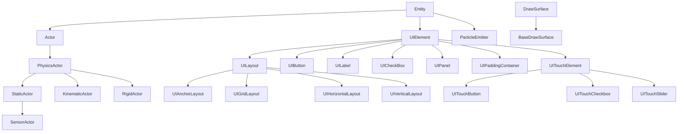

# Architecture Document - PixelRoot32 Game Engine

## Quick Navigation

The architecture documentation is organized into **layers** (hardware to game code) and **subsystem deep dives**.

### Layer Architecture

| Layer | Document | Description |
|-------|----------|-------------|
| **Overview** | [Architecture Overview](./layers-overview.md) | Executive summary, design philosophy, layer diagram |
| **Layer 0** | [Hardware Layer](./layer-hardware.md) | ESP32, displays, audio hardware, PC simulation |
| **Layer 1** | [Driver Layer](./layer-drivers.md) | TFT_eSPI, U8G2, SDL2, AudioBackends |
| **Layer 2** | [Abstraction Layer](./layer-abstraction.md) | DrawSurface, PlatformMemory, Logging, Math |
| **Layer 3** | [System Layer](./layer-systems.md) | Renderer, Audio, Physics, UI subsystems |
| **Layer 4** | [Scene Layer](./layer-scene.md) | Engine, SceneManager, Entity, Actor hierarchy |

### Subsystem Deep Dives

| Subsystem | Document | Description |
|-----------|----------|-------------|
| **Audio NES** | [Audio Subsystem](./audio-subsystem.md) | 4-channel NES-style: shared **`ApuCore`**, `AudioScheduler`, backends — see [Music player guide](../guide/music-player-guide.md), [API Audio](../api/audio.md) |
| **Physics** | [Physics Subsystem](./physics-subsystem.md) | Flat Solver, collisions, CCD (ex-PHYSICS_*) |
| **Memory** | [Memory System](./memory-system.md) | Smart pointers, RAII, ESP32 DRAM (ex-MEMORY_*) |
| **Resolution Scaling** | [Resolution Scaling](./resolution-scaling.md) | Logical vs physical resolution (ex-RESOLUTION_*) |
| **Tile Animation** | [Tile Animation](./tile-animation.md) | Lookup tables, O(1) resolve; see also static layer cache in [ESP32 rendering](#esp32-rendering-pipeline-and-tilemap-caching) (ex-TILE_ANIMATION_*) |
| **Touch Input** | [Touch Input](./touch-input.md) | Pipeline, XPT2046, calibration (ex-TOUCH_INPUT) |
| **Extensibility** | [Extending PixelRoot32](../guide/extending-pixelroot32.md) | Custom drivers, configuration |

### API Reference

For class-level API documentation, see `docs/api/`:

| Module | Document |
|--------|----------|
| Configuration | [config.md](../api/config.md) |
| Math | [math.md](../api/math.md) |
| Core | [core.md](../api/core.md) |
| Physics | [physics.md](../api/physics.md) |
| Graphics | [graphics.md](../api/graphics.md) |
| UI | [ui.md](../api/ui.md) |
| Audio | [audio.md](../api/audio.md) |
| Input | [input.md](../api/input.md) |
| Platform | [platform.md](../api/platform.md) |

**Audio (lectura recomendada):** [Arquitectura audio NES](./audio-subsystem.md) (diseño e implementación) → [API Audio](../api/audio.md) (clases y tipos) → [Music player guide](../guide/music-player-guide.md) (melodías y multi-pista).

---

Narrativa ampliada — resumen ejecutivo, filosofía de diseño, tabla de capas, dependencias entre módulos, rendimiento y ficheros de configuración: **[Layer overview](./layers-overview.md)**. En esta página: tablas de navegación rápida, diagrama de **jerarquía de clases**, matriz de flags **`PIXELROOT32_ENABLE_*`**, y la sección **ESP32 / caché de tilemap**.

---

## Core Class Hierarchy

The diagram below complements **Layer 4** (`Entity` → actors and UI). The `DrawSurface` → `BaseDrawSurface` branch sits in the **abstraction / graphics** side (los drawers concretos están en la capa de drivers). Detalle narrativo: [Scene layer](./layer-scene.md), modelo de capas: [Layer overview](./layers-overview.md).

The following diagram shows the inheritance relationships between the main engine types:

---

## Subsystem Modular Compilation

| Subsystem | Enable Flag | Default |
|-----------|-------------|---------|
| Audio | `PIXELROOT32_ENABLE_AUDIO` | Enabled |
| Physics | `PIXELROOT32_ENABLE_PHYSICS` | Enabled |
| UI System | `PIXELROOT32_ENABLE_UI_SYSTEM` | Enabled |
| Particles | `PIXELROOT32_ENABLE_PARTICLES` | Enabled |
| Touch Input | `PIXELROOT32_ENABLE_TOUCH` | Disabled |
| Tile Animations | `PIXELROOT32_ENABLE_TILE_ANIMATIONS` | Enabled |
| Static tilemap FB snapshot (4bpp) | `PIXELROOT32_ENABLE_STATIC_TILEMAP_FB_CACHE` | Enabled (`PlatformDefaults.h`) |
| Debug Overlay | `PIXELROOT32_ENABLE_DEBUG_OVERLAY` | Disabled |

---

## ESP32 rendering pipeline and tilemap caching

On ESP32 with **TFT_eSPI** (`TFT_eSPI_Drawer`), the logical framebuffer is typically an **8-bit color-depth sprite** (`TFT_eSprite`). Each frame:

1. **`Renderer::beginFrame()`** obtains a pointer to that buffer via **`DrawSurface::getSpriteBuffer()`** (when the driver supports it), clears the buffer, then draws the scene.
2. **2bpp / 4bpp tilemaps and sprites** can write **directly into that buffer** (matching TFT_eSPI’s 8bpp packing for RGB565), avoiding a virtual `drawPixel` per pixel where possible.
3. **`present()` / `sendBuffer()`** converts logical 8bpp rows to **RGB565** using a LUT and pushes pixels to the panel via **DMA** (see [Driver Layer](./layer-drivers.md), [System Layer / Renderer](./layer-systems.md)).

### Static tilemap layer cache (engine + scenes)

The engine provides **`pixelroot32::graphics::StaticTilemapLayerCache`** (`include/graphics/StaticTilemapLayerCache.h`): a **4bpp tilemap** helper that, when **`getSpriteBuffer()`** is non-null, can snapshot the logical framebuffer after drawing a **static** group of **`TileMap4bppDrawSpec`** entries, then on subsequent frames **`memcpy`** that snapshot back and redraw only the **dynamic** group until the **camera sample** (`-getXOffset()`, `-getYOffset()`) changes or **`invalidate()`** runs.

- **Allocation:** **`allocateForLogicalSize`** / **`allocateForRenderer`** in **`Scene::init()`** (about **W×H** bytes via `std::malloc`; not in `draw`/`update`).
- **Opt-out:** build flag **`PIXELROOT32_ENABLE_STATIC_TILEMAP_FB_CACHE=0`**, or **`setFramebufferCacheEnabled(false)`**.
- **Reflection in config:** **`pixelroot32::platforms::config::EnableStaticTilemapFbCache`** (`EngineConfig.h`).

**Example:** **`examples/animated_tilemap`** — **`AnimatedTilemapScene`** owns a **`StaticTilemapLayerCache`**, registers **background** as **static** and **ground + details** as **dynamic** (any split is possible via spec lists).

### Present-path savings (optional)

- **Opción A (implementada):** `Scene::shouldRedrawFramebuffer()` — el **`Engine`** omite **`draw()`** + **`present()`** cuando la escena devuelve `false`. **`AnimatedTilemapScene`** usa firmas de **`TileAnimationManager::getVisualSignature()`** y muestras de cámara para detectar frames sin cambio visual (p. ej. entre avances de frame de animación). Con **`PIXELROOT32_ENABLE_DEBUG_OVERLAY`** el motor **siempre** redibuja para mantener el overlay coherente.
- **Opción B (documentada, no implementada):** **bandas sucias / diff por líneas** dentro de **`TFT_eSPI_Drawer::sendBufferScaled`**: guardar el framebuffer lógico 8 bpp anterior (o comparar por bloques) y emitir **varios** `setAddrWindow` + **`pushPixelsDMA`** solo por bandas que cambiaron. Ahorra SPI cuando una fracción pequeña del panel cambia; coste: RAM extra (~**W×H** bytes para copia) y overhead por múltiples transacciones. Ver [Driver Layer](./layer-drivers.md).

**Game / scene developer contract**

- Call **`invalidate()`** (or a scene wrapper like **`invalidateStaticLayerCache()`**) when something inside the **static** group changes visually, e.g. after **`TileAnimationManager::step(deltaTime)`** on a layer in that group, or when mutating **indices** / **palettes** / **`runtimeMask`** on those maps.
- Layers in the **dynamic** group are drawn every frame on the fast path—no invalidation needed for **`step()`** on **dynamic-only** animators.
- **Scroll:** cache rebuilds when the camera sample changes; no extra invalidation solely for scroll.
- **`getSpriteBuffer() == nullptr`:** full redraw of all groups every frame; no snapshot used.

For animation data flow and linking managers to tilemaps, see [Tile Animation](./tile-animation.md). API surface: [API Reference — ESP32 graphics / tilemap cache](../api/graphics.md#multi-layer-4bpp-tilemap-framebuffer-snapshot-statictilemaplayercache).

---

## Related Documentation

| Document | Description |
|----------|-------------|
| [API Reference](../api/index.md) | Complete API documentation index |
| [Getting Started](../guide/getting-started.md) | First steps with the engine |
| [Style Guide](../reference/style-guide.md) | Coding conventions |
| [Platform Compatibility](../reference/platform-compatibility.md) | Supported hardware matrix |
| [Testing Guide](../reference/testing-guide.md) | Unit and integration testing |
| [Migration Guides](../migration/migration-v1-0-0.md) | Version upgrade guides |
| [MusicPlayer Guide](../guide/music-player-guide.md) | Música de fondo, multi-pista, tempo/BPM |
