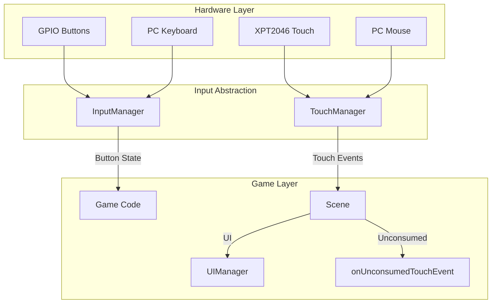

# Touch Input Architecture

This document describes how resistive and capacitive touch integrate with PixelRoot32: data flow, calibration, and platform responsibilities.

For public API details (methods, parameters), see [API Reference — Input Module](API_REFERENCE.md#touch-input-overview).

## 1. Design principles

- **Touch is optional.** Enable with `PIXELROOT32_ENABLE_TOUCH=1` in build flags (default: disabled). Saves ~200 bytes when disabled.
- **Engine optionally owns touch processing.** When `PIXELROOT32_ENABLE_TOUCH=1` and `setTouchManager()` is called, Engine automatically processes touch events in `Engine::update()` and sends them to `Scene::processTouchEvents()`. When disabled or unset, use the manual integration pattern (section 4).
- **Single coordinate space.** After the active adapter runs, coordinates are **screen pixels** in the same range as `PHYSICAL_DISPLAY_WIDTH` × `PHYSICAL_DISPLAY_HEIGHT` (or your `TouchManager` constructor bounds). Game logic, UI hit tests, and debug overlays should use this space.
- **UI before gameplay.** `Scene::processTouchEvents` runs `UIManager::processEvents` first (when `PIXELROOT32_ENABLE_UI_SYSTEM`), marks events **consumed**, then invokes `onUnconsumedTouchEvent` for each remaining event.
- **Scene owns touch widgets.** Construct `UITouchButton` / `UITouchSlider` / `UITouchCheckbox` (and layouts) in `init()`, keep them in `std::unique_ptr` or the scene arena, call `UIManager::addElement` for hit testing and dispatch, and `addEntity` on a layout (or entity) so `update` / `draw` run with the rest of the scene. `UIManager` does not allocate or destroy widgets.

## 2. Pipeline (high level)

### With Engine Integration (`PIXELROOT32_ENABLE_TOUCH=1` + `setTouchManager()`)

```text
Hardware (XPT2046, GT911, …)
    → Adapter readImpl()  [median sample, optional GPIO bit-bang SPI]
    → TouchCalibration / compile-time calibration macros
    → TouchPoint (x, y, pressed)
    → TouchManager::update()
         → clamp to display bounds
    → TouchManager::getTouchPoints()
    → Engine::setTouchManager(&touchManager) [called once in setup()]
    → Engine::update() [automatic each frame]
         → Engine polls getTouchPoints()
         → Detects release (count: >0 → 0)
         → TouchEventDispatcher processes points (gestures: down, drag, up, …)
    → Scene::processTouchEvents()
         → UIManager (optional)
         → onUnconsumedTouchEvent()
```

### Input abstraction (buttons + touch + PC)



### Without Engine Integration (`PIXELROOT32_ENABLE_TOUCH=0`)

```text
Hardware (XPT2046, GT911, …)
    → TouchManager::update()
    → TouchManager::getTouchPoints()  [only raw active touches]
    → Manual release detection required (track state externally)
    → Manual touch injection to engine.getTouchDispatcher()
    → Scene::processTouchEvents()  [manual call in user loop]
         → UIManager (optional)
         → onUnconsumedTouchEvent()
```

Optional gameplay layer: **`ActorTouchController`** consumes `TouchEvent`s in `onUnconsumedTouchEvent` to drag registered `Actor`s (hit test, drag threshold, position update).

## 3. Key components

| Component | Role |
|-----------|------|
| `TouchManager` | Polls adapter, clamps points, exposes `getTouchPoints()`. |
| `TouchCalibration` | `forResolution(w,h)`, `transform`, rotation; shared with adapter via `setCalibration`. |
| `XPT2046Adapter` | ESP32 XPT2046: shared TFT SPI or **GPIO bit-bang** (`XPT2046_USE_GPIO_SPI`) for boards like ESP32-2432S028R. |
| `TouchEventDispatcher` (in Engine) | Converts point stream into `TouchEvent` gestures (`TouchDown`, `DragMove`, `TouchUp`, …). |
| `ActorTouchController` | Drags actors from touch; optional **hit slop** for resistive alignment. |
| `Scene::processTouchEvents` | Central entry for a frame's touch batch; runs `UIManager::processEvents` then virtual `onUnconsumedTouchEvent`. |
| `UIManager` | Non-owning registry (`addElement`); `processEvents` calls `UITouchElement::processEvent`. Does not draw or own widget memory. |

## 4. Per-frame integration (recommended)

Call **once per frame**, in order:

1. `touchManager.update(deltaTimeMs);`
2. `TouchEvent buf[TOUCH_EVENT_QUEUE_SIZE];`
3. `uint8_t n = touchManager.getEvents(buf, …);`
4. If `n > 0` and a scene is active: `scene->processTouchEvents(buf, n);`
5. `engine.run();` (or your update/draw split).

Touch is intentionally processed **before** `engine.run()` in this pattern so gameplay reacts in the same frame as the sample.

## 5. Initialization order (critical on ESP32)

`TouchManager::init()` forwards the internal `TouchCalibration` to the adapter. The default `TouchCalibration` struct uses **320×240** defaults until you call `forResolution`.

**Always** set calibration for your real panel **before** `init()`:

```cpp
TouchCalibration cal = TouchCalibration::forResolution(PHYSICAL_DISPLAY_WIDTH, PHYSICAL_DISPLAY_HEIGHT);
touchManager.setCalibration(cal);
touchManager.init();
```

Wrong dimensions break horizontal mirror span (`displayWidth - x`), raw-to-screen mapping width/height, and clamping.

## 6. XPT2046 GPIO path (e.g. Sunton 2432S028R / CYD)

When `-D XPT2046_USE_GPIO_SPI` is set, the adapter uses a separate bit-banged bus (pins overridable via `XPT2046_GPIO_*` macros). After reading raw ADC channels and optional axis swap, coordinates go through this **order** (see `XPT2046Adapter.cpp`):

1. Map to screen (either `TouchCalibration::transform` **or** linear `XPT2046_GPIO_USE_RAW_RANGE` using `XPT2046_RAW_*_LO` / `HI`).
2. Optional `XPT2046_GPIO_VENDOR_COORDS` rotation-style swap.
3. **`XPT2046_GPIO_MIRROR_X`** — horizontal flip in screen space (`x = displayWidth - x`).
4. **`XPT2046_CAL_OFFSET_X` / `Y`** — final nudge in **post-mirror** pixels.
5. Clamp to `calibration.displayWidth` / `displayHeight`.

Typical alignment flags for CYD-class boards (exact values are project-specific):

- `XPT2046_GPIO_SWAP_AXES` — finger vertical/horizontal matched wrong screen axes.
- `XPT2046_GPIO_MIRROR_X` — left/right inverted after swap.
- `XPT2046_GPIO_USE_RAW_RANGE` — map real ADC span to full screen instead of assuming 0–4095.

## 7. Gameplay hit testing and slop

Resistive stacks often report a cluster of pixels offset from the visible sprite. **`ActorTouchController::setTouchHitSlop(n)`** expands the hit rectangle by `n` pixels per side for picking only (not rendering).

## 8. Cross-platform vs. board-specific configuration

To port touch features to a new board, it's important to understand which parts of this architecture apply generally and which are specific to particular hardware setups.

### Generic engine components (apply to all boards)

The following aspects of the touch system are hardware-agnostic and work exactly the same regardless of your board:

- **The data flow**: `TouchManager` -> `TouchEventDispatcher` -> `Scene::processTouchEvents` -> UI/Gameplay.
- **The coordinate space**: Your game logic always receives touch events in scaled screen pixels.
- **Gameplay tools**: `ActorTouchController` and its hit-slop mechanics work identically on any touchscreen.
- **Initialization**: You must always call `TouchCalibration::forResolution` and `touchManager.setCalibration()` **before** `touchManager.init()`.

### Hardware-specific configuration (board-dependent)

The underlying driver and its build flags vary drastically by device. You cannot copy-paste the `platformio.ini` touch flags from one board to another and expect them to work without adjustment.

**Example 1: ESP32-2432S028R (CYD)**
This board uses an XPT2046 resistive touch controller on a **separate bit-banged GPIO bus**, not the main TFT SPI bus. It requires specific macro overrides:

- `-D TOUCH_DRIVER_XPT2046`
- `-D XPT2046_USE_GPIO_SPI`
- Specific pins (`XPT2046_GPIO_MOSI`, etc.)
- Panel-specific tuning (`XPT2046_GPIO_SWAP_AXES`, `XPT2046_GPIO_MIRROR_X`, `XPT2046_GPIO_USE_RAW_RANGE`).

**Example 2: A standard ESP32 with shared SPI XPT2046**
Many TFT shields share the main SPI bus for both the display and the touch controller.

- You would **not** use `XPT2046_USE_GPIO_SPI`.
- The `TFT_eSPI` library typically handles the low-level SPI sharing via the `TFT_eSPI_TouchBridge` or built-in calibration.
- You only need `-D TOUCH_DRIVER_XPT2046` and `-D PIXELROOT32_USE_TFT_ESPI_DRIVER`.

**Example 3: A capacitive touchscreen (e.g., GT911)**
Capacitive screens use I²C and usually report perfect screen coordinates out of the box, requiring no axis swapping or offset calibration.

- You would use `-D TOUCH_DRIVER_GT911` instead.
- Resistive calibration flags (like `SWAP_AXES` or `MIRROR_X`) are not used.

## 10. Engine Integration

When `PIXELROOT32_ENABLE_TOUCH=1`, Engine automatically handles touch processing, eliminating the need for manual integration in your game loop.

### 10.1 Automatic Touch (PIXELROOT32_ENABLE_TOUCH=1 + setTouchManager)

With the flag enabled and `setTouchManager()` called, Engine automatically:

1. **Connects** `SDL2_Drawer` to the touch dispatcher on init (Native only)
2. **Polls** `touchManager.getTouchPoints()` each frame in `Engine::update()`
3. **Detects releases** when count goes from >0 to 0
4. **Processes** gesture events through internal `TouchEventDispatcher`
5. **Dispatches** to `Scene::processTouchEvents()` each frame

**Native (PC):**
```cpp
// No manual setup needed - Engine handles it automatically
Engine engine(displayConfig, inputConfig);
engine.init();
engine.setScene(&myScene);
engine.run();  // Mouse events → touch events automatically
```

**ESP32 - Using setTouchManager (recommended):**
```cpp
// En setup():
touchManager.init();
engine.setTouchManager(&touchManager);  // 1 línea

// En loop():
touchManager.update(frameDt);
engine.run();  // Engine maneja todo automáticamente
```

The developer no longer needs to manually inject touch points or track release state - Engine handles it all internally.

### 10.2 Manual Touch (legacy, without setTouchManager)

When `PIXELROOT32_ENABLE_TOUCH=1` but `setTouchManager()` is not called, you can manually inject touch points:

```cpp
void loop() {
    touchManager.update(frameDt);
    
    TouchPoint points[TOUCH_MAX_POINTS];
    uint8_t count = touchManager.getTouchPoints(points);
    
    static bool wasTouching = false;
    static int16_t lastX = 0, lastY = 0;
    
    auto& dispatcher = engine.getTouchDispatcher();
    
    if (count > 0) {
        for (uint8_t i = 0; i < count; i++) {
            dispatcher.processTouch(points[i].id, true, points[i].x, points[i].y, points[i].ts);
        }
        wasTouching = true;
        lastX = points[0].x;
        lastY = points[0].y;
    } else if (wasTouching) {
        dispatcher.processTouch(0, false, lastX, lastY, millis());
        wasTouching = false;
    }
    
    engine.run();
}
```

> **Note**: Using `setTouchManager()` (section 10.1) is recommended instead of this manual pattern.

### 10.3 InputManager Touch API (Native only)

When `PIXELROOT32_ENABLE_TOUCH=1`, InputManager provides mouse-to-touch conversion for Native platforms:

- **`processSDLEvent(const SDL_Event& event)`**: Converts SDL mouse events to touch events (Native only).

### 10.4 SDL2_Drawer Touch Integration

On Native (PC), `SDL2_Drawer` automatically converts mouse events to touch events for compatibility with touch UI widgets. This happens automatically when `PIXELROOT32_ENABLE_TOUCH=1`.

```cpp
// Automatic during init when PIXELROOT32_ENABLE_TOUCH=1
// SDL2_Drawer connects to Engine's touchDispatcher

// Mouse → touch coordinate conversion happens internally
// Coordinates are mapped to the logical display resolution
```

## 11. Related documentation

- [API Reference — Touch Input](API_REFERENCE.md#touch-input-overview)
- [Architecture — InputManager](ARCHITECTURE.md) (subsection documents touch parallel path)
- `include/core/Engine.h` — documented touch loop contract in class comment
