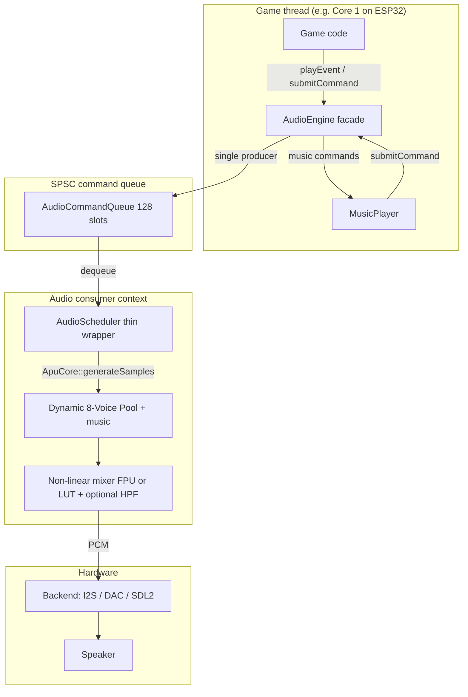

# Audio System

PixelRoot32 provides a **NES-like** audio subsystem: a **dynamic 8-voice pooling system** (supporting Pulse, Triangle, Noise, Sine, and Saw waveforms), **mono** 16-bit output, **event-driven** playback (`AudioEvent`), and **sample-accurate** timing decoupled from the game frame rate. There is **no DMC/sample channel** in the current engine.

For implementation details, see [Audio subsystem](../architecture/audio-subsystem.md) (authoritative).

## Architecture Overview



- **`AudioEngine`** forwards commands and **`generateSamples`** to the active **`AudioScheduler`**, which delegates to **`ApuCore`**: SPSC queue, dynamic 8-voice pool, music sequencer, mixing, and (on the FPU path) a one-pole output HPF. Synthesis is not duplicated across three scheduler copies.
- On **ESP32**, core affinity and task priority are applied when the **backend** creates its FreeRTOS task (`PlatformCapabilities`), not inside `ESP32AudioScheduler` construction arguments (those parameters are reserved for API stability).

## Key Features

| Feature | Description |
|--------|-------------|
| **8 voices** | Dynamic voice pooling with stealing logic. Supports Pulse, Triangle, Noise, Sine, and Saw. |
| **Sample-accurate** | Channel lifetime in samples; independent of FPS |
| **Schedulers** | `NativeAudioScheduler` (PC), `ESP32AudioScheduler` (firmware), `DefaultAudioScheduler` (tests / callback-driven) |
| **Command path** | Lock-free **SPSC** ring buffer, **128** entries; one producer / one consumer |
| **Mixer** | Soft saturation (FPU) or **LUT** (no-FPU, e.g. ESP32-C3) |
| **Multi-track music** | Up to **`MAX_MUSIC_TRACKS` (4)**: main `MusicTrack` + optional **`secondVoice`**, **`thirdVoice`**, **`percussion`**; `MusicPlayer::play` packs them into **`AudioCommand::subTracks`** |
| **NES-style timing** | Sequencer in **`ApuCore`** uses **tick** steps derived from **sample time** and **BPM** (default **150** BPM, **4 ticks per beat**); not tied to render FPS |
| **BPM & tempo** | **`MusicPlayer::setBPM` / `getBPM`** and **`setTempoFactor`** → `MUSIC_SET_BPM` / `MUSIC_SET_TEMPO` |
| **Percussion presets** | **`INSTR_KICK`**, **`INSTR_SNARE`**, **`INSTR_HIHAT`** (`duty == 0`, **`WaveType::NOISE`**, `noisePeriod` / `defaultDuration` in **`InstrumentPreset`**) |

## Quick start: sound effects

Use **`AudioEngine::playEvent`** with an **`AudioEvent`** (`#include <audio/AudioEngine.h>`, `<audio/AudioTypes.h>`):

```cpp
#if PIXELROOT32_ENABLE_AUDIO
#include <audio/AudioEngine.h>
#include <audio/AudioTypes.h>

void playCoin(pr32::core::Engine& engine) {
    pr32::audio::AudioEvent evt{};
    evt.type = pr32::audio::WaveType::PULSE;
    evt.frequency = 1500.0f;
    evt.duration = 0.12f;
    evt.volume = 0.8f;
    evt.duty = 0.5f;
    engine.getAudioEngine().playEvent(evt);
}
#endif
```

### Wave types (`WaveType`)

| Type | Role |
|------|------|
| `PULSE` | Square wave; use **`duty`** (e.g. 0.125, 0.25, 0.5) |
| `TRIANGLE` | Triangle wave; **`duty`** unused |
| `NOISE` | See **Noise channel semantics** below |

### Noise channel semantics

- **`frequency`** on a **NOISE** event does **not** set musical pitch in **`ApuCore`**. It drives the **noise clock**: default period in samples is `sample_rate / max(frequency, 1 Hz)` when `noisePeriod == 0`. Lower values → coarser / more “hit-like”; higher values → denser noise. Use **`noisePeriod`** for fixed percussion periods.
- **All platforms** share the same **15-bit NES-style LFSR** inside **`ApuCore`**; step rate follows `noisePeriodSamples` / `noiseCountdown` (and `AudioEvent`), not `rand()`.

### Master volume

```cpp
engine.getAudioEngine().setMasterVolume(0.75f);
float v = engine.getAudioEngine().getMasterVolume();
```

Per-channel volume is set per **`AudioEvent::volume`**; there are no separate `setChannelVolume` APIs in the core engine.

## Music (`MusicPlayer`)

Sequencing is **sample-accurate** and **tick-based** inside **`ApuCore`**. **`MusicPlayer`** only **enqueues** `AudioCommand`s (`MUSIC_PLAY`, tempo/BPM, pause/resume, stop). See **[Music Player API](../api/audio.md#playing-music)** and the long-form **[Music player guide](./music-player-guide.md)**.

### Multi-track layout

Point optional **`MusicTrack`** pointers from the **main** track: **`secondVoice`**, **`thirdVoice`**, **`percussion`**. Each sub-track has its own `notes`, `loop`, `channelType`, and `duty` (e.g. melody on **PULSE**, drums on **NOISE**). **`MusicPlayer::getActiveTrackCount()`** returns how many layers were requested on the last **`play()`** (1–4).

### Example project

The engine’s **`music_demo`** sample showcases **multi-track** arrangements, **instrument presets**, and melodies: [`examples/music_demo`](https://github.com/PixelRoot32-Game-Engine/PixelRoot32-Game-Engine/tree/main/examples/music_demo) (PlatformIO). Also see **`tic_tac_toe`** / **`brick_breaker`** for lighter music use ([Audio samples](/examples/audio-playback)).

```cpp
#include <audio/MusicPlayer.h>
#include <audio/AudioMusicTypes.h>

using namespace pixelroot32::audio;

static const MusicNote MELODY[] = {
    makeNote(INSTR_PULSE_LEAD, Note::C, 0.20f),
    makeNote(INSTR_PULSE_LEAD, Note::E, 0.20f),
    makeRest(0.10f),
};

static const MusicTrack GAME_MUSIC = {
    MELODY,
    sizeof(MELODY) / sizeof(MusicNote),
    true,              // loop
    WaveType::PULSE,
    0.5f               // duty for pulse tracks
};

void MyScene::init(pr32::core::Engine& engine) {
    engine.getMusicPlayer().play(GAME_MUSIC);
}
```

The music sequencer lives in **`ApuCore`**. If the audio consumer stops running for a long time (debugger, host suspend), the next **`generateSamples`** may advance **many ticks in one block** (more CPU in that step; there is no fixed per-quantum note cap).

## Command queue and thread safety

- Only **one thread** should call **`playEvent`**, **`setMasterVolume`**, **`MusicPlayer`**, and **`submitCommand`** (SPSC contract).
- If the queue is **full**, the newest command is **dropped**. **`ApuCore`** increments an atomic drop counter and may emit a **throttled** warning when **`PIXELROOT32_DEBUG_MODE`** is defined. Avoid enqueue storms without the audio thread draining the queue.

## Audio configuration

Backends are **concrete objects** passed by pointer on **`AudioConfig`**, not an enum:

```cpp
#include <audio/AudioConfig.h>
#include <drivers/esp32/ESP32_I2S_AudioBackend.h>

pr32::drivers::esp32::ESP32_I2S_AudioBackend audioBackend(26, 25, 22, 22050);
pr32::audio::AudioConfig audioConfig;
audioConfig.backend = &audioBackend;
audioConfig.sampleRate = 22050;
audioConfig.blockSize = 128; // Optional: tune for platform latency (e.g., 128 for ESP32-C3, 256 for FPU)

pr32::core::Engine engine(displayConfig, inputConfig, audioConfig);
```

See **[AudioEngine](../api/audio.md)** for **`AudioConfig`** fields and architecture links.

## Platform differences

| Platform | Mixer | Noise (typical) | Audio execution |
|----------|--------|-----------------|-----------------|
| **ESP32 (FPU)** | Float + soft clip + HPF | Clocked LFSR | Backend task; core from `PlatformCapabilities` |
| **ESP32-C3 (no FPU)** | LUT + Q15 Fixed-Point HPF | Clocked LFSR + Q15 LFO | Same; integer path with Q15 LFO and HPF, static function pointer dispatch for wave generation |
| **PC (native)** | Float + soft clip + HPF | Same LFSR as firmware | `std::thread` + ring buffer → SDL2 callback |

## Best practices

- Keep SFX **`duration`** short when possible; only **four** logical channels exist, with **voice stealing** among channels of the same `WaveType`.
- Use **NOISE** **`frequency`** / **`noisePeriod`** to shape **percussion vs hiss** (see above); for authored drums prefer **`INSTR_*`** presets on a **`percussion`** sub-track.
- Do **not** rely on multiple threads calling **`playEvent`** without a different queue design.
- Test on **real hardware**; buffer sizes and backend (I2S vs DAC) affect latency.

## Next steps

- **[Audio architecture](../architecture/audio-subsystem.md)** — Subsystem narrative (kept in sync with the engine)
- **[AudioEngine & types](../api/audio.md)** — Methods, `AudioEvent`, `AudioCommand`, `AudioConfig`, music transport queries
- **[AudioScheduler](../api/audio.md#architecture-notes)** — Schedulers vs **`ApuCore`**
- **[MusicPlayer](../api/audio.md#playing-music)** — Tracks, presets, tempo/BPM
- **Engine source:** [`ApuCore.h` / `ApuCore.cpp`](https://github.com/PixelRoot32-Game-Engine/PixelRoot32-Game-Engine/tree/main/include/audio) — authoritative implementation
