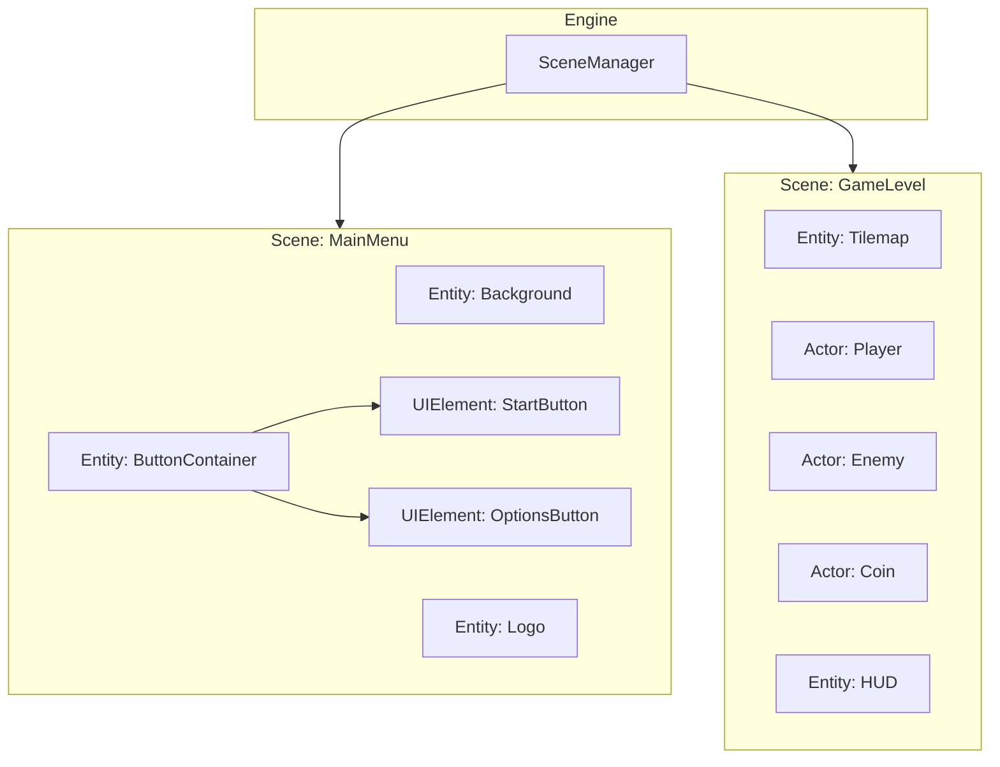
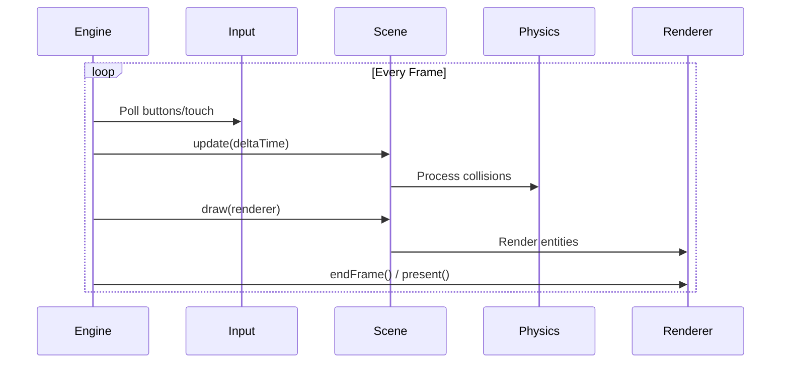
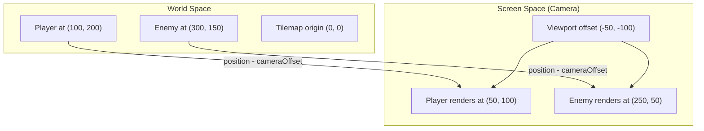
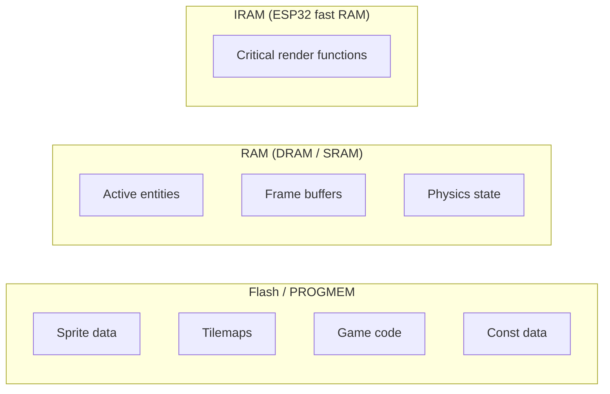

# Core Concepts

Understanding PixelRoot32's core architecture enables you to build games efficiently. This section explains the fundamental concepts that form the foundation of the engine.

## Scene-Based Architecture

PixelRoot32 uses a scene-based architecture inspired by Godot Engine. Games are organized as a collection of **scenes**, each containing a hierarchy of **entities**.



### Scene

A `Scene` represents a distinct game state: a menu, a level, a cutscene, or any screen. Scenes manage a collection of entities and coordinate the game loop within that context.

```cpp
class MyScene : public core::Scene {
public:
    void init() override;
    void update(unsigned long deltaTime) override;
    void draw(graphics::Renderer& renderer) override;
};
```

Key responsibilities:
- **Entity management**: Adding, removing, and updating entities
- **Lifecycle**: `init()` on entry, cleanup on exit
- **Rendering**: Coordinate drawing of all visible entities
- **Physics**: Run collision detection (if enabled)

### Entity

An `Entity` is any object that exists in a scene. It has a position, size, and lifecycle methods. Entities are the basic building blocks—players, enemies, UI elements, or invisible controllers.

```cpp
class Entity {
    math::Vector2 position;    // World position
    int width, height;         // Bounds
    EntityType type;           // Classification
    
    virtual void update(unsigned long deltaTime) = 0;
    virtual void draw(graphics::Renderer& renderer) = 0;
};
```

Entity types:
- `GENERIC`: Static objects, UI, visual effects
- `ACTOR`: Physics-enabled entities that can collide
- `UI_ELEMENT`: Interactive interface components

### Actor

An `Actor` extends `Entity` with collision capabilities. Actors participate in the physics system, can detect collisions, and move through the world.

```cpp
class Player : public core::Actor {
public:
    Player() : Actor(100, 100, 16, 16) {
        setCollisionLayer(physics::DefaultLayers::kPlayer);
        setCollisionMask(physics::DefaultLayers::kEnvironment);
    }
    
    void onCollision(core::Actor* other) override {
        // Handle collision with other actors
    }
};
```

## Game Loop Lifecycle

The game loop is the heartbeat of your game. PixelRoot32's loop is structured for predictability and performance:



### Phase Breakdown

| Phase | Method | Description |
|-------|--------|-------------|
| **Input** | `InputManager::update()` | Read button states, touch events |
| **Update** | `Scene::update()` → `Entity::update()` | Game logic, AI, movement |
| **Physics** | `CollisionSystem::process()` | Detect and resolve collisions |
| **Draw** | `Scene::draw()` → `Entity::draw()` | Render to framebuffer |
| **Present** | `Renderer::endFrame()` | Send to display via DMA |

### Delta Time

All update methods receive `deltaTime`—the milliseconds since the last frame. Use this for frame-rate independent movement:

```cpp
void update(unsigned long deltaTime) override {
    // Move 100 pixels per second, regardless of FPS
    position.x += velocityX * deltaTime / 1000.0f;
}
```

## Coordinate Systems

PixelRoot32 uses two coordinate spaces:



### World Space

- Fixed coordinate system where game objects exist
- Positions persist across frames
- Used for physics, gameplay logic

### Screen Space

- Transformed by camera offset
- What the player actually sees
- Used for rendering, culling

### Camera System

```cpp
// Set camera position (typically player-centered)
renderer.setDisplayOffset(-player->position.x + screenWidth/2, 
                          -player->position.y + screenHeight/2);

// Fixed-position UI (bypass camera)
renderer.setOffsetBypass(true);
renderer.drawText("Score: 100", 10, 10, Color::WHITE, 1);
renderer.setOffsetBypass(false);
```

## Render Layers

Entities are drawn in layer order (0 = bottom, higher = top):

```cpp
// Background layer
background->setRenderLayer(0);

// Game objects layer
player->setRenderLayer(1);
enemy->setRenderLayer(1);

// UI/HUD layer
hud->setRenderLayer(2);
```

::: tip Performance
Group entities by layer to minimize state changes. The engine sorts entities by layer each frame when needed.
:::

## Memory Model

PixelRoot32 is designed for memory-constrained environments:



### Key Principles

1. **Zero allocation during game loop**: Pre-allocate in `init()`, never in `update()` or `draw()`
2. **Object pooling**: Reuse objects instead of creating/destroying
3. **PROGMEM for static data**: Store sprites, tilemaps in flash
4. **Smart pointers**: Use `std::unique_ptr` for ownership management

```cpp
// Good: Pre-allocate in init()
void init() override {
    // Allocate once
    player = std::make_unique<Player>(100, 100);
    addEntity(player.get());
}

// Bad: Allocating every frame
void update(unsigned long dt) override {
    auto bullet = new Bullet();  // Never do this!
    addEntity(bullet);
}
```

## Subsystem Architecture

PixelRoot32 uses a modular architecture where subsystems can be enabled or disabled at compile time:

| Subsystem | Enable Flag | Default |
|-----------|-------------|---------|
| Audio | `PIXELROOT32_ENABLE_AUDIO` | Enabled |
| Physics | `PIXELROOT32_ENABLE_PHYSICS` | Enabled |
| UI System | `PIXELROOT32_ENABLE_UI_SYSTEM` | Enabled |
| Particles | `PIXELROOT32_ENABLE_PARTICLES` | Enabled |
| Touch Input | `PIXELROOT32_ENABLE_TOUCH` | Disabled |
| Tile Animations | `PIXELROOT32_ENABLE_TILE_ANIMATIONS` | Enabled |

This modular design reduces firmware size when features aren't needed:

```ini
; platformio.ini - minimal build without audio
build_flags =
    -std=gnu++17
    -fno-exceptions
    -DPIXELROOT32_ENABLE_AUDIO=0
    -DPIXELROOT32_ENABLE_PARTICLES=0
```

## Next Steps

- **[Game Loop](./game-loop.md)** — Deep dive into the update/render cycle
- **[Scenes](./scenes.md)** — Scene management and transitions
- **[Entities & Actors](./entities-actors.md)** — Creating game objects
- **[Architecture Index](../architecture/architecture-index.md)** — Engine design patterns
