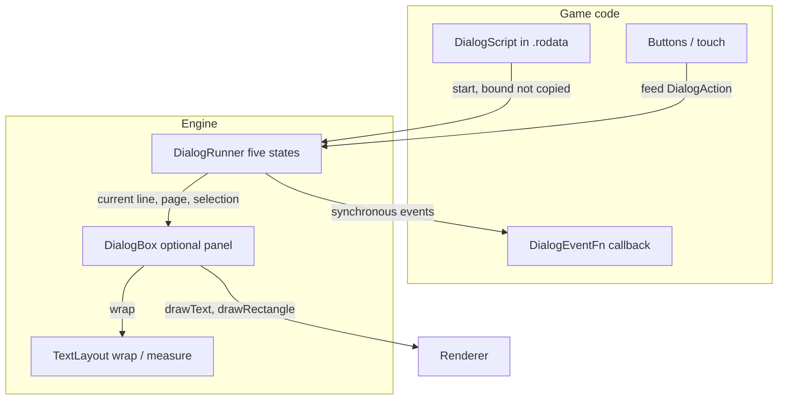

# Dialog System

PixelRoot32 ships dialog as **three independent pieces**, not one widget: **`TextLayout`** wraps and measures text, **`DialogRunner`** is a headless five-state machine over a script, and **`DialogBox`** is an optional default panel. A game can take all three, or take the runner alone and draw its own presentation. The script itself is **caller-owned `const` data in flash**: nothing is copied, nothing is heap-allocated, and no piece owns another.

Available from **1.11.0**, behind **`PIXELROOT32_ENABLE_DIALOG`** (default **0**).

## Architecture



| Piece | Header | Depends on | Why it is separate |
|-------|--------|------------|--------------------|
| **`TextLayout`** | `graphics/TextLayout.h` | `FontManager` only | **Not** behind `PIXELROOT32_ENABLE_DIALOG`. Glyph-accurate wrap and measure are useful to any HUD or menu, so they are always available. |
| **`DialogRunner`** | `gameplay/DialogRunner.h` | Nothing | No `Renderer`, no `InputManager`, no `Font`. It consumes semantic actions and knows nothing about pixels, so a game with its own presentation can adopt it alone. |
| **`DialogBox`** | `graphics/DialogBox.h` | `DialogRunner`, `TextLayout`, `Font` | Deliberately **not** a `UIElement`: it must work with `PIXELROOT32_ENABLE_UI_SYSTEM=0`, and it allocates nothing. With UI enabled there are two panel paths — `DialogBox` for dialog, `UIPanel` for structured HUDs (see [UI system](./ui-system.md)). |

**Ownership rule:** `DialogRunner::start()` binds the script by pointer. The `DialogScript`, its `DialogLine` array, its `DialogChoice` array and every `const char*` inside them **must outlive every runner started against them**. Declare them `static const` at namespace scope so they land in `.rodata`.

## Enabling dialog

```ini
; platformio.ini
build_flags =
    -D PIXELROOT32_ENABLE_DIALOG=1
```

One flag gates all three dialog headers (`gameplay/DialogTypes.h`, `gameplay/DialogRunner.h`, `graphics/DialogBox.h`). `TextLayout` needs no flag.

```cpp
#include <gameplay/DialogRunner.h>
#include <gameplay/DialogTypes.h>
#include <graphics/DialogBox.h>
```

## Authoring a script

A script is three plain tables. Nothing here is a class; everything is POD in flash.

```cpp
namespace gameplay = pixelroot32::gameplay;

constexpr const char* kGuide = "Guide";

static const gameplay::DialogChoice kChoices[] = {
    // text            next   tag
    {"Say hello",      3,     101},
    {"Ask a riddle",   4,     102},
    {"Walk away",      5,     103},
};

static const gameplay::DialogLine kLines[] = {
    // text, speaker, next, tag, autoAdvanceMs, firstChoice, choiceCount, kind, flags
    // 0: auto-advances on its own timer after 1800 ms.
    {"Welcome to the dialog demo.", kGuide, 1, 0, 1800, 0, 0, gameplay::LineKind::Text, 0},
    // 1: waits for the player (autoAdvanceMs == 0).
    {"Now try a choice.",           kGuide, 2, 0,    0, 0, 0, gameplay::LineKind::Text, 0},
    // 2: three options, branching to three endings. `next` is unused here.
    {"What do you do?",             kGuide, gameplay::kNoLine, 0, 0, 0, 3,
     gameplay::LineKind::Choice, 0},
    // 3-5: one ending per option, all rejoining at the End line.
    {"Hello to you too!",           kGuide, 6, 0, 0, 0, 0, gameplay::LineKind::Text, 0},
    {"Why did the chicken cross?",  kGuide, 6, 0, 0, 0, 0, gameplay::LineKind::Text, 0},
    {"You walk away in silence.",   kGuide, 6, 0, 0, 0, 0, gameplay::LineKind::Text, 0},
    // 6: End.
    {nullptr, nullptr, gameplay::kNoLine, 0, 0, 0, 0, gameplay::LineKind::End, 0},
};

static const gameplay::DialogScript kScript{
    kLines, kChoices,
    static_cast<uint16_t>(sizeof(kLines) / sizeof(kLines[0])),
    static_cast<uint16_t>(sizeof(kChoices) / sizeof(kChoices[0]))};
```

### `DialogLine`

| Field | Type | Meaning |
|-------|------|---------|
| `text` | `const char*` | Flash literal. `nullptr` for a choice-only or `End` line. |
| `speaker` | `const char*` | `nullptr` means no speaker row. |
| `next` | `LineId` | `LineKind::Text` only. `kNoLine` finishes the dialog. |
| `tag` | `uint16_t` | Opaque to the engine, carried on `LineEnter`. **`0` is a legal tag.** |
| `autoAdvanceMs` | `uint16_t` | `0` waits for the player (`AwaitingAdvance`); non-zero ticks in `update()` (`ShowingText`). |
| `firstChoice` | `ChoiceId` | Index into `DialogScript::choices`. Must stay **below 255**. |
| `choiceCount` | `uint8_t` | Clamped to `DialogMaxChoices`, to the table, and below 255. |
| `kind` | `LineKind` | `Text`, `Choice` or `End`. The discriminator — never inferred from which fields are populated. |
| `flags` | `uint8_t` | `kLineFlagAllowCancel` (`0x01`). Unknown bits are **ignored, not rejected**, so a script stays forward-compatible with an older runner. |

### `DialogChoice`

| Field | Type | Meaning |
|-------|------|---------|
| `text` | `const char*` | Flash literal. Never copied, never wrapped. |
| `next` | `LineId` | `kNoLine` ends the dialog. |
| `tag` | `uint16_t` | Opaque to the engine, carried on `ChoiceConfirmed`. |

### Sentinels and kinds

- **`kNoLine`** (`0xFFFF`) — "no next line". On `DialogLine::next` or `DialogChoice::next` it finishes the dialog.
- **`kNoChoice`** (`0xFF`) — "no choice". This is why a line may never address a choice at or past index 255.
- **`LineKind::Text`** enters `ShowingText` when `autoAdvanceMs > 0`, otherwise `AwaitingAdvance`.
- **`LineKind::Choice`** enters `ShowingChoices` directly. Its `next` is unused — branching comes from each `DialogChoice::next`.
- **`LineKind::End`** finishes the dialog on entry.

### `kLineFlagAllowCancel`

Set this bit to let `DialogAction::Cancel` act on a **`Choice`** line. It is the only defined flag bit, and it has no effect on `Text` lines — `Cancel` is already a no-op there.

```cpp
{"Buy something?", kShopkeeper, gameplay::kNoLine, 0, 0, 0, 3,
 gameplay::LineKind::Choice, gameplay::kLineFlagAllowCancel},
```

Read [what Cancel actually does](#cancel-does-not-end-the-dialog) before you rely on it.

## Driving the runner

```cpp
runner.configure(this, &MyScene::onDialogEvent);  // owner + plain function pointer
runner.start(kScript, /* first = */ 0);           // binds the script, enters line 0
```

Then, once per frame:

```cpp
void MyScene::update(unsigned long deltaTime) {
    auto& input = engine.getInputManager();

    if (input.isButtonPressed(BTN_UP))      runner.feed(gameplay::DialogAction::Up);
    if (input.isButtonPressed(BTN_DOWN))    runner.feed(gameplay::DialogAction::Down);
    if (input.isButtonPressed(BTN_CONFIRM)) runner.feed(gameplay::DialogAction::Confirm);
    if (input.isButtonPressed(BTN_CANCEL))  runner.feed(gameplay::DialogAction::Cancel);

    runner.update(deltaTime);  // ticks autoAdvanceMs; no-op outside ShowingText
}
```

`DialogAction` is deliberately abstracted away from physical input, so the same runner works from touch or from buttons. Your game translates its own input into an action before calling `feed()`.

### The five states

| State | Meaning | What moves it |
|-------|---------|---------------|
| `Inactive` | Not started, or stopped. | `start()` |
| `ShowingText` | Text line with `autoAdvanceMs > 0`. | `update(dt)`, or `Advance` / `Confirm` |
| `AwaitingAdvance` | Text line with `autoAdvanceMs == 0`. | `Advance` / `Confirm` only — never the clock |
| `ShowingChoices` | Choice line. | `Up` / `Down` / `Confirm` / `Cancel` |
| `Finished` | Ended. Kept distinct from `Inactive` so the result survives a frame. | `start()` |

`feed()` is **total** over state × action: an action that is illegal in the current state is silently ignored — no state change, no `revision()` bump, no event, no crash. `Confirm` aliases `Advance` in both text states, so one button can both advance lines and confirm options.

`Up` and `Down` **clamp** at the boundaries; they never wrap.

### Events

One callback, one switch. `DialogEventFn` is a plain function pointer — no `std::function`, no capturing lambda — so route it through a static trampoline.

```cpp
void MyScene::onDialogEvent(void* owner, const gameplay::DialogEvent& event) {
    static_cast<MyScene*>(owner)->handleDialogEvent(event);
}

void MyScene::handleDialogEvent(const gameplay::DialogEvent& event) {
    switch (event.type) {
        case gameplay::DialogEventType::LineEnter:
            // event.line, event.tag
            break;
        case gameplay::DialogEventType::ChoiceConfirmed:
            // event.choice is valid here: the runner has NOT yet left the
            // line, so runner.choice(event.choice) still resolves.
            break;
        case gameplay::DialogEventType::Cancelled:
            runner.stop();  // legal from inside the callback; see below
            break;
        case gameplay::DialogEventType::Ended:
            break;
    }
}
```

| Event | `line` | `choice` | `tag` |
|-------|--------|----------|-------|
| `LineEnter` | entered line | `kNoChoice` | the line's tag |
| `ChoiceConfirmed` | the choice line | confirmed index | the **choice's** tag |
| `Cancelled` | the choice line | `kNoChoice` | the **line's** tag |
| `Ended` | last line, or `kNoLine` after a bad id | `kNoChoice` | — |

### Reentrancy

`feed()`, `update()` and `start()` dispatch the callback synchronously, and the callback may read anything on the runner. A call it makes back into **`feed()`, `update()` or `start()` is dropped** — not queued, not deferred. Without this guard, a cyclic script plus a callback that feeds another action would recurse without bound and overflow the stack on ESP32.

Two methods are explicitly safe from inside the callback because they never emit:

- **`stop()`** — returns to `Inactive`, fires no event.
- **`select(index)`** — sets the selection directly, for touch hit-testing.

## Drawing with `DialogBox`

`DialogBox` reads the runner and draws a panel, border, optional speaker row, the current page of body text, a next-page cue and the option list.

```cpp
namespace gfx = pixelroot32::graphics;

gfx::DialogBoxStyle style;
style.x = 4;
style.w = static_cast<int16_t>(pixelroot32::platforms::config::LogicalWidth - 8);
style.borderWidth = 1;
style.padding = 4;
style.textSize = 1;
style.lineSpacing = 1;
style.fixedPosition = true;

// measureHeightPx() reads only w / font / padding / borderWidth / textSize /
// lineSpacing, so the height can be measured before y and h are known.
style.h = gfx::DialogBox::measureHeightPx(kScript, style);
style.y = static_cast<int16_t>(pixelroot32::platforms::config::LogicalHeight - style.h - 4);
box.setStyle(style);
```

Draw it after the scene, every frame:

```cpp
void MyScene::draw(gfx::Renderer& renderer) {
    Scene::draw(renderer);
    box.draw(renderer, runner);  // no-op when the runner has no current line
}
```

`draw()` is templated on the renderer type — `Renderer` declares no virtual methods, so a `Renderer&` parameter would statically dispatch past a mock and make the class unassertable in tests. It takes the runner **non-const** solely to call `setPageCount()` with the page count only `DialogBox` can compute; it changes no state and emits no event.

### `DialogBoxStyle` fields

| Field | Default | Notes |
|-------|---------|-------|
| `font` | `nullptr` | `nullptr` resolves `FontManager`'s default. |
| `x`, `y`, `w`, `h` | `0` | `h` is used **as-is, without clipping**. Size it with `measureHeightPx()`. |
| `panel` | `Color::Black` | Palette-resolved at draw time. |
| `border` | `Color::White` | Palette-resolved at draw time. |
| `ink` | `Color::White` | Speaker, body, unselected choices, **and the caret**. |
| `inkDim` | `Color::Gray` | Next-page cue. |
| `inkSelected` | `Color::Yellow` | Selected choice only. |
| `borderWidth` | `1` | |
| `padding` | `4` | Once inside the border on every side, **and again above and below every choice row**. |
| `textSize` | `1` | Glyph scale multiplier. |
| `lineSpacing` | `1` | Extra px between wrapped body lines. |
| `choiceCaret` | `'>'` | `0` disables the caret and its gutter. |
| `fixedPosition` | `true` | Applies `setOffsetBypass(true)` while drawing, ignoring the camera. |

### Sizing, touch and redraw

- **`measureHeightPx(script, style)`** returns the minimum panel height that fits the tallest single page any line in the script can produce. This is how you check a style against a fixed area such as a HUD strip.
- **`pageCountFor(line, style)`** returns how many pages one line needs — the explicit path for games that draw the panel themselves.
- **`choiceRect(runner, index, x, y, w, h)`** returns the row rect for touch hit-testing, derived from the **same** `computeLayout()` call `draw()` uses, so drawn and tappable geometry cannot drift apart. It returns `false`, touching nothing, when the runner is not showing choices or `index` is out of range.
- **`needsRedraw(runner)`** compares `runner.revision()` against the value the last `draw()` observed. It is an optimisation **hint only** — `draw()` is always safe to call unconditionally.

Touch selection, end to end:

```cpp
for (uint8_t i = 0; i < runner.choiceCount(); ++i) {
    int16_t rx, ry, rw, rh;
    if (!box.choiceRect(runner, i, rx, ry, rw, rh)) continue;
    if (touchX >= rx && touchX < rx + rw && touchY >= ry && touchY < ry + rh) {
        runner.select(i);
        runner.feed(gameplay::DialogAction::Confirm);
        break;
    }
}
```

`revision()` is a `uint16_t` change counter that **wraps** (roughly 18 minutes of per-frame bumps at 60 FPS). Compare it by inequality only — never order it with `<`, `>` or subtraction.

## Field-discovered gotchas

These four cost a real game time during the `legend_of_clone` RPG slice. None is a bug; each is a design decision with a consequence that is not obvious from the signatures.

### Cancel does not end the dialog

`DialogAction::Cancel` on a `kLineFlagAllowCancel` line emits **`DialogEventType::Cancelled` and nothing else**. The runner stays in `ShowingChoices`, on the same line, with the same selection. There is no implicit transition, because the runner will not invent one that `Cancel` was never specified to make.

**A game that wants Cancel to close the dialog must call `stop()` itself** — which is legal from inside the callback that receives `Cancelled`:

```cpp
case gameplay::DialogEventType::Cancelled:
    runner.stop();   // stop() never emits, so it cannot recurse
    break;
```

Cancel is also a no-op on text lines, and on a choice line whose `flags` lack the bit. An allowed `Cancel` still emits `Cancelled` on a line with zero usable choices, where `Up`, `Down` and `Confirm` are all no-ops.

### Choosing the next line from game state: restart in the same frame

`DialogChoice::next` is `const` flash data, so it cannot be computed. And a `start()` made from inside the event callback is **dropped by the reentrancy guard** — so a callback cannot pick the next line either.

The supported pattern restarts the runner from **frame code, after `feed()` returns, in the same `update()`**:

```cpp
// 1. Read the highlighted row BEFORE feeding Confirm. choice() returns
//    nullptr once the runner has left ShowingChoices; the pointer it
//    returns addresses the caller-owned script, so it stays valid after.
const gameplay::DialogChoice* picked = runner.choice(runner.selectedChoice());

// 2. Feed Confirm. The buy row points at kNoLine, so the runner emits
//    ChoiceConfirmed then Ended, and reports Finished.
runner.feed(gameplay::DialogAction::Confirm);

// 3. Still inside the same update(): branch on game state and restart.
if (picked != nullptr && picked->tag == kTagBuy &&
    runner.state() == gameplay::DialogState::Finished) {
    runner.start(kShopScript, canAfford() ? kLineThanks : kLineNoMoney);
}
```

Events arrive exactly once that frame, in this order: **`ChoiceConfirmed`, `Ended`** from the menu line, then **`LineEnter`** from the line you started.

**Why the ordering matters:** the runner is `Finished` only *between* `feed()` and `start()`, while `update()` is still running. No drawn frame ever observes that state, so the box never blinks. An earlier version of the slice deferred the restart to the next frame; it needed extra pending state and left the box `Finished` for one drawn frame. The same-frame version removed both.

If the callback called `stop()` on `ChoiceConfirmed`, `state()` is `Inactive`, the `Finished` test fails, and the restart is correctly skipped.

### Style colours are palette-resolved at draw time

`panel`, `border`, `ink`, `inkDim` and `inkSelected` are **`Color` names, not RGB565 values**. `DialogBox::draw()` hands them to the renderer, which resolves each one through a palette at draw time, exactly as for any primitive or text:

- In **single-palette** mode, the palette set by `setPalette()` or `setCustomPalette()`.
- In **dual-palette** mode, the **sprite** palette — unless the render context is `PaletteContext::Background` during the draw, which `Scene::draw()` sets only while drawing entities on render layer 0.

A palette that stores `0x0000` in one of these slots draws that element **black**. With the defaults, a zeroed Yellow slot makes the selected choice invisible on the black panel. This is not hypothetical: `legend_of_clone` shipped a generated sprite palette that zeroed every slot its art never used, and the selected option rendered black-on-black with no way for the player to see what was highlighted. The fix was to reserve Yellow in the game's palette (`0xFDC0`).

**This is why selection now has two independent signals.** `DialogBox` marks the selected row with the caret *as well as* with `inkSelected`, and draws the caret in **`ink`, not `inkSelected`**, on purpose: the caret's slot is the one the body text above it already proves is visible. A caret sharing the very colour slot it insures against would insure nothing.

Either set these fields to slots your palette defines, or keep the default slots (Black, White, Gray, Yellow) populated in it. See [Graphics techniques](./graphics-techniques.md) for palette generation.

### `padding` is expensive on choice boxes

`padding` is applied once inside the border on every side, **and again above and below the text of every choice row**. With `L = font lineHeight × textSize`:

```
bodyRowPx   = L + lineSpacing
choiceRowPx = L + 2 * padding
height      = 2 * (borderWidth + padding)
            + (speaker != nullptr ? bodyRowPx : 0)
            + bodyRows * bodyRowPx
            + (willPage ? bodyRowPx : 0)
            + choiceRows * choiceRowPx
```

- `bodyRows` is the wrapped row count, capped at `DialogMaxWrappedLines`, wrapping at `w - 2 * (borderWidth + padding)`.
- `willPage` holds for a non-`Choice` line whose text wraps past that cap, and reserves one row for the next-page cue.
- `choiceRows` is a `Choice` line's `choiceCount` capped at `DialogMaxChoices`, and `0` for any other kind.

So padding contributes **`2 * padding * (1 + choiceRows)`** px — and it also narrows the wrap width, which can add body rows on top of that.

On a four-choice box, going from `padding = 1` to the example's `padding = 4` adds **30 px**. That is the difference between fitting and not fitting: in a 240×240 game with a 64 px bottom HUD, the slice's shop menu measures **62 px at `padding = 1`** and would need **92 px at `padding = 4`**, pushing the panel onto the playfield. Measure with `measureHeightPx()` against the area you actually have before choosing `h`.

## The selection caret

`DialogBoxStyle::choiceCaret` defaults to `'>'`; setting it to `0` disables it.

A non-zero caret **reserves a gutter to the left of every option row**, as wide as the two-character slice `{caret, ' '}` at the current font and `textSize` (`Layout::caretGutterPx`). Consequences:

- It costs **no height**.
- Option text starts at **`Layout::choiceTextX`** (`choiceX + caretGutterPx`), not at the panel's inner edge.
- Choice text is **not wrapped**. A label that no longer fits simply runs past the panel's inner edge. Keep the longest option shorter than `contentWidth - caretGutterPx`, or set `choiceCaret` to `0`.
- **`choiceRect()` is unaffected** and still spans the gutter, so the whole row — caret included — stays tappable.

Setting `choiceCaret` to `0` gives back the pre-caret geometry exactly, at the cost of returning selection to a single point of failure. See the palette gotcha above for why that matters.

## Limits and paging

| Limit | Default | Override | Effect |
|-------|---------|----------|--------|
| `config::DialogMaxChoices` | `4` | `-D PIXELROOT32_DIALOG_MAX_CHOICES=n` | `DialogLine::choiceCount` is clamped to it. Must stay below `kNoChoice` (255) — a `static_assert` enforces this. |
| `config::DialogMaxWrappedLines` | `4` | `-D PIXELROOT32_DIALOG_MAX_WRAPPED_LINES=n` | Body rows per page, and the size of `DialogBox::Layout::bodyLines`. |

Both live in `platforms/EngineConfig.h`.

**Paging.** A `Text` line whose wrapped text exceeds `DialogMaxWrappedLines` splits into pages. `DialogBox::draw()` calls `runner.setPageCount()` with the count it computed, and `Advance` / `Confirm` then moves to the next page before following `DialogLine::next`. The runner is headless and cannot derive the page count itself — it resets to 1 on every line entry, so a runner with no presenter behaves as exactly one page per line.

**A `Choice` line's prompt never pages.** `pageCountFor()` always returns 1 for `LineKind::Choice`, because the runner ignores `Advance` while in `ShowingChoices` — there would be no way to turn the page. Keep choice prompts short enough to fit one page.

Choice addressing is clamped defensively: `choiceCount()` bounds `DialogLine::choiceCount` by `DialogMaxChoices`, by what `DialogScript::choices` actually holds from `firstChoice`, and by the `kNoChoice` collision guard. Any clamp that leaves nothing usable yields `0` rather than a read past the caller's array.

## What the dialog system is not

The 1.11.0 MVP is deliberately small. It has **no**:

- conditions, variables or text interpolation — branch with `start(script, first)` from game state, or with separate static choice lines;
- speaker portraits;
- per-character text reveal or per-character sound;
- localization text table;
- multi-column option rows with per-column colour — a padded literal (`"SHIELD   30"`) carries a price today;
- `GameplayEventBus` bridge — tags already reach the game through `DialogEventFn`.

Each of these is listed under **Dialog System, post-MVP** in the [roadmap](../roadmap.md), and each is waiting for a game to need it. An RPG slice built on the MVP needed none of them, so none has been implemented on speculation.

## Best practices

### Do

- Declare scripts **`static const` at namespace scope** so they live in `.rodata` and outlive every runner.
- Translate physical input into **`DialogAction`** at the edge of your game, not inside the runner.
- Call **`measureHeightPx()`** before fixing `DialogBoxStyle::h` — `draw()` does not clip.
- Call **`stop()`** yourself on `Cancelled` if Cancel should close the dialog.
- Read **`runner.choice(runner.selectedChoice())` before feeding `Confirm`** when the next line depends on game state.
- Keep the **default colour slots populated** in whichever palette is active while the box draws.

### Don't

- Build a script on the stack, or in a scope shorter than the runner's.
- Call **`start()`, `feed()` or `update()` from inside `DialogEventFn`** — the guard drops them silently.
- Order **`revision()`** with `<`, `>` or subtraction — it wraps; compare by inequality only.
- Assume **`Cancel`** ends the dialog, or that a **`Choice`** prompt can page.
- Drive a touch hit-test from **`ChoiceConfirmed`** — the selection is about to be reset. Use `LineEnter`.

## Next steps

- **[`examples/dialog`](../../examples/dialog/README.md)** — the runnable end-to-end sample every snippet above is adapted from
- **[DialogRunner API](../api/generated/gameplay/DialogRunner.md)** — every method, state and reentrancy rule
- **[DialogBox API](../api/generated/graphics/DialogBox.md)** / **[DialogBoxStyle](../api/generated/graphics/DialogBoxStyle.md)** — layout, styling, hit-testing
- **[TextLayout API](../api/generated/graphics/TextLayout.md)** — wrap, measure and the bytes/glyphs unit contract
- **[UI system](./ui-system.md)** — `UIPanel` and the structured-HUD path
- **[Rendering](./rendering.md)** — palettes, layers and `Renderer::drawText`
- **[Roadmap](../roadmap.md)** — the post-MVP dialog list
