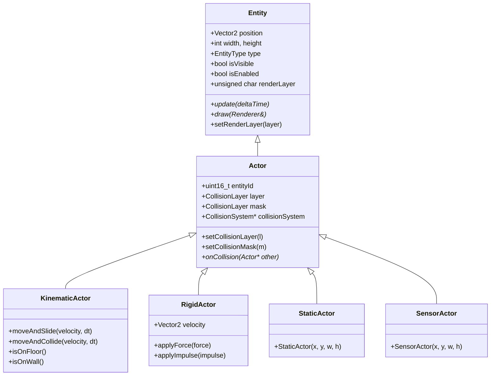
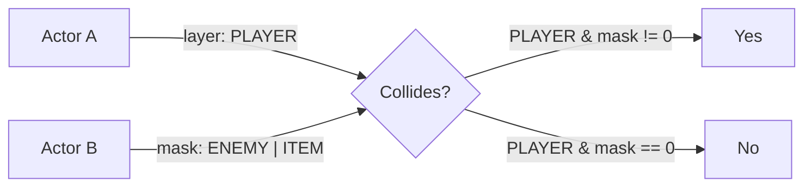
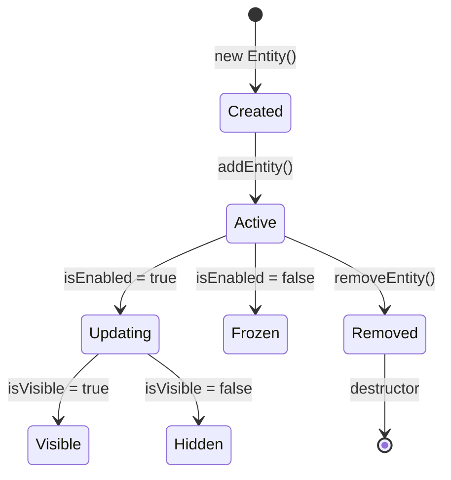

# Entities & Actors

Entities and Actors form the object system in PixelRoot32. Understanding their relationship and capabilities is essential for building game objects.

## Entity Hierarchy



## Entity

`Entity` is the base class for all objects in a scene. It provides:

- **Transform**: Position, width, height
- **Lifecycle**: `update()` and `draw()` methods
- **State**: Visibility, enabled status, render layer
- **Classification**: Entity type for safe casting

```cpp
#include <Entity.h>

using namespace pixelroot32;

class Background : public core::Entity {
public:
    Background() : Entity(0, 0, 240, 240, EntityType::GENERIC) {
        setRenderLayer(0);  // Draw first (background)
    }
    
    void update(unsigned long deltaTime) override {
        // Background typically doesn't update
        (void)deltaTime;
    }
    
    void draw(graphics::Renderer& r) override {
        // Draw background gradient or image
        r.drawFilledRectangle(0, 0, width, height, graphics::Color::BLUE);
    }
};
```

### Entity Properties

| Property | Type | Description |
|----------|------|-------------|
| `position` | `Vector2` | World-space position (top-left) |
| `width` / `height` | `int` | Dimensions in pixels |
| `type` | `EntityType` | Classification enum |
| `isVisible` | `bool` | Controls `draw()` calls |
| `isEnabled` | `bool` | Controls `update()` calls |
| `renderLayer` | `unsigned char` | Drawing order (0 = back) |

### Render Layers

Entities are drawn from lowest to highest layer:

```cpp
// Layer 0: Background
background->setRenderLayer(0);

// Layer 1: Game objects
player->setRenderLayer(1);
enemy->setRenderLayer(1);
item->setRenderLayer(1);

// Layer 2: Effects (particles, etc.)
explosion->setRenderLayer(2);

// Layer 3: UI/HUD
scoreDisplay->setRenderLayer(3);
healthBar->setRenderLayer(3);
```

## Actor

`Actor` extends `Entity` with collision capabilities. All physics-enabled objects are Actors.

```cpp
#include <Actor.h>

using namespace pixelroot32;

class Coin : public core::Actor {
public:
    Coin(int x, int y) : Actor(x, y, 8, 8) {
        // Set up collision filtering
        setCollisionLayer(physics::DefaultLayers::kItem);
        setCollisionMask(physics::DefaultLayers::kPlayer);
    }
    
    void update(unsigned long deltaTime) override {
        // Rotate animation
        rotation += deltaTime * 0.1f;
    }
    
    void draw(graphics::Renderer& r) override {
        // Draw coin sprite with rotation
        r.drawSprite(sprite, position.x, position.y, graphics::Color::YELLOW);
    }
    
    void onCollision(core::Actor* other) override {
        // Only collides with player due to mask
        if (other->isInLayer(physics::DefaultLayers::kPlayer)) {
            collect();
        }
    }
    
    void collect() {
        isVisible = false;  // Hide (will be cleaned up)
        // Award points...
    }
    
private:
    float rotation = 0;
    const graphics::Sprite* sprite;
};
```

### Collision Filtering

Actors use a layer/mask system for selective collision:



```cpp
// Default layers provided by engine
namespace physics::DefaultLayers {
    constexpr CollisionLayer kNone = 0;
    constexpr CollisionLayer kPlayer = 1 << 0;
    constexpr CollisionLayer kEnemy = 1 << 1;
    constexpr CollisionLayer kEnvironment = 1 << 2;
    constexpr CollisionLayer kItem = 1 << 3;
    constexpr CollisionLayer kProjectile = 1 << 4;
}

// Player collides with environment and items
player->setCollisionLayer(DefaultLayers::kPlayer);
player->setCollisionMask(DefaultLayers::kEnvironment | DefaultLayers::kItem);

// Enemy collides with environment and player projectiles
enemy->setCollisionLayer(DefaultLayers::kEnemy);
enemy->setCollisionMask(DefaultLayers::kEnvironment | DefaultLayers::kProjectile);

// Item only collides with player
item->setCollisionLayer(DefaultLayers::kItem);
item->setCollisionMask(DefaultLayers::kPlayer);
```

## Actor Types

PixelRoot32 provides four specialized Actor types for different use cases:

### StaticActor

For immovable world geometry—walls, floors, platforms.

```cpp
#include <StaticActor.h>

using namespace pixelroot32::physics;

// Create a ground platform
auto* ground = new StaticActor(0, 200, 240, 40);
ground->setCollisionLayer(DefaultLayers::kEnvironment);
scene.addEntity(ground);
```

Characteristics:
- Zero mass (infinite inertia)
- Never moves
- Other actors collide and respond

### KinematicActor

For player-controlled or AI-driven objects that need collision response.

```cpp
#include <KinematicActor.h>

using namespace pixelroot32;

class Player : public physics::KinematicActor {
public:
    Player() : KinematicActor(120, 120, 16, 16) {
        setCollisionLayer(physics::DefaultLayers::kPlayer);
        setCollisionMask(physics::DefaultLayers::kEnvironment);
    }
    
    void update(unsigned long deltaTime) override {
        using namespace math;
        
        // Build velocity from input
        Vector2 velocity;
        
        if (input.isButtonPressed(ButtonName::LEFT)) {
            velocity.x = -speed;
        } else if (input.isButtonPressed(ButtonName::RIGHT)) {
            velocity.x = speed;
        }
        
        if (isOnFloor() && input.isButtonPressed(ButtonName::A)) {
            velocity.y = -jumpForce;  // Jump
        }
        
        // Apply gravity
        velocity.y += gravity * toScalar(deltaTime) / toScalar(1000);
        
        // Move with collision response
        velocity *= toScalar(deltaTime) / toScalar(1000);
        auto collision = moveAndSlide(velocity, deltaTime);
        
        // Handle collision results
        if (collision.collides && collision.normal.y < 0) {
            // Hit ceiling
        }
    }
    
    void onCollision(core::Actor* other) override {
        // Handle special collisions
        if (other->isInLayer(physics::DefaultLayers::kItem)) {
            collectItem(static_cast<Item*>(other));
        }
    }
    
private:
    Scalar speed = toScalar(150);  // pixels/second
    Scalar jumpForce = toScalar(300);
    Scalar gravity = toScalar(600);
};
```

Key methods:

| Method | Description |
|--------|-------------|
| `moveAndSlide(velocity, dt)` | Move with sliding along surfaces |
| `moveAndCollide(velocity, dt)` | Move and stop on collision |
| `isOnFloor()` | True if standing on something |
| `isOnWall()` | True if touching a wall |
| `isOnCeiling()` | True if touching ceiling |

### RigidActor

For physics-driven objects affected by forces.

```cpp
#include <RigidActor.h>

using namespace pixelroot32;

class Crate : public physics::RigidActor {
public:
    Crate(int x, int y) : RigidActor(x, y, 16, 16) {
        setCollisionLayer(physics::DefaultLayers::kEnvironment);
        mass = 10.0f;
        friction = 0.5f;
        bounce = 0.2f;
    }
    
    void onCollision(core::Actor* other) override {
        // Crates can be pushed by player
        if (other->isInLayer(physics::DefaultLayers::kPlayer)) {
            // Momentum transfer handled by physics system
        }
    }
};

// Spawn and apply force
auto* crate = new Crate(100, 50);
scene.addEntity(crate);

crate->applyImpulse(math::Vector2(50, -100));  // Throw crate
```

Properties:

| Property | Description |
|----------|-------------|
| `mass` | Kilograms (affects momentum) |
| `velocity` | Current velocity vector |
| `friction` | 0-1, affects sliding |
| `bounce` | 0-1, restitution coefficient |
| `gravityScale` | Multiplier for gravity |

### SensorActor

For trigger zones—detection without physical response.

```cpp
#include <SensorActor.h>

using namespace pixelroot32;

class DeathZone : public physics::SensorActor {
public:
    DeathZone(int x, int y, int w, int h) 
        : SensorActor(x, y, w, h) {
        setCollisionLayer(physics::DefaultLayers::kSensor);
        setCollisionMask(physics::DefaultLayers::kPlayer);
    }
    
    void onCollision(core::Actor* other) override {
        // Kill player (no physics response, just notification)
        if (other->isInLayer(physics::DefaultLayers::kPlayer)) {
            gameOver();
        }
    }
};

// Checkpoint trigger
class Checkpoint : public physics::SensorActor {
    bool activated = false;
    
public:
    void onCollision(core::Actor* other) override {
        if (!activated && other->isInLayer(physics::DefaultLayers::kPlayer)) {
            activated = true;
            saveGame();
            showActivatedEffect();
        }
    }
};
```

Sensors:
- Detect overlaps without blocking movement
- Generate `onCollision` callbacks
- No physics response (velocity unaffected)

## Creating Custom Entities

### Basic Entity Pattern

```cpp
class MyEntity : public core::Entity {
public:
    MyEntity(int x, int y) 
        : Entity(x, y, 32, 32, EntityType::GENERIC) {
        // Initialize
    }
    
    void update(unsigned long deltaTime) override {
        // Update logic
    }
    
    void draw(graphics::Renderer& r) override {
        // Render
    }
};
```

### Custom Actor Pattern

```cpp
class Projectile : public physics::KinematicActor {
    unsigned long lifetime = 2000;  // 2 seconds
    unsigned long age = 0;
    
public:
    Projectile(int x, int y, Vector2 direction) 
        : KinematicActor(x, y, 4, 4) {
        setCollisionLayer(DefaultLayers::kProjectile);
        setCollisionMask(DefaultLayers::kEnemy | DefaultLayers::kEnvironment);
        
        velocity = direction * speed;
    }
    
    void update(unsigned long deltaTime) override {
        age += deltaTime;
        
        if (age > lifetime) {
            destroy();  // Remove from scene
            return;
        }
        
        // Move without gravity
        auto collision = moveAndCollide(velocity * dt, deltaTime);
        
        if (collision.collides) {
            onHit(collision);
        }
    }
    
    void onCollision(core::Actor* other) override {
        if (other->isInLayer(DefaultLayers::kEnemy)) {
            damageEnemy(static_cast<Enemy*>(other));
            destroy();
        }
    }
    
    void draw(graphics::Renderer& r) override {
        r.drawFilledRectangle(
            position.x, position.y, 
            width, height, 
            graphics::Color::YELLOW
        );
    }
    
private:
    Scalar speed = toScalar(400);
    Vector2 velocity;
    
    void destroy() {
        isVisible = false;
        isEnabled = false;
        // Scene cleanup will remove
    }
};
```

## Entity Management Best Practices

### Object Ownership

```cpp
class GameScene : public Scene {
    // Option 1: Smart pointers (recommended)
    std::unique_ptr<Player> player;
    std::vector<std::unique_ptr<Enemy>> enemies;
    
    // Option 2: Raw pointers (scene arena)
    Player* player;
    
public:
    void init() override {
        // Smart pointer approach
        player = std::make_unique<Player>(100, 100);
        addEntity(player.get());
        
        // Arena approach
        player = arenaNew<Player>(arena, 100, 100);
        addEntity(player);
    }
};
```

### Entity Lifecycle



### Performance Tips

1. **Reuse entities** instead of creating/destroying:
   ```cpp
   // Good: Pool pattern
   Projectile* spawnProjectile() {
       for (auto* p : projectilePool) {
           if (!p->isEnabled) {
               p->reset(x, y);
               p->isEnabled = true;
               return p;
           }
       }
       return nullptr;  // Pool exhausted
   }
   ```

2. **Pre-filter updates**:
   ```cpp
   void update(unsigned long dt) override {
       if (!shouldUpdate) return;  // Early out
       // ... expensive logic
   }
   ```

3. **Batch render calls**:
   ```cpp
   void draw(Renderer& r) override {
       // Bad: Many draw calls
       for (int i = 0; i < 100; ++i) {
           r.drawPixel(x + i, y, color);
       }
       
       // Good: Single draw call
       r.drawFilledRectangle(x, y, 100, 1, color);
   }
   ```

## Next Steps

- **[Scenes](./scenes.md)** — How entities live in scenes
- **[Physics](./physics.md)** — Deep dive into collision and movement
- **[Rendering](./rendering.md)** — Drawing techniques and optimization
