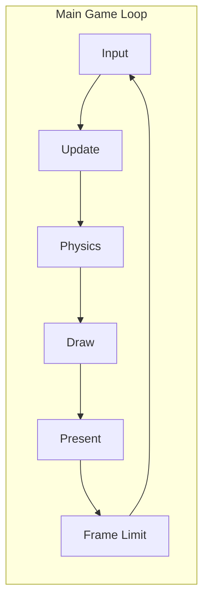
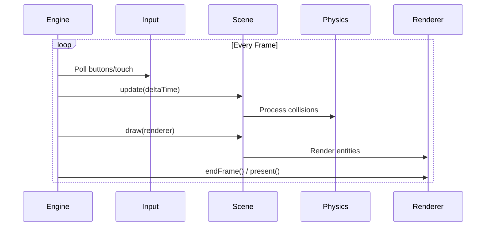
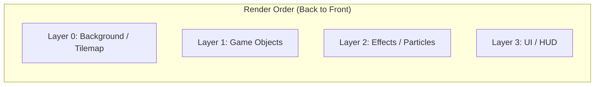
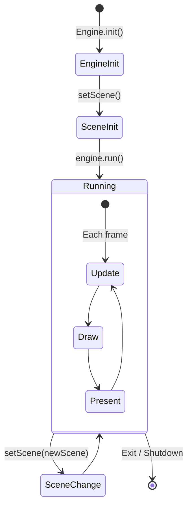

# Game Loop

The game loop is the core mechanism that drives your game forward. Understanding its structure and timing is essential for building performant, stable games.

## The Loop Structure

PixelRoot32 uses a traditional game loop with fixed phases:



Each phase has specific responsibilities and timing constraints.

### Simplified per-frame sequence



## Phase Breakdown

### 1. Input Phase

```cpp
void Engine::update() {
    inputManager.update();  // Poll button states
    
    #if PIXELROOT32_ENABLE_TOUCH
    // Poll touch manager if attached
    if (touchManager) {
        // Process touch points, generate events
    }
    #endif
}
```

The input phase captures the current state of:
- **Digital buttons**: GPIO pin states
- **Touch events**: Screen touches (if enabled)
- **Simulated input**: Mouse-to-touch mapping (native builds)

Input is sampled once per frame. All subsequent phases work with this snapshot.

### 2. Update Phase

```cpp
void Scene::update(unsigned long deltaTime) {
    // Update all enabled entities
    for (int i = 0; i < entityCount; ++i) {
        if (entities[i]->isEnabled) {
            entities[i]->update(deltaTime);
        }
    }
}
```

The update phase runs game logic:
- **AI behavior**: Enemy pathfinding, decision making
- **Animation**: Advance animation frames
- **Game state**: Score tracking, timer updates
- **Movement preparation**: Calculate desired velocity

> **Frame rate independence** — Always use `deltaTime` for time-based calculations:
>
> ```cpp
> // Bad: Frame-rate dependent
> position.x += 5;  // Moves 5px/frame (300px/s at 60fps, 150px/s at 30fps)
>
> // Good: Frame-rate independent  
> position.x += speed * deltaTime / 1000.0f;  // Consistent speed in px/sec
> ```

### 3. Physics Phase

```cpp
#if PIXELROOT32_ENABLE_PHYSICS
    collisionSystem.process(deltaTime);
#endif
```

Physics processing includes:
- **Broadphase**: Spatial grid collision queries
- **Narrowphase**: AABB intersection tests
- **Resolution**: Position/velocity corrections
- **Callbacks**: `onCollision()` notifications

Physics runs at a fixed timestep (typically 1/60s) for stability:

```mermaid
sequenceDiagram
    participant Actor
    participant CS[CollisionSystem]
    participant Other
    
    Actor->>CS: moveAndSlide(velocity, dt)
    CS->>CS: Broadphase query
    CS->>Other: AABB test
    CS->>Actor: Return collision info
    Actor->>Actor: Adjust velocity/position
```

### 4. Draw Phase

```cpp
void Renderer::beginFrame() {
    drawer->clear();  // Clear framebuffer
}

void Scene::draw(Renderer& renderer) {
    // Sort entities by render layer if needed
    if (needsSorting) sortEntities();
    
    // Draw visible entities
    for (int i = 0; i < entityCount; ++i) {
        if (entities[i]->isVisible && isVisibleInViewport(entities[i], renderer)) {
            entities[i]->draw(renderer);
        }
    }
}
```

Rendering happens in layers (0 to N, back to front):



### 5. Present Phase

```cpp
void Renderer::endFrame() {
    drawer->present();  // Send to display
}
```

On ESP32 with TFT_eSPI:
- **DMA transfer**: Non-blocking SPI transmission
- **Double buffering**: Prepare next block while sending current
- **Scaling**: Logical to physical resolution conversion

## Timing and Delta Time

### What is Delta Time?

`deltaTime` is the milliseconds elapsed since the last frame:

```cpp
unsigned long currentMillis = getMillis();
deltaTime = currentMillis - previousMillis;
previousMillis = currentMillis;
```

### Using Delta Time Correctly

```cpp
class Player : public KinematicActor {
    math::Scalar speed = math::toScalar(100);  // 100 pixels/second
    
    void update(unsigned long deltaTime) override {
        // Convert deltaTime to seconds
        math::Scalar dt = math::toScalar(deltaTime) / math::toScalar(1000);
        
        // Calculate movement
        math::Vector2 velocity;
        if (input.isButtonPressed(ButtonName::LEFT)) {
            velocity.x = -speed;
        } else if (input.isButtonPressed(ButtonName::RIGHT)) {
            velocity.x = speed;
        }
        
        // Move with collision
        moveAndSlide(velocity * dt, deltaTime);
    }
};
```

### Fixed Timestep vs Variable Timestep

| Approach | Pros | Cons | Use Case |
|----------|------|------|----------|
| **Variable** | Simple, adapts to performance | Physics can be unstable | General game logic |
| **Fixed** | Deterministic, stable physics | May need interpolation | Physics simulation |

PixelRoot32 uses fixed timestep for physics and variable for game logic:

```cpp
// Fixed timestep accumulator
static constexpr unsigned long PHYSICS_STEP_MS = 16;  // ~60fps
unsigned long physicsAccumulator = 0;

void update(unsigned long deltaTime) {
    physicsAccumulator += deltaTime;
    
    // Run physics at fixed rate
    while (physicsAccumulator >= PHYSICS_STEP_MS) {
        collisionSystem.process(PHYSICS_STEP_MS);
        physicsAccumulator -= PHYSICS_STEP_MS;
    }
    
    // Game logic runs every frame (variable)
    processInput();
    updateAnimations(deltaTime);
}
```

## Frame Rate Management

### Understanding Frame Timing

```mermaid
gantt
    title Frame Timing (16.67ms target for 60fps)
    dateFormat X
    axisFormat %dms
    
    section Frame
    Input       :a1, 0, 1ms
    Update      :a2, after a1, 3ms
    Physics     :a3, after a2, 4ms
    Draw        :a4, after a3, 6ms
    Present     :a5, after a4, 2ms
    Idle        :a6, after a5, 1ms
```



### Frame Limiting

The engine can limit frame rate to save power or maintain consistency:

```cpp
// In main loop
unsigned long frameTime = getMillis() - frameStart;
if (frameTime < TARGET_FRAME_TIME) {
    delay(TARGET_FRAME_TIME - frameTime);
}
```

### Adaptive Quality

Adjust quality based on performance:

```cpp
void update(unsigned long deltaTime) {
    // Track average frame time
    avgFrameTime = (avgFrameTime * 0.9f) + (deltaTime * 0.1f);
    
    // Reduce particle count if struggling
    if (avgFrameTime > 20) {  // Below 50fps
        maxParticles = 50;
    } else {
        maxParticles = 100;
    }
}
```

## Life cycle Methods

Understanding when methods are called helps organize code:



### Method Call Timing

| Method | Called When | Frequency |
|--------|-------------|-----------|
| `Engine::init()` | After construction | Once |
| `Scene::init()` | When scene becomes active | Once per entry |
| `Scene::update()` | Every frame | 60 times/second (target) |
| `Scene::draw()` | Every frame | 60 times/second (target) |
| `Entity::update()` | By Scene::update() | 60 times/second |
| `Entity::draw()` | By Scene::draw() | 60 times/second |

## Best Practices

### Do

- ✅ Use `deltaTime` for all time-based calculations
- ✅ Keep update logic under 16ms (for 60fps)
- ✅ Pre-allocate resources in `init()`, not in the loop
- ✅ Use object pooling for frequently created/destroyed objects
- ✅ Profile with `PIXELROOT32_ENABLE_DEBUG_OVERLAY`

### Don't

- ❌ Allocate memory in `update()` or `draw()`
- ❌ Perform file I/O in the game loop
- ❌ Ignore `deltaTime` (causes frame-rate dependency)
- ❌ Do heavy calculations every frame if unnecessary
- ❌ Block the loop with `delay()` for long periods

## Debugging the Loop

Enable the debug overlay to see real-time metrics:

```ini
build_flags =
    -DPIXELROOT32_ENABLE_DEBUG_OVERLAY=1
```

This displays:
- **FPS**: Current frame rate
- **CPU%**: Estimated CPU load
- **RAM**: Free heap memory

## Next Steps

- [Layer 4 — Scene](../architecture/layer-scene.md) — Scene management and entity hierarchy
- [Layer 3 — Systems](../architecture/layer-systems.md) — Renderer, physics, UI
- [Physics subsystem](../architecture/physics-subsystem.md) — Collision and movement
