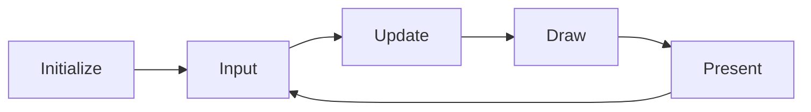

# Getting Started

**PixelRoot32** is a lightweight, modular 2D game engine written in **C++17**, designed primarily for **ESP32 microcontrollers**, with a native simulation layer for **PC (SDL2)** to enable rapid development without hardware.

## Overview

PixelRoot32 follows a **scene-based architecture inspired by Godot Engine**, making it intuitive for developers familiar with modern game development workflows.

**Key features**

- **Cross-Platform**: Develop on PC (Windows/Linux/macOS) and deploy on ESP32.
- **Scene-Entity System**: Intuitive management of Scenes, Entities, and Actors.
- **High Performance**: Optimized for ESP32 with DMA transfers, IRAM-cached rendering, and a Dirty Regions pipeline.
- **Sprite System**: Support for 1bpp/2bpp/4bpp sprites with multi-palette selection, flipping, rotation, and animation.
- **Tilemap Support**: Optimized rendering with viewport culling, static layer caching, multi-palette, and tile animations.
- **Tile Animation System**: Frame-based animations (water, lava) with O(1) frame resolution and zero-allocation policy.
- **Independent Resolution Scaling**: Render at low logical resolutions (e.g., 128x128) and scale to physical displays (e.g., 240x240).
- **NES-Style Audio**: Built-in dynamic 8-voice audio subsystem with fixed-point No-FPU optimizations (Pulse, Triangle, Noise, Sine, Saw).
- **Lightweight UI**: Label, Button, and Checkbox with automatic layouts.
- **AABB Physics**: Godot-style physics with Kinematic/Rigid actors, sensors, and one-way platforms.
- **Indexed Color Palettes**: Optimized palettes (PR32, NES, GameBoy, PICO-8) with multi-palette support.
- **Modular Architecture**: Compile only needed subsystems via `PIXELROOT32_ENABLE_*` flags to reduce firmware size.

## Prerequisites

- **VS Code** with **PlatformIO IDE**
- **ESP32** board or PC for `native` builds
- **USB cable** for flashing (ESP32)
- For PC: **SDL2** dev libraries (see [Platform compatibility](./platform-compatibility.md))

## Installation

### Option 1: PlatformIO Registry

```ini
lib_deps =
    gperez88/PixelRoot32-Game-Engine@^1.2.1
```

### Option 2: Clone the repository

```bash
git clone https://github.com/PixelRoot32-Game-Engine/PixelRoot32-Game-Engine.git
cd PixelRoot32-Game-Engine
```

### Open an example

Each example is a self-contained PlatformIO project under [`examples/`](../../examples/README.md).

```bash
cd examples/hello_world
```

## Configure PlatformIO

> **Required** — C++17 and no exceptions:

```ini
build_unflags = -std=gnu++11
build_flags =
    -std=gnu++17
    -fno-exceptions
```

Typical environments: `native`, `esp32dev`, `esp32cyd`, `esp32c3`, `esp32s3` (see each example’s `platformio.ini`).

## Minimal main file

```cpp
#include <Arduino.h>
#include <Engine.h>
#include <Scene.h>

using namespace pixelroot32;

class GameScene : public core::Scene {
public:
    void init() override {}
    void update(unsigned long deltaTime) override { (void)deltaTime; }
    void draw(graphics::Renderer& renderer) override {
        renderer.drawText("Hello World!", 10, 10, graphics::Color::WHITE, 2);
    }
};

core::Engine* engine;
GameScene scene;

void setup() {
    graphics::DisplayConfig displayConfig(240, 240);
    input::InputConfig inputConfig;
    inputConfig.addButton(input::ButtonName::A, 0);
    engine = new core::Engine(std::move(displayConfig), inputConfig);
    engine->setScene(&scene);
    engine->init();
    engine->run();
}

void loop() {}
```

## Understanding the game loop

PixelRoot32 follows a classic loop:



| Phase | Description |
|-------|-------------|
| **Input** | Buttons, touch, etc. |
| **Update** | Logic, physics, AI |
| **Draw** | Framebuffer |
| **Present** | DMA / display output |

See [Game loop](./game-loop.md) for detail.

## Best practices (ESP32)

1. Use **`math::Scalar`** / fixed-point patterns from the style guide; avoid raw `float` literals where the project uses fixed math.
2. **No heap churn** in `update()`/`draw()` — pool or pre-allocate in `init()`.
3. **Render layers** — background / world / UI ordering.
4. Use **`log()`** from `core/Log.h` instead of ad-hoc `Serial` spam.

See [Coding style](./coding-style.md) and [Memory system](../architecture/memory-system.md).

## Next steps

- [Core diagrams & scenes](../architecture/layer-scene.md) — entities and scene layer
- [Game loop](./game-loop.md)
- [Entities tutorial](./entities-scene-tutorial.md) — didactic `Entity` patterns
- [API index](../api/index.md)
- [Changelog](../../CHANGELOG.md)
