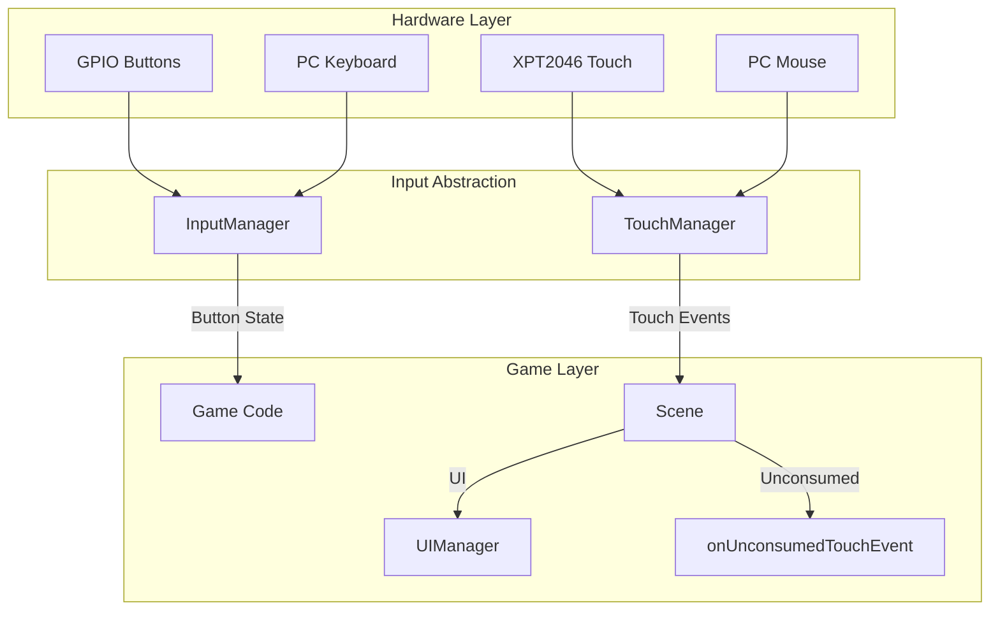
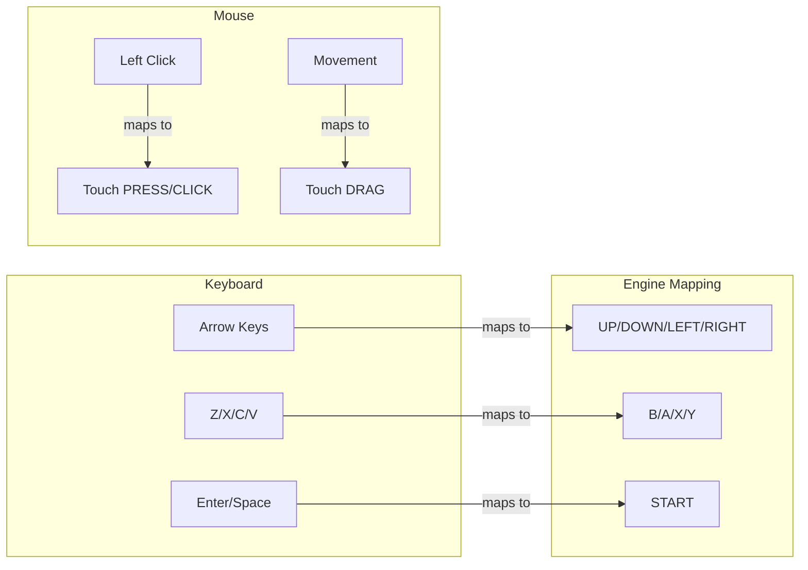

# Input System

PixelRoot32 provides a unified input abstraction supporting digital buttons, touch screens, and keyboard (native builds). The input system normalizes platform differences into a consistent API.

## Architecture Overview



## InputManager

The `InputManager` polls **logical button indices** (`0` … `count-1`). On ESP32 each index maps to a GPIO pin from `InputConfig`; on native builds it maps to SDL scancodes.

```cpp
#include <input/InputManager.h>
#include <core/Engine.h>

using namespace pixelroot32;

input::InputManager& input = engine.getInputManager();

// Held this frame (level)
if (input.isButtonDown(0)) {
    // ...
}

// Edge: transitioned up -> down this frame
if (input.isButtonPressed(0)) {
    // ...
}

// Edge: transitioned down -> up this frame
if (input.isButtonReleased(0)) {
    // ...
}

// Click = pressed and released same frame
if (input.isButtonClicked(2)) {
    // ...
}
```

### Logical indices

You choose the meaning of each index in your game (jump, fire, menu, …). Keep a small enum or constants in your own code if you want names like `kJump = 0`.

| Index | Suggested role |
|-------|----------------|
| `0` | Primary action |
| `1` | Secondary action |
| `2` | Tertiary |
| `3+` | D-pad, start, etc. |

### Configuration

`InputConfig` stores parallel arrays of pins (ESP32) or scancodes (native). Use the variadic constructor: first argument is **count**, then one value per button.

```cpp
#include <input/InputConfig.h>

#if defined(PLATFORM_NATIVE)
// Example: 4 keyboard keys (SDL scancodes)
input::InputConfig inputConfig(4, 80, 79, 81, 82); // arbitrary example keys
#else
// ESP32: count + GPIO pin numbers
input::InputConfig inputConfig(4, 0, 32, 33, 25);
#endif

core::Engine engine(std::move(displayConfig), inputConfig);
```

### Button state patterns

```cpp
class Player : public physics::KinematicActor {
    static constexpr uint8_t BTN_LEFT = 0;
    static constexpr uint8_t BTN_RIGHT = 1;
    static constexpr uint8_t BTN_JUMP = 2;
    static constexpr uint8_t BTN_ATTACK = 3;
    bool jumpHeldLastFrame = false;

public:
    void update(unsigned long deltaTime, input::InputManager& input) override {
        // Continuous movement (level)
        if (input.isButtonDown(BTN_LEFT)) {
            velocity.x = -speed;
        } else if (input.isButtonDown(BTN_RIGHT)) {
            velocity.x = speed;
        } else {
            velocity.x = 0;
        }

        // Jump on rising edge
        bool jumpHeld = input.isButtonDown(BTN_JUMP);
        if (jumpHeld && !jumpHeldLastFrame && isOnFloor()) {
            velocity.y = -jumpForce;
        }
        jumpHeldLastFrame = jumpHeld;

        if (input.isButtonPressed(BTN_ATTACK)) {
            performAttack();
        }
    }
};
```

## Touch Input

Touch support is optional and configured at compile time:

```cpp
// platformio.ini
build_flags =
    -DPIXELROOT32_ENABLE_TOUCH=1
```

### TouchManager

```cpp
#if PIXELROOT32_ENABLE_TOUCH
#include <input/TouchManager.h>
#include <input/TouchEvent.h>

class GameScene : public core::Scene {
    pixelroot32::core::Engine& engine;
    pixelroot32::input::TouchManager touchManager;

public:
    explicit GameScene(pixelroot32::core::Engine& e)
        : engine(e), touchManager(240, 240) {}

    void init() override {
        touchManager.init();
        engine.setTouchManager(&touchManager);
    }

    void onUnconsumedTouchEvent(const pixelroot32::input::TouchEvent& event) override {
        using pixelroot32::input::TouchEventType;
        switch (event.type) {
            case TouchEventType::CLICK:
                spawnProjectile(event.x, event.y);
                break;
            case TouchEventType::DRAG:
                movePlayerTo(event.x, event.y);
                break;
            case TouchEventType::LONG_PRESS:
                showContextMenu(event.x, event.y);
                break;
            default:
                break;
        }
    }
};
#endif
```

### Touch Event Types

| Event | Description | Trigger |
|-------|-------------|---------|
| `PRESS` | Finger touched screen | Immediate |
| `RELEASE` | Finger lifted | Immediate |
| `CLICK` | Quick press-release | After release, < 200ms |
| `DOUBLE_CLICK` | Two quick clicks | After second click |
| `LONG_PRESS` | Press held | After 500ms hold |
| `DRAG` | Movement while pressed | During movement |

### Touch Calibration

```cpp
void calibrateTouch() {
    // Define display and touch coordinate ranges
    TouchCalibration cal;
    cal.displayWidth = 240;
    cal.displayHeight = 240;
    cal.touchMinX = 200;   // Raw touch minimum
    cal.touchMaxX = 3800;  // Raw touch maximum
    cal.touchMinY = 300;
    cal.touchMaxY = 3700;
    
    touchManager.setCalibration(cal);
}
```

## Native Input (PC)

On PC builds, input maps to keyboard and mouse:



### Default PC mappings (illustrative)

Your `InputConfig` on native builds lists **SDL scancodes** in the order of logical indices `0…n-1`. A typical layout might map arrow keys to indices `2–5` and action keys to `0–1`, but the exact table is entirely project-specific—mirror the order you passed into `InputConfig(count, …)`.

## Input patterns

### Virtual D-pad (touch)

Map screen regions to the same **logical indices** you use for GPIO / keyboard:

```cpp
// Example: indices 2–5 = left, right, up, down in your InputConfig
bool inRect(const pixelroot32::core::Rect& r, int x, int y) {
    return x >= r.position.x && x < r.position.x + r.width &&
           y >= r.position.y && y < r.position.y + r.height;
}

int virtualDirFromTouch(const pixelroot32::input::TouchEvent& event,
                        const pixelroot32::core::Rect& left,
                        const pixelroot32::core::Rect& right,
                        const pixelroot32::core::Rect& up,
                        const pixelroot32::core::Rect& down) {
    if (inRect(left, event.x, event.y)) return 2;
    if (inRect(right, event.x, event.y)) return 3;
    if (inRect(up, event.x, event.y)) return 4;
    if (inRect(down, event.x, event.y)) return 5;
    return -1;
}
```

### Gestures

Higher-level gestures (swipe, long-press) are usually derived from `TouchEvent` streams in `onUnconsumedTouchEvent` or custom widgets—see [Touch system API](../api/input.md#touch-input-system).

### Buffered combos

Store recent **logical indices** (`uint8_t`) in a ring buffer if you need fighting-game style command detection.

## Best practices

### Do

- Use `isButtonPressed` for **one-frame edges** (just pressed) and `isButtonDown` for **held** state.
- Use `isButtonReleased` / `isButtonClicked` when you need release or click semantics.
- Keep touch and keys behind the same gameplay actions where possible.

### Don't

- Assume a global `ButtonName` enum—indices are defined by your `InputConfig` order.
- Skip `TouchManager` calibration on resistive panels when coordinates are non-linear.

## Bootstrap sketch

```cpp
#include <graphics/DisplayConfig.h>
#include <input/InputConfig.h>
#include <core/Engine.h>

void setup() {
    pixelroot32::graphics::DisplayConfig display(240, 240);
#if defined(PLATFORM_NATIVE)
    pixelroot32::input::InputConfig input(4, /* scancodes */ 0, 0, 0, 0);
#else
    pixelroot32::input::InputConfig input(4, 0, 32, 33, 25);
#endif
    pixelroot32::core::Engine engine(std::move(display), input);
    // GameScene scene(engine); engine.setScene(&scene);
    engine.init();
    engine.run();
}
```

Wire your scene’s `update` method so it receives `engine.getInputManager()` (or store a reference to `Engine` on the scene, as in the touch example above).

## Next steps

- [Touch input architecture](../architecture/touch-input.md)
- [UI system](./ui-system.md)
- [InputManager API](../api/input.md#inputmanager)
