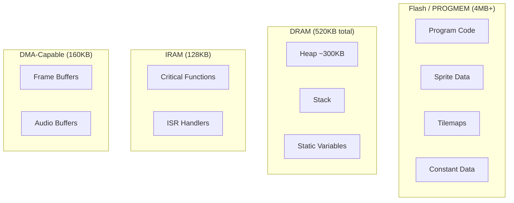

# Memory Management

PixelRoot32 is designed for memory-constrained embedded systems. Understanding the memory model is crucial for building stable, performant games.

## Memory Model Overview



## Key Principles

### 1. Zero Allocation During Game Loop

```cpp
class GoodExample : public core::Scene {
    std::unique_ptr<Player> player;  // Allocated in init()
    std::vector<Bullet> bulletPool;   // Pre-allocated pool
    
public:
    void init() override {
        // ✅ Allocate once at initialization
        player = std::make_unique<Player>(100, 100);
        
        // Pre-allocate bullet pool
        bulletPool.reserve(MAX_BULLETS);
        for (int i = 0; i < MAX_BULLETS; ++i) {
            bulletPool.emplace_back();
        }
    }
    
    void update(unsigned long deltaTime) override {
        // ✅ Reuse existing objects
        for (auto& bullet : bulletPool) {
            if (bullet.isActive) {
                bullet.update(deltaTime);
            }
        }
    }
};

class BadExample : public core::Scene {
public:
    void update(unsigned long deltaTime) override {
        // ❌ Never allocate in the game loop!
        auto* bullet = new Bullet();  // Bad!
        addEntity(bullet);
    }
};
```

### 2. Use PROGMEM for Static Data

```cpp
// ❌ Stored in RAM (520 bytes)
const uint8_t spriteData[] = { /* ... */ };

// ✅ Stored in Flash (saves RAM)
const uint8_t spriteData[] PROGMEM = { /* ... */ };

// Or use engine macro for cross-platform
const uint8_t spriteData[] PIXELROOT32_FLASH_ATTR = { /* ... */ };
```

Accessing PROGMEM data:

```cpp
// Read single byte
uint8_t value = pgm_read_byte(&spriteData[index]);

// Read 16-bit value
uint16_t word = pgm_read_word(&spriteData16[index]);

// Or use wrapper macros
PIXELROOT32_READ_BYTE_P(&spriteData[index]);
```

### 3. Smart Pointers for Ownership

```cpp
#include <memory>

class GameScene : public core::Scene {
    // ✅ unique_ptr - single owner, auto-deletes
    std::unique_ptr<Player> player;
    
    // ✅ shared_ptr - multiple owners
    std::shared_ptr<Texture> sharedTexture;
    
    // ✅ Vector of unique_ptr for collections
    std::vector<std::unique_ptr<Enemy>> enemies;
    
public:
    void init() override {
        player = std::make_unique<Player>(100, 100);
        addEntity(player.get());
        
        for (int i = 0; i < 5; ++i) {
            auto enemy = std::make_unique<Enemy>(200 + i * 50, 100);
            enemies.push_back(std::move(enemy));
            addEntity(enemies.back().get());
        }
    }
    
    // ✅ Automatic cleanup when scene destroyed
};
```

### 4. Object Pooling

```cpp
template<typename T, size_t Size>
class ObjectPool {
    std::array<T, Size> pool;
    std::array<bool, Size> active;
    
public:
    ObjectPool() { active.fill(false); }
    
    T* acquire() {
        for (size_t i = 0; i < Size; ++i) {
            if (!active[i]) {
                active[i] = true;
                return &pool[i];
            }
        }
        return nullptr;  // Pool exhausted
    }
    
    void release(T* obj) {
        size_t index = obj - &pool[0];
        if (index < Size) {
            active[index] = false;
        }
    }
};

// Usage
ObjectPool<Bullet, 32> bulletPool;

void fireBullet() {
    Bullet* bullet = bulletPool.acquire();
    if (bullet) {
        bullet->reset(x, y, direction);
        addEntity(bullet);
    }
}

void destroyBullet(Bullet* bullet) {
    removeEntity(bullet);
    bulletPool.release(bullet);
}
```

## Scene Arena

The optional arena allocator provides fast, bulk allocation:

```cpp
class GameScene : public core::Scene {
public:
    void init() override {
        // Allocate arena (4KB)
        arena.init(malloc(4096), 4096);
        
        // Allocate from arena
        player = arenaNew<Player>(arena, 100, 100);
        addEntity(player);
        
        enemy = arenaNew<Enemy>(arena, 200, 100);
        addEntity(enemy);
    }
    
    void cleanup() override {
        // Single free for all arena allocations
        if (arena.buffer) {
            free(arena.buffer);
        }
    }
    
private:
    Player* player;
    Enemy* enemy;
};
```

## Memory Monitoring

### Debug Overlay

```ini
# platformio.ini
build_flags = -DPIXELROOT32_ENABLE_DEBUG_OVERLAY=1
```

Shows real-time:
- Free heap
- CPU usage
- FPS

### Programmatic Check

```cpp
#include <platforms/PlatformMemory.h>

void checkMemory() {
    size_t freeHeap = platforms::getFreeHeap();
    size_t minFreeHeap = platforms::getMinFreeHeap();
    size_t largestBlock = platforms::getLargestFreeBlock();
    
    log("Free heap: %d bytes", freeHeap);
    log("Min free: %d bytes", minFreeHeap);
    log("Largest block: %d bytes", largestBlock);
}
```

### Memory Warnings

```cpp
void update(unsigned long deltaTime) override {
    static unsigned long lastCheck = 0;
    lastCheck += deltaTime;
    
    if (lastCheck > 5000) {  // Every 5 seconds
        lastCheck = 0;
        
        if (platforms::getFreeHeap() < 10000) {  // < 10KB
            log("WARNING: Low memory!");
            // Reduce quality, free caches, etc.
        }
    }
}
```

## PlatformMemory Utilities

### Cross-Platform Flash Access

```cpp
#include <platforms/PlatformMemory.h>

// Read from PROGMEM (works on ESP32 and PC)
uint8_t value = PIXELROOT32_READ_BYTE_P(&myFlashData[index]);
uint16_t word = PIXELROOT32_READ_WORD_P(&myFlashData16[index]);

// Copy from PROGMEM
PIXELROOT32_MEMCPY_P(destBuffer, sourceFlashPtr, size);

// Compare strings
int result = PIXELROOT32_STRCMP_P(ramString, flashString);
```

### IRAM_ATTR

Place critical functions in fast RAM:

```cpp
// Called thousands of times per frame
void IRAM_ATTR drawPixel(int x, int y, Color c) {
    // Fast execution, no flash wait states
}

void IRAM_ATTR resolveColor(uint8_t index) {
    // Critical color lookup
}
```

::: warning IRAM is Limited
Only 128KB available. Use sparingly for hot paths only.
:::

## Memory Optimization Techniques

### 1. Reduce Framebuffer Size

```cpp
// Use logical resolution smaller than display
graphics::DisplayConfig config;
config.logicalWidth = 128;   // Render at 128x128
config.logicalHeight = 128;
config.physicalWidth = 240;  // Scale to 240x240 display
config.physicalHeight = 240;
```

Saves: (240×240 - 128×128) × 2 bytes = ~82KB

### 2. Disable Unused Subsystems

```ini
build_flags =
    -DPIXELROOT32_ENABLE_AUDIO=0        ; Save ~20KB
    -DPIXELROOT32_ENABLE_PARTICLES=0    ; Save ~5KB
    -DPIXELROOT32_ENABLE_TOUCH=0         ; Save ~2KB
```

### 3. Use Appropriate Sprite Formats

| Format | Bits/Pixel | Memory |
|--------|------------|--------|
| 1bpp | 1 | 8× smaller |
| 2bpp | 2 | 4× smaller |
| 4bpp | 4 | 2× smaller |
| 8bpp | 8 | baseline |

```cpp
// For simple sprites, use 1bpp
const uint16_t playerSprite[] = { /* 1bpp data */ };

// For detailed sprites, use 2bpp or 4bpp
const uint8_t detailedSprite[] = { /* 2bpp data */ };
```

### 4. Tilemap Compression

```cpp
// Use smaller tile indices where possible
uint8_t tileIndices[100];   // 100 bytes

// vs
uint16_t tileIndices[100];  // 200 bytes
```

## Memory Layout Best Practices

```cpp
// Group related data for cache efficiency
struct EntityData {
    // Hot data - accessed together
    Vector2 position;
    Vector2 velocity;
    
    // Cold data - accessed less frequently
    uint32_t creationTime;
    uint16_t flags;
    uint8_t type;
};

// Avoid padding waste
#pragma pack(push, 1)
struct CompactData {
    uint8_t a;
    uint8_t b;
    uint16_t c;  // Aligned to 2 bytes
    uint32_t d;  // Aligned to 4 bytes
};
#pragma pack(pop)
```

## Debugging Memory Issues

### Common Problems

| Symptom | Cause | Solution |
|---------|-------|----------|
| Crash after running | Heap fragmentation | Use pools, avoid fragmentation |
| Slow performance | Flash cache misses | Add `IRAM_ATTR` to hot functions |
| Out of memory | Too many allocations | Pre-allocate, use pools |
| Corrupted data | Stack overflow | Reduce recursion, increase stack |

### Heap Corruption Detection

```cpp
// Enable in platformio.ini
build_flags = 
    -DCONFIG_HEAP_POISONING_COMPREHENSIVE=1
```

### Stack Monitoring

```cpp
// Check stack high water mark (FreeRTOS)
UBaseType_t watermark = uxTaskGetStackHighWaterMark(NULL);
log("Stack free: %d words", watermark);
```

## Next Steps

- **[Platform Configuration](./platform-config.md)** — Build flags and optimization
- **[Resolution scaling](./resolution-scaling.md)** — Logical vs physical framebuffer trade-offs
