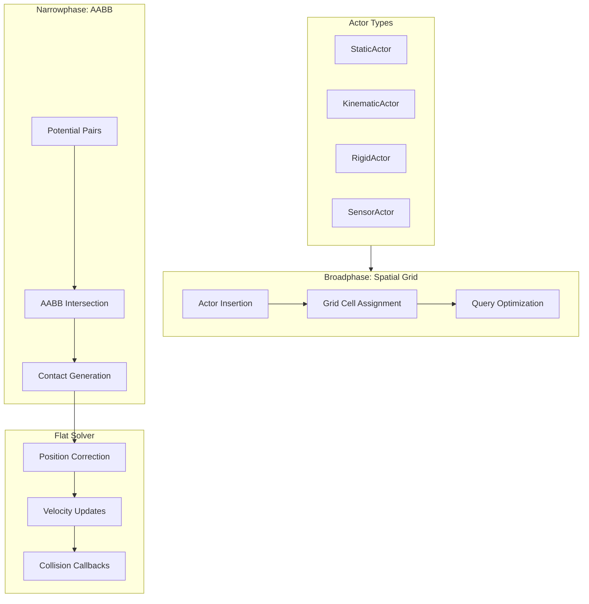
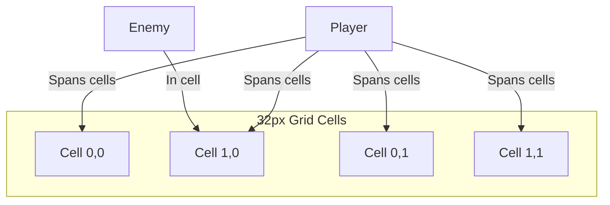
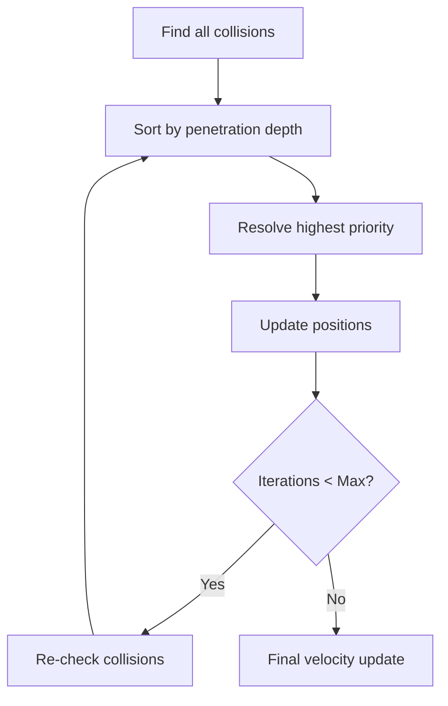

# Physics System

PixelRoot32 includes a complete 2D physics system with Godot-style APIs. The "Flat Solver" provides stable collision detection and response optimized for embedded hardware.

## Architecture



## Collision System

The `CollisionSystem` manages all physics interactions:

```cpp
#include <CollisionSystem.h>

using namespace pixelroot32;

// Access through scene
#if PIXELROOT32_ENABLE_PHYSICS
    physics::CollisionSystem& physics = scene.getCollisionSystem();
#endif
```

### Core Concepts

| Concept | Description |
|---------|-------------|
| **Body** | A physical object with position and size |
| **Layer** | Classification for collision filtering |
| **Mask** | Which layers this body collides with |
| **Broadphase** | Fast rejection of distant pairs |
| **Narrowphase** | Exact collision detection |
| **Solver** | Resolves overlapping bodies |

## Spatial Grid (Broadphase)

The broadphase uses a uniform grid for efficient queries:



```cpp
// Grid configuration (compile-time)
constexpr int GRID_CELL_SIZE = 32;
constexpr int MAX_GRID_CELLS = 256;

// Automatic actor insertion
void Scene::addEntity(Entity* e) {
    if (e->type == EntityType::ACTOR) {
        auto* actor = static_cast<Actor*>(e);
        collisionSystem.registerActor(actor);
    }
}
```

Benefits:
- **O(1) insertion**: Direct cell index calculation
- **O(1) queries**: Only check relevant cells
- **Memory efficient**: Sparse representation

## Collision Layers and Masking

Control which objects collide:

```cpp
namespace physics::DefaultLayers {
    constexpr uint16_t kNone        = 0;
    constexpr uint16_t kPlayer      = 1 << 0;   // 0x0001
    constexpr uint16_t kEnemy       = 1 << 1;   // 0x0002
    constexpr uint16_t kEnvironment = 1 << 2;   // 0x0004
    constexpr uint16_t kItem        = 1 << 3;   // 0x0008
    constexpr uint16_t kProjectile  = 1 << 4;   // 0x0010
    constexpr uint16_t kSensor      = 1 << 5;   // 0x0020
}
```

```mermaid
flowchart LR
    subgraph Player["Player"]
        PL[layer: PLAYER]
        PM[mask: ENVIRONMENT | ITEM]
    end
    
    subgraph Wall["Wall"]
        WL[layer: ENVIRONMENT]
        WM[mask: PLAYER | ENEMY | PROJECTILE]
    end
    
    subgraph Coin["Coin"]
        CL[layer: ITEM]
        CM[mask: PLAYER]
    end
    
    Player -->|"PLAYER & mask != 0"| Wall
    Player -->|"ITEM & mask != 0"| Coin
    Wall -->|"ENVIRONMENT & mask == 0"| Coin
```

```cpp
// Player configuration
player->setCollisionLayer(DefaultLayers::kPlayer);
player->setCollisionMask(DefaultLayers::kEnvironment | 
                        DefaultLayers::kItem | 
                        DefaultLayers::kEnemy);

// Environment collides with everything dynamic
wall->setCollisionLayer(DefaultLayers::kEnvironment);
wall->setCollisionMask(DefaultLayers::kPlayer | 
                       DefaultLayers::kEnemy | 
                       DefaultLayers::kProjectile);

// Item only collides with player
coin->setCollisionLayer(DefaultLayers::kItem);
coin->setCollisionMask(DefaultLayers::kPlayer);
```

## Actor Types

### StaticActor

Immovable world geometry:

```cpp
#include <StaticActor.h>

// Create ground
auto* ground = new physics::StaticActor(0, 220, 240, 20);
ground->setCollisionLayer(DefaultLayers::kEnvironment);
scene.addEntity(ground);
```

- Zero mass (infinite inertia)
- Never moves
- Others collide and respond

### KinematicActor

Player-controlled or AI-driven with collision response:

```cpp
#include <KinematicActor.h>

class Player : public physics::KinematicActor {
    bool wasOnFloor = false;
    
public:
    Player() : KinematicActor(120, 100, 16, 16) {
        setCollisionLayer(DefaultLayers::kPlayer);
        setCollisionMask(DefaultLayers::kEnvironment);
    }
    
    void update(unsigned long deltaTime) override {
        using namespace math;
        
        // Build velocity
        Vector2 velocity;
        
        // Horizontal movement
        if (input.isButtonPressed(ButtonName::LEFT)) {
            velocity.x = -speed;
        } else if (input.isButtonPressed(ButtonName::RIGHT)) {
            velocity.x = speed;
        }
        
        // Jump (only if on floor)
        if (isOnFloor() && input.isButtonPressed(ButtonName::A)) {
            velocity.y = -jumpForce;
        }
        
        // Apply gravity
        velocity.y += gravity * toScalar(deltaTime) / toScalar(1000);
        
        // Scale by delta time
        velocity *= toScalar(deltaTime) / toScalar(1000);
        
        // Move with sliding
        auto collision = moveAndSlide(velocity, deltaTime);
        
        // Landing detection
        if (!wasOnFloor && isOnFloor()) {
            onLanding();
        }
        wasOnFloor = isOnFloor();
    }
    
private:
    Scalar speed = toScalar(120);      // px/sec
    Scalar jumpForce = toScalar(250);  // px/sec
    Scalar gravity = toScalar(500);    // px/sec^2
};
```

#### Kinematic Methods

| Method | Description |
|--------|-------------|
| `moveAndSlide(velocity, dt)` | Move with wall sliding |
| `moveAndCollide(velocity, dt)` | Move and stop on collision |
| `isOnFloor()` | Standing on something |
| `isOnWall()` | Touching wall |
| `isOnCeiling()` | Touching ceiling |

#### One-Way Platforms

```cpp
class OneWayPlatform : public physics::StaticActor {
public:
    OneWayPlatform(int x, int y, int w, int h) 
        : StaticActor(x, y, w, h) {
        setCollisionLayer(DefaultLayers::kEnvironment);
        // Mark as one-way
        platformType = PlatformType::OneWay;
    }
};

// Player can jump through from below
// Collision only when falling onto platform
```

### RigidActor

Physics-driven objects:

```cpp
#include <RigidActor.h>

class Crate : public physics::RigidActor {
public:
    Crate(int x, int y) : RigidActor(x, y, 16, 16) {
        setCollisionLayer(DefaultLayers::kEnvironment);
        
        // Physics properties
        mass = 5.0f;
        friction = 0.3f;
        bounce = 0.1f;
    }
    
    void onCollision(core::Actor* other) override {
        // Can be pushed by player
        // Physics system handles momentum transfer
    }
};

// Spawn and throw
auto* crate = new Crate(100, 50);
scene.addEntity(crate);

crate->applyImpulse(math::Vector2(100, -150));
```

Properties:

| Property | Default | Description |
|----------|---------|-------------|
| `mass` | 1.0 | Kilograms |
| `velocity` | (0, 0) | Current velocity |
| `friction` | 0.5 | 0-1, surface friction |
| `bounce` | 0.0 | 0-1, restitution |
| `gravityScale` | 1.0 | Gravity multiplier |
| `linearDamping` | 0.0 | Velocity decay |

### SensorActor

Trigger zones without physical response:

```cpp
#include <SensorActor.h>

class Checkpoint : public physics::SensorActor {
    bool activated = false;
    
public:
    Checkpoint(int x, int y) 
        : SensorActor(x, y, 16, 16) {
        setCollisionLayer(DefaultLayers::kSensor);
        setCollisionMask(DefaultLayers::kPlayer);
    }
    
    void draw(Renderer& r) override {
        Color c = activated ? Color::GREEN : Color::YELLOW;
        r.drawRectangle(position.x, position.y, width, height, c);
    }
    
    void onCollision(core::Actor* other) override {
        if (!activated && other->isInLayer(DefaultLayers::kPlayer)) {
            activated = true;
            saveGame(position);
            showEffect();
        }
    }
};
```

Sensors:
- Detect overlaps
- No physics response
- Generate callbacks only

## Collision Response

### The Solver

The Flat Solver resolves collisions iteratively:



Configuration:

```cpp
// solver_iterations affects stability
// More iterations = more stable stacking
constexpr int SOLVER_ITERATIONS = 3;
```

### Collision Information

```cpp
struct KinematicCollision {
    bool collides;           // Did collision occur?
    Vector2 normal;        // Surface normal
    float penetration;     // Overlap depth
    Actor* collider;       // What was hit?
};

auto result = moveAndSlide(velocity, deltaTime);

if (result.collides) {
    // result.normal points away from surface
    // result.penetration is how deep (for debugging)
    // result.collider is the hit object
}
```

### Callbacks

```cpp
class Player : public KinematicActor {
public:
    void onCollision(core::Actor* other) override {
        // Called after physics resolution
        // Use for game logic, not physics changes
        
        if (other->isInLayer(DefaultLayers::kItem)) {
            collectItem(static_cast<Item*>(other));
        }
        
        if (other->isInLayer(DefaultLayers::kEnemy)) {
            takeDamage();
        }
        
        if (other->isInLayer(DefaultLayers::kProjectile)) {
            // Already resolved by physics
            // Just handle game consequence
            die();
        }
    }
};
```

::: warning Callback Timing
`onCollision` is called **after** physics resolution. Don't modify physics state here—use it for game logic only.
:::

## Tilemap Collision

Generate physics bodies from tilemaps:

```cpp
#include <TileCollisionBuilder.h>

using namespace pixelroot32::physics;

// Build collision from tile layer
TileCollisionBuilder builder;
builder.setLayer(wallLayer)
    .setTileSize(8, 8)
    .setCollisionLayer(DefaultLayers::kEnvironment)
    .setDefaultFlags(TileCollisionFlags::Solid);

// Scan tilemap and create static actors
builder.build(scene);

// Or manual tile checks
void Player::update(unsigned long dt) {
    int tileX = position.x / 8;
    int tileY = position.y / 8;
    
    if (tilemap.isSolid(tileX, tileY + 1)) {
        // Ground below
    }
}
```

## Query System

Find actors in regions:

```cpp
// Query region
auto results = collisionSystem.queryRegion(x, y, w, h);

for (auto* actor : results) {
    if (actor->isInLayer(DefaultLayers::kEnemy)) {
        // Process enemy in range
    }
}

// Ray cast (simplified)
bool lineOfSight(Actor* from, Actor* to) {
    Vector2 start = from->position;
    Vector2 end = to->position;
    
    auto hits = collisionSystem.lineQuery(start, end);
    
    for (auto* hit : hits) {
        if (hit != from && hit != to && 
            hit->isInLayer(DefaultLayers::kEnvironment)) {
            return false;  // Blocked
        }
    }
    return true;
}
```

## Performance Considerations

### Optimization Tips

1. **Use appropriate actor types**:
   - Static for immovable geometry
   - Sensor for triggers (no solver cost)

2. **Layer filtering**:
   - Be specific with masks
   - Reduces narrowphase checks

3. **Grid tuning**:
   - Default 32px cells work for most games
   - Adjust if actors are very large/small

4. **Actor count**:
   - Keep dynamic actors under 50 for 60fps
   - Static actors are cheaper

### Debug Visualization

```cpp
void Scene::draw(Renderer& r) {
    Scene::draw(r);  // Normal rendering
    
#if PIXELROOT32_DEBUG_MODE
    // Draw collision boxes
    for (auto* actor : allActors) {
        auto box = actor->getHitBox();
        r.drawRectangle(box.position.x, box.position.y,
                       box.width, box.height, Color::RED);
    }
    
    // Draw grid (if needed)
    collisionSystem.debugDraw(r);
#endif
}
```

## Best Practices

### Do

- ✅ Use `isOnFloor()` for grounded checks
- ✅ Pre-calculate collision masks at init
- ✅ Use sensors for pickup/trigger zones
- ✅ Keep physics in `update()`, visuals in `draw()`

### Don't

- ❌ Modify position directly (bypasses solver)
- ❌ Allocate actors during physics step
- ❌ Change layers frequently
- ❌ Ignore deltaTime in velocity calculations

## Complete Example

```cpp
#include <Engine.h>
#include <Scene.h>
#include <KinematicActor.h>
#include <StaticActor.h>
#include <SensorActor.h>

using namespace pixelroot32;

class Player : public physics::KinematicActor {
public:
    Player() : KinematicActor(120, 100, 16, 16) {
        setCollisionLayer(physics::DefaultLayers::kPlayer);
        setCollisionMask(physics::DefaultLayers::kEnvironment | 
                        physics::DefaultLayers::kItem);
    }
    
    void update(unsigned long deltaTime) override {
        using namespace math;
        
        Vector2 velocity;
        auto& input = engine->getInputManager();
        
        if (input.isButtonPressed(ButtonName::LEFT)) velocity.x = -speed;
        if (input.isButtonPressed(ButtonName::RIGHT)) velocity.x = speed;
        if (input.isButtonPressed(ButtonName::A) && isOnFloor()) {
            velocity.y = -jumpForce;
        }
        
        velocity.y += gravity * toScalar(deltaTime) / toScalar(1000);
        velocity *= toScalar(deltaTime) / toScalar(1000);
        
        moveAndSlide(velocity, deltaTime);
    }
    
    void draw(Renderer& r) override {
        r.drawFilledRectangle(position.x, position.y, width, height, Color::BLUE);
    }
    
    void onCollision(core::Actor* other) override {
        if (other->isInLayer(physics::DefaultLayers::kItem)) {
            // Collect
        }
    }
    
private:
    Scalar speed = toScalar(100);
    Scalar jumpForce = toScalar(200);
    Scalar gravity = toScalar(400);
};

class GameScene : public core::Scene {
    std::unique_ptr<Player> player;
    
public:
    void init() override {
        // Ground
        auto* ground = new physics::StaticActor(0, 220, 240, 20);
        ground->setCollisionLayer(physics::DefaultLayers::kEnvironment);
        addEntity(ground);
        
        // Player
        player = std::make_unique<Player>();
        addEntity(player.get());
        
        // Collectible
        auto* coin = new physics::SensorActor(200, 200, 8, 8);
        coin->setCollisionLayer(physics::DefaultLayers::kItem);
        coin->setCollisionMask(physics::DefaultLayers::kPlayer);
        addEntity(coin);
    }
};
```

## Next Steps

- **[Entities & Actors](./entities-actors.md)** — Actor types reference
- **[CollisionSystem & tile helpers](../api/physics.md#collision-system-the-flat-solver)** — `TileCollisionBuilder`, layers, and static colliders
- **[Architecture](../architecture/physics-subsystem.md)** — Physics architecture deep dive
