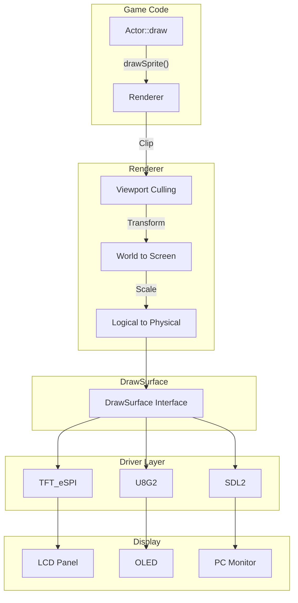
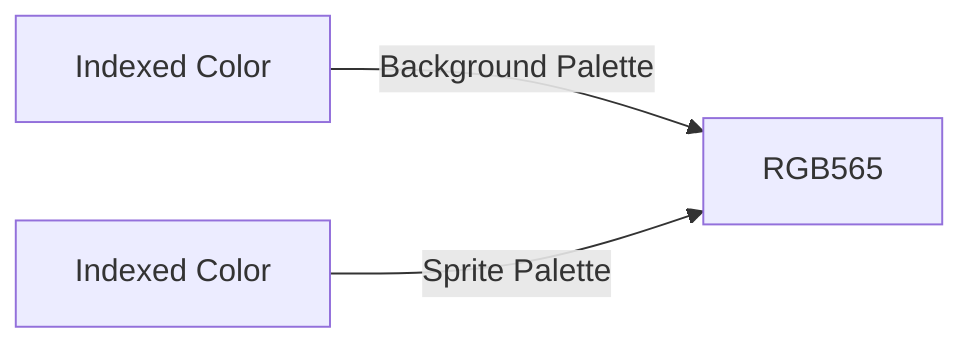

# Rendering System

The rendering system provides hardware abstraction and high-level drawing primitives. It manages the transformation from game world coordinates to physical display pixels.

## Architecture Overview



## The Renderer

`Renderer` is the main interface for all drawing operations:

```cpp
#include <Renderer.h>

using namespace pixelroot32;

// Initialize with display configuration
graphics::DisplayConfig config(240, 240);  // Logical resolution
graphics::Renderer renderer(config);
renderer.init();

// Frame structure
renderer.beginFrame();  // Clear framebuffer (full or selective with dirty regions)

// ... draw game content ...

renderer.endFrame();    // Send to display
```

### Drawing Primitives

```cpp
class Renderer {
    // Shapes
    void drawPixel(int x, int y, Color color);
    void drawLine(int x1, int y1, int x2, int y2, Color color);
    void drawRectangle(int x, int y, int w, int h, Color color);
    void drawFilledRectangle(int x, int y, int w, int h, Color color);
    void drawCircle(int x, int y, int radius, Color color);
    void drawFilledCircle(int x, int y, int radius, Color color);
    
    // Text
    void drawText(std::string_view text, int x, int y, Color c, uint8_t size);
    void drawTextCentered(std::string_view text, int y, Color c, uint8_t size);
    
    // Sprites
    void drawSprite(const Sprite& sprite, int x, int y, Color color);
    void drawSprite2bpp(const Sprite2bpp& sprite, int x, int y);
    void drawSprite4bpp(const Sprite4bpp& sprite, int x, int y);
    void drawMultiSprite(const MultiSprite& sprite, int x, int y);
    
    // Tilemaps
    void drawTileMap(const TileMap& map, int x, int y, Color color, LayerType layerType = LayerType::Dynamic);
    void drawTileMap2bpp(const TileMap2bpp& map, int x, int y, LayerType layerType = LayerType::Dynamic);
    void drawTileMap4bpp(const TileMap4bpp& map, int x, int y, LayerType layerType = LayerType::Dynamic);
};
```

## Coordinate Systems

### World Space

Where game objects exist:

```cpp
// Player at world position (1000, 500)
player->position = math::Vector2(1000, 500);
```

### Logical Resolution

The rendering resolution—may differ from physical display:

```cpp
// Render at 128x128, display on 240x240
graphics::DisplayConfig config;
config.logicalWidth = 128;
config.logicalHeight = 128;
config.physicalWidth = 240;
config.physicalHeight = 240;
```

### Camera/Offset

The viewport into the world:

```cpp
// Center camera on player
renderer.setDisplayOffset(
    -player->position.x + renderer.getLogicalWidth() / 2,
    -player->position.y + renderer.getLogicalHeight() / 2
);
```

### Physical Resolution

Actual display pixels:

```mermaid
flowchart LR
    subgraph Logical["Logical (128x128)"]
        L1[Pixel at (64, 64)]
    end
    
    subgraph Physical["Physical (240x240)"]
        P1[Pixel at (120, 120)]
    end
    
    L1 -->|"Scale 1.875x"| P1
```

## Resolution Scaling

PixelRoot32 supports independent logical and physical resolutions:

```cpp
// Setup for different display sizes
void setupRenderer(int displaySize) {
    graphics::DisplayConfig config;
    
    // Always render at 128x128 for consistent game logic
    config.logicalWidth = 128;
    config.logicalHeight = 128;
    
    // Scale to actual display
    config.physicalWidth = displaySize;
    config.physicalHeight = displaySize;
    
    renderer = graphics::Renderer(config);
}

// Usage
setupRenderer(240);  // 240x240 display
setupRenderer(320);  // 320x320 display
```

### Benefits

1. **Consistent game logic**—coordinates are always 0-127
2. **Memory savings**—framebuffer sized to logical resolution
3. **Performance**—render fewer pixels, scale in hardware/DMA
4. **Portability**—same code works on different displays

### Scaling Algorithms

| Algorithm | Quality | Speed | Use Case |
|-----------|---------|-------|----------|
| Nearest neighbor | Low | Fastest | Retro/pixel art |
| Bilinear | Medium | Fast | Smooth graphics |
| 1:1 (no scale) | Perfect | Fastest | Matching resolutions |

The engine automatically selects the best approach based on configuration.

## Sprites

### 1bpp Sprites (Monochrome)

Most memory-efficient format:

```cpp
// Sprite data: 16x16, packed rows
const uint16_t playerSpriteData[] = {
    0b0000000000000000,
    0b0000000110000000,
    0b0000001111000000,
    0b0000011111100000,
    // ... 16 rows total
};

const graphics::Sprite playerSprite = {
    .data = playerSpriteData,
    .width = 16,
    .height = 16
};

// Drawing
void Player::draw(Renderer& r) {
    r.drawSprite(playerSprite, position.x, position.y, Color::WHITE);
}
```

### 2bpp Sprites (4 colors)

```cpp
// Palette: 4 colors
const graphics::Color palette2bpp[] = {
    Color::BLACK,   // Index 0: Transparent
    Color::BROWN,   // Index 1: Skin
    Color::BLUE,    // Index 2: Shirt
    Color::GREEN    // Index 3: Pants
};

// Data: 2 bits per pixel, packed
const uint8_t sprite2bppData[] = {
    0x00, 0x00, 0x00, 0x00,  // Row 0: all transparent
    0x00, 0x11, 0x11, 0x00,  // Row 1: skin
    // ...
};

const graphics::Sprite2bpp player2bpp = {
    .data = sprite2bppData,
    .palette = palette2bpp,
    .width = 16,
    .height = 16,
    .paletteSize = 4
};

// Drawing
r.drawSprite2bpp(player2bpp, position.x, position.y);
```

### 4bpp Sprites (16 colors)

```cpp
const graphics::Color palette4bpp[] = {
    Color::BLACK, Color::DARK_BLUE, Color::PURPLE, Color::DARK_GREEN,
    Color::BROWN, Color::DARK_GRAY, Color::GRAY, Color::WHITE,
    Color::RED, Color::ORANGE, Color::YELLOW, Color::GREEN,
    Color::BLUE, Color::INDIGO, Color::PINK, Color::LIGHT_GRAY
};

const graphics::Sprite4bpp sprite4bpp = {
    .data = sprite4bppData,  // 4 bits per pixel
    .palette = palette4bpp,
    .width = 16,
    .height = 16,
    .paletteSize = 16
};
```

### Multi-Sprite (Layered)

Combine multiple 1bpp layers for complex sprites:

```cpp
// Layer 0: Outline
const uint16_t outlineData[] = { /* ... */ };
const graphics::SpriteLayer outline = {
    .data = outlineData,
    .color = Color::BLACK
};

// Layer 1: Body
const uint16_t bodyData[] = { /* ... */ };
const graphics::SpriteLayer body = {
    .data = bodyData,
    .color = Color::BLUE
};

// Layer 2: Highlight
const uint16_t highlightData[] = { /* ... */ };
const graphics::SpriteLayer highlight = {
    .data = highlightData,
    .color = Color::WHITE
};

const graphics::SpriteLayer playerLayers[] = { outline, body, highlight };
const graphics::MultiSprite playerMulti = {
    .width = 16,
    .height = 16,
    .layers = playerLayers,
    .layerCount = 3
};

// Drawing (layers drawn in order)
r.drawMultiSprite(playerMulti, position.x, position.y);
```

## Tilemaps

Tilemaps efficiently render large backgrounds:

```cpp
// Tile definitions (1bpp)
const graphics::Sprite tiles[] = {
    { groundData, 8, 8 },    // Index 0
    { wallData, 8, 8 },      // Index 1
    { waterData, 8, 8 },     // Index 2
    // ...
};

// Map data: indices into tiles array
uint8_t mapIndices[20 * 15];  // 20x15 tile map

const graphics::TileMap tileMap = {
    .indices = mapIndices,
    .width = 20,
    .height = 15,
    .tiles = tiles,
    .tileWidth = 8,
    .tileHeight = 8,
    .tileCount = 3
};

// Initialize map
void initMap() {
    for (int y = 0; y < 15; ++y) {
        for (int x = 0; x < 20; ++x) {
            if (y == 14) {
                mapIndices[y * 20 + x] = 0;  // Ground
            } else if (x == 0 || x == 19) {
                mapIndices[y * 20 + x] = 1;  // Walls
            } else {
                mapIndices[y * 20 + x] = 2;  // Water
            }
        }
    }
}

// Drawing with camera offset
void GameScene::draw(Renderer& r) {
    // Camera follows player
    r.setDisplayOffset(-player->position.x + 60, -player->position.y + 60);
    
    // Draw tilemap (automatically culled to viewport)
    r.drawTileMap(tileMap, 0, 0, Color::WHITE);
    
    // Draw entities
    Scene::draw(r);
}
```

### Multi-Palette Tilemaps

```cpp
// 2bpp tilemap with per-tile palette selection
const graphics::TileMap2bpp tileMap2bpp = {
    .indices = mapIndices,
    .width = 20,
    .height = 15,
    .tiles = tiles2bpp,
    .tileWidth = 8,
    .tileHeight = 8,
    .tileCount = 10,
    .paletteIndices = paletteIndexMap  // Per-tile palette (0-7)
};

// Palette 0: Day colors
// Palette 1: Sunset colors
// Palette 2: Night colors
```

## Viewport Culling

The renderer automatically skips off-screen entities:

```cpp
void Scene::draw(Renderer& r) {
    for (int i = 0; i < entityCount; ++i) {
        // Skip if not visible
        if (!entities[i]->isVisible) continue;
        
        // Skip if outside viewport
        if (!isVisibleInViewport(entities[i], r)) continue;
        
        entities[i]->draw(r);
    }
}
```

Culling significantly improves performance with large levels.

## Color System

### Indexed Colors

```cpp
namespace Color {
    constexpr uint8_t BLACK = 0;
    constexpr uint8_t DARK_BLUE = 1;
    constexpr uint8_t PURPLE = 2;
    // ... NES palette
}
```

### Palette Resolution

Colors are resolved through palettes:



```cpp
// Set palettes
renderer.setBackgroundPalette(palettes::NES);
renderer.setSpritePalette(palettes::PR32);

// Or use dual palette mode
renderer.enableDualPaletteMode(true);
renderer.setBackgroundPalette(palettes::GB);    // Muted
renderer.setSpritePalette(palettes::PR32);      // Vibrant
```

### Custom Palettes

```cpp
const graphics::Color customPalette[] = {
    0x0000,  // 0: Black
    0x001F,  // 1: Blue
    0xF800,  // 2: Red
    0x07E0,  // 3: Green
    0xFFE0,  // 4: Yellow
    // ... (RGB565 format)
};

renderer.setCustomPalette(customPalette, 16);
```

## Font Rendering

### Bitmap Fonts

```cpp
// Use built-in 5x7 font
renderer.drawText("Score: 100", 10, 10, Color::WHITE, 2);

// Or load custom font
#include <Font.h>
const graphics::Font customFont = { /* ... */ };
renderer.setFont(&customFont);
```

### Text Alignment

```cpp
// Left-aligned (default)
renderer.drawText("Left", 10, 10, Color::WHITE, 1);

// Centered horizontally
renderer.drawTextCentered("Centered Title", 50, Color::WHITE, 3);

// Manual centering
int width = graphics::FontManager::textWidth("Text", &customFont);
renderer.drawText("Text", (240 - width) / 2, 100, Color::WHITE, 1);
```

## Dirty Region Optimization

The Dirty Region System reduces framebuffer clearing overhead by tracking which 8×8 pixel cells were drawn to in each frame.

### When to Enable

- Games with mostly static backgrounds (platformers, top-down RPGs)
- Scenes where only a small portion of the screen changes per frame
- When `dirty_ratio` < 0.5 (most of the screen stays clean)

### Enable in platformio.ini

```ini
build_flags =
    -DPIXELROOT32_ENABLE_DIRTY_REGIONS=1
    -DPIXELROOT32_ENABLE_DIRTY_REGION_PROFILING=1
```

### Using LayerType

Classify tilemaps when drawing to optimize tracking:

```cpp
// Static background - rarely changes, doesn't mark dirty cells
renderer.drawTileMap(backgroundMap, 0, 0, Color::WHITE, LayerType::Static);

// Dynamic sprites - move every frame, mark their cells as dirty
renderer.drawTileMap(playerSprite, x, y, Color::WHITE, LayerType::Dynamic);
```

### When to Call forceFullRedraw()

Call this to force a full framebuffer clear when needed:

```cpp
// Scene transitions
void GameScene::onSceneEnter() {
    renderer.forceFullRedraw();
}

// Pause menus
void pauseGame() {
    renderer.forceFullRedraw();
    // Draw pause UI
}

// Camera jump / teleport
void teleportPlayer(Vector2 newPos) {
    camera.setPosition(newPos);
    renderer.forceFullRedraw();
}
```

### Example: Tilemap + Sprites with Layer Types

```cpp
void GameScene::draw(Renderer& r) {
    // Background (static - won't mark dirty cells)
    r.drawTileMap(stageMap, 0, 0, Color::WHITE, LayerType::Static);
    
    // Midground objects
    r.drawTileMap(wallsMap, 0, 0, Color::WHITE, LayerType::Dynamic);
    
    // Entities (dynamic sprites)
    for (auto* enemy : enemies) {
        enemy->draw(r);  // Automatically marks dirty
    }
    
    // Player
    player->draw(r);  // Automatically marks dirty
    
    // UI (drawn last, on top)
    r.setOffsetBypass(true);
    drawUI(r);
    r.setOffsetBypass(false);
}
```

### Debug Overlay

Enable to visualize which cells are dirty:

```cpp
// In setup
renderer.setDebugDirtyCellOverlay(true);
```

This draws a colored overlay showing dirty cells in real-time.

## Best Practices

### Batch Similar Draw Calls

```cpp
// Good: Group by layer
void draw(Renderer& r) {
    // Background layer (0)
    for (auto* e : backgroundEntities) e->draw(r);
    
    // Game layer (1)
    for (auto* e : gameEntities) e->draw(r);
    
    // UI layer (2)
    r.setOffsetBypass(true);  // Ignore camera
    for (auto* e : uiEntities) e->draw(r);
    r.setOffsetBypass(false);
}
```

### Minimize State Changes

```cpp
// Good: Set color once, draw many
r.setColor(Color::WHITE);
for (int i = 0; i < 100; ++i) {
    r.drawPixel(points[i].x, points[i].y, Color::WHITE);
}
```

### Use Appropriate Sprite Formats

| Format | Colors | Use Case |
|--------|--------|----------|
| 1bpp | 2 | UI, simple sprites, tilemaps |
| 2bpp | 4 | Characters, detailed sprites |
| 4bpp | 16 | High-color elements, effects |
| Multi | Per-layer | Complex layered sprites |

## Next Steps

- **[Performance Guide](./performance/esp32-performance.md)** — Logical vs physical resolution, hot paths
- **[Graphics Techniques](./graphics-techniques.md)** — Tilemaps, palettes, indexed color
