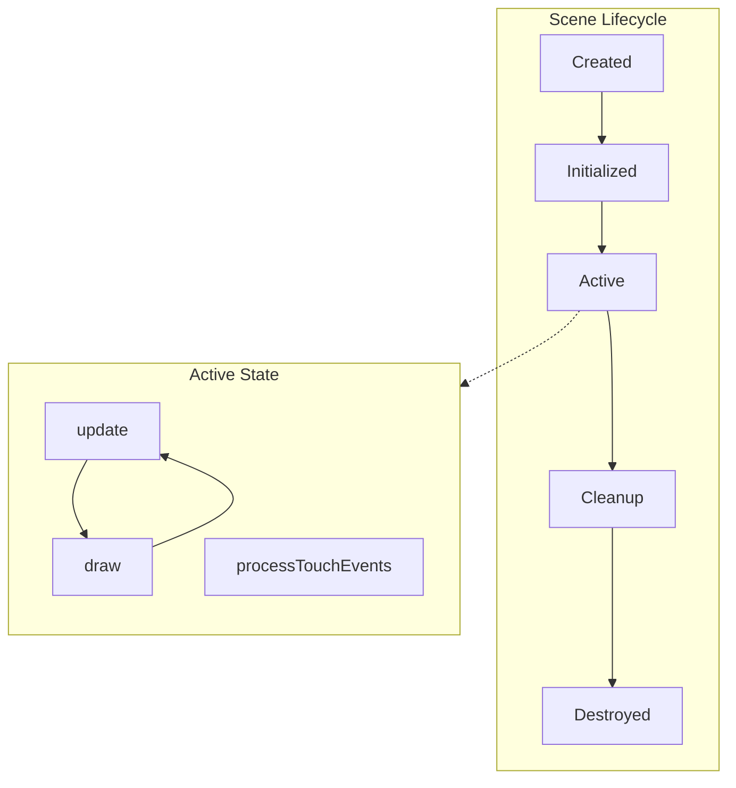
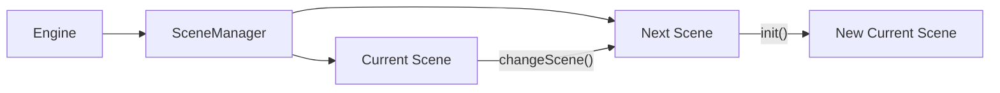

# Scenes

Scenes are the fundamental containers for game states in PixelRoot32. Each scene represents a distinct screen or level—menus, gameplay levels, cutscenes, or any other game state.

## Scene Architecture



## The Scene Class

All scenes inherit from `core::Scene`:

```cpp
#include <Scene.h>

class MyScene : public pixelroot32::core::Scene {
public:
    // Called when entering the scene
    void init() override;
    
    // Called every frame for game logic
    void update(unsigned long deltaTime) override;
    
    // Called every frame for rendering
    void draw(graphics::Renderer& renderer) override;
    
    // Called for touch events (if touch enabled)
    void processTouchEvents(input::TouchEvent* events, uint8_t count) override;
    
    // Called for unconsumed touch events
    void onUnconsumedTouchEvent(const input::TouchEvent& event) override;
};
```

### Lifecycle Methods

| Method | When Called | Purpose |
|--------|-------------|---------|
| `init()` | Scene becomes active | Setup entities, load resources |
| `update(deltaTime)` | Every frame | Game logic, AI, physics prep |
| `draw(renderer)` | Every frame | Render all visible content |
| `processTouchEvents()` | Touch events available | Handle UI and touch input |

## Scene Management

The `Engine` owns a `SceneManager` that handles scene transitions:



### Changing Scenes

```cpp
// From within a scene
void MainMenu::onStartPressed() {
    // Transition to game level
    engine->setScene(new GameLevel());
}

// From outside (engine reference needed)
void setup() {
    Engine engine(config);
    
    MainMenu menu;
    engine.setScene(&menu);
    
    engine.init();
    engine.run();
}
```

::: warning Scene Lifetime
When calling `setScene()`, the previous scene is not automatically deleted. Manage scene lifetime appropriately:

```cpp
// Option 1: Stack allocation (simple, scenes persist)
MainMenu menu;
GameLevel level1;
GameLevel level2;

void gotoLevel(int n) {
    if (n == 1) engine.setScene(&level1);
    if (n == 2) engine.setScene(&level2);
}

// Option 2: Dynamic allocation (scenes created on demand)
void gotoLevel(int n) {
    delete currentScene;  // Clean up previous
    currentScene = new GameLevel(n);
    engine.setScene(currentScene);
}
```
:::

## Entity Management

Scenes manage a collection of entities:

```cpp
class GameLevel : public Scene {
    std::unique_ptr<Player> player;
    std::vector<std::unique_ptr<Enemy>> enemies;
    
public:
    void init() override {
        // Create player
        player = std::make_unique<Player>(100, 100);
        addEntity(player.get());
        
        // Create enemies
        for (int i = 0; i < 5; ++i) {
            auto enemy = std::make_unique<Enemy>(200 + i * 50, 100);
            enemies.push_back(std::move(enemy));
            addEntity(enemies.back().get());
        }
        
        // Create tilemap
        addEntity(&background);
    }
    
    void cleanup() override {
        // Entities are automatically removed when scene ends
        // Smart pointers handle memory cleanup
    }
};
```

### Adding and Removing Entities

```cpp
// Add an entity to the scene
void addEntity(Entity* entity);

// Remove a specific entity
void removeEntity(Entity* entity);

// Remove all entities
void clearEntities();
```

::: tip Performance
Adding/removing entities during gameplay causes sorting overhead. Pre-allocate and use visibility toggling when possible.
:::

## Scene Arena (Optional)

For memory-constrained scenarios, scenes provide an arena allocator:

```cpp
void GameLevel::init() override {
    // Allocate 4KB arena for this scene
    arena.init(malloc(4096), 4096);
    
    // Allocate entities from arena
    player = arenaNew<Player>(arena, 100, 100);
    addEntity(player);
}
```

The arena is reset when the scene is destroyed, providing automatic bulk deallocation.

## Touch Event Handling

When touch is enabled, scenes receive touch events:

```cpp
void GameLevel::processTouchEvents(input::TouchEvent* events, uint8_t count) {
    // Default implementation handles UI first
    Scene::processTouchEvents(events, count);
    
    // Unconsumed events can be handled here or in onUnconsumedTouchEvent
}

void GameLevel::onUnconsumedTouchEvent(const input::TouchEvent& event) {
    // Event wasn't handled by UI - use for gameplay
    if (event.type == input::TouchEventType::CLICK) {
        // Spawn projectile at touch position
        spawnProjectile(event.x, event.y);
    }
}
```

### Touch Event Types

| Type | Description |
|------|-------------|
| `PRESS` | Finger touched screen |
| `RELEASE` | Finger lifted |
| `CLICK` | Quick press-release |
| `DOUBLE_CLICK` | Two quick clicks |
| `LONG_PRESS` | Press held for duration |
| `DRAG` | Movement while pressed |

## Physics Integration

When physics is enabled, scenes automatically manage the collision system:

```cpp
class GameLevel : public Scene {
public:
    void update(unsigned long deltaTime) override {
        // Update entities (including physics actors)
        Scene::update(deltaTime);
        
        // Physics is automatically processed after entity updates
        // (if PIXELROOT32_ENABLE_PHYSICS is enabled)
    }
};
```

Access the collision system directly if needed:

```cpp
#if PIXELROOT32_ENABLE_PHYSICS
    collisionSystem.setGravity(0, 500);  // Set scene gravity
    
    // Query collisions
    auto hits = collisionSystem.queryRegion(x, y, w, h);
#endif
```

## UI Integration

When the UI system is enabled, each scene has its own `UIManager`:

```cpp
class MainMenu : public Scene {
public:
    void init() override {
        Scene::init();  // Required for UI init
        
        #if PIXELROOT32_ENABLE_UI_SYSTEM
        // Get UI manager and create buttons
        auto& ui = getUIManager();
        
        auto* startBtn = new graphics::ui::UIButton("Start Game");
        startBtn->setPosition(80, 80);
        startBtn->onClick = [this]() { startGame(); };
        ui.addElement(startBtn);
        #endif
    }
    
    void updateUI(unsigned long deltaTime) override {
        // UI updates happen here
        Scene::updateUI(deltaTime);
    }
};
```

## Common Scene Patterns

### Splash Screen

```cpp
class SplashScene : public Scene {
    unsigned long elapsed = 0;
    static constexpr unsigned long DURATION = 3000;  // 3 seconds
    
public:
    void update(unsigned long deltaTime) override {
        elapsed += deltaTime;
        
        if (elapsed >= DURATION) {
            engine->setScene(new MainMenu());
        }
    }
    
    void draw(Renderer& r) override {
        r.drawTextCentered("PixelRoot32", 100, Color::WHITE, 3);
    }
};
```

### Pause Menu Overlay

```cpp
class GameLevel : public Scene {
    bool paused = false;
    
public:
    void update(unsigned long deltaTime) override {
        if (paused) {
            // Only update pause menu, not game entities
            updateUI(deltaTime);
            return;
        }
        
        // Normal game update
        Scene::update(deltaTime);
    }
    
    void draw(Renderer& r) override {
        // Always draw game (dimmed or frozen)
        Scene::draw(r);
        
        if (paused) {
            // Draw pause overlay
            r.drawFilledRectangleW(0, 0, 240, 240, 0x0000);  // Semi-transparent
            r.drawTextCentered("PAUSED", 100, Color::WHITE, 2);
        }
    }
};
```

### Level Transitions

```cpp
class TransitionScene : public Scene {
    Scene* nextScene;
    unsigned long elapsed = 0;
    
public:
    TransitionScene(Scene* next) : nextScene(next) {}
    
    void draw(Renderer& r) override {
        // Fade effect based on elapsed time
        int alpha = (elapsed * 255) / 1000;
        r.drawFilledRectangleW(0, 0, 240, 240, 
            (alpha << 8) | alpha);  // Fade to black
    }
    
    void update(unsigned long deltaTime) override {
        elapsed += deltaTime;
        
        if (elapsed > 1000) {
            engine->setScene(nextScene);
        }
    }
};

// Usage
void GameLevel::completeLevel() {
    engine->setScene(new TransitionScene(new NextLevel()));
}
```

## Best Practices

### Do

- ✅ Keep scene initialization fast—show loading screen if needed
- ✅ Pre-allocate resources in `init()`
- ✅ Use smart pointers for automatic cleanup
- ✅ Separate concerns: one scene per game state
- ✅ Handle touch events through the scene pipeline

### Don't

- ❌ Load files or allocate heavily in the game loop
- ❌ Create circular dependencies between scenes
- ❌ Forget to call `Scene::init()` when overriding
- ❌ Mix unrelated functionality in one scene

## Complete Example

```cpp
#include <Engine.h>
#include <Scene.h>
#include <Renderer.h>
#include <KinematicActor.h>

using namespace pixelroot32;

class Player : public physics::KinematicActor {
public:
    Player() : KinematicActor(120, 120, 16, 16) {
        setCollisionLayer(physics::DefaultLayers::kPlayer);
        setCollisionMask(physics::DefaultLayers::kEnvironment);
    }
    
    void update(unsigned long deltaTime) override {
        math::Vector2 velocity;
        
        if (engine->getInputManager().isButtonPressed(ButtonName::LEFT)) {
            velocity.x = -100;
        } else if (engine->getInputManager().isButtonPressed(ButtonName::RIGHT)) {
            velocity.x = 100;
        }
        
        if (engine->getInputManager().isButtonPressed(ButtonName::UP)) {
            velocity.y = -100;
        } else if (engine->getInputManager().isButtonPressed(ButtonName::DOWN)) {
            velocity.y = 100;
        }
        
        velocity *= math::toScalar(deltaTime) / math::toScalar(1000);
        moveAndSlide(velocity, deltaTime);
    }
    
    void draw(Renderer& r) override {
        r.drawFilledRectangle(
            static_cast<int>(position.x), 
            static_cast<int>(position.y), 
            width, height, Color::GREEN
        );
    }
    
    void onCollision(core::Actor* other) override {
        // Handle collisions
    }
};

class GameScene : public core::Scene {
    std::unique_ptr<Player> player;
    
public:
    void init() override {
        player = std::make_unique<Player>();
        addEntity(player.get());
    }
    
    void draw(Renderer& r) override {
        r.drawText("Use arrow keys to move", 10, 10, Color::WHITE, 1);
        Scene::draw(r);  // Draw all entities
    }
};

// main.cpp setup
void setup() {
    graphics::DisplayConfig config(240, 240);
    core::Engine engine(std::move(config));
    
    GameScene scene;
    engine.setScene(&scene);
    
    engine.init();
    engine.run();
}
```

## Next Steps

- **[Entities & Actors](./entities-actors.md)** — Create game objects that live in scenes
- **[Game Loop](./game-loop.md)** — Understand the update/draw cycle
- **[UI System](./ui-system.md)** — Add interactive elements to scenes
