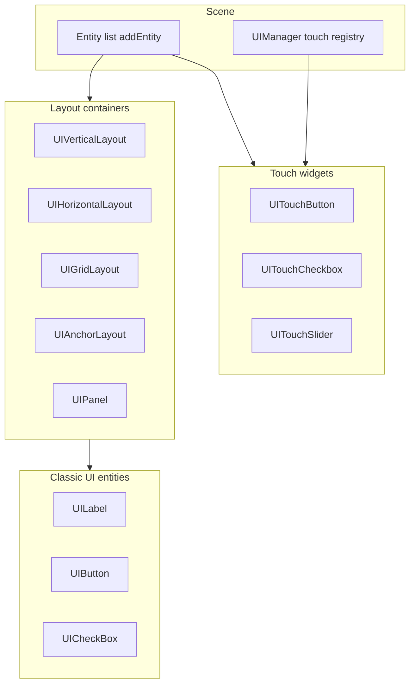

# UI System

PixelRoot32 provides a lightweight UI system with automatic layouts and optional touch support. The engine separates **two integration paths**: drawing and updates via the scene **entity list**, and **touch hit-testing** via `UIManager` (only for `UITouchElement` widgets).

## Architecture



- **`addEntity`**: any `UIElement` (labels, layouts, `UIButton`, `UICheckBox`) is an `Entity` and must be added to the scene so `update` / `draw` run.
- **`getUIManager().addElement`**: only **`UITouchElement`** subclasses (`UITouchButton`, `UITouchCheckbox`, `UITouchSlider`) for touch routing. Register **before** touch events; `UIManager` holds non-owning pointers (max 16). Call `removeElement` before destroying a widget.

## Enabling UI

```cpp
// platformio.ini
build_flags =
    -DPIXELROOT32_ENABLE_UI_SYSTEM=1
```

For touch input (hardware + `Scene::processTouchEvents`), also enable:

```cpp
    -DPIXELROOT32_ENABLE_TOUCH=1
```

See the engine’s touch architecture doc for calibration and `TouchManager` setup.

```cpp
#include <Scene.h>
#include <graphics/ui/UILabel.h>

using namespace pixelroot32;

class MenuScene : public core::Scene {
public:
    void init() override {
        initUI();
    }

    void initUI() override {
        auto* label = new graphics::ui::UILabel(
            "Main Menu",
            math::Vector2(math::toScalar(0), math::toScalar(40)),
            graphics::Color::White,
            2);
        addEntity(label);
    }
};
```

## Classic UI elements (`addEntity`)

Constructors use **plain function pointers** for callbacks (`void(*)()`, `void(*)(bool)`), not `std::function`, to keep memory use small on MCUs. Use **free functions** or static methods; if you need `this`, use a static context pointer (see engine examples).

### UILabel

```cpp
using namespace pixelroot32;

auto* label = new graphics::ui::UILabel(
    "Hello",
    math::Vector2(math::toScalar(80), math::toScalar(50)),
    graphics::Color::White,
    2);  // text size multiplier (font height ≈ 8 × size)
addEntity(label);
```

`UILabel` exposes `setText`, `setVisible`, and `centerX`. There is no `setTextColor` / `setTextSize` after construction; choose color and size in the constructor.

### UIButton (keyboard / D-pad)

`UIButton` handles **logical buttons** from `InputManager` when the control is **selected** inside a layout that calls `handleInput`. It does **not** perform touch hit-testing.

```cpp
void onStartClicked() { /* ... */ }

auto* btn = new graphics::ui::UIButton(
    "Start Game",
    0,  // navigation index (matches InputManager button mapping in layout)
    math::Vector2(math::toScalar(80), math::toScalar(100)),
    math::Vector2(math::toScalar(80), math::toScalar(24)),
    onStartClicked);
btn->setStyle(graphics::Color::White, graphics::Color::Blue, true);
addEntity(btn);
```

### UICheckBox

```cpp
void onSoundToggled(bool enabled) { /* ... */ }

auto* checkbox = new graphics::ui::UICheckBox(
    "Enable Sound",
    0,
    math::Vector2(math::toScalar(80), math::toScalar(140)),
    math::Vector2(math::toScalar(80), math::toScalar(20)),
    true,   // initially checked
    onSoundToggled);
addEntity(checkbox);
```

## Layout containers

Layouts require a **bounding rectangle** `(x, y, width, height)` — the viewport used for placement and optional scrolling.

### UIVerticalLayout

```cpp
auto* vlayout = new graphics::ui::UIVerticalLayout(
    math::toScalar(80), math::toScalar(60),
    200, 120);  // width × height viewport
vlayout->setSpacing(10);

vlayout->addElement(new graphics::ui::UILabel(
    "Option 1",
    math::Vector2(math::toScalar(0), math::toScalar(0)),
    graphics::Color::White,
    1));
// ... more rows

addEntity(vlayout);
```

Call **`vlayout->handleInput(engine.getInputManager())`** from your scene `update` (or equivalent) when you rely on D-pad navigation inside the layout.

### UIHorizontalLayout

```cpp
auto* hlayout = new graphics::ui::UIHorizontalLayout(
    math::toScalar(40), math::toScalar(200),
    240, 32);
hlayout->setSpacing(20);
// addElement(UIButton* ...) with proper constructors
addEntity(hlayout);
```

### UIGridLayout

Column count and **cell size are derived** from the layout size, padding, and spacing — there is **no** `setCellSize` API.

```cpp
auto* grid = new graphics::ui::UIGridLayout(
    math::toScalar(40), math::toScalar(60),
    200, 120);
grid->setColumns(3);
grid->setSpacing(10);  // single spacing value (row and column gap)

void onCell0() { selectNumber(1); }
// ... register buttons with constructors + callbacks

addEntity(grid);
```

### UIAnchorLayout

Anchors use **`addElement(element, Anchor)`** only — **no per-edge pixel offsets** in `addElement`. Use a full-screen layout at `(0,0)` with logical width/height, or wrap content and adjust the layout’s position/size for margins.

```cpp
constexpr int SW = 320;
constexpr int SH = 240;

auto* anchors = new graphics::ui::UIAnchorLayout(
    math::toScalar(0), math::toScalar(0), SW, SH);
anchors->setFixedPosition(true);
anchors->setScreenSize(SW, SH);

auto* score = new graphics::ui::UILabel(
    "Score: 0",
    math::Vector2(math::toScalar(0), math::toScalar(0)),
    graphics::Color::Yellow,
    1);
anchors->addElement(score, graphics::ui::Anchor::TOP_LEFT);

addEntity(anchors);
```

Enum values are `Anchor::TOP_LEFT`, `TOP_RIGHT`, `BOTTOM_RIGHT`, etc.

### UIPanel

`UIPanel` holds **one** child via **`setChild`**. Use a nested `UILayout` for multiple rows.

```cpp
auto* panel = new graphics::ui::UIPanel(
    math::toScalar(60), math::toScalar(80), 120, 100);
panel->setBackgroundColor(graphics::Color::DarkGray);
panel->setBorderColor(graphics::Color::White);
panel->setBorderWidth(1);

auto* inner = new graphics::ui::UIVerticalLayout(
    math::toScalar(0), math::toScalar(0), 110, 90);
// inner->addElement(...);
panel->setChild(inner);

addEntity(panel);
```

## Touch widgets (`UIManager` + `addEntity`)

Touch events flow through **`Scene::processTouchEvents`** → `UIManager::processEvents` → `UITouchElement::processEvent`. Register widgets with **`getUIManager().addElement`**, and also **`addEntity`** so they draw and update.

```cpp
#include <graphics/ui/UITouchButton.h>

void onOk() { /* ... */ }

void MyScene::initUI() {
    auto& ui = getUIManager();
    okButton = std::make_unique<graphics::ui::UITouchButton>(
        "OK",
        math::Vector2(math::toScalar(50), math::toScalar(100)),
        math::Vector2(math::toScalar(120), math::toScalar(40)),
        onOk);
    ui.addElement(okButton.get());
    addEntity(okButton.get());
}
```

`UITouchCheckbox` uses **`setOnChanged`**; `UITouchSlider` uses **`setOnValueChanged`**. Before destroying a widget, call **`removeElement`** on the manager.

## Complete menu example (sketch)

```cpp
using namespace pixelroot32;

class MainMenuScene : public core::Scene {
    graphics::ui::UILabel* statusLabel = nullptr;

    static void startStatic() { /* engine->setScene(...); */ }
    static void optionsStatic() { /* ... */ }
    static void quitStatic() { /* ... */ }
    static void soundStatic(bool on) { (void)on; /* ... */ }

public:
    void init() override {
        initUI();
    }

    void initUI() override {
        auto* title = new graphics::ui::UILabel(
            "PIXEL GAME",
            math::Vector2(math::toScalar(60), math::toScalar(30)),
            graphics::Color::Yellow,
            3);

        auto* vlayout = new graphics::ui::UIVerticalLayout(
            math::toScalar(80), math::toScalar(80), 120, 100);
        vlayout->setSpacing(15);

        vlayout->addElement(new graphics::ui::UIButton(
            "Start", 0,
            math::Vector2(math::toScalar(0), math::toScalar(0)),
            math::Vector2(math::toScalar(80), math::toScalar(24)),
            startStatic));

        vlayout->addElement(new graphics::ui::UIButton(
            "Options", 1,
            math::Vector2(math::toScalar(0), math::toScalar(0)),
            math::Vector2(math::toScalar(80), math::toScalar(24)),
            optionsStatic));

        vlayout->addElement(new graphics::ui::UICheckBox(
            "Sound", 2,
            math::Vector2(math::toScalar(0), math::toScalar(0)),
            math::Vector2(math::toScalar(80), math::toScalar(20)),
            true,
            soundStatic));

        vlayout->addElement(new graphics::ui::UIButton(
            "Quit", 3,
            math::Vector2(math::toScalar(0), math::toScalar(0)),
            math::Vector2(math::toScalar(80), math::toScalar(24)),
            quitStatic));

        statusLabel = new graphics::ui::UILabel(
            "Ready",
            math::Vector2(math::toScalar(10), math::toScalar(220)),
            graphics::Color::Gray,
            1);

        addEntity(title);
        addEntity(vlayout);
        addEntity(statusLabel);
    }

    void setStatus(const char* text) {
        if (statusLabel) {
            statusLabel->setText(text);
        }
    }
};
```

Wire **`vlayout->handleInput(engine.getInputManager())`** in `update` if you use D-pad navigation. Replace static stubs with functions that reach your `Engine` / scene instance as in the engine samples.

## HUD example

`UILabel` does not support changing color after construction; keep colors fixed or rebuild labels if you need dynamic palette changes.

```cpp
#include <string>

using namespace pixelroot32;

class GameHUD : public core::Scene {
    graphics::ui::UILabel* scoreLabel = nullptr;
    graphics::ui::UILabel* healthLabel = nullptr;
    int score = 0;
    int health = 100;

public:
    void init() override {
        constexpr int SW = 320;
        constexpr int SH = 240;

        auto* hud = new graphics::ui::UIAnchorLayout(
            math::toScalar(0), math::toScalar(0), SW, SH);
        hud->setFixedPosition(true);
        hud->setScreenSize(SW, SH);

        scoreLabel = new graphics::ui::UILabel(
            "Score: 0",
            math::Vector2(math::toScalar(0), math::toScalar(0)),
            graphics::Color::Yellow,
            1);
        hud->addElement(scoreLabel, graphics::ui::Anchor::TOP_LEFT);

        healthLabel = new graphics::ui::UILabel(
            "HP: 100",
            math::Vector2(math::toScalar(0), math::toScalar(0)),
            graphics::Color::Green,
            1);
        hud->addElement(healthLabel, graphics::ui::Anchor::TOP_RIGHT);

        addEntity(hud);
    }

    void addScore(int points) {
        score += points;
        if (scoreLabel) {
            std::string s = "Score: " + std::to_string(score);
            scoreLabel->setText(s);
        }
    }
};
```

## Touch integration

`Scene::processTouchEvents` runs **`UIManager::processEvents` first (when UI is enabled), marks consumed events, then** calls **`onUnconsumedTouchEvent`** for the rest.

```cpp
void GameScene::processTouchEvents(input::TouchEvent* events, uint8_t count) {
    Scene::processTouchEvents(events, count);
}
```

- **`UITouchButton` / `UITouchCheckbox` / `UITouchSlider`**: touch hits and gestures via `processEvent`.
- **`UIButton` / `UICheckBox`**: not driven by the touch dispatcher; use **`UITouch*`** variants on touch devices, or drive classic widgets with **D-pad / keyboard** through `handleInput`.

## Styling

```cpp
// UIButton / UICheckBox — use setStyle(...)
button->setStyle(graphics::Color::White, graphics::Color::Blue, true);
checkbox->setStyle(graphics::Color::White, graphics::Color::Black, false);

// UITouchButton — setColors(normal, pressed, disabled)
// touchButton->setColors(graphics::Color::White, graphics::Color::Cyan, graphics::Color::Gray);
```

`UIPanel` supports `setBackgroundColor`, `setBorderColor`, and `setBorderWidth`.

## Performance tips

1. **Minimize UI updates**: change text only when values change.
2. **Use `fixedPosition` + anchor layouts** for HUDs to avoid camera scroll work.
3. **Reuse widgets** instead of allocating every frame.
4. **Limit deep layout nesting** — each level has layout cost.

## Best practices

### Do

- Register **`UITouchElement`** instances with `getUIManager` **and** `addEntity` when using touch.
- Call **`removeElement`** before destroying a touch widget.
- Call **`handleInput`** on layouts when you need focus / D-pad navigation.

### Don’t

- Pass **`UILabel` / `UIButton` / `UILayout`** to **`UIManager::addElement`** — they are not `UITouchElement`.
- Update label text every frame without need.
- Create UI entities inside the per-frame `update` loop.

## Next steps

- **[Input](./input.md)** — Touch and button handling
- **[Examples/Hello World](/examples/hello-world)** — Sample projects
